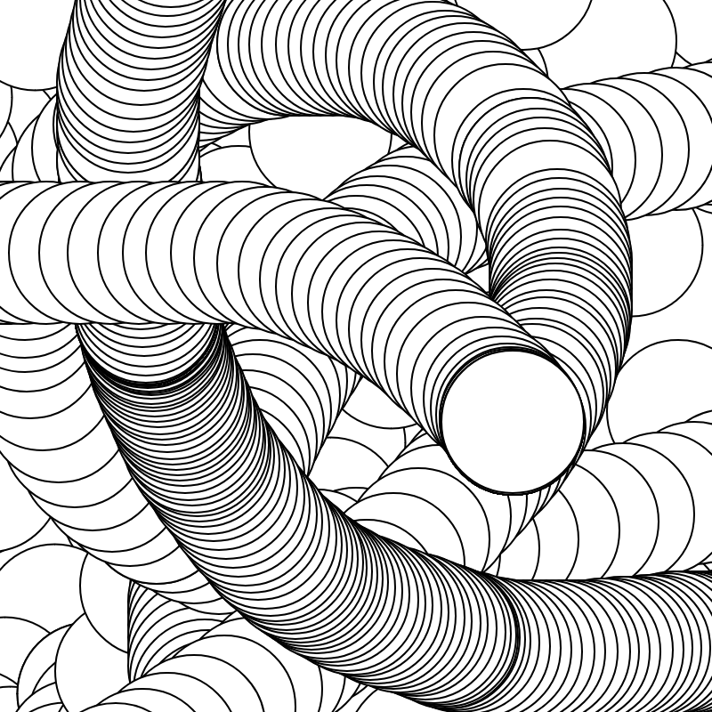

[](https://www.npmjs.com/package/p5)
[](#contributors)
[](https://www.npmjs.com/package/p5)

# [p5.js](https://p5js.org)

Welcome! 👋👋🏿👋🏽👋🏻👋🏾👋🏼

p5.js is a free and open-source JavaScript library for [accessible](https://p5js.org/contribute/access) creative coding. It is a nurturing community, an approachable language, an exploratory tool, an accessible environment, an inclusive platform, welcoming and playful for artists, designers, educators, beginners, and anyone else!

<table>
<tr>
<td>

```js
function setup() {
  createCanvas(400, 400);
  background(255);
}

function draw() {
  circle(mouseX, mouseY, 80);
}
```

</td>
<td>



</td>
</tr>
</table>

[Get Started](https://p5js.org/tutorials/get-started/) — [Reference](https://p5js.org/reference) — [Tutorials](https://p5js.org/tutorials) — [Examples](https://p5js.org/examples/) — [Libraries](https://p5js.org/libraries) — [Forum](https://discourse.processing.org/c/p5js) — [Discord](https://discord.gg/SHQ8dH25r9)

## About

p5.js is built and organized to prioritize [accessibility, inclusivity, community, and joy](https://p5js.org/community). Similar to sketching, p5.js has a full set of tools to draw. It also supports creating audio-visual, interactive, experimental, and generative works for the web. p5.js enables thinking of a web page as your sketch. p5.js is accessible in multiple languages and has an expansive [documentation](https://p5js.org/reference/) with visual examples. You can find [tutorials](https://p5js.org/tutorials/) on the p5.js website and start coding right now in the [p5.js web editor](https://editor.p5js.org/). You can extend p5.js with many community-created [libraries](https://p5js.org/libraries/) that bring different capabilities. Its community provides endless inspiration and support for creators.

p5.js encourages iterative and exploratory code for creative expression. Its friendly, diverse community shares art, code, and learning resources to help elevate all voices. We share our values in open source and access for all, to learn, create, imagine, design, share and code freely.

## Community

The p5.js community shares an interest in exploring the creation of art and design with technology. We are a community of, and in solidarity with, people from every gender identity and expression, sexual orientation, race, ethnicity, language, neuro-type, size, disability, class, caste, religion, culture, subculture, immigration status, age, skill level, occupation, and background. We stand in solidarity with justice and liberation movements. We work to acknowledge, dismantle, and prevent barriers to access p5.js code and the p5.js community.

Learn more about [our community](https://p5js.org/community/) and read our community statement and [code of conduct](https://github.com/processing/p5.js/blob/main/CODE_OF_CONDUCT.md). You can directly support our work with p5.js by donating to [the Processing Foundation](https://processingfoundation.org/support).

## 🌼 p5.js 2.0 Now Available for Community Testing & Development!

We are releasing p5.js 2.0 to the community for testing and development! Here’s what you need to know.

* For **reference**: p5.js 1.x reference will stay on [https://p5js.org/](https://p5js.org/), and p5.js 2.x documentation will be on [https://beta.p5js.org/](https://beta.p5js.org/)
* In the p5.js Editor: the **default will continue to be 1.x** until at least August 2026 - more information and discussion on timeline can be found on [this Discourse thread](https://discourse.processing.org/t/dev-updates-p5-js-2-0-you-are-here/46130) or [this GitHub thread](https://github.com/processing/p5.js/issues/7488)
* For updating sketches and add-on libraries: check out [the compatibility add-on libraries and guides](https://github.com/processing/p5.js-compatibility)
* For **contribution**: `npm latest` will default to 2.x, but the git branches are still separated with `main` on 1.x and `dev-2.0` on 2.x. We will switch the branches when we have updated all automations (including deploying updated documentation to the website). Want to contribute ideas or implementation? Check the [2.x project board](https://github.com/orgs/processing/projects/21/views/8) for an overview of what still needs discussion, and what’s ready for work!

## Issues

If you have found a bug in the p5.js library or want to request new features, feel free to file an issue! See our [contributor guidelines](https://p5js.org/contribute/contributor_guidelines) for a full reference of our contribution process. A set of templates for reporting issues and requesting features are provided to assist you (and us!). Different parts of p5.js are in different repositories. You can open an issue on each of them through these links:

[p5.js](https://github.com/processing/p5.js/issues) — [p5.js website](https://github.com/processing/p5.js-website/issues) —- [p5.js web editor](https://github.com/processing/p5.js-web-editor/issues)

p5.js is maintained mostly by volunteers, so we thank you for your patience as we try to address your issues as soon as we can.

## Get Started for Contributors

p5.js is a collaborative project with many contributors, mostly volunteers, and you are invited to help. All types of involvement are welcome. See the [contribute](https://p5js.org/contribute) for more in-depth details about contributing to different areas of the project, including code, bug fixes, documentation, discussion, and more.

A quick Getting Started with the Build and setting up the repository could be found [here](https://p5js.org/contribute/contributor_guidelines/#quick-get-started-for-developers).

## Stewards

Stewards are contributors who are particularly involved, familiar, or responsive to certain areas of the project. Their role is to help provide context and guidance to others working on p5.js. If you have a question about contributing to a particular area, you can tag the listed steward in an issue or pull request. They may also weigh in on feature requests and guide the overall direction of their area, with the input of the community. You can read more about the organization of the project in our p5.js [Contributor Guidelines](https://p5js.org/contribute/contributor_guidelines) and p5.js [Steward Guidelines](https://p5js.org/contribute/steward_guidelines).

Anyone interested can volunteer to be a steward! There are no specific requirements for expertise, just an interest in actively learning and participating. If you’re familiar with or interested in actively learning and participating in some of the p5.js areas below, please reply to [this issue](https://github.com/processing/p5.js/issues/5719) mentioning which area(s) you are interested in volunteering as a steward! 👋👋👋

p5.js was created by [Lauren Lee McCarthy](https://github.com/lmccart) in 2013 as a new interpretation of Processing for the context of the web. Since then we have allowed ourselves space to deviate and grow, while drawing inspiration from Processing and our shared community. p5.js is sustained by a community of contributors, with support from the Processing Foundation. p5.js follows a rotating leadership model started in 2020, and [Qianqian Ye](https://github.com/qianqianye) has been leading p5.js since 2021. Learn more about the [people](https://p5js.org/people/) behind p5.js.

Current Lead/Mentor
* [@ksen0](https://github.com/ksen0) - p5.js Lead，2024-present
* [@limzykenneth](https://github.com/limzykenneth) - p5.js Mentor，2023-present

Lead/Mentor Alumni
* [@lmccart](https://github.com/lmccart) - p5.js Creator
* [@qianqianye](https://github.com/qianqianye) - p5.js Lead，2021-present (on leave)
* [@outofambit](https://github.com/outofambit) - p5.js Co-Lead 2021-22, Mentor 2022-2023
* [@mcturner1995](https://github.com/mcturner1995) - p5.js Lead 2020


<!-- STEWARDS-LIST:START - Do not remove or modify this section -->
| Area | Steward(s) |
|------|-------------|
| Maintainers | [@davepagurek](https://github.com/davepagurek), [@ksen0](https://github.com/ksen0), [@limzykenneth](https://github.com/limzykenneth), [@perminder-17](https://github.com/perminder-17), [@qianqianye](https://github.com/qianqianye) |
| Accessibility | [@calebfoss](https://github.com/calebfoss) |
| Accessibility (p5.js-website) | [@coseeian](https://github.com/coseeian) |
| Color | [@limzykenneth](https://github.com/limzykenneth) |
| Core | [@davepagurek](https://github.com/davepagurek) |
| DevOps | [@Vaivaswat2244](https://github.com/Vaivaswat2244), [@error-four-o-four](https://github.com/error-four-o-four), [@limzykenneth](https://github.com/limzykenneth), [@lirenjie95](https://github.com/lirenjie95) |
| Documentation | [@VANSH3104](https://github.com/VANSH3104), [@limzykenneth](https://github.com/limzykenneth), [@perminder-17](https://github.com/perminder-17) |
| Friendly Errors | [@IIITM-Jay](https://github.com/IIITM-Jay) |
| Graphics (p5.strands) | [@lukeplowden](https://github.com/lukeplowden) |
| Graphics (WebGL) | [@RandomGamingDev](https://github.com/RandomGamingDev), [@aferriss](https://github.com/aferriss), [@davepagurek](https://github.com/davepagurek), [@lukeplowden](https://github.com/lukeplowden), [@perminder-17](https://github.com/perminder-17) |
| i18n (es) | [@marioguzzzman](https://github.com/marioguzzzman) |
| i18n (hi) | [@Divyansh013](https://github.com/Divyansh013), [@takshittt](https://github.com/takshittt) |
| i18n (ko) | [@hana-cho](https://github.com/hana-cho) |
| i18n (zh) | [@limzykenneth](https://github.com/limzykenneth), [@lirenjie95](https://github.com/lirenjie95) |
| Math | [@GregStanton](https://github.com/GregStanton), [@holomorfo](https://github.com/holomorfo) |
| p5.js-website | [@clairep94](https://github.com/clairep94), [@ksen0](https://github.com/ksen0) |
| p5.sound.js | [@ogbabydiesal](https://github.com/ogbabydiesal) |
| Shapes | [@GregStanton](https://github.com/GregStanton) |
| Typography | [@dhowe](https://github.com/dhowe) |
<!-- STEWARDS-LIST:END -->

## Contributors

We recognize all types of contributions. This project follows the [all-contributors specification](https://github.com/all-contributors/all-contributors) and the [Emoji Key](https://github.com/all-contributors/all-contributors/blob/master/docs/emoji-key.md) ✨ for contribution types. Instructions to add yourself or add contribution emojis to your name are [here](https://github.com/processing/p5.js/issues/2309). You can also post an issue or comment on a pull request with the text: `@all-contributors please add @YOUR-USERNAME for THINGS` (where `THINGS` is a comma-separated list of entries from the [list of possible contribution types](https://github.com/all-contributors/all-contributors/blob/master/docs/emoji-key.md)) and our nice bot will add you.

<!-- ALL-CONTRIBUTORS-LIST:START - Do not remove or modify this section -->
<!-- prettier-ignore-start -->
<!-- markdownlint-disable -->
<table>
  <tbody>
    <tr>
      <td align="center" valign="top" width="16.66%"><a href="http://lauren-mccarthy.com"><br /><sub><b>Lauren McCarthy</b></sub></a><br /></td>
      <td align="center" valign="top" width="16.66%"><a href="http://jasonsigal.cc"><br /><sub><b>Jason Sigal</b></sub></a><br /></td>
      <td align="center" valign="top" width="16.66%"><a href="https://twitter.com/KarenPunkPunk"><br /><sub><b>Karen</b></sub></a><br /></td>
      <td align="center" valign="top" width="16.66%"><a href="http://www.evelyneastmond.com"><br /><sub><b>Evelyn Eastmond</b></sub></a><br /></td>
      <td align="center" valign="top" width="16.66%"><a href="http://www.shiffman.net"><br /><sub><b>Daniel Shiffman</b></sub></a><br /></td>
      <td align="center" valign="top" width="16.66%"><a href="http://reas.com"><br /><sub><b>Casey Reas</b></sub></a><br /></td>
    </tr>
    <tr>
      <td align="center" valign="top" width="16.66%"><a href="http://fathom.info"><br /><sub><b>Ben Fry</b></sub></a><br /></td>
      <td align="center" valign="top" width="16.66%"><a href="https://limzykenneth.com"><br /><sub><b>Kenneth Lim</b></sub></a><br /><a href="https://github.com/processing/p5.js/issues?q=author%3Alimzykenneth" title="Bug reports">🐛</a> <a href="https://github.com/processing/p5.js/commits?author=limzykenneth" title="Code">💻</a> <a href="https://github.com/processing/p5.js/commits?author=limzykenneth" title="Documentation">📖</a></td>
      <td align="center" valign="top" width="16.66%"><a href="http://www.katehollenbach.com"><br /><sub><b>kate hollenbach</b></sub></a><br /></td>
      <td align="center" valign="top" width="16.66%"><a href="https://github.com/mlarghydracept"><br /><sub><b>Stalgia Grigg</b></sub></a><br /></td>
      <td align="center" valign="top" width="16.66%"><a href="https://github.com/machinic"><br /><sub><b>Jerel Johnson</b></sub></a><br /></td>
      <td align="center" valign="top" width="16.66%"><a href="http://sakshamsaxena.in"><br /><sub><b>Saksham Saxena</b></sub></a><br /></td>
    </tr>
    <tr>
      <td align="center" valign="top" width="16.66%"><a href="https://twitter.com/ed_saber"><br /><sub><b>saber khan</b></sub></a><br /></td>
      <td align="center" valign="top" width="16.66%"><a href="https://github.com/dhowe"><br /><sub><b>Daniel Howe</b></sub></a><br /></td>
      <td align="center" valign="top" width="16.66%"><a href="http://kevinsiwoff.com"><br /><sub><b>Kevin Siwoff</b></sub></a><br /></td>
      <td align="center" valign="top" width="16.66%"><a href="http://portfolio.toolness.org/"><br /><sub><b>Atul Varma</b></sub></a><br /></td>
      <td align="center" valign="top" width="16.66%"><a href="http://www.jessklein.is/"><br /><sub><b>Jess Klein</b></sub></a><br /></td>
      <td align="center" valign="top" width="16.66%"><a href="http://unoseistres.com"><br /><sub><b>uno seis tres</b></sub></a><br /></td>
    </tr>
    <tr>
      <td align="center" valign="top" width="16.66%"><a href="http://www.susanev.com/"><br /><sub><b>susan evans</b></sub></a><br /></td>
      <td align="center" valign="top" width="16.66%"><a href="http://sasj.tumblr.com"><br /><sub><b>Saskia Freeke</b></sub></a><br /></td>
      <td align="center" valign="top" width="16.66%"><a href="http://www.phoenixperry.com"><br /><sub><b>Phoenix Perry</b></sub></a><br /></td>
      <td align="center" valign="top" width="16.66%"><a href="https://s01e01.xyz/jct"><br /><sub><b>jesse cahn-thompson</b></sub></a><br /></td>
      <td align="center" valign="top" width="16.66%"><a href="https://github.com/lee2sman"><br /><sub><b>Lee T</b></sub></a><br /></td>
      <td align="center" valign="top" width="16.66%"><a href="http://www.cargocollective.com/chellyjin"><br /><sub><b>Chelly Jin</b></sub></a><br /></td>
    </tr>
    <tr>
      <td align="center" valign="top" width="16.66%"><a href="http://L05.is"><br /><sub><b>L05</b></sub></a><br /></td>
      <td align="center" valign="top" width="16.66%"><a href="http://www.diygirls.org"><br /><sub><b>DIYgirls</b></sub></a><br /></td>
      <td align="center" valign="top" width="16.66%"><a href="https://github.com/lam802"><br /><sub><b>lam802</b></sub></a><br /></td>
      <td align="center" valign="top" width="16.66%"><a href="http://www.mayaman.cc"><br /><sub><b>Maya Man</b></sub></a><br /></td>
      <td align="center" valign="top" width="16.66%"><a href="https://github.com/tegacodes"><br /><sub><b>Tega Brain</b></sub></a><br /></td>
      <td align="center" valign="top" width="16.66%"><a href="https://github.com/luisaph"><br /><sub><b>luisaph</b></sub></a><br /></td>
    </tr>
    <tr>
      <td align="center" valign="top" width="16.66%"><a href="https://github.com/almchung"><br /><sub><b>AlM Chng</b></sub></a><br /></td>
      <td align="center" valign="top" width="16.66%"><a href="http://montoyamoraga.io"><br /><sub><b>aarón montoya-moraga</b></sub></a><br /></td>
      <td align="center" valign="top" width="16.66%"><a href="https://github.com/catarak"><br /><sub><b>Cassie Tarakajian</b></sub></a><br /></td>
      <td align="center" valign="top" width="16.66%"><a href="https://www.niklaspeters.com"><br /><sub><b>Niklas Peters</b></sub></a><br /><a href="https://github.com/processing/p5.js/commits?author=nikfm" title="Documentation">📖</a> <a href="#tutorial-nikfm" title="Tutorials">✅</a></td>
      <td align="center" valign="top" width="16.66%"><a href="http://mathuramg.com"><br /><sub><b>Mathura MG</b></sub></a><br /></td>
      <td align="center" valign="top" width="16.66%"><a href="http://1023.io"><br /><sub><b>Yining Shi</b></sub></a><br /></td>
    </tr>
    <tr>
      <td align="center" valign="top" width="16.66%"><a href="http://kaganjd.github.io/portfolio/"><br /><sub><b>Jen Kagan</b></sub></a><br /></td>
      <td align="center" valign="top" width="16.66%"><a href="http://fromjia.com/"><br /><sub><b>Jiashan Wu</b></sub></a><br /></td>
      <td align="center" valign="top" width="16.66%"><a href="https://github.com/futuremarc"><br /><sub><b>Marc Abbey</b></sub></a><br /></td>
      <td align="center" valign="top" width="16.66%"><a href="http://www.kadamwhite.com"><br /><sub><b>K.Adam White</b></sub></a><br /></td>
      <td align="center" valign="top" width="16.66%"><a href="https://ecridge.com/"><br /><sub><b>Eden Cridge</b></sub></a><br /><a href="https://github.com/processing/p5.js/commits?author=ecridge" title="Code">💻</a> <a href="https://github.com/processing/p5.js/issues?q=author%3Aecridge" title="Bug reports">🐛</a> <a href="https://github.com/processing/p5.js/pulls?q=is%3Apr+reviewed-by%3Aecridge" title="Reviewed Pull Requests">👀</a> <a href="https://github.com/processing/p5.js/commits?author=ecridge" title="Tests">⚠️</a></td>
      <td align="center" valign="top" width="16.66%"><a href="http://mikewesthad.com"><br /><sub><b>Michael Hadley</b></sub></a><br /></td>
    </tr>
    <tr>
      <td align="center" valign="top" width="16.66%"><a href="http://tiller.dog"><br /><sub><b>Todd H. Page</b></sub></a><br /></td>
      <td align="center" valign="top" width="16.66%"><a href="http://jaredsprague.com/"><br /><sub><b>Jared Sprague</b></sub></a><br /><a href="https://github.com/processing/p5.js/commits?author=Jared-Sprague" title="Code">💻</a> <a href="https://github.com/processing/p5.js/commits?author=Jared-Sprague" title="Documentation">📖</a> <a href="#example-Jared-Sprague" title="Examples">💡</a> <a href="#financial-Jared-Sprague" title="Financial">💵</a> <a href="https://github.com/processing/p5.js/commits?author=Jared-Sprague" title="Tests">⚠️</a> <a href="https://github.com/processing/p5.js/issues?q=author%3AJared-Sprague" title="Bug reports">🐛</a></td>
      <td align="center" valign="top" width="16.66%"><a href="http://www.outofambit.com"><br /><sub><b>evelyn masso</b></sub></a><br /></td>
      <td align="center" valign="top" width="16.66%"><a href="http://bomoko.net"><br /><sub><b>Blaize Kaye</b></sub></a><br /></td>
      <td align="center" valign="top" width="16.66%"><a href="https://github.com/DarkPrince304"><br /><sub><b>Sanchit Kapoor</b></sub></a><br /></td>
      <td align="center" valign="top" width="16.66%"><a href="http://meiamso.me"><br /><sub><b>Oliver Wright</b></sub></a><br /></td>
    </tr>
    <tr>
      <td align="center" valign="top" width="16.66%"><a href="https://github.com/mindofmatthew"><br /><sub><b>Matthew Kaney</b></sub></a><br /></td>
      <td align="center" valign="top" width="16.66%"><a href="https://github.com/Spongman"><br /><sub><b>Spongman</b></sub></a><br /></td>
      <td align="center" valign="top" width="16.66%"><a href="https://github.com/CleezyITP"><br /><sub><b>Claire K-V</b></sub></a><br /></td>
      <td align="center" valign="top" width="16.66%"><a href="http://lukedubois.com"><br /><sub><b>R. Luke DuBois</b></sub></a><br /></td>
      <td align="center" valign="top" width="16.66%"><a href="https://github.com/kevinbarabash"><br /><sub><b>Kevin Barabash</b></sub></a><br /></td>
      <td align="center" valign="top" width="16.66%"><a href="http://andrescolubri.net/"><br /><sub><b>codeanticode</b></sub></a><br /></td>
    </tr>
    <tr>
      <td align="center" valign="top" width="16.66%"><a href="http://www.bobholtwebdev.com/"><br /><sub><b>Bob Holt</b></sub></a><br /></td>
      <td align="center" valign="top" width="16.66%"><a href="http://sarahghp.com"><br /><sub><b>Sarah Groff Hennigh-Palermo</b></sub></a><br /></td>
      <td align="center" valign="top" width="16.66%"><a href="http://jordanshaw.com"><br /><sub><b>Jordan Shaw</b></sub></a><br /></td>
      <td align="center" valign="top" width="16.66%"><a href="https://github.com/brightredchilli"><br /><sub><b>brightredchilli</b></sub></a><br /></td>
      <td align="center" valign="top" width="16.66%"><a href="http://derekkinsman.com/"><br /><sub><b>Derek J. Kinsman</b></sub></a><br /></td>
      <td align="center" valign="top" width="16.66%"><a href="https://github.com/hkirat"><br /><sub><b>harkirat singh</b></sub></a><br /></td>
    </tr>
    <tr>
      <td align="center" valign="top" width="16.66%"><a href="https://github.com/GoToLoop"><br /><sub><b>GoToLoop</b></sub></a><br /></td>
      <td align="center" valign="top" width="16.66%"><a href="http://maxgoldste.in/"><br /><sub><b>Max Goldstein</b></sub></a><br /></td>
      <td align="center" valign="top" width="16.66%"><a href="http://xystudio.cc"><br /><sub><b>XY Feng</b></sub></a><br /></td>
      <td align="center" valign="top" width="16.66%"><a href="https://github.com/PaliwalSparsh"><br /><sub><b>Sparsh Paliwal</b></sub></a><br /></td>
      <td align="center" valign="top" width="16.66%"><a href="https://austince.me"><br /><sub><b>Austin Cawley-Edwards</b></sub></a><br /><a href="https://github.com/processing/p5.js/commits?author=austince" title="Documentation">📖</a> <a href="#example-austince" title="Examples">💡</a></td>
      <td align="center" valign="top" width="16.66%"><a href="http://www.estebanalmiron.com"><br /><sub><b>taseenb</b></sub></a><br /></td>
    </tr>
    <tr>
      <td align="center" valign="top" width="16.66%"><a href="https://github.com/tafsiri"><br /><sub><b>Yannick Assogba</b></sub></a><br /></td>
      <td align="center" valign="top" width="16.66%"><a href="https://github.com/johnpasquarello"><br /><sub><b>John Pasquarello</b></sub></a><br /><a href="https://github.com/processing/p5.js/commits?author=johnpasquarello" title="Code">💻</a></td>
      <td align="center" valign="top" width="16.66%"><a href="http://HappyCoding.io"><br /><sub><b>Kevin Workman</b></sub></a><br /><a href="https://github.com/processing/p5.js/commits?author=KevinWorkman" title="Documentation">📖</a></td>
      <td align="center" valign="top" width="16.66%"><a href="https://github.com/gauini"><br /><sub><b>gauini</b></sub></a><br /></td>
      <td align="center" valign="top" width="16.66%"><a href="http://sansumbrella.com/"><br /><sub><b>David Wicks</b></sub></a><br /></td>
      <td align="center" valign="top" width="16.66%"><a href="https://github.com/guillemontecinos"><br /><sub><b>Guillermo Montecinos</b></sub></a><br /></td>
    </tr>
    <tr>
      <td align="center" valign="top" width="16.66%"><a href="http://www.walking-productions.com/notslop/"><br /><sub><b>Shawn Van Every</b></sub></a><br /></td>
      <td align="center" valign="top" width="16.66%"><a href="http://www.wiredpieces.com"><br /><sub><b>Sinan Ascioglu</b></sub></a><br /></td>
      <td align="center" valign="top" width="16.66%"><a href="https://hamoid.com"><br /><sub><b>Abe Pazos</b></sub></a><br /></td>
      <td align="center" valign="top" width="16.66%"><a href="http://charstiles.com/"><br /><sub><b>Char</b></sub></a><br /></td>
      <td align="center" valign="top" width="16.66%"><a href="http://genekogan.com"><br /><sub><b>Gene Kogan</b></sub></a><br /></td>
      <td align="center" valign="top" width="16.66%"><a href="https://github.com/jay-manday"><br /><sub><b>Jason Mandel</b></sub></a><br /></td>
    </tr>
    <tr>
      <td align="center" valign="top" width="16.66%"><a href="https://github.com/russomf"><br /><sub><b>Mark Russo</b></sub></a><br /></td>
      <td align="center" valign="top" width="16.66%"><a href="http://jedahan.com"><br /><sub><b>Jonathan Dahan</b></sub></a><br /></td>
      <td align="center" valign="top" width="16.66%"><a href="https://nok.onl"><br /><sub><b>Darius Morawiec</b></sub></a><br /></td>
      <td align="center" valign="top" width="16.66%"><a href="https://github.com/darbicus"><br /><sub><b>Darby Rathbone</b></sub></a><br /></td>
      <td align="center" valign="top" width="16.66%"><a href="https://github.com/hrishit"><br /><sub><b>hrishit</b></sub></a><br /></td>
      <td align="center" valign="top" width="16.66%"><a href="https://twitter.com/chiunhauyou"><br /><sub><b>Chiun Hau You</b></sub></a><br /></td>
    </tr>
    <tr>
      <td align="center" valign="top" width="16.66%"><a href="https://zaerl.com"><br /><sub><b>Francesco Bigiarini</b></sub></a><br /></td>
      <td align="center" valign="top" width="16.66%"><a href="https://fabianmoronzirfas.me"><br /><sub><b>Fabian Morón Zirfas</b></sub></a><br /></td>
      <td align="center" valign="top" width="16.66%"><a href="http://cambridgemike.com"><br /><sub><b>Mike Anderson</b></sub></a><br /></td>
      <td align="center" valign="top" width="16.66%"><a href="http://linkedin.com/in/limikael"><br /><sub><b>Mikael Lindqvist</b></sub></a><br /></td>
      <td align="center" valign="top" width="16.66%"><a href="https://github.com/ctlusto"><br /><sub><b>Chris</b></sub></a><br /></td>
      <td align="center" valign="top" width="16.66%"><a href="https://github.com/max0410"><br /><sub><b>Max Segal</b></sub></a><br /></td>
    </tr>
    <tr>
      <td align="center" valign="top" width="16.66%"><a href="https://github.com/tstefanich"><br /><sub><b>Tyler Stefanich</b></sub></a><br /></td>
      <td align="center" valign="top" width="16.66%"><a href="http://www.sixhat.net/"><br /><sub><b>Dave</b></sub></a><br /></td>
      <td align="center" valign="top" width="16.66%"><a href="http://wxs.ca"><br /><sub><b>Xavier Snelgrove</b></sub></a><br /></td>
      <td align="center" valign="top" width="16.66%"><a href="https://github.com/DoubleJump"><br /><sub><b>Gareth Battensby</b></sub></a><br /></td>
      <td align="center" valign="top" width="16.66%"><a href="http://taeyoonchoi.com"><br /><sub><b>Taeyoon Choi</b></sub></a><br /></td>
      <td align="center" valign="top" width="16.66%"><a href="https://github.com/akashraj9828"><br /><sub><b>AKASH RAJ</b></sub></a><br /></td>
    </tr>
    <tr>
      <td align="center" valign="top" width="16.66%"><a href="https://github.com/keho98"><br /><sub><b>Kevin Ho</b></sub></a><br /></td>
      <td align="center" valign="top" width="16.66%"><a href="http://dexter1691.github.io"><br /><sub><b>Harsh Agrawal</b></sub></a><br /></td>
      <td align="center" valign="top" width="16.66%"><a href="https://github.com/Luxapodular"><br /><sub><b>Luca Damasco</b></sub></a><br /></td>
      <td align="center" valign="top" width="16.66%"><a href="http://lav.io"><br /><sub><b>Sam Lavigne</b></sub></a><br /></td>
      <td align="center" valign="top" width="16.66%"><a href="http://epicjefferson.com"><br /><sub><b>Epic Jefferson</b></sub></a><br /></td>
      <td align="center" valign="top" width="16.66%"><a href="http://www.carolinerecord.com/"><br /><sub><b>Caroline Record</b></sub></a><br /></td>
    </tr>
    <tr>
      <td align="center" valign="top" width="16.66%"><a href="http://cjdecarteret.com"><br /><sub><b>Christine de Carteret</b></sub></a><br /></td>
      <td align="center" valign="top" width="16.66%"><a href="http://crhallberg.com"><br /><sub><b>Chris Hallberg</b></sub></a><br /></td>
      <td align="center" valign="top" width="16.66%"><a href="http://www.workergnome.com"><br /><sub><b>David Newbury</b></sub></a><br /></td>
      <td align="center" valign="top" width="16.66%"><a href="https://github.com/piinthecloud"><br /><sub><b>piinthecloud</b></sub></a><br /></td>
      <td align="center" valign="top" width="16.66%"><a href="http://www.molleindustria.org"><br /><sub><b>Paolo Pedercini</b></sub></a><br /></td>
      <td align="center" valign="top" width="16.66%"><a href="http://huah.net/jason/"><br /><sub><b>Jason Alderman</b></sub></a><br /></td>
    </tr>
    <tr>
      <td align="center" valign="top" width="16.66%"><a href="http://media.mit.edu/~jacobsj"><br /><sub><b>Jennifer Jacobs</b></sub></a><br /></td>
      <td align="center" valign="top" width="16.66%"><a href="http://sepans.com"><br /><sub><b>Sepand Ansari</b></sub></a><br /></td>
      <td align="center" valign="top" width="16.66%"><a href="http://valhead.com"><br /><sub><b>Val Head</b></sub></a><br /></td>
      <td align="center" valign="top" width="16.66%"><a href="https://github.com/six5532one"><br /><sub><b>Emily Chen</b></sub></a><br /></td>
      <td align="center" valign="top" width="16.66%"><a href="http://benmoren.com"><br /><sub><b>Ben Moren</b></sub></a><br /></td>
      <td align="center" valign="top" width="16.66%"><a href="http://www.runemadsen.com"><br /><sub><b>Rune Skjoldborg Madsen</b></sub></a><br /></td>
    </tr>
    <tr>
      <td align="center" valign="top" width="16.66%"><a href="http://alignedleft.com"><br /><sub><b>Scott Murray</b></sub></a><br /></td>
      <td align="center" valign="top" width="16.66%"><a href="http://www.scottmadethis.net/"><br /><sub><b>Scott Garner</b></sub></a><br /></td>
      <td align="center" valign="top" width="16.66%"><a href="http://b2renger.github.io/"><br /><sub><b>b2renger</b></sub></a><br /></td>
      <td align="center" valign="top" width="16.66%"><a href="http://craigpickard.net/"><br /><sub><b>Craig Pickard</b></sub></a><br /></td>
      <td align="center" valign="top" width="16.66%"><a href="https://github.com/mxchelle"><br /><sub><b>mxchelle</b></sub></a><br /></td>
      <td align="center" valign="top" width="16.66%"><a href="http://www.wickeditor.com"><br /><sub><b>Zach Rispoli</b></sub></a><br /></td>
    </tr>
    <tr>
      <td align="center" valign="top" width="16.66%"><a href="http://www.liuchang.work"><br /><sub><b>Liu Chang</b></sub></a><br /></td>
      <td align="center" valign="top" width="16.66%"><a href="http://cvalenzuelab.com/"><br /><sub><b>Cristóbal Valenzuela</b></sub></a><br /></td>
      <td align="center" valign="top" width="16.66%"><a href="http://www.milespeyton.info"><br /><sub><b>Miles Peyton</b></sub></a><br /></td>
      <td align="center" valign="top" width="16.66%"><a href="http://www.flong.com"><br /><sub><b>Golan Levin</b></sub></a><br /></td>
      <td align="center" valign="top" width="16.66%"><a href="https://github.com/feedzh"><br /><sub><b>feedzh</b></sub></a><br /></td>
      <td align="center" valign="top" width="16.66%"><a href="https://github.com/rubayet170746"><br /><sub><b>Shahriar Rahman Rubayet</b></sub></a><br /></td>
    </tr>
    <tr>
      <td align="center" valign="top" width="16.66%"><a href="http://nicusor.org/"><br /><sub><b>Chiciuc Nicușor</b></sub></a><br /></td>
      <td align="center" valign="top" width="16.66%"><a href="http://www.videoventure.org"><br /><sub><b>Ken Miller</b></sub></a><br /></td>
      <td align="center" valign="top" width="16.66%"><a href="http://brysonian.com"><br /><sub><b>Chandler McWilliams</b></sub></a><br /></td>
      <td align="center" valign="top" width="16.66%"><a href="http://wxactly.com/"><br /><sub><b>Jaymz Rhime</b></sub></a><br /></td>
      <td align="center" valign="top" width="16.66%"><a href="http://njoubert.com"><br /><sub><b>Niels Joubert</b></sub></a><br /></td>
      <td align="center" valign="top" width="16.66%"><a href="https://github.com/iamutkarshtiwari"><br /><sub><b>Utkarsh Tiwari</b></sub></a><br /></td>
    </tr>
    <tr>
      <td align="center" valign="top" width="16.66%"><a href="https://github.com/parsoyaarihant"><br /><sub><b>Arihant Parsoya</b></sub></a><br /></td>
      <td align="center" valign="top" width="16.66%"><a href="http://bradleycbuchanan.com"><br /><sub><b>Brad Buchanan</b></sub></a><br /></td>
      <td align="center" valign="top" width="16.66%"><a href="https://twitter.com/DonKarlssonSan"><br /><sub><b>Johan Karlsson</b></sub></a><br /></td>
      <td align="center" valign="top" width="16.66%"><a href="http://andrewjtimmons.github.io"><br /><sub><b>Andy Timmons</b></sub></a><br /></td>
      <td align="center" valign="top" width="16.66%"><a href="https://github.com/zacharystenger"><br /><sub><b>zacharystenger</b></sub></a><br /></td>
      <td align="center" valign="top" width="16.66%"><a href="http://boucheron.org/brian"><br /><sub><b>Brian Boucheron</b></sub></a><br /></td>
    </tr>
    <tr>
      <td align="center" valign="top" width="16.66%"><a href="https://github.com/sortasleepy"><br /><sub><b>sortasleepy</b></sub></a><br /></td>
      <td align="center" valign="top" width="16.66%"><a href="http://kylemcdonald.net/"><br /><sub><b>Kyle McDonald</b></sub></a><br /></td>
      <td align="center" valign="top" width="16.66%"><a href="http://spadial.com"><br /><sub><b>Antonio Jesús Sánchez Padial</b></sub></a><br /><a href="https://github.com/processing/p5.js/commits?author=ajspadial" title="Code">💻</a></td>
      <td align="center" valign="top" width="16.66%"><a href="http://www.geekdome.net"><br /><sub><b>Brad Smith</b></sub></a><br /></td>
      <td align="center" valign="top" width="16.66%"><a href="https://vitorgalvao.com/"><br /><sub><b>Vítor Galvão</b></sub></a><br /></td>
      <td align="center" valign="top" width="16.66%"><a href="https://github.com/drifkin"><br /><sub><b>Devon Rifkin</b></sub></a><br /></td>
    </tr>
    <tr>
      <td align="center" valign="top" width="16.66%"><a href="http://xie-emily.com"><br /><sub><b>Emily Xie</b></sub></a><br /></td>
      <td align="center" valign="top" width="16.66%"><a href="http://twitter.com/borisbucha"><br /><sub><b>Boris Bucha</b></sub></a><br /></td>
      <td align="center" valign="top" width="16.66%"><a href="http://avocode.com"><br /><sub><b>Petr Brzek</b></sub></a><br /></td>
      <td align="center" valign="top" width="16.66%"><a href="https://github.com/transfluxus"><br /><sub><b>Ramin</b></sub></a><br /></td>
      <td align="center" valign="top" width="16.66%"><a href="https://github.com/arsenijesavic"><br /><sub><b>Arsenije Savic</b></sub></a><br /></td>
      <td align="center" valign="top" width="16.66%"><a href="http://www.linkedin.com/in/lukeburgessyeo"><br /><sub><b>Luke Burgess-Yeo</b></sub></a><br /></td>
    </tr>
    <tr>
      <td align="center" valign="top" width="16.66%"><a href="https://github.com/slfmessi"><br /><sub><b>Sun Lifei</b></sub></a><br /></td>
      <td align="center" valign="top" width="16.66%"><a href="http://himo.boy.jp/"><br /><sub><b>naoyashiga</b></sub></a><br /></td>
      <td align="center" valign="top" width="16.66%"><a href="http://facebook.com/Jimish.Fotariya"><br /><sub><b>Jimish Fotariya</b></sub></a><br /></td>
      <td align="center" valign="top" width="16.66%"><a href="http://www.moro.es"><br /><sub><b>Jorge Moreno</b></sub></a><br /><a href="https://github.com/processing/p5.js/issues?q=author%3Aalterebro" title="Bug reports">🐛</a> <a href="https://github.com/processing/p5.js/commits?author=alterebro" title="Code">💻</a> <a href="https://github.com/processing/p5.js/commits?author=alterebro" title="Documentation">📖</a></td>
      <td align="center" valign="top" width="16.66%"><a href="http://stevengreens10.github.io"><br /><sub><b>Steven Green</b></sub></a><br /></td>
      <td align="center" valign="top" width="16.66%"><a href="http://www.marcusparsons.com"><br /><sub><b>Marcus Parsons</b></sub></a><br /></td>
    </tr>
    <tr>
      <td align="center" valign="top" width="16.66%"><a href="https://github.com/nthitz"><br /><sub><b>Nick Yahnke</b></sub></a><br /></td>
      <td align="center" valign="top" width="16.66%"><a href="http://www.radialglo.com"><br /><sub><b>Anthony Su</b></sub></a><br /></td>
      <td align="center" valign="top" width="16.66%"><a href="http://www.kroko.me/"><br /><sub><b>kroko / Reinis Adovičs</b></sub></a><br /></td>
      <td align="center" valign="top" width="16.66%"><a href="https://github.com/robynitp"><br /><sub><b>Robyn Overstreet</b></sub></a><br /></td>
      <td align="center" valign="top" width="16.66%"><a href="https://github.com/benhinchley"><br /><sub><b>Ben Hinchley</b></sub></a><br /></td>
      <td align="center" valign="top" width="16.66%"><a href="http://ello.co/maxkolyanov"><br /><sub><b>Max Kolyanov</b></sub></a><br /></td>
    </tr>
    <tr>
      <td align="center" valign="top" width="16.66%"><a href="http://zenozeng.com"><br /><sub><b>Zeno Zeng</b></sub></a><br /></td>
      <td align="center" valign="top" width="16.66%"><a href="http://www.sethkranzler.com"><br /><sub><b>Seth</b></sub></a><br /></td>
      <td align="center" valign="top" width="16.66%"><a href="https://github.com/plural"><br /><sub><b>plural</b></sub></a><br /></td>
      <td align="center" valign="top" width="16.66%"><a href="http://ucodia.space"><br /><sub><b>Lionel Ringenbach</b></sub></a><br /></td>
      <td align="center" valign="top" width="16.66%"><a href="https://github.com/darkcoderrises"><br /><sub><b>Harshil Goel</b></sub></a><br /></td>
      <td align="center" valign="top" width="16.66%"><a href="http://becker.codes"><br /><sub><b>Joshua Storm Becker</b></sub></a><br /></td>
    </tr>
    <tr>
      <td align="center" valign="top" width="16.66%"><a href="http://twitter.com/maxdevjs"><br /><sub><b>maxdevjs</b></sub></a><br /></td>
      <td align="center" valign="top" width="16.66%"><a href="http://timorychert.de/"><br /><sub><b>trych</b></sub></a><br /></td>
      <td align="center" valign="top" width="16.66%"><a href="https://www.alejandratrejo.com/"><br /><sub><b>Alejandra Trejo</b></sub></a><br /></td>
      <td align="center" valign="top" width="16.66%"><a href="http://www.pgupta.com"><br /><sub><b>Prashant Gupta</b></sub></a><br /></td>
      <td align="center" valign="top" width="16.66%"><a href="https://github.com/rasca0027"><br /><sub><b>Kai-han Chang</b></sub></a><br /></td>
      <td align="center" valign="top" width="16.66%"><a href="https://github.com/kjav"><br /><sub><b>kjav</b></sub></a><br /></td>
    </tr>
    <tr>
      <td align="center" valign="top" width="16.66%"><a href="http://maddy.zone"><br /><sub><b>maddy</b></sub></a><br /></td>
      <td align="center" valign="top" width="16.66%"><a href="http://digitalcoleman.com"><br /><sub><b>Christopher Coleman</b></sub></a><br /></td>
      <td align="center" valign="top" width="16.66%"><a href="http://boazsender.com"><br /><sub><b>Boaz</b></sub></a><br /></td>
      <td align="center" valign="top" width="16.66%"><a href="https://github.com/wangyasai"><br /><sub><b>Yasai</b></sub></a><br /><a href="#blog-wangyasai" title="Blogposts">📝</a></td>
      <td align="center" valign="top" width="16.66%"><a href="https://github.com/hackertron"><br /><sub><b>Jay Gupta</b></sub></a><br /></td>
      <td align="center" valign="top" width="16.66%"><a href="https://github.com/bansalnitish"><br /><sub><b>Nitish Bansal</b></sub></a><br /></td>
    </tr>
    <tr>
      <td align="center" valign="top" width="16.66%"><a href="https://caro.io/"><br /><sub><b>Caroline Hermans</b></sub></a><br /><a href="#example-carolinehermans" title="Examples">💡</a> <a href="https://github.com/processing/p5.js/commits?author=carolinehermans" title="Documentation">📖</a></td>
      <td align="center" valign="top" width="16.66%"><a href="https://github.com/faithwyu"><br /><sub><b>Faith Wuyue Yu</b></sub></a><br /></td>
      <td align="center" valign="top" width="16.66%"><a href="https://aatishb.com"><br /><sub><b>Aatish Bhatia</b></sub></a><br /><a href="https://github.com/processing/p5.js/commits?author=aatishb" title="Documentation">📖</a> <a href="https://github.com/processing/p5.js/issues?q=author%3Aaatishb" title="Bug reports">🐛</a> <a href="#example-aatishb" title="Examples">💡</a></td>
      <td align="center" valign="top" width="16.66%"><a href="https://github.com/dekmm"><br /><sub><b>Mislav Milicevic</b></sub></a><br /><a href="https://github.com/processing/p5.js/commits?author=dekmm" title="Code">💻</a> <a href="https://github.com/processing/p5.js/issues?q=author%3Adekmm" title="Bug reports">🐛</a></td>
      <td align="center" valign="top" width="16.66%"><a href="https://github.com/yutinglu413"><br /><sub><b>Yuting Lu</b></sub></a><br /><a href="https://github.com/processing/p5.js/commits?author=yutinglu413" title="Documentation">📖</a></td>
      <td align="center" valign="top" width="16.66%"><a href="https://github.com/adilrabbani"><br /><sub><b>Adil Rabbani</b></sub></a><br /><a href="https://github.com/processing/p5.js/commits?author=adilrabbani" title="Code">💻</a> <a href="https://github.com/processing/p5.js/issues?q=author%3Aadilrabbani" title="Bug reports">🐛</a> <a href="#example-adilrabbani" title="Examples">💡</a></td>
    </tr>
    <tr>
      <td align="center" valign="top" width="16.66%"><a href="http://zalastax.github.io/"><br /><sub><b>Pierre Krafft</b></sub></a><br /><a href="https://github.com/processing/p5.js/issues?q=author%3AZalastax" title="Bug reports">🐛</a> <a href="https://github.com/processing/p5.js/commits?author=Zalastax" title="Code">💻</a> <a href="https://github.com/processing/p5.js/commits?author=Zalastax" title="Documentation">📖</a> <a href="#example-Zalastax" title="Examples">💡</a> <a href="https://github.com/processing/p5.js/pulls?q=is%3Apr+reviewed-by%3AZalastax" title="Reviewed Pull Requests">👀</a> <a href="https://github.com/processing/p5.js/commits?author=Zalastax" title="Tests">⚠️</a> <a href="#tool-Zalastax" title="Tools">🔧</a></td>
      <td align="center" valign="top" width="16.66%"><a href="https://github.com/zoeingram"><br /><sub><b>Zoë Ingram</b></sub></a><br /><a href="https://github.com/processing/p5.js/commits?author=zoeingram" title="Documentation">📖</a></td>
      <td align="center" valign="top" width="16.66%"><a href="https://github.com/AidanNelson"><br /><sub><b>Aidan Nelson</b></sub></a><br /><a href="https://github.com/processing/p5.js/issues?q=author%3Aaidannelson" title="Bug reports">🐛</a> <a href="https://github.com/processing/p5.js/commits?author=aidannelson" title="Code">💻</a> <a href="https://github.com/processing/p5.js/commits?author=aidannelson" title="Documentation">📖</a> <a href="#example-aidannelson" title="Examples">💡</a></td>
      <td align="center" valign="top" width="16.66%"><a href="https://github.com/hydrosquall"><br /><sub><b>Cameron Yick</b></sub></a><br /><a href="https://github.com/processing/p5.js/commits?author=hydrosquall" title="Documentation">📖</a> <a href="#example-hydrosquall" title="Examples">💡</a></td>
      <td align="center" valign="top" width="16.66%"><a href="https://github.com/TanviKumar"><br /><sub><b>Tanvi Kumar</b></sub></a><br /><a href="https://github.com/processing/p5.js/issues?q=author%3ATanviKumar" title="Bug reports">🐛</a> <a href="https://github.com/processing/p5.js/commits?author=TanviKumar" title="Code">💻</a> <a href="https://github.com/processing/p5.js/commits?author=TanviKumar" title="Documentation">📖</a> <a href="#example-TanviKumar" title="Examples">💡</a></td>
      <td align="center" valign="top" width="16.66%"><a href="https://enkatsu.org"><br /><sub><b>Katsuya Endoh</b></sub></a><br /></td>
    </tr>
    <tr>
      <td align="center" valign="top" width="16.66%"><a href="https://github.com/OsakaStarbux"><br /><sub><b>Kevin Bradley</b></sub></a><br /><a href="https://github.com/processing/p5.js/commits?author=OsakaStarbux" title="Documentation">📖</a></td>
      <td align="center" valign="top" width="16.66%"><a href="https://justinsunho.com/"><br /><sub><b>Justin Kim</b></sub></a><br /><a href="https://github.com/processing/p5.js/commits?author=justinsunho" title="Documentation">📖</a></td>
      <td align="center" valign="top" width="16.66%"><a href="https://github.com/EndBug"><br /><sub><b>Federico Grandi</b></sub></a><br /><a href="https://github.com/processing/p5.js/commits?author=EndBug" title="Code">💻</a> <a href="https://github.com/processing/p5.js/commits?author=EndBug" title="Documentation">📖</a></td>
      <td align="center" valign="top" width="16.66%"><a href="https://freddierawlins.wixsite.com/site"><br /><sub><b>Freddie Rawlins</b></sub></a><br /><a href="https://github.com/processing/p5.js/commits?author=FreddieRa" title="Code">💻</a> <a href="https://github.com/processing/p5.js/commits?author=FreddieRa" title="Documentation">📖</a></td>
      <td align="center" valign="top" width="16.66%"><a href="https://github.com/justlucdewit"><br /><sub><b>Luc de wit</b></sub></a><br /><a href="https://github.com/processing/p5.js/commits?author=Luke_" title="Code">💻</a> <a href="https://github.com/processing/p5.js/issues?q=author%3ALuke_" title="Bug reports">🐛</a></td>
      <td align="center" valign="top" width="16.66%"><a href="https://github.com/mcuz"><br /><sub><b>Mark Nikora</b></sub></a><br /><a href="https://github.com/processing/p5.js/commits?author=mcuz" title="Code">💻</a></td>
    </tr>
    <tr>
      <td align="center" valign="top" width="16.66%"><a href="https://github.com/Nekzuris"><br /><sub><b>Louis Demange</b></sub></a><br /><a href="https://github.com/processing/p5.js/issues?q=author%3ANekzuris" title="Bug reports">🐛</a></td>
      <td align="center" valign="top" width="16.66%"><a href="https://twitter.com/sanket24singh"><br /><sub><b>Sanket Singh</b></sub></a><br /><a href="https://github.com/processing/p5.js/commits?author=sanketsingh24" title="Code">💻</a> <a href="https://github.com/processing/p5.js/issues?q=author%3Asanketsingh24" title="Bug reports">🐛</a> <a href="https://github.com/processing/p5.js/commits?author=sanketsingh24" title="Documentation">📖</a> <a href="#example-sanketsingh24" title="Examples">💡</a></td>
      <td align="center" valign="top" width="16.66%"><a href="https://orenshoham.com"><br /><sub><b>Oren Shoham</b></sub></a><br /><a href="https://github.com/processing/p5.js/commits?author=oshoham" title="Code">💻</a></td>
      <td align="center" valign="top" width="16.66%"><a href="https://github.com/abhinavsagar"><br /><sub><b>Abhinav Sagar</b></sub></a><br /><a href="https://github.com/processing/p5.js/commits?author=abhinavsagar" title="Code">💻</a></td>
      <td align="center" valign="top" width="16.66%"><a href="https://github.com/jonnytest1"><br /><sub><b>Jonathan Heindl</b></sub></a><br /><a href="https://github.com/processing/p5.js/commits?author=jonnytest1" title="Code">💻</a> <a href="#example-jonnytest1" title="Examples">💡</a> <a href="#ideas-jonnytest1" title="Ideas, Planning, & Feedback">🤔</a> <a href="https://github.com/processing/p5.js/commits?author=jonnytest1" title="Documentation">📖</a></td>
      <td align="center" valign="top" width="16.66%"><a href="https://hiradsab.com"><br /><sub><b>Hirad Sab</b></sub></a><br /><a href="https://github.com/processing/p5.js/commits?author=hsab" title="Code">💻</a> <a href="https://github.com/processing/p5.js/issues?q=author%3Ahsab" title="Bug reports">🐛</a> <a href="https://github.com/processing/p5.js/commits?author=hsab" title="Documentation">📖</a> <a href="#example-hsab" title="Examples">💡</a></td>
    </tr>
    <tr>
      <td align="center" valign="top" width="16.66%"><a href="https://github.com/singhvisha"><br /><sub><b>Vishal Singh</b></sub></a><br /><a href="https://github.com/processing/p5.js/commits?author=singhvisha" title="Documentation">📖</a> <a href="https://github.com/processing/p5.js/commits?author=singhvisha" title="Code">💻</a></td>
      <td align="center" valign="top" width="16.66%"><a href="https://www.coreygo.com"><br /><sub><b>Corey Gouker</b></sub></a><br /><a href="https://github.com/processing/p5.js/commits?author=coreygo" title="Code">💻</a> <a href="https://github.com/processing/p5.js/commits?author=coreygo" title="Documentation">📖</a> <a href="https://github.com/processing/p5.js/issues?q=author%3Acoreygo" title="Bug reports">🐛</a></td>
      <td align="center" valign="top" width="16.66%"><a href="https://www.lisamabley.codes"><br /><sub><b>Lisa Mabley</b></sub></a><br /><a href="https://github.com/processing/p5.js/commits?author=LisaMabley" title="Documentation">📖</a> <a href="#example-LisaMabley" title="Examples">💡</a></td>
      <td align="center" valign="top" width="16.66%"><a href="https://www.amf.fyi"><br /><sub><b>Adam Ferriss</b></sub></a><br /><a href="https://github.com/processing/p5.js/commits?author=aferriss" title="Code">💻</a> <a href="https://github.com/processing/p5.js/commits?author=aferriss" title="Documentation">📖</a> <a href="https://github.com/processing/p5.js/issues?q=author%3Aaferriss" title="Bug reports">🐛</a> <a href="#example-aferriss" title="Examples">💡</a></td>
      <td align="center" valign="top" width="16.66%"><a href="https://joshuaalm.github.io"><br /><sub><b>Joshua Marris</b></sub></a><br /><a href="https://github.com/processing/p5.js/commits?author=joshuaalm" title="Documentation">📖</a> <a href="https://github.com/processing/p5.js/commits?author=joshuaalm" title="Code">💻</a> <a href="#talk-joshuaalm" title="Talks">📢</a> <a href="#tutorial-joshuaalm" title="Tutorials">✅</a></td>
      <td align="center" valign="top" width="16.66%"><a href="https://github.com/thumbsupep"><br /><sub><b>Erica Pramer</b></sub></a><br /><a href="https://github.com/processing/p5.js/commits?author=thumbsupep" title="Documentation">📖</a></td>
    </tr>
    <tr>
      <td align="center" valign="top" width="16.66%"><a href="https://github.com/CrypticGuy"><br /><sub><b>Vasu Goel</b></sub></a><br /><a href="https://github.com/processing/p5.js/commits?author=CrypticGuy" title="Code">💻</a> <a href="https://github.com/processing/p5.js/commits?author=CrypticGuy" title="Tests">⚠️</a></td>
      <td align="center" valign="top" width="16.66%"><a href="https://github.com/tokinifubara"><br /><sub><b>Tokini Irene Fubara</b></sub></a><br /><a href="https://github.com/processing/p5.js/commits?author=tokinifubara" title="Documentation">📖</a></td>
      <td align="center" valign="top" width="16.66%"><a href="https://github.com/dhruvs009"><br /><sub><b>Dhruv Sahnan</b></sub></a><br /><a href="https://github.com/processing/p5.js/commits?author=dhruvs009" title="Code">💻</a> <a href="https://github.com/processing/p5.js/commits?author=dhruvs009" title="Documentation">📖</a></td>
      <td align="center" valign="top" width="16.66%"><a href="https://github.com/jjkaufman"><br /><sub><b>Jon Kaufman</b></sub></a><br /><a href="https://github.com/processing/p5.js/commits?author=jjkaufman" title="Documentation">📖</a></td>
      <td align="center" valign="top" width="16.66%"><a href="https://gruselhaus.com"><br /><sub><b>Nico Finkernagel</b></sub></a><br /><a href="#infra-gruselhaus" title="Infrastructure (Hosting, Build-Tools, etc)">🚇</a> <a href="https://github.com/processing/p5.js/pulls?q=is%3Apr+reviewed-by%3Agruselhaus" title="Reviewed Pull Requests">👀</a></td>
      <td align="center" valign="top" width="16.66%"><a href="https://github.com/ashu8912"><br /><sub><b>ashu8912</b></sub></a><br /><a href="https://github.com/processing/p5.js/commits?author=ashu8912" title="Code">💻</a></td>
    </tr>
    <tr>
      <td align="center" valign="top" width="16.66%"><a href="http://teddavis.org"><br /><sub><b>ffd8</b></sub></a><br /><a href="https://github.com/processing/p5.js/commits?author=ffd8" title="Code">💻</a></td>
      <td align="center" valign="top" width="16.66%"><a href="https://about.sonalee.me"><br /><sub><b>Sona Lee</b></sub></a><br /><a href="https://github.com/processing/p5.js/commits?author=mojosoeun" title="Code">💻</a></td>
      <td align="center" valign="top" width="16.66%"><a href="rdslade.github.io"><br /><sub><b>Ryan Slade</b></sub></a><br /><a href="https://github.com/processing/p5.js/commits?author=rdslade" title="Code">💻</a></td>
      <td align="center" valign="top" width="16.66%"><a href="https://github.com/mann27"><br /><sub><b>Mann Shah</b></sub></a><br /></td>
      <td align="center" valign="top" width="16.66%"><a href="https://github.com/nthe"><br /><sub><b>Juraj Onuska</b></sub></a><br /></td>
      <td align="center" valign="top" width="16.66%"><a href="https://github.com/AnuragGupta93"><br /><sub><b>ANURAG GUPTA</b></sub></a><br /><a href="https://github.com/processing/p5.js/commits?author=AnuragGupta93" title="Documentation">📖</a></td>
    </tr>
    <tr>
      <td align="center" valign="top" width="16.66%"><a href="https://zoyron.github.io/"><br /><sub><b>Sagar Arora</b></sub></a><br /></td>
      <td align="center" valign="top" width="16.66%"><a href="https://iamrajiv.github.io/"><br /><sub><b>Rajiv Ranjan Singh</b></sub></a><br /></td>
      <td align="center" valign="top" width="16.66%"><a href="http://fenilgandhi.tech"><br /><sub><b>Fenil Gandhi</b></sub></a><br /><a href="https://github.com/processing/p5.js/commits?author=fenilgandhi" title="Documentation">📖</a> <a href="#example-fenilgandhi" title="Examples">💡</a></td>
      <td align="center" valign="top" width="16.66%"><a href="https://github.com/akshay-99"><br /><sub><b>Akshay Padte</b></sub></a><br /><a href="https://github.com/processing/p5.js/commits?author=akshay-99" title="Code">💻</a> <a href="https://github.com/processing/p5.js/issues?q=author%3Aakshay-99" title="Bug reports">🐛</a> <a href="https://github.com/processing/p5.js/commits?author=akshay-99" title="Tests">⚠️</a></td>
      <td align="center" valign="top" width="16.66%"><a href="https://github.com/sk1122"><br /><sub><b>Satyam Kulkarni</b></sub></a><br /><a href="https://github.com/processing/p5.js/commits?author=sk1122" title="Documentation">📖</a></td>
      <td align="center" valign="top" width="16.66%"><a href="https://github.com/DivyamAhuja"><br /><sub><b>Shirou</b></sub></a><br /><a href="https://github.com/processing/p5.js/commits?author=DivyamAhuja" title="Code">💻</a> <a href="https://github.com/processing/p5.js/issues?q=author%3ADivyamAhuja" title="Bug reports">🐛</a></td>
    </tr>
    <tr>
      <td align="center" valign="top" width="16.66%"><a href="https://github.com/pcgamer1"><br /><sub><b>Sarthak Saxena</b></sub></a><br /><a href="https://github.com/processing/p5.js/commits?author=pcgamer1" title="Code">💻</a></td>
      <td align="center" valign="top" width="16.66%"><a href="https://github.com/nickmcintyre"><br /><sub><b>Nick McIntyre</b></sub></a><br /><a href="#plugin-nickmcintyre" title="Plugin/utility libraries">🔌</a> <a href="https://github.com/processing/p5.js/issues?q=author%3Anickmcintyre" title="Bug reports">🐛</a> <a href="#tutorial-nickmcintyre" title="Tutorials">✅</a></td>
      <td align="center" valign="top" width="16.66%"><a href="https://github.com/ameybhavsar24"><br /><sub><b>Amey Bhavsar</b></sub></a><br /><a href="https://github.com/processing/p5.js/issues?q=author%3Aameybhavsar24" title="Bug reports">🐛</a> <a href="#example-ameybhavsar24" title="Examples">💡</a></td>
      <td align="center" valign="top" width="16.66%"><a href="https://github.com/fisherdiede"><br /><sub><b>Fisher Diede</b></sub></a><br /><a href="https://github.com/processing/p5.js/commits?author=fisherdiede" title="Code">💻</a></td>
      <td align="center" valign="top" width="16.66%"><a href="https://github.com/karinaxlpz"><br /><sub><b>karinaxlpz</b></sub></a><br /><a href="#translation-karinaxlpz" title="Translation">🌍</a></td>
      <td align="center" valign="top" width="16.66%"><a href="https://github.com/SamuelAl"><br /><sub><b>Samuel Alarco Cantos</b></sub></a><br /><a href="#translation-SamuelAl" title="Translation">🌍</a></td>
    </tr>
    <tr>
      <td align="center" valign="top" width="16.66%"><a href="http://divyanshuraj.co"><br /><sub><b>DIVYANSHU RAJ</b></sub></a><br /><a href="https://github.com/processing/p5.js/commits?author=endurance21" title="Code">💻</a> <a href="https://github.com/processing/p5.js/issues?q=author%3Aendurance21" title="Bug reports">🐛</a> <a href="https://github.com/processing/p5.js/commits?author=endurance21" title="Documentation">📖</a></td>
      <td align="center" valign="top" width="16.66%"><a href="https://github.com/sm7515"><br /><sub><b>sm7515</b></sub></a><br /><a href="https://github.com/processing/p5.js/commits?author=sm7515" title="Documentation">📖</a> <a href="#example-sm7515" title="Examples">💡</a></td>
      <td align="center" valign="top" width="16.66%"><a href="http://adityarp.com"><br /><sub><b>Aditya Rachman Putra</b></sub></a><br /><a href="https://github.com/processing/p5.js/commits?author=banditelol" title="Documentation">📖</a></td>
      <td align="center" valign="top" width="16.66%"><a href="https://github.com/shaharyar-shamshi"><br /><sub><b>shaharyarshamshi</b></sub></a><br /><a href="#translation-shaharyar-shamshi" title="Translation">🌍</a></td>
      <td align="center" valign="top" width="16.66%"><a href="https://ayushj.me"><br /><sub><b>Ayush Jain</b></sub></a><br /><a href="#translation-ayushjainrksh" title="Translation">🌍</a></td>
      <td align="center" valign="top" width="16.66%"><a href="http://dev.to/rizz0s"><br /><sub><b>Summer Rizzo</b></sub></a><br /><a href="https://github.com/processing/p5.js/commits?author=Rizz0S" title="Documentation">📖</a></td>
    </tr>
    <tr>
      <td align="center" valign="top" width="16.66%"><a href="https://github.com/Aierie"><br /><sub><b>Aierie</b></sub></a><br /><a href="https://github.com/processing/p5.js/commits?author=Aierie" title="Code">💻</a> <a href="https://github.com/processing/p5.js/issues?q=author%3AAierie" title="Bug reports">🐛</a></td>
      <td align="center" valign="top" width="16.66%"><a href="https://github.com/matvs"><br /><sub><b>Mateusz Swiatkowski</b></sub></a><br /><a href="https://github.com/processing/p5.js/commits?author=matvs" title="Code">💻</a> <a href="https://github.com/processing/p5.js/issues?q=author%3Amatvs" title="Bug reports">🐛</a></td>
      <td align="center" valign="top" width="16.66%"><a href="https://github.com/SketchySketch"><br /><sub><b>XingZiLong</b></sub></a><br /><a href="#translation-SketchySketch" title="Translation">🌍</a></td>
      <td align="center" valign="top" width="16.66%"><a href="https://github.com/oruburos"><br /><sub><b>ov</b></sub></a><br /><a href="#translation-oruburos" title="Translation">🌍</a></td>
      <td align="center" valign="top" width="16.66%"><a href="https://github.com/kyle1james"><br /><sub><b>Kyle James</b></sub></a><br /><a href="https://github.com/processing/p5.js/commits?author=kyle1james" title="Code">💻</a></td>
      <td align="center" valign="top" width="16.66%"><a href="https://github.com/AbhiGulati"><br /><sub><b>Abhi Gulati</b></sub></a><br /><a href="https://github.com/processing/p5.js/commits?author=AbhiGulati" title="Documentation">📖</a></td>
    </tr>
    <tr>
      <td align="center" valign="top" width="16.66%"><a href="https://jtp.io"><br /><sub><b>Jeremy Tuloup</b></sub></a><br /><a href="https://github.com/processing/p5.js/commits?author=jtpio" title="Documentation">📖</a></td>
      <td align="center" valign="top" width="16.66%"><a href="http://lm-n.com"><br /><sub><b>Luis Morales-Navarro</b></sub></a><br /><a href="#a11y-lm-n" title="Accessibility">️️️️♿️</a></td>
      <td align="center" valign="top" width="16.66%"><a href="https://www.linkedin.com/in/yukie-nomiya/"><br /><sub><b>Yuki</b></sub></a><br /><a href="#translation-yukienomiya" title="Translation">🌍</a></td>
      <td align="center" valign="top" width="16.66%"><a href="https://github.com/cedarfall"><br /><sub><b>cedarfall</b></sub></a><br /><a href="https://github.com/processing/p5.js/commits?author=cedarfall" title="Documentation">📖</a></td>
      <td align="center" valign="top" width="16.66%"><a href="https://dribbble.com/isaacdurazo"><br /><sub><b>Isaac Durazo </b></sub></a><br /><a href="#translation-isaacdurazo" title="Translation">🌍</a></td>
      <td align="center" valign="top" width="16.66%"><a href="https://github.com/ismailnamdar"><br /><sub><b>İsmail Namdar</b></sub></a><br /><a href="https://github.com/processing/p5.js/commits?author=ismailnamdar" title="Code">💻</a> <a href="https://github.com/processing/p5.js/commits?author=ismailnamdar" title="Tests">⚠️</a></td>
    </tr>
    <tr>
      <td align="center" valign="top" width="16.66%"><a href="http://skyperx.github.io"><br /><sub><b>skyperx</b></sub></a><br /><a href="https://github.com/processing/p5.js/commits?author=skyperx" title="Code">💻</a></td>
      <td align="center" valign="top" width="16.66%"><a href="http://josepharonson.com/"><br /><sub><b>Joseph Aronson</b></sub></a><br /><a href="https://github.com/processing/p5.js/commits?author=joeyaronson" title="Code">💻</a> <a href="https://github.com/processing/p5.js/issues?q=author%3Ajoeyaronson" title="Bug reports">🐛</a></td>
      <td align="center" valign="top" width="16.66%"><a href="https://haideralipunjabi.com"><br /><sub><b>Haider Ali Punjabi</b></sub></a><br /><a href="https://github.com/processing/p5.js/commits?author=haideralipunjabi" title="Code">💻</a></td>
      <td align="center" valign="top" width="16.66%"><a href="https://github.com/Swapnil-2001"><br /><sub><b>Swapnil-2001</b></sub></a><br /><a href="https://github.com/processing/p5.js/commits?author=Swapnil-2001" title="Documentation">📖</a></td>
      <td align="center" valign="top" width="16.66%"><a href="https://github.com/TakumaKira"><br /><sub><b>Takuma Kira</b></sub></a><br /><a href="https://github.com/processing/p5.js/issues?q=author%3ATakumaKira" title="Bug reports">🐛</a> <a href="https://github.com/processing/p5.js/commits?author=TakumaKira" title="Code">💻</a> <a href="https://github.com/processing/p5.js/commits?author=TakumaKira" title="Tests">⚠️</a></td>
      <td align="center" valign="top" width="16.66%"><a href="https://github.com/NagariaHussain"><br /><sub><b>Mohammad Hussain Nagaria</b></sub></a><br /><a href="https://github.com/processing/p5.js/issues?q=author%3ANagariaHussain" title="Bug reports">🐛</a></td>
    </tr>
    <tr>
      <td align="center" valign="top" width="16.66%"><a href="http://tush.xyz"><br /><sub><b>Tushar Choudhari</b></sub></a><br /><a href="https://github.com/processing/p5.js/commits?author=chtushar" title="Documentation">📖</a> <a href="https://github.com/processing/p5.js/commits?author=chtushar" title="Code">💻</a></td>
      <td align="center" valign="top" width="16.66%"><a href="http://nakulshahdadpuri3141@gmail.com"><br /><sub><b>Nakul Shahdadpuri</b></sub></a><br /><a href="https://github.com/processing/p5.js/commits?author=nakul-shahdadpuri" title="Code">💻</a></td>
      <td align="center" valign="top" width="16.66%"><a href="https://github.com/jpdutoit"><br /><sub><b>Jacques P. du Toit</b></sub></a><br /><a href="https://github.com/processing/p5.js/commits?author=jpdutoit" title="Code">💻</a></td>
      <td align="center" valign="top" width="16.66%"><a href="https://github.com/surajsurajsuraj"><br /><sub><b>surajsurajsuraj</b></sub></a><br /><a href="https://github.com/processing/p5.js/issues?q=author%3Asurajsurajsuraj" title="Bug reports">🐛</a></td>
      <td align="center" valign="top" width="16.66%"><a href="http://connieliu0.github.io"><br /><sub><b>Connie Liu</b></sub></a><br /><a href="https://github.com/processing/p5.js/commits?author=connieliu0" title="Code">💻</a> <a href="#design-connieliu0" title="Design">🎨</a></td>
      <td align="center" valign="top" width="16.66%"><a href="http://zeke.sikelianos.com"><br /><sub><b>Zeke Sikelianos</b></sub></a><br /><a href="https://github.com/processing/p5.js/commits?author=zeke" title="Documentation">📖</a></td>
    </tr>
    <tr>
      <td align="center" valign="top" width="16.66%"><a href="https://www.linkedin.com/in/dryniguez"><br /><sub><b>Ramon Jr. Yniguez</b></sub></a><br /><a href="https://github.com/processing/p5.js/commits?author=TheoNeUpKid88" title="Code">💻</a></td>
      <td align="center" valign="top" width="16.66%"><a href="https://twitter.com/Benoit_Boure"><br /><sub><b>Benoît Bouré</b></sub></a><br /><a href="https://github.com/processing/p5.js/commits?author=bboure" title="Documentation">📖</a></td>
      <td align="center" valign="top" width="16.66%"><a href="http://www.linkedin.com/in/heroichitesh"><br /><sub><b>Hitesh Kumar</b></sub></a><br /><a href="https://github.com/processing/p5.js/commits?author=HeroicHitesh" title="Code">💻</a></td>
      <td align="center" valign="top" width="16.66%"><a href="https://samporapeli.fi"><br /><sub><b>Sampo Rapeli</b></sub></a><br /><a href="#example-samporapeli" title="Examples">💡</a></td>
      <td align="center" valign="top" width="16.66%"><a href="https://github.com/Milchreis"><br /><sub><b>Nick Müller</b></sub></a><br /><a href="#plugin-milchreis" title="Plugin/utility libraries">🔌</a></td>
      <td align="center" valign="top" width="16.66%"><a href="https://github.com/tankeith"><br /><sub><b>Keith Tan</b></sub></a><br /><a href="https://github.com/processing/p5.js/commits?author=tankeith" title="Documentation">📖</a></td>
    </tr>
    <tr>
      <td align="center" valign="top" width="16.66%"><a href="https://berkeozgen.me/"><br /><sub><b>Berke Özgen</b></sub></a><br /><a href="https://github.com/processing/p5.js/issues?q=author%3Aberkeozgen08" title="Bug reports">🐛</a> <a href="#example-berkeozgen08" title="Examples">💡</a></td>
      <td align="center" valign="top" width="16.66%"><a href="https://musab.me"><br /><sub><b>Musab Kılıç</b></sub></a><br /><a href="https://github.com/processing/p5.js/commits?author=musabkilic" title="Code">💻</a> <a href="https://github.com/processing/p5.js/commits?author=musabkilic" title="Tests">⚠️</a></td>
      <td align="center" valign="top" width="16.66%"><a href="http://nmarino.dev"><br /><sub><b>Nicholas Marino</b></sub></a><br /><a href="https://github.com/processing/p5.js/commits?author=nsmarino" title="Documentation">📖</a></td>
      <td align="center" valign="top" width="16.66%"><a href="https://greg.technology/"><br /><sub><b>Greg Sadetsky</b></sub></a><br /><a href="https://github.com/processing/p5.js/commits?author=gregsadetsky" title="Code">💻</a></td>
      <td align="center" valign="top" width="16.66%"><a href="https://github.com/Priya-Pathak"><br /><sub><b>Priya-Pathak</b></sub></a><br /><a href="#example-Priya-Pathak" title="Examples">💡</a></td>
      <td align="center" valign="top" width="16.66%"><a href="https://github.com/daniel-michel"><br /><sub><b>Daniel Michel</b></sub></a><br /><a href="https://github.com/processing/p5.js/commits?author=daniel-michel" title="Code">💻</a></td>
    </tr>
    <tr>
      <td align="center" valign="top" width="16.66%"><a href="https://nisar.dev"><br /><sub><b>Nisar Hassan Naqvi</b></sub></a><br /><a href="https://github.com/processing/p5.js/commits?author=nisarhassan12" title="Code">💻</a></td>
      <td align="center" valign="top" width="16.66%"><a href="https://github.com/shocknoble"><br /><sub><b>Joshua Noble</b></sub></a><br /><a href="https://github.com/processing/p5.js/commits?author=shocknoble" title="Documentation">📖</a></td>
      <td align="center" valign="top" width="16.66%"><a href="https://liamp.uk"><br /><sub><b>Liam Piesley</b></sub></a><br /><a href="https://github.com/processing/p5.js/commits?author=liampuk" title="Code">💻</a></td>
      <td align="center" valign="top" width="16.66%"><a href="https://github.com/rt1301"><br /><sub><b>Rishabh Taparia</b></sub></a><br /><a href="https://github.com/processing/p5.js/commits?author=rt1301" title="Code">💻</a> <a href="https://github.com/processing/p5.js/commits?author=rt1301" title="Documentation">📖</a></td>
      <td align="center" valign="top" width="16.66%"><a href="https://github.com/dansarno"><br /><sub><b>Daniel Sarno</b></sub></a><br /><a href="#example-dansarno" title="Examples">💡</a></td>
      <td align="center" valign="top" width="16.66%"><a href="https://kkvanonymous.github.io/"><br /><sub><b>Kunal Kumar Verma</b></sub></a><br /><a href="https://github.com/processing/p5.js/commits?author=KKVANONYMOUS" title="Documentation">📖</a> <a href="https://github.com/processing/p5.js/issues?q=author%3AKKVANONYMOUS" title="Bug reports">🐛</a> <a href="https://github.com/processing/p5.js/commits?author=KKVANONYMOUS" title="Code">💻</a></td>
    </tr>
    <tr>
      <td align="center" valign="top" width="16.66%"><a href="http://bharathkumarravichandran.github.io"><br /><sub><b>Bharath Kumar R</b></sub></a><br /><a href="https://github.com/processing/p5.js/commits?author=BharathKumarRavichandran" title="Code">💻</a></td>
      <td align="center" valign="top" width="16.66%"><a href="https://www.linkedin.com/in/aditya-mohan-b1ba7a182/"><br /><sub><b>Aditya Mohan</b></sub></a><br /><a href="https://github.com/processing/p5.js/commits?author=TraXIcoN" title="Code">💻</a></td>
      <td align="center" valign="top" width="16.66%"><a href="https://www.linkedin.com/in/arijit-kundu/"><br /><sub><b>Arijit Kundu</b></sub></a><br /><a href="https://github.com/processing/p5.js/issues?q=author%3Acovalentbond" title="Bug reports">🐛</a> <a href="https://github.com/processing/p5.js/commits?author=covalentbond" title="Code">💻</a> <a href="https://github.com/processing/p5.js/commits?author=covalentbond" title="Documentation">📖</a></td>
      <td align="center" valign="top" width="16.66%"><a href="https://tannerdolby.com"><br /><sub><b>Tanner Dolby</b></sub></a><br /><a href="https://github.com/processing/p5.js/commits?author=tannerdolby" title="Code">💻</a></td>
      <td align="center" valign="top" width="16.66%"><a href="https://samdelong.com"><br /><sub><b>sam delong</b></sub></a><br /><a href="https://github.com/processing/p5.js/commits?author=samdelong" title="Code">💻</a></td>
      <td align="center" valign="top" width="16.66%"><a href="https://www.haoohaoo.com"><br /><sub><b>Zhao Xin</b></sub></a><br /><a href="https://github.com/processing/p5.js/commits?author=archtaurus" title="Code">💻</a> <a href="https://github.com/processing/p5.js/pulls?q=is%3Apr+reviewed-by%3Aarchtaurus" title="Reviewed Pull Requests">👀</a></td>
    </tr>
    <tr>
      <td align="center" valign="top" width="16.66%"><a href="https://github.com/siv2r"><br /><sub><b>Sivaram D</b></sub></a><br /><a href="https://github.com/processing/p5.js/commits?author=siv2r" title="Documentation">📖</a> <a href="https://github.com/processing/p5.js/commits?author=siv2r" title="Code">💻</a></td>
      <td align="center" valign="top" width="16.66%"><a href="https://github.com/frappelatte28"><br /><sub><b>Pragya</b></sub></a><br /><a href="https://github.com/processing/p5.js/commits?author=frappelatte28" title="Code">💻</a></td>
      <td align="center" valign="top" width="16.66%"><a href="https://github.com/myselfhimself"><br /><sub><b>Jonathan-David Schröder</b></sub></a><br /><a href="#ideas-myselfhimself" title="Ideas, Planning, & Feedback">🤔</a> <a href="https://github.com/processing/p5.js/commits?author=myselfhimself" title="Code">💻</a></td>
      <td align="center" valign="top" width="16.66%"><a href="https://github.com/ShenpaiSharma"><br /><sub><b>Shubham Kumar</b></sub></a><br /><a href="https://github.com/processing/p5.js/commits?author=ShenpaiSharma" title="Code">💻</a></td>
      <td align="center" valign="top" width="16.66%"><a href="https://github.com/nakednous"><br /><sub><b>Jean Pierre Charalambos</b></sub></a><br /><a href="https://github.com/processing/p5.js/commits?author=nakednous" title="Code">💻</a> <a href="#tool-nakednous" title="Tools">🔧</a></td>
      <td align="center" valign="top" width="16.66%"><a href="https://github.com/satyasaibhushan"><br /><sub><b>Sai Bhushan</b></sub></a><br /><a href="https://github.com/processing/p5.js/commits?author=satyasaibhushan" title="Code">💻</a> <a href="https://github.com/processing/p5.js/commits?author=satyasaibhushan" title="Documentation">📖</a></td>
    </tr>
    <tr>
      <td align="center" valign="top" width="16.66%"><a href="https://github.com/vulongphan"><br /><sub><b>Long Phan</b></sub></a><br /><a href="https://github.com/processing/p5.js/commits?author=vulongphan" title="Code">💻</a></td>
      <td align="center" valign="top" width="16.66%"><a href="https://jcelerier.name"><br /><sub><b>Jean-Michaël Celerier</b></sub></a><br /><a href="https://github.com/processing/p5.js/issues?q=author%3Ajcelerier" title="Bug reports">🐛</a></td>
      <td align="center" valign="top" width="16.66%"><a href="https://sosunnyproject.github.io"><br /><sub><b>So Sun Park</b></sub></a><br /><a href="https://github.com/processing/p5.js/commits?author=sosunnyproject" title="Documentation">📖</a></td>
      <td align="center" valign="top" width="16.66%"><a href="http://msub2.com"><br /><sub><b>Daniel Adams</b></sub></a><br /><a href="https://github.com/processing/p5.js/commits?author=msub2" title="Code">💻</a> <a href="https://github.com/processing/p5.js/commits?author=msub2" title="Documentation">📖</a></td>
      <td align="center" valign="top" width="16.66%"><a href="https://shantanu-kaushik.herokuapp.com/"><br /><sub><b>Aloneduckling</b></sub></a><br /><a href="https://github.com/processing/p5.js/commits?author=Aloneduckling" title="Documentation">📖</a></td>
      <td align="center" valign="top" width="16.66%"><a href="http://msundaram.me"><br /><sub><b>Mohana Sundaram S</b></sub></a><br /><a href="https://github.com/processing/p5.js/commits?author=highonweb" title="Code">💻</a></td>
    </tr>
    <tr>
      <td align="center" valign="top" width="16.66%"><a href="https://github.com/two-ticks"><br /><sub><b>TwoTicks</b></sub></a><br /><a href="https://github.com/processing/p5.js/commits?author=two-ticks" title="Code">💻</a> <a href="https://github.com/processing/p5.js/commits?author=two-ticks" title="Documentation">📖</a> <a href="#example-two-ticks" title="Examples">💡</a></td>
      <td align="center" valign="top" width="16.66%"><a href="http://kathrynisabelle.com"><br /><sub><b>Kathryn Isabelle Lawrence</b></sub></a><br /><a href="https://github.com/processing/p5.js/commits?author=lawreka" title="Code">💻</a> <a href="#ideas-lawreka" title="Ideas, Planning, & Feedback">🤔</a></td>
      <td align="center" valign="top" width="16.66%"><a href="http://www.joonasjokinen.fi"><br /><sub><b>Joonas Jokinen</b></sub></a><br /><a href="#design-jnsjknn" title="Design">🎨</a></td>
      <td align="center" valign="top" width="16.66%"><a href="https://github.com/Ajaya1000"><br /><sub><b>Ajaya Mati</b></sub></a><br /><a href="https://github.com/processing/p5.js/commits?author=Ajaya1000" title="Code">💻</a></td>
      <td align="center" valign="top" width="16.66%"><a href="https://github.com/suhascv"><br /><sub><b>Suhas CV</b></sub></a><br /><a href="https://github.com/processing/p5.js/commits?author=suhascv" title="Documentation">📖</a> <a href="#example-suhascv" title="Examples">💡</a></td>
      <td align="center" valign="top" width="16.66%"><a href="http://sanjaysinghrajpoot.me"><br /><sub><b>Sanjay Singh Rajpoot</b></sub></a><br /><a href="https://github.com/processing/p5.js/commits?author=SanjaySinghRajpoot" title="Documentation">📖</a></td>
    </tr>
    <tr>
      <td align="center" valign="top" width="16.66%"><a href="http://chrispilcher.me"><br /><sub><b>Chris P.</b></sub></a><br /><a href="https://github.com/processing/p5.js/commits?author=b4ux1t3" title="Documentation">📖</a></td>
      <td align="center" valign="top" width="16.66%"><a href="https://github.com/maxthomax"><br /><sub><b>Thomas Herlea</b></sub></a><br /><a href="https://github.com/processing/p5.js/issues?q=author%3Amaxthomax" title="Bug reports">🐛</a> <a href="https://github.com/processing/p5.js/commits?author=maxthomax" title="Code">💻</a> <a href="https://github.com/processing/p5.js/commits?author=maxthomax" title="Documentation">📖</a></td>
      <td align="center" valign="top" width="16.66%"><a href="http://smrnjeet222.github.io"><br /><sub><b>Simranjeet Singh</b></sub></a><br /><a href="https://github.com/processing/p5.js/commits?author=smrnjeet222" title="Code">💻</a> <a href="#talk-smrnjeet222" title="Talks">📢</a> <a href="#design-smrnjeet222" title="Design">🎨</a> <a href="https://github.com/processing/p5.js/pulls?q=is%3Apr+reviewed-by%3Asmrnjeet222" title="Reviewed Pull Requests">👀</a></td>
      <td align="center" valign="top" width="16.66%"><a href="http://rahulm2310.github.io/Portfolio"><br /><sub><b>Rahul Mohata</b></sub></a><br /><a href="https://github.com/processing/p5.js/commits?author=Rahulm2310" title="Documentation">📖</a></td>
      <td align="center" valign="top" width="16.66%"><a href="http://www.davepagurek.com"><br /><sub><b>Dave Pagurek</b></sub></a><br /><a href="https://github.com/processing/p5.js/commits?author=davepagurek" title="Code">💻</a> <a href="https://github.com/processing/p5.js/commits?author=davepagurek" title="Tests">⚠️</a> <a href="#example-davepagurek" title="Examples">💡</a></td>
      <td align="center" valign="top" width="16.66%"><a href="http://fb.com/leo.kamwathi"><br /><sub><b>Leo Kamwathi</b></sub></a><br /><a href="https://github.com/processing/p5.js/commits?author=leokamwathi" title="Code">💻</a></td>
    </tr>
    <tr>
      <td align="center" valign="top" width="16.66%"><a href="https://github.com/DavidWeiss2"><br /><sub><b>David Weiss</b></sub></a><br /><a href="https://github.com/processing/p5.js/commits?author=DavidWeiss2" title="Code">💻</a> <a href="#talk-DavidWeiss2" title="Talks">📢</a> <a href="https://github.com/processing/p5.js/pulls?q=is%3Apr+reviewed-by%3ADavidWeiss2" title="Reviewed Pull Requests">👀</a> <a href="https://github.com/processing/p5.js/commits?author=DavidWeiss2" title="Documentation">📖</a></td>
      <td align="center" valign="top" width="16.66%"><a href="https://github.com/christhomson"><br /><sub><b>Chris Thomson</b></sub></a><br /><a href="https://github.com/processing/p5.js/commits?author=christhomson" title="Code">💻</a> <a href="https://github.com/processing/p5.js/issues?q=author%3Achristhomson" title="Bug reports">🐛</a></td>
      <td align="center" valign="top" width="16.66%"><a href="http://olusegunsamson.me"><br /><sub><b>mainstreamdev</b></sub></a><br /><a href="https://github.com/processing/p5.js/issues?q=author%3Acryptochap" title="Bug reports">🐛</a></td>
      <td align="center" valign="top" width="16.66%"><a href="https://github.com/ageonic"><br /><sub><b>Aaron George</b></sub></a><br /><a href="https://github.com/processing/p5.js/issues?q=author%3Aageonic" title="Bug reports">🐛</a></td>
      <td align="center" valign="top" width="16.66%"><a href="https://github.com/aLyonsGH"><br /><sub><b>Alex Lyons</b></sub></a><br /><a href="https://github.com/processing/p5.js/commits?author=aLyonsGH" title="Documentation">📖</a></td>
      <td align="center" valign="top" width="16.66%"><a href="https://github.com/TylersGit"><br /><sub><b>Tyler Jordan</b></sub></a><br /><a href="https://github.com/processing/p5.js/commits?author=TylersGit" title="Documentation">📖</a></td>
    </tr>
    <tr>
      <td align="center" valign="top" width="16.66%"><a href="https://ghales.top"><br /><sub><b>Ghales</b></sub></a><br /><a href="#design-ghalestrilo" title="Design">🎨</a> <a href="https://github.com/processing/p5.js/commits?author=ghalestrilo" title="Code">💻</a> <a href="#tool-ghalestrilo" title="Tools">🔧</a></td>
      <td align="center" valign="top" width="16.66%"><a href="https://github.com/JetStarBlues"><br /><sub><b>JetStarBlues</b></sub></a><br /><a href="https://github.com/processing/p5.js/commits?author=JetStarBlues" title="Documentation">📖</a> <a href="https://github.com/processing/p5.js/commits?author=JetStarBlues" title="Code">💻</a></td>
      <td align="center" valign="top" width="16.66%"><a href="https://github.com/code4humanity"><br /><sub><b>Avelar</b></sub></a><br /><a href="https://github.com/processing/p5.js/commits?author=code4humanity" title="Documentation">📖</a></td>
      <td align="center" valign="top" width="16.66%"><a href="https://code.osteele.com/"><br /><sub><b>Oliver Steele</b></sub></a><br /><a href="https://github.com/processing/p5.js/commits?author=osteele" title="Documentation">📖</a></td>
      <td align="center" valign="top" width="16.66%"><a href="https://github.com/pearmini"><br /><sub><b>MiniPear</b></sub></a><br /><a href="https://github.com/processing/p5.js/commits?author=pearmini" title="Documentation">📖</a></td>
      <td align="center" valign="top" width="16.66%"><a href="http://www.paulwheeler.us/"><br /><sub><b>Paul Wheeler</b></sub></a><br /><a href="https://github.com/processing/p5.js/commits?author=sflanker" title="Code">💻</a></td>
    </tr>
    <tr>
      <td align="center" valign="top" width="16.66%"><a href="https://nitin-rana.github.io/nitinrana.github.io/"><br /><sub><b>Nitin Rana</b></sub></a><br /><a href="https://github.com/processing/p5.js/commits?author=Nitin-Rana" title="Documentation">📖</a></td>
      <td align="center" valign="top" width="16.66%"><a href="https://www.anniemckinnon.com/"><br /><sub><b>Annie McKinnon</b></sub></a><br /><a href="https://github.com/processing/p5.js/issues?q=author%3Aanniemckinnon" title="Bug reports">🐛</a> <a href="https://github.com/processing/p5.js/commits?author=anniemckinnon" title="Code">💻</a></td>
      <td align="center" valign="top" width="16.66%"><a href="http://jiwon.me"><br /><sub><b>Jiwon Park (hanpanic)</b></sub></a><br /><a href="https://github.com/processing/p5.js/commits?author=jiwonme" title="Code">💻</a></td>
      <td align="center" valign="top" width="16.66%"><a href="https://truemaxdh.github.io/"><br /><sub><b>truemaxdh</b></sub></a><br /><a href="https://github.com/processing/p5.js/issues?q=author%3Atruemaxdh" title="Bug reports">🐛</a> <a href="https://github.com/processing/p5.js/commits?author=truemaxdh" title="Code">💻</a></td>
      <td align="center" valign="top" width="16.66%"><a href="https://github.com/katiejliu"><br /><sub><b>Katie</b></sub></a><br /><a href="https://github.com/processing/p5.js/commits?author=katiejliu" title="Code">💻</a></td>
      <td align="center" valign="top" width="16.66%"><a href="http://www.alura.com.br"><br /><sub><b>Guilherme Silveira</b></sub></a><br /><a href="https://github.com/processing/p5.js/commits?author=guilhermesilveira" title="Documentation">📖</a></td>
    </tr>
    <tr>
      <td align="center" valign="top" width="16.66%"><a href="https://www.camilleroux.com/"><br /><sub><b>Camille Roux</b></sub></a><br /><a href="https://github.com/processing/p5.js/commits?author=camilleroux" title="Code">💻</a></td>
      <td align="center" valign="top" width="16.66%"><a href="https://github.com/reejuBhattacharya"><br /><sub><b>reejuBhattacharya</b></sub></a><br /><a href="https://github.com/processing/p5.js/commits?author=reejuBhattacharya" title="Documentation">📖</a> <a href="https://github.com/processing/p5.js/commits?author=reejuBhattacharya" title="Code">💻</a></td>
      <td align="center" valign="top" width="16.66%"><a href="https://github.com/akshatnema"><br /><sub><b>Akshat Nema</b></sub></a><br /><a href="https://github.com/processing/p5.js/commits?author=akshatnema" title="Code">💻</a></td>
      <td align="center" valign="top" width="16.66%"><a href="https://github.com/IamEzio"><br /><sub><b>Anshuman Maurya</b></sub></a><br /><a href="https://github.com/processing/p5.js/issues?q=author%3AIamEzio" title="Bug reports">🐛</a></td>
      <td align="center" valign="top" width="16.66%"><a href="https://github.com/Himanshu664"><br /><sub><b>Himanshu Malviya</b></sub></a><br /><a href="https://github.com/processing/p5.js/issues?q=author%3AHimanshu664" title="Bug reports">🐛</a></td>
      <td align="center" valign="top" width="16.66%"><a href="https://github.com/chosamuel"><br /><sub><b>Samuel Cho</b></sub></a><br /><a href="https://github.com/processing/p5.js/issues?q=author%3Achosamuel" title="Bug reports">🐛</a></td>
    </tr>
    <tr>
      <td align="center" valign="top" width="16.66%"><a href="https://github.com/TOrfevres"><br /><sub><b>Théodore Orfèvres</b></sub></a><br /><a href="https://github.com/processing/p5.js/issues?q=author%3ATOrfevres" title="Bug reports">🐛</a></td>
      <td align="center" valign="top" width="16.66%"><a href="https://github.com/JaPatGitHub"><br /><sub><b>Jyotiraditya Pradhan</b></sub></a><br /><a href="https://github.com/processing/p5.js/commits?author=JaPatGitHub" title="Documentation">📖</a></td>
      <td align="center" valign="top" width="16.66%"><a href="https://github.com/Zearin"><br /><sub><b>Zearin</b></sub></a><br /><a href="https://github.com/processing/p5.js/commits?author=Zearin" title="Documentation">📖</a></td>
      <td align="center" valign="top" width="16.66%"><a href="https://github.com/pifragile"><br /><sub><b>pifragile</b></sub></a><br /><a href="https://github.com/processing/p5.js/issues?q=author%3Apifragile" title="Bug reports">🐛</a></td>
      <td align="center" valign="top" width="16.66%"><a href="https://github.com/j-stodd"><br /><sub><b>Jstodd</b></sub></a><br /><a href="https://github.com/processing/p5.js/issues?q=author%3Aj-stodd" title="Bug reports">🐛</a></td>
      <td align="center" valign="top" width="16.66%"><a href="https://racket-stories.com"><br /><sub><b>Jens Axel Søgaard</b></sub></a><br /><a href="https://github.com/processing/p5.js/commits?author=soegaard" title="Documentation">📖</a> <a href="https://github.com/processing/p5.js/issues?q=author%3Asoegaard" title="Bug reports">🐛</a></td>
    </tr>
    <tr>
      <td align="center" valign="top" width="16.66%"><a href="https://github.com/oleboleskole3"><br /><sub><b>oleboleskole3</b></sub></a><br /><a href="https://github.com/processing/p5.js/issues?q=author%3Aoleboleskole3" title="Bug reports">🐛</a></td>
      <td align="center" valign="top" width="16.66%"><a href="https://github.com/awelles"><br /><sub><b>A Welles</b></sub></a><br /><a href="https://github.com/processing/p5.js/issues?q=author%3Aawelles" title="Bug reports">🐛</a></td>
      <td align="center" valign="top" width="16.66%"><a href="https://superblob.studio/"><br /><sub><b>andrei antonescu</b></sub></a><br /><a href="https://github.com/processing/p5.js/issues?q=author%3Aandreiantonescu" title="Bug reports">🐛</a></td>
      <td align="center" valign="top" width="16.66%"><a href="https://github.com/dipamsen"><br /><sub><b>Fun Planet</b></sub></a><br /><a href="https://github.com/processing/p5.js/issues?q=author%3Adipamsen" title="Bug reports">🐛</a></td>
      <td align="center" valign="top" width="16.66%"><a href="https://github.com/stigmollerhansen"><br /><sub><b>Stig Møller Hansen</b></sub></a><br /><a href="https://github.com/processing/p5.js/issues?q=author%3Astigmollerhansen" title="Bug reports">🐛</a></td>
      <td align="center" valign="top" width="16.66%"><a href="http://derekenlow.com"><br /><sub><b>Derek Enlow</b></sub></a><br /><a href="https://github.com/processing/p5.js/commits?author=frigorific44" title="Code">💻</a></td>
    </tr>
    <tr>
      <td align="center" valign="top" width="16.66%"><a href="http://willmartian.com"><br /><sub><b>Will Martin</b></sub></a><br /><a href="#ideas-willmartian" title="Ideas, Planning, & Feedback">🤔</a></td>
      <td align="center" valign="top" width="16.66%"><a href="https://github.com/beaumu"><br /><sub><b>Beau Muylle</b></sub></a><br /><a href="https://github.com/processing/p5.js/commits?author=beaumu" title="Documentation">📖</a></td>
      <td align="center" valign="top" width="16.66%"><a href="https://github.com/unjust"><br /><sub><b>Ivy Feraco</b></sub></a><br /><a href="https://github.com/processing/p5.js/issues?q=author%3Aunjust" title="Bug reports">🐛</a></td>
      <td align="center" valign="top" width="16.66%"><a href="http://RandomSyntax.Net"><br /><sub><b>Gareth Williams</b></sub></a><br /><a href="https://github.com/processing/p5.js/commits?author=Gaweph" title="Code">💻</a></td>
      <td align="center" valign="top" width="16.66%"><a href="https://bandism.net/"><br /><sub><b>Ikko Ashimine</b></sub></a><br /><a href="https://github.com/processing/p5.js/commits?author=eltociear" title="Documentation">📖</a></td>
      <td align="center" valign="top" width="16.66%"><a href="https://github.com/0xJonas"><br /><sub><b>Jonas Rinke</b></sub></a><br /><a href="https://github.com/processing/p5.js/issues?q=author%3A0xJonas" title="Bug reports">🐛</a></td>
    </tr>
    <tr>
      <td align="center" valign="top" width="16.66%"><a href="http://www.gakuin.otsuma.ac.jp/english/"><br /><sub><b>MATSUDA, Kouichi</b></sub></a><br /><a href="https://github.com/processing/p5.js/issues?q=author%3AKouichiMatsuda" title="Bug reports">🐛</a></td>
      <td align="center" valign="top" width="16.66%"><a href="https://github.com/stampyzfanz"><br /><sub><b>stampyzfanz</b></sub></a><br /><a href="https://github.com/processing/p5.js/commits?author=stampyzfanz" title="Documentation">📖</a></td>
      <td align="center" valign="top" width="16.66%"><a href="https://github.com/taejs"><br /><sub><b>tae</b></sub></a><br /><a href="https://github.com/processing/p5.js/issues?q=author%3Ataejs" title="Bug reports">🐛</a></td>
      <td align="center" valign="top" width="16.66%"><a href="https://github.com/Divyansh013"><br /><sub><b>Divyansh013</b></sub></a><br /><a href="#translation-Divyansh013" title="Translation">🌍</a></td>
      <td align="center" valign="top" width="16.66%"><a href="https://github.com/rinkydevi"><br /><sub><b>rinkydevi</b></sub></a><br /><a href="#translation-rinkydevi" title="Translation">🌍</a></td>
      <td align="center" valign="top" width="16.66%"><a href="https://www.zhdk.ch/weiterbildung/weiterbildung-design/cas-coding-for-the-arts"><br /><sub><b>Coding for the Arts</b></sub></a><br /><a href="https://github.com/processing/p5.js/issues?q=author%3Acas-c4ta" title="Bug reports">🐛</a></td>
    </tr>
    <tr>
      <td align="center" valign="top" width="16.66%"><a href="http://danieljamesross.github.io"><br /><sub><b>Dan</b></sub></a><br /><a href="https://github.com/processing/p5.js/issues?q=author%3Adanieljamesross" title="Bug reports">🐛</a></td>
      <td align="center" valign="top" width="16.66%"><a href="https://sparshg.github.io"><br /><sub><b>sparshg</b></sub></a><br /><a href="https://github.com/processing/p5.js/issues?q=author%3Asparshg" title="Bug reports">🐛</a></td>
      <td align="center" valign="top" width="16.66%"><a href="https://github.com/liz-peng"><br /><sub><b>Liz Peng</b></sub></a><br /><a href="#design-liz-peng" title="Design">🎨</a> <a href="https://github.com/processing/p5.js/commits?author=liz-peng" title="Code">💻</a> <a href="#tool-liz-peng" title="Tools">🔧</a></td>
      <td align="center" valign="top" width="16.66%"><a href="https://github.com/koolaidkrusade"><br /><sub><b>koolaidkrusade</b></sub></a><br /><a href="https://github.com/processing/p5.js/commits?author=koolaidkrusade" title="Documentation">📖</a></td>
      <td align="center" valign="top" width="16.66%"><a href="https://github.com/smilee"><br /><sub><b>smilee</b></sub></a><br /><a href="https://github.com/processing/p5.js/commits?author=smilee" title="Code">💻</a></td>
      <td align="center" valign="top" width="16.66%"><a href="https://github.com/CommanderRoot"><br /><sub><b>CommanderRoot</b></sub></a><br /><a href="https://github.com/processing/p5.js/commits?author=CommanderRoot" title="Code">💻</a></td>
    </tr>
    <tr>
      <td align="center" valign="top" width="16.66%"><a href="http://philipbell.org"><br /><sub><b>Philip Bell</b></sub></a><br /><a href="https://github.com/processing/p5.js/commits?author=processprocess" title="Documentation">📖</a></td>
      <td align="center" valign="top" width="16.66%"><a href="https://github.com/tapioca24"><br /><sub><b>tapioca24</b></sub></a><br /><a href="#plugin-tapioca24" title="Plugin/utility libraries">🔌</a></td>
      <td align="center" valign="top" width="16.66%"><a href="http://qianqian-ye.com"><br /><sub><b>Qianqian Ye</b></sub></a><br /><a href="https://github.com/processing/p5.js/commits?author=Qianqianye" title="Code">💻</a> <a href="#design-Qianqianye" title="Design">🎨</a> <a href="https://github.com/processing/p5.js/commits?author=Qianqianye" title="Documentation">📖</a> <a href="#eventOrganizing-Qianqianye" title="Event Organizing">📋</a> <a href="https://github.com/processing/p5.js/pulls?q=is%3Apr+reviewed-by%3AQianqianye" title="Reviewed Pull Requests">👀</a> <a href="#translation-Qianqianye" title="Translation">🌍</a></td>
      <td align="center" valign="top" width="16.66%"><a href="https://github.com/adarrssh"><br /><sub><b>Adarsh</b></sub></a><br /><a href="#translation-adarrssh" title="Translation">🌍</a></td>
      <td align="center" valign="top" width="16.66%"><a href="https://github.com/kaabe1"><br /><sub><b>kaabe1</b></sub></a><br /><a href="#design-kaabe1" title="Design">🎨</a> <a href="#eventOrganizing-kaabe1" title="Event Organizing">📋</a></td>
      <td align="center" valign="top" width="16.66%"><a href="https://www.guirdo.xyz/"><br /><sub><b>Seb Méndez</b></sub></a><br /><a href="#translation-Guirdo" title="Translation">🌍</a></td>
    </tr>
    <tr>
      <td align="center" valign="top" width="16.66%"><a href="https://github.com/3ru"><br /><sub><b>Ryuya</b></sub></a><br /><a href="https://github.com/processing/p5.js/issues?q=author%3A3ru" title="Bug reports">🐛</a> <a href="https://github.com/processing/p5.js/pulls?q=is%3Apr+reviewed-by%3A3ru" title="Reviewed Pull Requests">👀</a> <a href="https://github.com/processing/p5.js/commits?author=3ru" title="Code">💻</a></td>
      <td align="center" valign="top" width="16.66%"><a href="https://github.com/LEMIBANDDEXARI"><br /><sub><b>LEMIBANDDEXARI</b></sub></a><br /><a href="#translation-LEMIBANDDEXARI" title="Translation">🌍</a></td>
      <td align="center" valign="top" width="16.66%"><a href="https://linktr.ee/probablyvivek"><br /><sub><b>Vivek Tiwari</b></sub></a><br /><a href="#translation-probablyvivek" title="Translation">🌍</a></td>
      <td align="center" valign="top" width="16.66%"><a href="https://github.com/KevinGrajeda"><br /><sub><b>Kevin Grajeda</b></sub></a><br /><a href="https://github.com/processing/p5.js/commits?author=KevinGrajeda" title="Code">💻</a></td>
      <td align="center" valign="top" width="16.66%"><a href="https://github.com/anniezhengg"><br /><sub><b>anniezhengg</b></sub></a><br /><a href="https://github.com/processing/p5.js/commits?author=anniezhengg" title="Code">💻</a> <a href="#design-anniezhengg" title="Design">🎨</a></td>
      <td align="center" valign="top" width="16.66%"><a href="https://github.com/SNP0301"><br /><sub><b>Seung-Gi Kim(David)</b></sub></a><br /><a href="#translation-SNP0301" title="Translation">🌍</a></td>
    </tr>
    <tr>
      <td align="center" valign="top" width="16.66%"><a href="https://ikebot108.weebly.com/"><br /><sub><b>Ike Bischof</b></sub></a><br /><a href="https://github.com/processing/p5.js/commits?author=IkeB108" title="Code">💻</a></td>
      <td align="center" valign="top" width="16.66%"><a href="https://ongzz.ml"><br /><sub><b>Ong Zhi Zheng</b></sub></a><br /><a href="#plugin-ongzzzzzz" title="Plugin/utility libraries">🔌</a></td>
      <td align="center" valign="top" width="16.66%"><a href="https://github.com/bsubbaraman"><br /><sub><b>bsubbaraman</b></sub></a><br /><a href="#plugin-bsubbaraman" title="Plugin/utility libraries">🔌</a></td>
      <td align="center" valign="top" width="16.66%"><a href="http://jdeboi.com"><br /><sub><b>Jenna deBoisblanc</b></sub></a><br /><a href="#plugin-jdeboi" title="Plugin/utility libraries">🔌</a></td>
      <td align="center" valign="top" width="16.66%"><a href="https://github.com/Manpreet-Singh001"><br /><sub><b>manpreet</b></sub></a><br /><a href="https://github.com/processing/p5.js/commits?author=Manpreet-Singh001" title="Documentation">📖</a> <a href="https://github.com/processing/p5.js/commits?author=Manpreet-Singh001" title="Code">💻</a> <a href="https://github.com/processing/p5.js/commits?author=Manpreet-Singh001" title="Tests">⚠️</a></td>
      <td align="center" valign="top" width="16.66%"><a href="https://github.com/TetroGem"><br /><sub><b>TetroGem</b></sub></a><br /><a href="#ideas-TetroGem" title="Ideas, Planning, & Feedback">🤔</a></td>
    </tr>
    <tr>
      <td align="center" valign="top" width="16.66%"><a href="https://ggorlen.github.io/"><br /><sub><b>ggorlen</b></sub></a><br /><a href="https://github.com/processing/p5.js/commits?author=ggorlen" title="Code">💻</a></td>
      <td align="center" valign="top" width="16.66%"><a href="https://github.com/raclim"><br /><sub><b>raclim</b></sub></a><br /><a href="https://github.com/processing/p5.js/commits?author=raclim" title="Code">💻</a></td>
      <td align="center" valign="top" width="16.66%"><a href="https://github.com/dwight9339"><br /><sub><b>David White</b></sub></a><br /><a href="https://github.com/processing/p5.js/commits?author=dwight9339" title="Code">💻</a></td>
      <td align="center" valign="top" width="16.66%"><a href="https://lf32.github.io/Blog"><br /><sub><b>Akhil Raj</b></sub></a><br /><a href="https://github.com/processing/p5.js/issues?q=author%3Alf32" title="Bug reports">🐛</a> <a href="https://github.com/processing/p5.js/commits?author=lf32" title="Documentation">📖</a> <a href="#translation-lf32" title="Translation">🌍</a> <a href="#design-lf32" title="Design">🎨</a> <a href="https://github.com/processing/p5.js/commits?author=lf32" title="Code">💻</a></td>
      <td align="center" valign="top" width="16.66%"><a href="http://brahvim.github.io"><br /><sub><b>Brahvim</b></sub></a><br /><a href="https://github.com/processing/p5.js/commits?author=Brahvim" title="Documentation">📖</a></td>
      <td align="center" valign="top" width="16.66%"><a href="https://github.com/UnityOfFairfax"><br /><sub><b>UnityOfFairfax</b></sub></a><br /><a href="https://github.com/processing/p5.js/commits?author=UnityOfFairfax" title="Code">💻</a></td>
    </tr>
    <tr>
      <td align="center" valign="top" width="16.66%"><a href="https://github.com/inaridarkfox4231"><br /><sub><b>INARI_DARKFOX</b></sub></a><br /><a href="https://github.com/processing/p5.js/commits?author=inaridarkfox4231" title="Code">💻</a></td>
      <td align="center" valign="top" width="16.66%"><a href="http://jwilliamdunn.com"><br /><sub><b>James Dunn</b></sub></a><br /><a href="https://github.com/processing/p5.js/issues?q=author%3Ajwdunn1" title="Bug reports">🐛</a> <a href="https://github.com/processing/p5.js/commits?author=jwdunn1" title="Code">💻</a></td>
      <td align="center" valign="top" width="16.66%"><a href="https://github.com/Malayvasa"><br /><sub><b>Malay Vasa</b></sub></a><br /><a href="#design-Malayvasa" title="Design">🎨</a> <a href="https://github.com/processing/p5.js/commits?author=Malayvasa" title="Code">💻</a> <a href="#example-Malayvasa" title="Examples">💡</a></td>
      <td align="center" valign="top" width="16.66%"><a href="https://github.com/wagedu"><br /><sub><b>wagedu</b></sub></a><br /><a href="https://github.com/processing/p5.js/issues?q=author%3Awagedu" title="Bug reports">🐛</a></td>
      <td align="center" valign="top" width="16.66%"><a href="https://weslord.com"><br /><sub><b>Wes Lord</b></sub></a><br /><a href="https://github.com/processing/p5.js/commits?author=weslord" title="Documentation">📖</a> <a href="https://github.com/processing/p5.js/commits?author=weslord" title="Tests">⚠️</a></td>
      <td align="center" valign="top" width="16.66%"><a href="https://github.com/pinky-pig"><br /><sub><b>pinky-pig</b></sub></a><br /><a href="#translation-pinky-pig" title="Translation">🌍</a></td>
    </tr>
    <tr>
      <td align="center" valign="top" width="16.66%"><a href="https://github.com/ChinmayKadam172"><br /><sub><b>Chinmay Kadam</b></sub></a><br /><a href="https://github.com/processing/p5.js/commits?author=ChinmayKadam172" title="Documentation">📖</a></td>
      <td align="center" valign="top" width="16.66%"><a href="https://github.com/Prateek462003"><br /><sub><b>Prateekgit</b></sub></a><br /><a href="https://github.com/processing/p5.js/commits?author=Prateek462003" title="Code">💻</a></td>
      <td align="center" valign="top" width="16.66%"><a href="http://adityashrivastav.tech"><br /><sub><b>Aditya Shrivastav</b></sub></a><br /><a href="https://github.com/processing/p5.js/issues?q=author%3Aaditya-shrivastavv" title="Bug reports">🐛</a> <a href="https://github.com/processing/p5.js/commits?author=aditya-shrivastavv" title="Code">💻</a> <a href="https://github.com/processing/p5.js/commits?author=aditya-shrivastavv" title="Documentation">📖</a></td>
      <td align="center" valign="top" width="16.66%"><a href="https://github.com/davidbmx"><br /><sub><b>David</b></sub></a><br /><a href="https://github.com/processing/p5.js/issues?q=author%3Adavidbmx" title="Bug reports">🐛</a> <a href="https://github.com/processing/p5.js/commits?author=davidbmx" title="Code">💻</a></td>
      <td align="center" valign="top" width="16.66%"><a href="https://github.com/AryanKoundal"><br /><sub><b>Aryan Koundal</b></sub></a><br /><a href="https://github.com/processing/p5.js/commits?author=AryanKoundal" title="Code">💻</a></td>
      <td align="center" valign="top" width="16.66%"><a href="http://alptugan.com"><br /><sub><b>alp tuğan</b></sub></a><br /><a href="https://github.com/processing/p5.js/commits?author=alptugan" title="Code">💻</a> <a href="#plugin-alptugan" title="Plugin/utility libraries">🔌</a> <a href="#tool-alptugan" title="Tools">🔧</a> <a href="#tutorial-alptugan" title="Tutorials">✅</a> <a href="#example-alptugan" title="Examples">💡</a></td>
    </tr>
    <tr>
      <td align="center" valign="top" width="16.66%"><a href="https://github.com/ltciro"><br /><sub><b>Laura Ciro</b></sub></a><br /><a href="#translation-ltciro" title="Translation">🌍</a></td>
      <td align="center" valign="top" width="16.66%"><a href="https://www.linkedin.com/in/kate-grant-dev/"><br /><sub><b>Kate Grant</b></sub></a><br /><a href="https://github.com/processing/p5.js/issues?q=author%3Akate-grant" title="Bug reports">🐛</a> <a href="https://github.com/processing/p5.js/commits?author=kate-grant" title="Code">💻</a> <a href="https://github.com/processing/p5.js/commits?author=kate-grant" title="Tests">⚠️</a></td>
      <td align="center" valign="top" width="16.66%"><a href="https://github.com/yogitheboss"><br /><sub><b>Yograj Rajput</b></sub></a><br /><a href="#example-yogitheboss" title="Examples">💡</a></td>
      <td align="center" valign="top" width="16.66%"><a href="http://www.holomorfo.com"><br /><sub><b>Dr. Holomorfo</b></sub></a><br /><a href="#translation-holomorfo" title="Translation">🌍</a></td>
      <td align="center" valign="top" width="16.66%"><a href="http://p5play.org"><br /><sub><b>Quinton Ashley</b></sub></a><br /><a href="https://github.com/processing/p5.js/commits?author=quinton-ashley" title="Code">💻</a> <a href="https://github.com/processing/p5.js/issues?q=author%3Aquinton-ashley" title="Bug reports">🐛</a> <a href="#plugin-quinton-ashley" title="Plugin/utility libraries">🔌</a></td>
      <td align="center" valign="top" width="16.66%"><a href="https://github.com/ninioArtillero"><br /><sub><b>Xavier Góngora</b></sub></a><br /><a href="#translation-ninioArtillero" title="Translation">🌍</a></td>
    </tr>
    <tr>
      <td align="center" valign="top" width="16.66%"><a href="http://www.hernanivillasenor.com"><br /><sub><b>hvillase</b></sub></a><br /><a href="#translation-hvillase" title="Translation">🌍</a></td>
      <td align="center" valign="top" width="16.66%"><a href="http://shivanshsharma13.github.io/"><br /><sub><b>Shivansh Sharma</b></sub></a><br /><a href="#translation-shivanshsharma13" title="Translation">🌍</a></td>
      <td align="center" valign="top" width="16.66%"><a href="https://github.com/Elliot-Hernandez"><br /><sub><b>Elliot-Hernandez</b></sub></a><br /><a href="#translation-Elliot-Hernandez" title="Translation">🌍</a></td>
      <td align="center" valign="top" width="16.66%"><a href="https://github.com/hunahpu18"><br /><sub><b>hunahpu18</b></sub></a><br /><a href="#translation-hunahpu18" title="Translation">🌍</a></td>
      <td align="center" valign="top" width="16.66%"><a href="http://dewanshthakur.vercel.app"><br /><sub><b>Dewansh Thakur</b></sub></a><br /><a href="https://github.com/processing/p5.js/issues?q=author%3AdewanshDT" title="Bug reports">🐛</a></td>
      <td align="center" valign="top" width="16.66%"><a href="https://github.com/konstantinstanmeyer"><br /><sub><b>konstantinstanmeyer</b></sub></a><br /><a href="https://github.com/processing/p5.js/commits?author=konstantinstanmeyer" title="Documentation">📖</a></td>
    </tr>
    <tr>
      <td align="center" valign="top" width="16.66%"><a href="https://github.com/al6862"><br /><sub><b>al6862</b></sub></a><br /><a href="https://github.com/processing/p5.js/issues?q=author%3Aal6862" title="Bug reports">🐛</a> <a href="https://github.com/processing/p5.js/commits?author=al6862" title="Code">💻</a></td>
      <td align="center" valign="top" width="16.66%"><a href="https://github.com/monmon2003"><br /><sub><b>Monalisa Maity</b></sub></a><br /><a href="https://github.com/processing/p5.js/commits?author=monmon2003" title="Code">💻</a></td>
      <td align="center" valign="top" width="16.66%"><a href="https://github.com/kr-2003"><br /><sub><b>Abhinav Kumar</b></sub></a><br /><a href="https://github.com/processing/p5.js/issues?q=author%3Akr-2003" title="Bug reports">🐛</a></td>
      <td align="center" valign="top" width="16.66%"><a href="https://nownine.vercel.app"><br /><sub><b>Abhinav Srinivas</b></sub></a><br /><a href="https://github.com/processing/p5.js/issues?q=author%3Anown1ne" title="Bug reports">🐛</a> <a href="https://github.com/processing/p5.js/commits?author=nown1ne" title="Code">💻</a></td>
      <td align="center" valign="top" width="16.66%"><a href="https://github.com/sawaisinghh"><br /><sub><b>Sawai Singh Rajpurohit</b></sub></a><br /><a href="https://github.com/processing/p5.js/commits?author=sawaisinghh" title="Documentation">📖</a> <a href="https://github.com/processing/p5.js/issues?q=author%3Asawaisinghh" title="Bug reports">🐛</a> <a href="https://github.com/processing/p5.js/commits?author=sawaisinghh" title="Code">💻</a></td>
      <td align="center" valign="top" width="16.66%"><a href="https://github.com/anpanring"><br /><sub><b>Jack Dempsey</b></sub></a><br /><a href="https://github.com/processing/p5.js/issues?q=author%3Aanpanring" title="Bug reports">🐛</a></td>
    </tr>
    <tr>
      <td align="center" valign="top" width="16.66%"><a href="https://github.com/Aryan1982"><br /><sub><b>Aryan Thakor</b></sub></a><br /><a href="https://github.com/processing/p5.js/commits?author=Aryan1982" title="Code">💻</a></td>
      <td align="center" valign="top" width="16.66%"><a href="https://github.com/MostafaEwis"><br /><sub><b>Mostafa Ewis</b></sub></a><br /><a href="#translation-MostafaEwis" title="Translation">🌍</a></td>
      <td align="center" valign="top" width="16.66%"><a href="https://github.com/nabilhassein"><br /><sub><b>Nabil Hassein</b></sub></a><br /><a href="#translation-nabilhassein" title="Translation">🌍</a></td>
      <td align="center" valign="top" width="16.66%"><a href="https://asukaminato.notion.site/Blog-3c0df75d3d8b471ab67e97ecc82e10a4"><br /><sub><b>AsukaMinato</b></sub></a><br /><a href="#translation-wuyudi" title="Translation">🌍</a> <a href="https://github.com/processing/p5.js/commits?author=wuyudi" title="Code">💻</a></td>
      <td align="center" valign="top" width="16.66%"><a href="https://github.com/agrshch"><br /><sub><b>agrshch</b></sub></a><br /><a href="https://github.com/processing/p5.js/commits?author=agrshch" title="Code">💻</a></td>
      <td align="center" valign="top" width="16.66%"><a href="https://shibomb.xyz"><br /><sub><b>SHIBAHARA Hiroki</b></sub></a><br /><a href="https://github.com/processing/p5.js/commits?author=shibomb" title="Code">💻</a> <a href="#translation-shibomb" title="Translation">🌍</a></td>
    </tr>
    <tr>
      <td align="center" valign="top" width="16.66%"><a href="http://twitter.com/CallMeSiddhant"><br /><sub><b>siddhant</b></sub></a><br /><a href="https://github.com/processing/p5.js/issues?q=author%3Asiddhant1" title="Bug reports">🐛</a> <a href="https://github.com/processing/p5.js/commits?author=siddhant1" title="Code">💻</a></td>
      <td align="center" valign="top" width="16.66%"><a href="http://calebfoss.com"><br /><sub><b>Caleb Foss</b></sub></a><br /><a href="#ideas-calebfoss" title="Ideas, Planning, & Feedback">🤔</a> <a href="https://github.com/processing/p5.js/pulls?q=is%3Apr+reviewed-by%3Acalebfoss" title="Reviewed Pull Requests">👀</a> <a href="#plugin-calebfoss" title="Plugin/utility libraries">🔌</a> <a href="#example-calebfoss" title="Examples">💡</a></td>
      <td align="center" valign="top" width="16.66%"><a href="https://github.com/chechenxu"><br /><sub><b>chechenxu</b></sub></a><br /><a href="https://github.com/processing/p5.js/commits?author=chechenxu" title="Code">💻</a></td>
      <td align="center" valign="top" width="16.66%"><a href="https://github.com/pmarsh-scottlogic"><br /><sub><b>Peter Marsh</b></sub></a><br /><a href="https://github.com/processing/p5.js/commits?author=pmarsh-scottlogic" title="Code">💻</a></td>
      <td align="center" valign="top" width="16.66%"><a href="https://github.com/neondev27"><br /><sub><b>Ahmet Kaya</b></sub></a><br /><a href="#translation-neondev27" title="Translation">🌍</a></td>
      <td align="center" valign="top" width="16.66%"><a href="https://oz.super.site/"><br /><sub><b>oz</b></sub></a><br /><a href="https://github.com/processing/p5.js/commits?author=ozramos" title="Code">💻</a></td>
    </tr>
    <tr>
      <td align="center" valign="top" width="16.66%"><a href="http://munusshih.com"><br /><sub><b>Munus Shih</b></sub></a><br /><a href="https://github.com/processing/p5.js/commits?author=munusshih" title="Code">💻</a></td>
      <td align="center" valign="top" width="16.66%"><a href="https://github.com/peilingjiang"><br /><sub><b>Peiling Jiang</b></sub></a><br /><a href="https://github.com/processing/p5.js/commits?author=peilingjiang" title="Code">💻</a> <a href="#design-peilingjiang" title="Design">🎨</a> <a href="#translation-peilingjiang" title="Translation">🌍</a></td>
      <td align="center" valign="top" width="16.66%"><a href="https://github.com/Decoy4ever"><br /><sub><b>Decoy4ever</b></sub></a><br /><a href="https://github.com/processing/p5.js/commits?author=Decoy4ever" title="Code">💻</a></td>
      <td align="center" valign="top" width="16.66%"><a href="http://lindapaiste.com"><br /><sub><b>Linda Paiste</b></sub></a><br /><a href="https://github.com/processing/p5.js/issues?q=author%3Alindapaiste" title="Bug reports">🐛</a> <a href="https://github.com/processing/p5.js/commits?author=lindapaiste" title="Code">💻</a> <a href="#design-lindapaiste" title="Design">🎨</a> <a href="https://github.com/processing/p5.js/commits?author=lindapaiste" title="Documentation">📖</a></td>
      <td align="center" valign="top" width="16.66%"><a href="https://github.com/shujuuu"><br /><sub><b>shujulin</b></sub></a><br /><a href="https://github.com/processing/p5.js/issues?q=author%3Ashujuuu" title="Bug reports">🐛</a> <a href="#ideas-shujuuu" title="Ideas, Planning, & Feedback">🤔</a> <a href="#design-shujuuu" title="Design">🎨</a></td>
      <td align="center" valign="top" width="16.66%"><a href="http://wonger.dev"><br /><sub><b>J Wong</b></sub></a><br /><a href="https://github.com/processing/p5.js/commits?author=wong-justin" title="Code">💻</a> <a href="https://github.com/processing/p5.js/commits?author=wong-justin" title="Documentation">📖</a></td>
    </tr>
    <tr>
      <td align="center" valign="top" width="16.66%"><a href="http://aceslowman.com"><br /><sub><b>Austin Lee Slominski</b></sub></a><br /><a href="https://github.com/processing/p5.js/commits?author=aceslowman" title="Code">💻</a> <a href="https://github.com/processing/p5.js/commits?author=aceslowman" title="Documentation">📖</a> <a href="#example-aceslowman" title="Examples">💡</a></td>
      <td align="center" valign="top" width="16.66%"><a href="http://nickbriz.com"><br /><sub><b>Nick Briz</b></sub></a><br /><a href="https://github.com/processing/p5.js/pulls?q=is%3Apr+reviewed-by%3Anbriz" title="Reviewed Pull Requests">👀</a></td>
      <td align="center" valign="top" width="16.66%"><a href="http://ayush23dash.github.io"><br /><sub><b>Ayush Shankar</b></sub></a><br /><a href="https://github.com/processing/p5.js/commits?author=Ayush23Dash" title="Code">💻</a></td>
      <td align="center" valign="top" width="16.66%"><a href="https://github.com/zelf0"><br /><sub><b>zelf0</b></sub></a><br /><a href="https://github.com/processing/p5.js/commits?author=zelf0" title="Documentation">📖</a></td>
      <td align="center" valign="top" width="16.66%"><a href="http://jtn.im"><br /><sub><b>JT Nimoy</b></sub></a><br /><a href="https://github.com/processing/p5.js/commits?author=jtnimoy" title="Code">💻</a> <a href="#plugin-jtnimoy" title="Plugin/utility libraries">🔌</a></td>
      <td align="center" valign="top" width="16.66%"><a href="https://github.com/SilasVM"><br /><sub><b>Victor Morgan</b></sub></a><br /><a href="https://github.com/processing/p5.js/commits?author=SilasVM" title="Documentation">📖</a></td>
    </tr>
    <tr>
      <td align="center" valign="top" width="16.66%"><a href="https://github.com/snwarner22"><br /><sub><b>Sekani Warner</b></sub></a><br /><a href="https://github.com/processing/p5.js/commits?author=snwarner22" title="Documentation">📖</a></td>
      <td align="center" valign="top" width="16.66%"><a href="https://github.com/e-coucou"><br /><sub><b>e-Coucou</b></sub></a><br /><a href="https://github.com/processing/p5.js/issues?q=author%3Ae-coucou" title="Bug reports">🐛</a></td>
      <td align="center" valign="top" width="16.66%"><a href="https://github.com/thatguyseven"><br /><sub><b>Aaron Ni</b></sub></a><br /><a href="https://github.com/processing/p5.js/commits?author=thatguyseven" title="Documentation">📖</a></td>
      <td align="center" valign="top" width="16.66%"><a href="https://github.com/OnexiMedina"><br /><sub><b>Onexi</b></sub></a><br /><a href="https://github.com/processing/p5.js/commits?author=OnexiMedina" title="Documentation">📖</a></td>
      <td align="center" valign="top" width="16.66%"><a href="http://www.vijithassar.com"><br /><sub><b>Vijith Assar</b></sub></a><br /><a href="https://github.com/processing/p5.js/commits?author=vijithassar" title="Code">💻</a> <a href="https://github.com/processing/p5.js/commits?author=vijithassar" title="Documentation">📖</a></td>
      <td align="center" valign="top" width="16.66%"><a href="https://processingfoundation.org/"><br /><sub><b>Dorothy R. Santos</b></sub></a><br /><a href="https://github.com/processing/p5.js/commits?author=drsantos8791" title="Documentation">📖</a> <a href="#eventOrganizing-drsantos8791" title="Event Organizing">📋</a> <a href="#fundingFinding-drsantos8791" title="Funding Finding">🔍</a> <a href="#talk-drsantos8791" title="Talks">📢</a></td>
    </tr>
    <tr>
      <td align="center" valign="top" width="16.66%"><a href="https://github.com/tonipizza"><br /><sub><b>tonipizza</b></sub></a><br /><a href="#fundingFinding-tonipizza" title="Funding Finding">🔍</a> <a href="#financial-tonipizza" title="Financial">💵</a></td>
      <td align="center" valign="top" width="16.66%"><a href="http://www.annacarreras.com"><br /><sub><b>Anna Carreras</b></sub></a><br /><a href="#example-acarreras" title="Examples">💡</a> <a href="#talk-acarreras" title="Talks">📢</a></td>
      <td align="center" valign="top" width="16.66%"><a href="http://cenkhor.org"><br /><sub><b>takawo</b></sub></a><br /><a href="#example-takawo" title="Examples">💡</a> <a href="#eventOrganizing-takawo" title="Event Organizing">📋</a> <a href="#blog-takawo" title="Blogposts">📝</a></td>
      <td align="center" valign="top" width="16.66%"><a href="https://github.com/13sfaith"><br /><sub><b>Spencer Faith</b></sub></a><br /><a href="https://github.com/processing/p5.js/commits?author=13sfaith" title="Code">💻</a></td>
      <td align="center" valign="top" width="16.66%"><a href="https://github.com/a-y-u-s-h"><br /><sub><b>Ayush Sharma</b></sub></a><br /><a href="https://github.com/processing/p5.js/commits?author=a-y-u-s-h" title="Code">💻</a></td>
      <td align="center" valign="top" width="16.66%"><a href="https://github.com/aaronccasanova"><br /><sub><b>Aaron Casanova</b></sub></a><br /><a href="https://github.com/processing/p5.js/commits?author=aaronccasanova" title="Code">💻</a></td>
    </tr>
    <tr>
      <td align="center" valign="top" width="16.66%"><a href="https://github.com/acasmith"><br /><sub><b>Adam Smith</b></sub></a><br /><a href="https://github.com/processing/p5.js/commits?author=acasmith" title="Code">💻</a></td>
      <td align="center" valign="top" width="16.66%"><a href="https://github.com/Acha0203"><br /><sub><b>Acha</b></sub></a><br /><a href="https://github.com/processing/p5.js/commits?author=Acha0203" title="Code">💻</a> <a href="#example-Acha0203" title="Examples">💡</a></td>
      <td align="center" valign="top" width="16.66%"><a href="https://github.com/aditya-siddheshwar"><br /><sub><b>Aditya Siddheshwar</b></sub></a><br /><a href="https://github.com/processing/p5.js/commits?author=aditya-siddheshwar" title="Code">💻</a></td>
      <td align="center" valign="top" width="16.66%"><a href="https://github.com/adwaith007"><br /><sub><b>Adwaith D</b></sub></a><br /><a href="https://github.com/processing/p5.js/commits?author=adwaith007" title="Code">💻</a></td>
      <td align="center" valign="top" width="16.66%"><a href="https://github.com/aemonm"><br /><sub><b>æmon</b></sub></a><br /><a href="https://github.com/processing/p5.js/commits?author=aemonm" title="Code">💻</a></td>
      <td align="center" valign="top" width="16.66%"><a href="https://github.com/Ajayneethikannan"><br /><sub><b>ajayTDM</b></sub></a><br /><a href="https://github.com/processing/p5.js/commits?author=Ajayneethikannan" title="Code">💻</a></td>
    </tr>
    <tr>
      <td align="center" valign="top" width="16.66%"><a href="https://akashgutha.github.io/"><br /><sub><b>Akash</b></sub></a><br /><a href="https://github.com/processing/p5.js/commits?author=AkashGutha" title="Code">💻</a></td>
      <td align="center" valign="top" width="16.66%"><a href="https://github.com/AliLordLoss"><br /><sub><b>AliLordLoss</b></sub></a><br /><a href="https://github.com/processing/p5.js/commits?author=AliLordLoss" title="Code">💻</a></td>
      <td align="center" valign="top" width="16.66%"><a href="https://amethyst.codes/"><br /><sub><b>Lauren</b></sub></a><br /><a href="https://github.com/processing/p5.js/commits?author=Amethystix" title="Code">💻</a></td>
      <td align="center" valign="top" width="16.66%"><a href="https://github.com/anagondesign"><br /><sub><b>anagondesign</b></sub></a><br /><a href="https://github.com/processing/p5.js/commits?author=anagondesign" title="Code">💻</a></td>
      <td align="center" valign="top" width="16.66%"><a href="https://github.com/AndrasGardos"><br /><sub><b>András Gárdos</b></sub></a><br /><a href="https://github.com/processing/p5.js/commits?author=AndrasGardos" title="Code">💻</a></td>
      <td align="center" valign="top" width="16.66%"><a href="https://github.com/AndrasGG"><br /><sub><b>AndrasGG</b></sub></a><br /><a href="https://github.com/processing/p5.js/commits?author=AndrasGG" title="Code">💻</a></td>
    </tr>
    <tr>
      <td align="center" valign="top" width="16.66%"><a href="https://github.com/Aqmalp99"><br /><sub><b>Aqmalp99</b></sub></a><br /><a href="https://github.com/processing/p5.js/commits?author=Aqmalp99" title="Code">💻</a></td>
      <td align="center" valign="top" width="16.66%"><a href="https://arbaaz.io/"><br /><sub><b>Arbaaz</b></sub></a><br /><a href="https://github.com/processing/p5.js/commits?author=arbaaz" title="Code">💻</a></td>
      <td align="center" valign="top" width="16.66%"><a href="https://github.com/arihantparsoya"><br /><sub><b>Arihant Parsoya</b></sub></a><br /><a href="https://github.com/processing/p5.js/commits?author=arihantparsoya" title="Code">💻</a></td>
      <td align="center" valign="top" width="16.66%"><a href="https://github.com/ArshM17"><br /><sub><b>ArshM17</b></sub></a><br /><a href="https://github.com/processing/p5.js/commits?author=ArshM17" title="Code">💻</a></td>
      <td align="center" valign="top" width="16.66%"><a href="https://asukaminato.eu.org/"><br /><sub><b>AsukaMinato</b></sub></a><br /><a href="https://github.com/processing/p5.js/commits?author=asukaminato0721" title="Code">💻</a></td>
      <td align="center" valign="top" width="16.66%"><a href="http://jareddonovan.com/"><br /><sub><b>Jared Donovan</b></sub></a><br /><a href="https://github.com/processing/p5.js/commits?author=awarua" title="Code">💻</a> <a href="#example-awarua" title="Examples">💡</a></td>
    </tr>
    <tr>
      <td align="center" valign="top" width="16.66%"><a href="https://github.com/beau-muylle"><br /><sub><b>beau-muylle</b></sub></a><br /><a href="https://github.com/processing/p5.js/commits?author=beau-muylle" title="Code">💻</a></td>
      <td align="center" valign="top" width="16.66%"><a href="https://bekicot.github.io/"><br /><sub><b>Yana Agun Siswanto</b></sub></a><br /><a href="https://github.com/processing/p5.js/commits?author=bekicot" title="Code">💻</a></td>
      <td align="center" valign="top" width="16.66%"><a href="https://github.com/Benjamin-Davies"><br /><sub><b>Benjamin Davies</b></sub></a><br /><a href="https://github.com/processing/p5.js/commits?author=Benjamin-Davies" title="Code">💻</a></td>
      <td align="center" valign="top" width="16.66%"><a href="https://github.com/BerfinA"><br /><sub><b>BerfinA</b></sub></a><br /><a href="https://github.com/processing/p5.js/commits?author=BerfinA" title="Code">💻</a></td>
      <td align="center" valign="top" width="16.66%"><a href="https://github.com/Bernice55231"><br /><sub><b>Bernice Wu</b></sub></a><br /><a href="https://github.com/processing/p5.js/commits?author=Bernice55231" title="Code">💻</a></td>
      <td align="center" valign="top" width="16.66%"><a href="https://subculturecreations.com/"><br /><sub><b>Ben Scheiner</b></sub></a><br /><a href="https://github.com/processing/p5.js/commits?author=brmscheiner" title="Code">💻</a></td>
    </tr>
    <tr>
      <td align="center" valign="top" width="16.66%"><a href="http://www.bryanleister.com/"><br /><sub><b>Bryan</b></sub></a><br /><a href="https://github.com/processing/p5.js/commits?author=bryanrtboy" title="Code">💻</a></td>
      <td align="center" valign="top" width="16.66%"><a href="http://bulkan-evcimen.com/"><br /><sub><b>Bulkan Evcimen</b></sub></a><br /><a href="https://github.com/processing/p5.js/commits?author=bulkan" title="Code">💻</a></td>
      <td align="center" valign="top" width="16.66%"><a href="http://notes.variogram.com/"><br /><sub><b>Brian Whitman</b></sub></a><br /><a href="https://github.com/processing/p5.js/commits?author=bwhitman" title="Code">💻</a></td>
      <td align="center" valign="top" width="16.66%"><a href="https://github.com/cacoollib"><br /><sub><b>cacoollib</b></sub></a><br /><a href="https://github.com/processing/p5.js/commits?author=cacoollib" title="Code">💻</a></td>
      <td align="center" valign="top" width="16.66%"><a href="http://caitelatte.com/"><br /><sub><b>Caitlin</b></sub></a><br /><a href="https://github.com/processing/p5.js/commits?author=caitelatte" title="Code">💻</a></td>
      <td align="center" valign="top" width="16.66%"><a href="https://github.com/calebegg"><br /><sub><b>Caleb Eggensperger</b></sub></a><br /><a href="https://github.com/processing/p5.js/commits?author=calebegg" title="Code">💻</a></td>
    </tr>
    <tr>
      <td align="center" valign="top" width="16.66%"><a href="https://github.com/cdfuller"><br /><sub><b>Cody Fuller</b></sub></a><br /><a href="https://github.com/processing/p5.js/commits?author=cdfuller" title="Code">💻</a></td>
      <td align="center" valign="top" width="16.66%"><a href="https://github.com/ChrisJohnRyan"><br /><sub><b>Christopher John Ryan</b></sub></a><br /><a href="https://github.com/processing/p5.js/commits?author=ChrisJohnRyan" title="Code">💻</a></td>
      <td align="center" valign="top" width="16.66%"><a href="https://github.com/constanceyu"><br /><sub><b>Constance Yu</b></sub></a><br /><a href="https://github.com/processing/p5.js/commits?author=constanceyu" title="Code">💻</a></td>
      <td align="center" valign="top" width="16.66%"><a href="https://cosme.dev/"><br /><sub><b>Cosme Escobedo</b></sub></a><br /><a href="https://github.com/processing/p5.js/commits?author=cosmeoes" title="Code">💻</a></td>
      <td align="center" valign="top" width="16.66%"><a href="http://cotsog.wordpress.com/"><br /><sub><b>Dominic Jodoin</b></sub></a><br /><a href="https://github.com/processing/p5.js/commits?author=cotsog" title="Code">💻</a></td>
      <td align="center" valign="top" width="16.66%"><a href="https://github.com/dabe"><br /><sub><b>Dabe Andre Enajada</b></sub></a><br /><a href="https://github.com/processing/p5.js/commits?author=dabe" title="Code">💻</a></td>
    </tr>
    <tr>
      <td align="center" valign="top" width="16.66%"><a href="https://github.com/danarmulder"><br /><sub><b>Dana Mulder</b></sub></a><br /><a href="https://github.com/processing/p5.js/commits?author=danarmulder" title="Code">💻</a></td>
      <td align="center" valign="top" width="16.66%"><a href="https://github.com/demc"><br /><sub><b>Derrick McMillen</b></sub></a><br /><a href="https://github.com/processing/p5.js/commits?author=demc" title="Code">💻</a></td>
      <td align="center" valign="top" width="16.66%"><a href="https://github.com/dhoizner"><br /><sub><b>Dan Hoizner</b></sub></a><br /><a href="https://github.com/processing/p5.js/commits?author=dhoizner" title="Code">💻</a></td>
      <td align="center" valign="top" width="16.66%"><a href="https://twitter.com/digitalfrost"><br /><sub><b>digitalfrost</b></sub></a><br /><a href="https://github.com/processing/p5.js/commits?author=digitalfrost" title="Code">💻</a></td>
      <td align="center" valign="top" width="16.66%"><a href="http://thomasdiewald.com/"><br /><sub><b>Thomas Diewald</b></sub></a><br /><a href="https://github.com/processing/p5.js/commits?author=diwi" title="Code">💻</a></td>
      <td align="center" valign="top" width="16.66%"><a href="https://github.com/dummyAccount22"><br /><sub><b>dummyAccount22</b></sub></a><br /><a href="https://github.com/processing/p5.js/commits?author=dummyAccount22" title="Code">💻</a></td>
    </tr>
    <tr>
      <td align="center" valign="top" width="16.66%"><a href="https://duskvirkus.com/links"><br /><sub><b>Dusk</b></sub></a><br /><a href="https://github.com/processing/p5.js/commits?author=duskvirkus" title="Code">💻</a></td>
      <td align="center" valign="top" width="16.66%"><a href="http://edbrannin.com/"><br /><sub><b>Ed Brannin</b></sub></a><br /><a href="https://github.com/processing/p5.js/commits?author=edbrannin" title="Code">💻</a></td>
      <td align="center" valign="top" width="16.66%"><a href="https://www.linkedin.com/in/drewanjohnstone/"><br /><sub><b>Ewan Johnstone</b></sub></a><br /><a href="https://github.com/processing/p5.js/commits?author=eJohnstonePhd1991" title="Code">💻</a></td>
      <td align="center" valign="top" width="16.66%"><a href="https://github.com/emclaren"><br /><sub><b>elgin mclaren</b></sub></a><br /><a href="https://github.com/processing/p5.js/commits?author=emclaren" title="Code">💻</a></td>
      <td align="center" valign="top" width="16.66%"><a href="https://github.com/epramer-godaddy"><br /><sub><b>epramer-godaddy</b></sub></a><br /><a href="https://github.com/processing/p5.js/commits?author=epramer-godaddy" title="Code">💻</a></td>
      <td align="center" valign="top" width="16.66%"><a href="https://bob.ippoli.to/"><br /><sub><b>Bob Ippolito</b></sub></a><br /><a href="https://github.com/processing/p5.js/commits?author=etrepum" title="Code">💻</a></td>
    </tr>
    <tr>
      <td align="center" valign="top" width="16.66%"><a href="https://www.fal-works.com/"><br /><sub><b>FAL</b></sub></a><br /><a href="https://github.com/processing/p5.js/commits?author=fal-works" title="Code">💻</a></td>
      <td align="center" valign="top" width="16.66%"><a href="https://rwell.org/"><br /><sub><b>Corey Farwell</b></sub></a><br /><a href="https://github.com/processing/p5.js/commits?author=frewsxcv" title="Code">💻</a></td>
      <td align="center" valign="top" width="16.66%"><a href="https://rathoresaab.wordpress.com/"><br /><sub><b>Shubham Rathore</b></sub></a><br /><a href="https://github.com/processing/p5.js/commits?author=GABBAR1947" title="Code">💻</a></td>
      <td align="center" valign="top" width="16.66%"><a href="https://github.com/glneto"><br /><sub><b>Geraldo Neto</b></sub></a><br /><a href="https://github.com/processing/p5.js/commits?author=glneto" title="Code">💻</a></td>
      <td align="center" valign="top" width="16.66%"><a href="https://dev.to/gr2m"><br /><sub><b>Gregor Martynus</b></sub></a><br /><a href="https://github.com/processing/p5.js/commits?author=gr2m" title="Code">💻</a></td>
      <td align="center" valign="top" width="16.66%"><a href="https://github.com/Gracia-zhang"><br /><sub><b>Gracia-zhang</b></sub></a><br /><a href="https://github.com/processing/p5.js/commits?author=Gracia-zhang" title="Code">💻</a></td>
    </tr>
    <tr>
      <td align="center" valign="top" width="16.66%"><a href="https://github.com/hellonearthis"><br /><sub><b>Brett Cooper</b></sub></a><br /><a href="https://github.com/processing/p5.js/commits?author=hellonearthis" title="Code">💻</a></td>
      <td align="center" valign="top" width="16.66%"><a href="https://github.com/hscdl"><br /><sub><b>Half Scheidl</b></sub></a><br /><a href="https://github.com/processing/p5.js/commits?author=hscdl" title="Code">💻</a></td>
      <td align="center" valign="top" width="16.66%"><a href="http://iashris.com/"><br /><sub><b>Ashris</b></sub></a><br /><a href="https://github.com/processing/p5.js/commits?author=iashris" title="Code">💻</a></td>
      <td align="center" valign="top" width="16.66%"><a href="https://github.com/idontknowjs"><br /><sub><b>Arijit</b></sub></a><br /><a href="https://github.com/processing/p5.js/commits?author=idontknowjs" title="Code">💻</a></td>
      <td align="center" valign="top" width="16.66%"><a href="https://github.com/ihsavru"><br /><sub><b>Urvashi</b></sub></a><br /><a href="https://github.com/processing/p5.js/commits?author=ihsavru" title="Code">💻</a> <a href="#example-ihsavru" title="Examples">💡</a></td>
      <td align="center" valign="top" width="16.66%"><a href="https://jtajuelo.com/"><br /><sub><b>José Miguel Tajuelo Garrigós</b></sub></a><br /><a href="https://github.com/processing/p5.js/commits?author=J-888" title="Code">💻</a></td>
    </tr>
    <tr>
      <td align="center" valign="top" width="16.66%"><a href="https://www.linkedin.com/in/jai-kotia/"><br /><sub><b>Jai Kotia</b></sub></a><br /><a href="https://github.com/processing/p5.js/commits?author=JaiKotia" title="Code">💻</a></td>
      <td align="center" valign="top" width="16.66%"><a href="https://github.com/jatin33"><br /><sub><b>Jatin Panjwani</b></sub></a><br /><a href="https://github.com/processing/p5.js/commits?author=jatin33" title="Code">💻</a></td>
      <td align="center" valign="top" width="16.66%"><a href="https://github.com/jeong"><br /><sub><b>jeong</b></sub></a><br /><a href="https://github.com/processing/p5.js/commits?author=jeong" title="Code">💻</a></td>
      <td align="center" valign="top" width="16.66%"><a href="https://github.com/jesi-rgb"><br /><sub><b>Jesús Enrique Rascón</b></sub></a><br /><a href="https://github.com/processing/p5.js/commits?author=jesi-rgb" title="Code">💻</a></td>
      <td align="center" valign="top" width="16.66%"><a href="https://github.com/jhongover9000"><br /><sub><b>Joseph Hong</b></sub></a><br /><a href="https://github.com/processing/p5.js/commits?author=jhongover9000" title="Code">💻</a></td>
      <td align="center" valign="top" width="16.66%"><a href="https://jithinks.netlify.app/"><br /><sub><b>Jithin KS</b></sub></a><br /><a href="https://github.com/processing/p5.js/commits?author=JithinKS97" title="Code">💻</a> <a href="#example-JithinKS97" title="Examples">💡</a></td>
    </tr>
    <tr>
      <td align="center" valign="top" width="16.66%"><a href="https://github.com/jmandel1027"><br /><sub><b>Jason Mandel</b></sub></a><br /><a href="https://github.com/processing/p5.js/commits?author=jmandel1027" title="Code">💻</a></td>
      <td align="center" valign="top" width="16.66%"><a href="https://github.com/JoeCastor"><br /><sub><b>JoeCastor</b></sub></a><br /><a href="https://github.com/processing/p5.js/commits?author=JoeCastor" title="Code">💻</a></td>
      <td align="center" valign="top" width="16.66%"><a href="https://prototyping.barcelona/"><br /><sub><b>Juan Irache</b></sub></a><br /><a href="https://github.com/processing/p5.js/commits?author=JuanIrache" title="Code">💻</a></td>
      <td align="center" valign="top" width="16.66%"><a href="http://junagao.com/"><br /><sub><b>juliane nagao</b></sub></a><br /><a href="https://github.com/processing/p5.js/commits?author=junagao" title="Code">💻</a></td>
      <td align="center" valign="top" width="16.66%"><a href="https://junshern.github.io/"><br /><sub><b>Chan Jun Shern</b></sub></a><br /><a href="https://github.com/processing/p5.js/commits?author=JunShern" title="Code">💻</a></td>
      <td align="center" valign="top" width="16.66%"><a href="https://ashleykang.dev/"><br /><sub><b>Ashley Kang</b></sub></a><br /><a href="https://github.com/processing/p5.js/commits?author=kangashley" title="Code">💻</a></td>
    </tr>
    <tr>
      <td align="center" valign="top" width="16.66%"><a href="https://github.com/kant"><br /><sub><b>Darío Hereñú</b></sub></a><br /><a href="https://github.com/processing/p5.js/commits?author=kant" title="Code">💻</a></td>
      <td align="center" valign="top" width="16.66%"><a href="https://github.com/LadySith"><br /><sub><b>Sithe Ncube</b></sub></a><br /><a href="https://github.com/processing/p5.js/commits?author=LadySith" title="Code">💻</a></td>
      <td align="center" valign="top" width="16.66%"><a href="https://github.com/LakshSingla"><br /><sub><b>Laksh Singla</b></sub></a><br /><a href="https://github.com/processing/p5.js/commits?author=LakshSingla" title="Code">💻</a></td>
      <td align="center" valign="top" width="16.66%"><a href="https://github.com/leslieyip02"><br /><sub><b>Leslie Yip</b></sub></a><br /><a href="https://github.com/processing/p5.js/commits?author=leslieyip02" title="Code">💻</a></td>
      <td align="center" valign="top" width="16.66%"><a href="https://github.com/linnhallonqvist"><br /><sub><b>linnhallonqvist</b></sub></a><br /><a href="https://github.com/processing/p5.js/commits?author=linnhallonqvist" title="Code">💻</a></td>
      <td align="center" valign="top" width="16.66%"><a href="https://www.frederikring.com/"><br /><sub><b>Frederik Ring</b></sub></a><br /><a href="https://github.com/processing/p5.js/commits?author=m90" title="Code">💻</a></td>
    </tr>
    <tr>
      <td align="center" valign="top" width="16.66%"><a href="https://github.com/maddyfisher"><br /><sub><b>maddyfisher</b></sub></a><br /><a href="https://github.com/processing/p5.js/commits?author=maddyfisher" title="Code">💻</a></td>
      <td align="center" valign="top" width="16.66%"><a href="https://github.com/Maikuolan/"><br /><sub><b>Caleb Mazalevskis</b></sub></a><br /><a href="https://github.com/processing/p5.js/commits?author=Maikuolan" title="Code">💻</a></td>
      <td align="center" valign="top" width="16.66%"><a href="https://github.com/manpreeeeeet"><br /><sub><b>manpreet</b></sub></a><br /><a href="https://github.com/processing/p5.js/commits?author=manpreeeeeet" title="Code">💻</a></td>
      <td align="center" valign="top" width="16.66%"><a href="https://bento.me/meodai"><br /><sub><b>David Aerne</b></sub></a><br /><a href="https://github.com/processing/p5.js/commits?author=meodai" title="Code">💻</a></td>
      <td align="center" valign="top" width="16.66%"><a href="http://naotohieda.com/"><br /><sub><b>Naoto Hieda</b></sub></a><br /><a href="https://github.com/processing/p5.js/commits?author=micuat" title="Code">💻</a></td>
      <td align="center" valign="top" width="16.66%"><a href="https://github.com/min-kim42"><br /><sub><b>min-kim42</b></sub></a><br /><a href="https://github.com/processing/p5.js/commits?author=min-kim42" title="Code">💻</a></td>
    </tr>
    <tr>
      <td align="center" valign="top" width="16.66%"><a href="https://github.com/minortext"><br /><sub><b>M</b></sub></a><br /><a href="https://github.com/processing/p5.js/commits?author=minortext" title="Code">💻</a></td>
      <td align="center" valign="top" width="16.66%"><a href="https://github.com/N4M3L355"><br /><sub><b>Adam Král</b></sub></a><br /><a href="https://github.com/processing/p5.js/commits?author=N4M3L355" title="Code">💻</a></td>
      <td align="center" valign="top" width="16.66%"><a href="https://github.com/nebbles"><br /><sub><b>Ben Greenberg</b></sub></a><br /><a href="https://github.com/processing/p5.js/commits?author=nebbles" title="Code">💻</a></td>
      <td align="center" valign="top" width="16.66%"><a href="https://github.com/Neilblaze"><br /><sub><b>Pratyay Banerjee</b></sub></a><br /><a href="https://github.com/processing/p5.js/commits?author=Neilblaze" title="Code">💻</a></td>
      <td align="center" valign="top" width="16.66%"><a href="https://github.com/nikhilhvr"><br /><sub><b>Nikhil</b></sub></a><br /><a href="https://github.com/processing/p5.js/commits?author=nikhilhvr" title="Code">💻</a></td>
      <td align="center" valign="top" width="16.66%"><a href="https://www.behance.net/nikiartito2d54"><br /><sub><b>Niki Ito</b></sub></a><br /><a href="https://github.com/processing/p5.js/commits?author=niki-ito" title="Code">💻</a></td>
    </tr>
    <tr>
      <td align="center" valign="top" width="16.66%"><a href="http://nikolas.us.to/"><br /><sub><b>Nik Nyby</b></sub></a><br /><a href="https://github.com/processing/p5.js/commits?author=nikolas" title="Code">💻</a></td>
      <td align="center" valign="top" width="16.66%"><a href="https://github.com/nully0x"><br /><sub><b>nully0x</b></sub></a><br /><a href="https://github.com/processing/p5.js/commits?author=nully0x" title="Code">💻</a></td>
      <td align="center" valign="top" width="16.66%"><a href="https://whatoscarhasmade.com/blog/mise"><br /><sub><b>odm275</b></sub></a><br /><a href="https://github.com/processing/p5.js/commits?author=odm275" title="Code">💻</a></td>
      <td align="center" valign="top" width="16.66%"><a href="https://github.com/OleksiiBulba"><br /><sub><b>Oleksii Bulba</b></sub></a><br /><a href="https://github.com/processing/p5.js/commits?author=OleksiiBulba" title="Code">💻</a></td>
      <td align="center" valign="top" width="16.66%"><a href="https://github.com/paollabd"><br /><sub><b>paollabd</b></sub></a><br /><a href="https://github.com/processing/p5.js/commits?author=paollabd" title="Code">💻</a></td>
      <td align="center" valign="top" width="16.66%"><a href="https://prateek93a.medium.com/"><br /><sub><b>Prateek Jain</b></sub></a><br /><a href="https://github.com/processing/p5.js/commits?author=Prateek93a" title="Code">💻</a></td>
    </tr>
    <tr>
      <td align="center" valign="top" width="16.66%"><a href="https://github.com/quinox"><br /><sub><b>Ceesjan Luiten</b></sub></a><br /><a href="https://github.com/processing/p5.js/commits?author=quinox" title="Code">💻</a></td>
      <td align="center" valign="top" width="16.66%"><a href="http://niinomi.art/"><br /><sub><b>NIINOMI</b></sub></a><br /><a href="https://github.com/processing/p5.js/commits?author=r21nomi" title="Code">💻</a></td>
      <td align="center" valign="top" width="16.66%"><a href="http://benwendt.ca/"><br /><sub><b>Ben Wendt</b></sub></a><br /><a href="https://github.com/processing/p5.js/commits?author=rbwendt" title="Code">💻</a></td>
      <td align="center" valign="top" width="16.66%"><a href="https://github.com/reijovosu"><br /><sub><b>Reijo Vosu</b></sub></a><br /><a href="https://github.com/processing/p5.js/commits?author=reijovosu" title="Code">💻</a></td>
      <td align="center" valign="top" width="16.66%"><a href="https://github.com/risingBirdSong"><br /><sub><b>peter</b></sub></a><br /><a href="https://github.com/processing/p5.js/commits?author=risingBirdSong" title="Code">💻</a></td>
      <td align="center" valign="top" width="16.66%"><a href="https://sachinvarghese.github.io/"><br /><sub><b>Sachin Varghese</b></sub></a><br /><a href="https://github.com/processing/p5.js/commits?author=SachinVarghese" title="Code">💻</a></td>
    </tr>
    <tr>
      <td align="center" valign="top" width="16.66%"><a href="https://art.sarahghp.com/"><br /><sub><b>Sarah Groff Hennigh-Palermo</b></sub></a><br /><a href="https://github.com/processing/p5.js/commits?author=sarahghp" title="Code">💻</a></td>
      <td align="center" valign="top" width="16.66%"><a href="https://github.com/seagalputra"><br /><sub><b>Dwiferdio Seagal Putra</b></sub></a><br /><a href="https://github.com/processing/p5.js/commits?author=seagalputra" title="Code">💻</a></td>
      <td align="center" valign="top" width="16.66%"><a href="https://github.com/shakeabi"><br /><sub><b>Abishake</b></sub></a><br /><a href="https://github.com/processing/p5.js/commits?author=shakeabi" title="Code">💻</a></td>
      <td align="center" valign="top" width="16.66%"><a href="http://sheamus.dev/"><br /><sub><b>sheamus</b></sub></a><br /><a href="https://github.com/processing/p5.js/commits?author=sheamusburns" title="Code">💻</a></td>
      <td align="center" valign="top" width="16.66%"><a href="https://github.com/shinytang6"><br /><sub><b>Liang Tang</b></sub></a><br /><a href="https://github.com/processing/p5.js/commits?author=shinytang6" title="Code">💻</a></td>
      <td align="center" valign="top" width="16.66%"><a href="https://github.com/Siphonophora"><br /><sub><b>Michael J Conrad</b></sub></a><br /><a href="https://github.com/processing/p5.js/commits?author=Siphonophora" title="Code">💻</a></td>
    </tr>
    <tr>
      <td align="center" valign="top" width="16.66%"><a href="https://github.com/smrghsh"><br /><sub><b>Samir Ghosh</b></sub></a><br /><a href="https://github.com/processing/p5.js/commits?author=smrghsh" title="Code">💻</a></td>
      <td align="center" valign="top" width="16.66%"><a href="https://github.com/stalgiag"><br /><sub><b>Stalgia Grigg</b></sub></a><br /><a href="https://github.com/processing/p5.js/commits?author=stalgiag" title="Code">💻</a></td>
      <td align="center" valign="top" width="16.66%"><a href="https://steftervel.de/"><br /><sub><b>Stef Tervelde</b></sub></a><br /><a href="https://github.com/processing/p5.js/commits?author=Stefterv" title="Code">💻</a></td>
      <td align="center" valign="top" width="16.66%"><a href="https://github.com/stormCup"><br /><sub><b>stormCup</b></sub></a><br /><a href="https://github.com/processing/p5.js/commits?author=stormCup" title="Code">💻</a></td>
      <td align="center" valign="top" width="16.66%"><a href="https://www.cliffsu.me/"><br /><sub><b>Cliff Su</b></sub></a><br /><a href="https://github.com/processing/p5.js/commits?author=stu01509" title="Code">💻</a></td>
      <td align="center" valign="top" width="16.66%"><a href="https://github.com/sz245"><br /><sub><b>sz245</b></sub></a><br /><a href="https://github.com/processing/p5.js/commits?author=sz245" title="Code">💻</a></td>
    </tr>
    <tr>
      <td align="center" valign="top" width="16.66%"><a href="https://github.com/tau-"><br /><sub><b>Alex Troesch</b></sub></a><br /><a href="https://github.com/processing/p5.js/commits?author=tau-" title="Code">💻</a></td>
      <td align="center" valign="top" width="16.66%"><a href="https://github.com/tawez"><br /><sub><b>Maciej Stankiewicz</b></sub></a><br /><a href="https://github.com/processing/p5.js/commits?author=tawez" title="Code">💻</a></td>
      <td align="center" valign="top" width="16.66%"><a href="https://tito21.github.io/"><br /><sub><b>Alberto Di Biase</b></sub></a><br /><a href="https://github.com/processing/p5.js/commits?author=tito21" title="Code">💻</a></td>
      <td align="center" valign="top" width="16.66%"><a href="https://github.com/vedhant"><br /><sub><b>Vedhant Agarwal</b></sub></a><br /><a href="https://github.com/processing/p5.js/commits?author=vedhant" title="Code">💻</a></td>
      <td align="center" valign="top" width="16.66%"><a href="https://verma-varsha.github.io/"><br /><sub><b>Varsha Verma</b></sub></a><br /><a href="https://github.com/processing/p5.js/commits?author=verma-varsha" title="Code">💻</a></td>
      <td align="center" valign="top" width="16.66%"><a href="https://github.com/vipulrawat"><br /><sub><b>vipulrawat</b></sub></a><br /><a href="https://github.com/processing/p5.js/commits?author=vipulrawat" title="Code">💻</a></td>
    </tr>
    <tr>
      <td align="center" valign="top" width="16.66%"><a href="https://github.com/with-a-k"><br /><sub><b>Erik Butcher</b></sub></a><br /><a href="https://github.com/processing/p5.js/commits?author=with-a-k" title="Code">💻</a></td>
      <td align="center" valign="top" width="16.66%"><a href="https://github.com/wmmnola"><br /><sub><b>Wade Marshall</b></sub></a><br /><a href="https://github.com/processing/p5.js/commits?author=wmmnola" title="Code">💻</a></td>
      <td align="center" valign="top" width="16.66%"><a href="https://www.orangutan.or.id/"><br /><sub><b>XTY</b></sub></a><br /><a href="https://github.com/processing/p5.js/commits?author=xty" title="Code">💻</a></td>
      <td align="center" valign="top" width="16.66%"><a href="http://www.xujenna.com/"><br /><sub><b>Jenna</b></sub></a><br /><a href="https://github.com/processing/p5.js/commits?author=xujenna" title="Code">💻</a></td>
      <td align="center" valign="top" width="16.66%"><a href="https://github.com/yifanmai"><br /><sub><b>Yifan Mai</b></sub></a><br /><a href="https://github.com/processing/p5.js/commits?author=yifanmai" title="Code">💻</a></td>
      <td align="center" valign="top" width="16.66%"><a href="https://yinhwa.art/"><br /><sub><b>Inhwa</b></sub></a><br /><a href="https://github.com/processing/p5.js/commits?author=yinhwa" title="Code">💻</a></td>
    </tr>
    <tr>
      <td align="center" valign="top" width="16.66%"><a href="https://github.com/ykabusalah"><br /><sub><b>Yousef Abu-Salah</b></sub></a><br /><a href="https://github.com/processing/p5.js/commits?author=ykabusalah" title="Code">💻</a></td>
      <td align="center" valign="top" width="16.66%"><a href="https://harvestplugins.com/"><br /><sub><b>Zoe Stenger</b></sub></a><br /><a href="https://github.com/processing/p5.js/commits?author=zoalst" title="Code">💻</a></td>
      <td align="center" valign="top" width="16.66%"><a href="https://github.com/mcturner1995"><br /><sub><b>mcturner1995</b></sub></a><br /><a href="https://github.com/processing/p5.js/commits?author=mcturner1995" title="Code">💻</a></td>
      <td align="center" valign="top" width="16.66%"><a href="https://github.com/okdalto"><br /><sub><b>Seonghyeon Kim</b></sub></a><br /><a href="https://github.com/processing/p5.js/commits?author=okdalto" title="Code">💻</a> <a href="#translation-okdalto" title="Translation">🌍</a></td>
      <td align="center" valign="top" width="16.66%"><a href="https://github.com/cgusb"><br /><sub><b>Gus Becker</b></sub></a><br /><a href="#maintenance-cgusb" title="Maintenance">🚧</a> <a href="#ideas-cgusb" title="Ideas, Planning, & Feedback">🤔</a> <a href="#question-cgusb" title="Answering Questions">💬</a></td>
      <td align="center" valign="top" width="16.66%"><a href="https://holoshow.senbaku.info/"><br /><sub><b>senbaku</b></sub></a><br /><a href="#example-senbaku" title="Examples">💡</a> <a href="#blog-senbaku" title="Blogposts">📝</a> <a href="#translation-senbaku" title="Translation">🌍</a> <a href="#tutorial-senbaku" title="Tutorials">✅</a></td>
    </tr>
    <tr>
      <td align="center" valign="top" width="16.66%"><a href="https://reona396.com/"><br /><sub><b>reona396</b></sub></a><br /><a href="#example-reona396" title="Examples">💡</a> <a href="#translation-reona396" title="Translation">🌍</a></td>
      <td align="center" valign="top" width="16.66%"><a href="http://maveme.github.com/"><br /><sub><b>Mauricio Verano Merino</b></sub></a><br /><a href="#eventOrganizing-maveme" title="Event Organizing">📋</a> <a href="#research-maveme" title="Research">🔬</a> <a href="#mentoring-maveme" title="Mentoring">🧑‍🏫</a></td>
      <td align="center" valign="top" width="16.66%"><a href="https://github.com/RandomGamingDev"><br /><sub><b>RandomGamingDev</b></sub></a><br /><a href="https://github.com/processing/p5.js/commits?author=RandomGamingDev" title="Code">💻</a> <a href="https://github.com/processing/p5.js/issues?q=author%3ARandomGamingDev" title="Bug reports">🐛</a></td>
      <td align="center" valign="top" width="16.66%"><a href="https://cheyuwu.com/"><br /><sub><b>Wu Che Yu</b></sub></a><br /><a href="#eventOrganizing-frank890417" title="Event Organizing">📋</a> <a href="#blog-frank890417" title="Blogposts">📝</a> <a href="#tutorial-frank890417" title="Tutorials">✅</a> <a href="#video-frank890417" title="Videos">📹</a></td>
      <td align="center" valign="top" width="16.66%"><a href="http://sarahciston.com"><br /><sub><b>Sarah Ciston</b></sub></a><br /><a href="#mentoring-sarahciston" title="Mentoring">🧑‍🏫</a> <a href="https://github.com/processing/p5.js/commits?author=sarahciston" title="Documentation">📖</a> <a href="#eventOrganizing-sarahciston" title="Event Organizing">📋</a></td>
      <td align="center" valign="top" width="16.66%"><a href="https://tiagohermano.dev"><br /><sub><b>Tiago Hermano</b></sub></a><br /><a href="#translation-tiagohermano" title="Translation">🌍</a> <a href="https://github.com/processing/p5.js/pulls?q=is%3Apr+reviewed-by%3Atiagohermano" title="Reviewed Pull Requests">👀</a></td>
    </tr>
    <tr>
      <td align="center" valign="top" width="16.66%"><a href="https://unicar9.github.io/weijia/"><br /><sub><b>Unicar</b></sub></a><br /><a href="#translation-unicar9" title="Translation">🌍</a> <a href="#tutorial-unicar9" title="Tutorials">✅</a> <a href="#example-unicar9" title="Examples">💡</a></td>
      <td align="center" valign="top" width="16.66%"><a href="https://github.com/yulicai"><br /><sub><b>Yolonanido</b></sub></a><br /><a href="#eventOrganizing-yulicai" title="Event Organizing">📋</a></td>
      <td align="center" valign="top" width="16.66%"><a href="https://github.com/SableRaf"><br /><sub><b>Raphaël de Courville</b></sub></a><br /><a href="#eventOrganizing-SableRaf" title="Event Organizing">📋</a> <a href="#video-SableRaf" title="Videos">📹</a> <a href="#ideas-SableRaf" title="Ideas, Planning, & Feedback">🤔</a> <a href="#promotion-SableRaf" title="Promotion">📣</a></td>
      <td align="center" valign="top" width="16.66%"><a href="https://github.com/mykongee"><br /><sub><b>Mike </b></sub></a><br /><a href="https://github.com/processing/p5.js/commits?author=mykongee" title="Code">💻</a> <a href="https://github.com/processing/p5.js/issues?q=author%3Amykongee" title="Bug reports">🐛</a></td>
      <td align="center" valign="top" width="16.66%"><a href="https://my-portfolio-ankush263.vercel.app/"><br /><sub><b>Ankush Banik</b></sub></a><br /><a href="https://github.com/processing/p5.js/issues?q=author%3AAnkush263" title="Bug reports">🐛</a> <a href="https://github.com/processing/p5.js/commits?author=Ankush263" title="Code">💻</a> <a href="#talk-Ankush263" title="Talks">📢</a> <a href="#question-Ankush263" title="Answering Questions">💬</a></td>
      <td align="center" valign="top" width="16.66%"><a href="https://qiita.com/tetunori_lego"><br /><sub><b>tetunori</b></sub></a><br /><a href="#blog-tetunori" title="Blogposts">📝</a> <a href="https://github.com/processing/p5.js/commits?author=tetunori" title="Code">💻</a> <a href="#example-tetunori" title="Examples">💡</a> <a href="#tool-tetunori" title="Tools">🔧</a></td>
    </tr>
    <tr>
      <td align="center" valign="top" width="16.66%"><a href="https://github.com/KeyboardSounds"><br /><sub><b>Emma Krantz</b></sub></a><br /><a href="https://github.com/processing/p5.js/issues?q=author%3AKeyboardSounds" title="Bug reports">🐛</a> <a href="https://github.com/processing/p5.js/commits?author=KeyboardSounds" title="Code">💻</a></td>
      <td align="center" valign="top" width="16.66%"><a href="https://zactolle.notion.site"><br /><sub><b>Zac Tolle</b></sub></a><br /><a href="#a11y-ZacTolle" title="Accessibility">️️️️♿️</a> <a href="https://github.com/processing/p5.js/commits?author=ZacTolle" title="Code">💻</a> <a href="#tool-ZacTolle" title="Tools">🔧</a> <a href="#example-ZacTolle" title="Examples">💡</a></td>
      <td align="center" valign="top" width="16.66%"><a href="https://github.com/capGoblin"><br /><sub><b>Dharshan</b></sub></a><br /><a href="https://github.com/processing/p5.js/commits?author=capGoblin" title="Code">💻</a></td>
      <td align="center" valign="top" width="16.66%"><a href="https://github.com/skbhagat0502"><br /><sub><b>Sandeep Kumar Bhagat</b></sub></a><br /><a href="#design-skbhagat0502" title="Design">🎨</a> <a href="https://github.com/processing/p5.js/commits?author=skbhagat0502" title="Code">💻</a></td>
      <td align="center" valign="top" width="16.66%"><a href="https://gaurav-personal-portfolio.netlify.app/"><br /><sub><b>Gaurav Tiwary</b></sub></a><br /><a href="https://github.com/processing/p5.js/commits?author=Gaurav-1306" title="Code">💻</a></td>
      <td align="center" valign="top" width="16.66%"><a href="https://github.com/Garima3110"><br /><sub><b>Garima</b></sub></a><br /><a href="https://github.com/processing/p5.js/commits?author=Garima3110" title="Code">💻</a></td>
    </tr>
    <tr>
      <td align="center" valign="top" width="16.66%"><a href="https://github.com/lakshay451"><br /><sub><b>Lakshay Joshi</b></sub></a><br /><a href="https://github.com/processing/p5.js/commits?author=lakshay451" title="Code">💻</a></td>
      <td align="center" valign="top" width="16.66%"><a href="https://github.com/perminder-17"><br /><sub><b>perminder-17</b></sub></a><br /><a href="https://github.com/processing/p5.js/commits?author=perminder-17" title="Code">💻</a> <a href="https://github.com/processing/p5.js/issues?q=author%3Aperminder-17" title="Bug reports">🐛</a> <a href="https://github.com/processing/p5.js/commits?author=perminder-17" title="Documentation">📖</a> <a href="#example-perminder-17" title="Examples">💡</a> <a href="#ideas-perminder-17" title="Ideas, Planning, & Feedback">🤔</a> <a href="#plugin-perminder-17" title="Plugin/utility libraries">🔌</a> <a href="#projectManagement-perminder-17" title="Project Management">📆</a> <a href="#promotion-perminder-17" title="Promotion">📣</a> <a href="#question-perminder-17" title="Answering Questions">💬</a> <a href="#research-perminder-17" title="Research">🔬</a></td>
      <td align="center" valign="top" width="16.66%"><a href="https://yash-portfolio-bice.vercel.app/"><br /><sub><b>Yash Pandey</b></sub></a><br /><a href="https://github.com/processing/p5.js/issues?q=author%3Ayashpandey06" title="Bug reports">🐛</a> <a href="https://github.com/processing/p5.js/commits?author=yashpandey06" title="Code">💻</a></td>
      <td align="center" valign="top" width="16.66%"><a href="https://github.com/adityadeshpande09"><br /><sub><b>Aditya Deshpande</b></sub></a><br /><a href="https://github.com/processing/p5.js/issues?q=author%3Aadityadeshpande09" title="Bug reports">🐛</a> <a href="https://github.com/processing/p5.js/commits?author=adityadeshpande09" title="Documentation">📖</a></td>
      <td align="center" valign="top" width="16.66%"><a href="http://art.arqtistic.com"><br /><sub><b>Alejandro</b></sub></a><br /><a href="https://github.com/processing/p5.js/issues?q=author%3Aacamposuribe" title="Bug reports">🐛</a> <a href="https://github.com/processing/p5.js/commits?author=acamposuribe" title="Code">💻</a></td>
      <td align="center" valign="top" width="16.66%"><a href="https://github.com/diyaayay"><br /><sub><b>Diya Solanki</b></sub></a><br /><a href="https://github.com/processing/p5.js/commits?author=diyaayay" title="Code">💻</a></td>
    </tr>
    <tr>
      <td align="center" valign="top" width="16.66%"><a href="https://github.com/mhsh312"><br /><sub><b>mhsh312</b></sub></a><br /><a href="https://github.com/processing/p5.js/commits?author=mhsh312" title="Code">💻</a> <a href="https://github.com/processing/p5.js/issues?q=author%3Amhsh312" title="Bug reports">🐛</a></td>
      <td align="center" valign="top" width="16.66%"><a href="https://github.com/wackbyte"><br /><sub><b>wackbyte</b></sub></a><br /><a href="https://github.com/processing/p5.js/commits?author=wackbyte" title="Documentation">📖</a></td>
      <td align="center" valign="top" width="16.66%"><a href="https://github.com/apsinghdev"><br /><sub><b>Ajeet Pratap Singh</b></sub></a><br /><a href="https://github.com/processing/p5.js/commits?author=apsinghdev" title="Code">💻</a> <a href="https://github.com/processing/p5.js/issues?q=author%3Aapsinghdev" title="Bug reports">🐛</a></td>
      <td align="center" valign="top" width="16.66%"><a href="https://github.com/Jaivignesh-afk"><br /><sub><b>Jai Vignesh J</b></sub></a><br /><a href="https://github.com/processing/p5.js/commits?author=Jaivignesh-afk" title="Code">💻</a></td>
      <td align="center" valign="top" width="16.66%"><a href="https://kyabe.net"><br /><sub><b>cab_kyabe</b></sub></a><br /><a href="https://github.com/processing/p5.js/issues?q=author%3Acabbage63" title="Bug reports">🐛</a> <a href="https://github.com/processing/p5.js/commits?author=cabbage63" title="Code">💻</a></td>
      <td align="center" valign="top" width="16.66%"><a href="https://github.com/vishwassrivastava"><br /><sub><b>Vishwas Srivastava</b></sub></a><br /><a href="https://github.com/processing/p5.js/commits?author=vishwassrivastava" title="Code">💻</a></td>
    </tr>
    <tr>
      <td align="center" valign="top" width="16.66%"><a href="https://github.com/suhani6904"><br /><sub><b>suhani6904</b></sub></a><br /><a href="#translation-suhani6904" title="Translation">🌍</a></td>
      <td align="center" valign="top" width="16.66%"><a href="https://github.com/dexterco"><br /><sub><b>Nabeel (Dexter)</b></sub></a><br /><a href="https://github.com/processing/p5.js/commits?author=dexterco" title="Code">💻</a></td>
      <td align="center" valign="top" width="16.66%"><a href="https://github.com/umangutkarsh"><br /><sub><b>Umang Utkarsh</b></sub></a><br /><a href="https://github.com/processing/p5.js/commits?author=umangutkarsh" title="Documentation">📖</a> <a href="#translation-umangutkarsh" title="Translation">🌍</a></td>
      <td align="center" valign="top" width="16.66%"><a href="https://github.com/aditya123473892"><br /><sub><b>aditya123473892</b></sub></a><br /><a href="https://github.com/processing/p5.js/commits?author=aditya123473892" title="Code">💻</a> <a href="https://github.com/processing/p5.js/issues?q=author%3Aaditya123473892" title="Bug reports">🐛</a> <a href="https://github.com/processing/p5.js/commits?author=aditya123473892" title="Documentation">📖</a></td>
      <td align="center" valign="top" width="16.66%"><a href="https://github.com/haarsh157"><br /><sub><b>Harsh Range</b></sub></a><br /><a href="https://github.com/processing/p5.js/commits?author=haarsh157" title="Code">💻</a> <a href="https://github.com/processing/p5.js/issues?q=author%3Ahaarsh157" title="Bug reports">🐛</a></td>
      <td align="center" valign="top" width="16.66%"><a href="https://github.com/sudhanshuv1"><br /><sub><b>Sudhanshu Tiwari</b></sub></a><br /><a href="https://github.com/processing/p5.js/commits?author=sudhanshuv1" title="Code">💻</a></td>
    </tr>
    <tr>
      <td align="center" valign="top" width="16.66%"><a href="https://github.com/mohamedalisaifudeen"><br /><sub><b>mohamedalisaifudeen</b></sub></a><br /><a href="https://github.com/processing/p5.js/issues?q=author%3Amohamedalisaifudeen" title="Bug reports">🐛</a></td>
      <td align="center" valign="top" width="16.66%"><a href="https://github.com/aryanas159"><br /><sub><b>Aryan Singh</b></sub></a><br /><a href="https://github.com/processing/p5.js/commits?author=aryanas159" title="Code">💻</a></td>
      <td align="center" valign="top" width="16.66%"><a href="https://github.com/nikhilkalburgi"><br /><sub><b>nikhilkalburgi</b></sub></a><br /><a href="https://github.com/processing/p5.js/issues?q=author%3Anikhilkalburgi" title="Bug reports">🐛</a> <a href="https://github.com/processing/p5.js/commits?author=nikhilkalburgi" title="Documentation">📖</a></td>
      <td align="center" valign="top" width="16.66%"><a href="https://github.com/samrudh3125"><br /><sub><b>Samrudh Shetty</b></sub></a><br /><a href="#a11y-samrudh3125" title="Accessibility">️️️️♿️</a></td>
      <td align="center" valign="top" width="16.66%"><a href="https://github.com/Bumblebee00"><br /><sub><b>Mattia Micheletta Merlin</b></sub></a><br /><a href="#example-Bumblebee00" title="Examples">💡</a> <a href="https://github.com/processing/p5.js/commits?author=Bumblebee00" title="Code">💻</a> <a href="https://github.com/processing/p5.js/commits?author=Bumblebee00" title="Tests">⚠️</a></td>
      <td align="center" valign="top" width="16.66%"><a href="http://rmncafe.in"><br /><sub><b>Armaan Gupta</b></sub></a><br /><a href="https://github.com/processing/p5.js/commits?author=ohayouarmaan" title="Code">💻</a></td>
    </tr>
    <tr>
      <td align="center" valign="top" width="16.66%"><a href="https://harmanbatheja15.github.io/harmanbatheja/"><br /><sub><b>Harman Batheja</b></sub></a><br /><a href="#translation-harmanbatheja15" title="Translation">🌍</a> <a href="https://github.com/processing/p5.js/issues?q=author%3Aharmanbatheja15" title="Bug reports">🐛</a></td>
      <td align="center" valign="top" width="16.66%"><a href="https://github.com/PracDuckling"><br /><sub><b>PracDuckling</b></sub></a><br /><a href="https://github.com/processing/p5.js/issues?q=author%3APracDuckling" title="Bug reports">🐛</a> <a href="https://github.com/processing/p5.js/commits?author=PracDuckling" title="Documentation">📖</a></td>
      <td align="center" valign="top" width="16.66%"><a href="https://github.com/PoulavBhowmick03"><br /><sub><b>Poulav Bhowmick</b></sub></a><br /><a href="https://github.com/processing/p5.js/issues?q=author%3APoulavBhowmick03" title="Bug reports">🐛</a> <a href="https://github.com/processing/p5.js/commits?author=PoulavBhowmick03" title="Documentation">📖</a></td>
      <td align="center" valign="top" width="16.66%"><a href="https://keshav-malik99.netlify.app/"><br /><sub><b>Keshav Malik</b></sub></a><br /><a href="https://github.com/processing/p5.js/commits?author=keshav-0907" title="Code">💻</a> <a href="https://github.com/processing/p5.js/commits?author=keshav-0907" title="Documentation">📖</a> <a href="https://github.com/processing/p5.js/issues?q=author%3Akeshav-0907" title="Bug reports">🐛</a></td>
      <td align="center" valign="top" width="16.66%"><a href="https://github.com/deveshidwivedi"><br /><sub><b>Deveshi Dwivedi</b></sub></a><br /><a href="https://github.com/processing/p5.js/commits?author=deveshidwivedi" title="Code">💻</a></td>
      <td align="center" valign="top" width="16.66%"><a href="https://github.com/mohitbalwani"><br /><sub><b>Mohit Balwani</b></sub></a><br /><a href="https://github.com/processing/p5.js/commits?author=mohitbalwani" title="Code">💻</a></td>
    </tr>
    <tr>
      <td align="center" valign="top" width="16.66%"><a href="https://github.com/rahulrangers"><br /><sub><b>rahulrangers</b></sub></a><br /><a href="https://github.com/processing/p5.js/commits?author=rahulrangers" title="Code">💻</a></td>
      <td align="center" valign="top" width="16.66%"><a href="https://github.com/sudhanshuv3"><br /><sub><b>Sudhanshu Tiwari</b></sub></a><br /><a href="https://github.com/processing/p5.js/issues?q=author%3Asudhanshuv3" title="Bug reports">🐛</a> <a href="https://github.com/processing/p5.js/commits?author=sudhanshuv3" title="Code">💻</a></td>
      <td align="center" valign="top" width="16.66%"><a href="https://meezwhite.xyz"><br /><sub><b>meezwhite</b></sub></a><br /><a href="https://github.com/processing/p5.js/commits?author=meezwhite" title="Documentation">📖</a></td>
      <td align="center" valign="top" width="16.66%"><a href="https://github.com/pie999"><br /><sub><b>pie999</b></sub></a><br /><a href="https://github.com/processing/p5.js/commits?author=pie999" title="Documentation">📖</a></td>
      <td align="center" valign="top" width="16.66%"><a href="https://github.com/haroon10725"><br /><sub><b>Muhammad Haroon</b></sub></a><br /><a href="https://github.com/processing/p5.js/commits?author=haroon10725" title="Documentation">📖</a> <a href="https://github.com/processing/p5.js/commits?author=haroon10725" title="Code">💻</a></td>
      <td align="center" valign="top" width="16.66%"><a href="https://github.com/natdecker"><br /><sub><b>Nat Decker</b></sub></a><br /><a href="#a11y-natdecker" title="Accessibility">️️️️♿️</a> <a href="https://github.com/processing/p5.js/commits?author=natdecker" title="Documentation">📖</a></td>
    </tr>
    <tr>
      <td align="center" valign="top" width="16.66%"><a href="https://github.com/sproutleaf"><br /><sub><b>Miaoye Que</b></sub></a><br /><a href="#translation-sproutleaf" title="Translation">🌍</a> <a href="#maintenance-sproutleaf" title="Maintenance">🚧</a></td>
      <td align="center" valign="top" width="16.66%"><a href="https://github.com/sphantom-code"><br /><sub><b>sphantom-code</b></sub></a><br /><a href="https://github.com/processing/p5.js/commits?author=sphantom-code" title="Documentation">📖</a></td>
      <td align="center" valign="top" width="16.66%"><a href="http://parkminwook.com"><br /><sub><b>Minwook Park</b></sub></a><br /><a href="#translation-wooknick" title="Translation">🌍</a></td>
      <td align="center" valign="top" width="16.66%"><a href="https://github.com/Harrycheng233"><br /><sub><b>Harrycheng233</b></sub></a><br /><a href="#translation-Harrycheng233" title="Translation">🌍</a></td>
      <td align="center" valign="top" width="16.66%"><a href="https://github.com/DianaMGalindo"><br /><sub><b>Diana Galindo</b></sub></a><br /><a href="#translation-DianaMGalindo" title="Translation">🌍</a></td>
      <td align="center" valign="top" width="16.66%"><a href="https://github.com/douMax"><br /><sub><b>Lingxiao Wang</b></sub></a><br /><a href="#translation-douMax" title="Translation">🌍</a></td>
    </tr>
    <tr>
      <td align="center" valign="top" width="16.66%"><a href="https://github.com/ml008008"><br /><sub><b>ml.008</b></sub></a><br /><a href="#translation-ml008008" title="Translation">🌍</a></td>
      <td align="center" valign="top" width="16.66%"><a href="http://ocelotl.cc"><br /><sub><b>EmilioOcelotl</b></sub></a><br /><a href="#translation-EmilioOcelotl" title="Translation">🌍</a></td>
      <td align="center" valign="top" width="16.66%"><a href="https://marianneteixido.github.io/"><br /><sub><b>Teixido</b></sub></a><br /><a href="#translation-MarianneTeixido" title="Translation">🌍</a></td>
      <td align="center" valign="top" width="16.66%"><a href="https://www.ien.zone"><br /><sub><b>IENGROUND</b></sub></a><br /><a href="#translation-ienground" title="Translation">🌍</a></td>
      <td align="center" valign="top" width="16.66%"><a href="https://www.behance.net/orwiss"><br /><sub><b>Orwiss</b></sub></a><br /><a href="#translation-Orwiss" title="Translation">🌍</a></td>
      <td align="center" valign="top" width="16.66%"><a href="http://ranaa.tech"><br /><sub><b>Aditya Rana</b></sub></a><br /><a href="#translation-ranaaditya" title="Translation">🌍</a></td>
    </tr>
    <tr>
      <td align="center" valign="top" width="16.66%"><a href="https://eshaanagg.netlify.app/"><br /><sub><b>Eshaan Aggarwal</b></sub></a><br /><a href="#translation-EshaanAgg" title="Translation">🌍</a></td>
      <td align="center" valign="top" width="16.66%"><a href="https://github.com/yunyoungJang"><br /><sub><b>everything became blue</b></sub></a><br /><a href="#translation-yunyoungJang" title="Translation">🌍</a></td>
      <td align="center" valign="top" width="16.66%"><a href="https://github.com/YewonCALLI"><br /><sub><b>YewonCALLI</b></sub></a><br /><a href="#translation-YewonCALLI" title="Translation">🌍</a></td>
      <td align="center" valign="top" width="16.66%"><a href="http://sejinoh.live"><br /><sub><b>SejinOH</b></sub></a><br /><a href="#translation-designerSejinOH" title="Translation">🌍</a> <a href="https://github.com/processing/p5.js/pulls?q=is%3Apr+reviewed-by%3AdesignerSejinOH" title="Reviewed Pull Requests">👀</a></td>
      <td align="center" valign="top" width="16.66%"><a href="https://github.com/Surbhi-Pittie"><br /><sub><b>Surbhi Pittie</b></sub></a><br /><a href="#translation-Surbhi-Pittie" title="Translation">🌍</a></td>
      <td align="center" valign="top" width="16.66%"><a href="https://github.com/Tmicrd"><br /><sub><b>nancy</b></sub></a><br /><a href="#translation-Tmicrd" title="Translation">🌍</a></td>
    </tr>
    <tr>
      <td align="center" valign="top" width="16.66%"><a href="https://github.com/jaiakash"><br /><sub><b>Akash Jaiswal</b></sub></a><br /><a href="#translation-jaiakash" title="Translation">🌍</a></td>
      <td align="center" valign="top" width="16.66%"><a href="https://jackbdu.com/about"><br /><sub><b>Jack B. Du</b></sub></a><br /><a href="#tutorial-jackbdu" title="Tutorials">✅</a> <a href="#example-jackbdu" title="Examples">💡</a></td>
      <td align="center" valign="top" width="16.66%"><a href="https://github.com/togekisse"><br /><sub><b>togekisse</b></sub></a><br /><a href="#translation-togekisse" title="Translation">🌍</a></td>
      <td align="center" valign="top" width="16.66%"><a href="https://tuan-h.com"><br /><sub><b>tuan</b></sub></a><br /><a href="#translation-tuantinghuang" title="Translation">🌍</a> <a href="#ideas-tuantinghuang" title="Ideas, Planning, & Feedback">🤔</a></td>
      <td align="center" valign="top" width="16.66%"><a href="https://github.com/janisepulveda"><br /><sub><b>Janis Sepúlveda</b></sub></a><br /><a href="#translation-janisepulveda" title="Translation">🌍</a> <a href="#ideas-janisepulveda" title="Ideas, Planning, & Feedback">🤔</a></td>
      <td align="center" valign="top" width="16.66%"><a href="http://violand.xyz"><br /><sub><b>viola </b></sub></a><br /><a href="#translation-sandpills" title="Translation">🌍</a> <a href="#ideas-sandpills" title="Ideas, Planning, & Feedback">🤔</a></td>
    </tr>
    <tr>
      <td align="center" valign="top" width="16.66%"><a href="https://yuyuy.cargo.site/"><br /><sub><b>yu</b></sub></a><br /><a href="#translation-leey611" title="Translation">🌍</a> <a href="#ideas-leey611" title="Ideas, Planning, & Feedback">🤔</a></td>
      <td align="center" valign="top" width="16.66%"><a href="https://github.com/LKL2017"><br /><sub><b>李坤霖</b></sub></a><br /><a href="https://github.com/processing/p5.js/issues?q=author%3ALKL2017" title="Bug reports">🐛</a></td>
      <td align="center" valign="top" width="16.66%"><a href="https://github.com/wwwld1"><br /><sub><b>Leo Wang</b></sub></a><br /><a href="#translation-wwwld1" title="Translation">🌍</a></td>
      <td align="center" valign="top" width="16.66%"><a href="https://github.com/Papershine"><br /><sub><b>Hilary Lau</b></sub></a><br /><a href="https://github.com/processing/p5.js/commits?author=Papershine" title="Code">💻</a> <a href="https://github.com/processing/p5.js/commits?author=Papershine" title="Tests">⚠️</a></td>
      <td align="center" valign="top" width="16.66%"><a href="http://bobbykaz.com"><br /><sub><b>Bobby Kazimiroff</b></sub></a><br /><a href="https://github.com/processing/p5.js/commits?author=bobbykaz" title="Documentation">📖</a></td>
      <td align="center" valign="top" width="16.66%"><a href="https://github.com/PalumboN"><br /><sub><b>Nahuel Palumbo</b></sub></a><br /><a href="https://github.com/processing/p5.js/issues?q=author%3APalumboN" title="Bug reports">🐛</a> <a href="https://github.com/processing/p5.js/commits?author=PalumboN" title="Documentation">📖</a></td>
    </tr>
    <tr>
      <td align="center" valign="top" width="16.66%"><a href="https://github.com/lottihill"><br /><sub><b>lottihill</b></sub></a><br /><a href="https://github.com/processing/p5.js/commits?author=lottihill" title="Documentation">📖</a> <a href="https://github.com/processing/p5.js/issues?q=author%3Alottihill" title="Bug reports">🐛</a></td>
      <td align="center" valign="top" width="16.66%"><a href="https://github.com/JulioGitLab"><br /><sub><b>Julio Lab</b></sub></a><br /><a href="https://github.com/processing/p5.js/commits?author=JulioGitLab" title="Documentation">📖</a></td>
      <td align="center" valign="top" width="16.66%"><a href="https://github.com/JordanSucher"><br /><sub><b>Jordan Sucher</b></sub></a><br /><a href="https://github.com/processing/p5.js/issues?q=author%3AJordanSucher" title="Bug reports">🐛</a> <a href="https://github.com/processing/p5.js/commits?author=JordanSucher" title="Code">💻</a></td>
      <td align="center" valign="top" width="16.66%"><a href="https://github.com/iambiancafonseca"><br /><sub><b>iambiancafonseca</b></sub></a><br /><a href="https://github.com/processing/p5.js/commits?author=iambiancafonseca" title="Documentation">📖</a></td>
      <td align="center" valign="top" width="16.66%"><a href="https://github.com/Vishal2002"><br /><sub><b>Vishal Sharma</b></sub></a><br /><a href="https://github.com/processing/p5.js/commits?author=Vishal2002" title="Code">💻</a></td>
      <td align="center" valign="top" width="16.66%"><a href="https://piyushs-folio-c8b8.onrender.com/"><br /><sub><b>PiyushChandra17</b></sub></a><br /><a href="https://github.com/processing/p5.js/commits?author=PiyushChandra17" title="Code">💻</a> <a href="https://github.com/processing/p5.js/issues?q=author%3APiyushChandra17" title="Bug reports">🐛</a> <a href="https://github.com/processing/p5.js/pulls?q=is%3Apr+reviewed-by%3APiyushChandra17" title="Reviewed Pull Requests">👀</a></td>
    </tr>
    <tr>
      <td align="center" valign="top" width="16.66%"><a href="https://github.com/dgrantham01"><br /><sub><b>Daniel Grantham</b></sub></a><br /><a href="https://github.com/processing/p5.js/commits?author=dgrantham01" title="Code">💻</a></td>
      <td align="center" valign="top" width="16.66%"><a href="https://aboutmonica.com"><br /><sub><b>Monica Powell</b></sub></a><br /><a href="#talk-m0nica" title="Talks">📢</a> <a href="#example-m0nica" title="Examples">💡</a> <a href="https://github.com/processing/p5.js/commits?author=m0nica" title="Documentation">📖</a> <a href="https://github.com/processing/p5.js/issues?q=author%3Am0nica" title="Bug reports">🐛</a></td>
      <td align="center" valign="top" width="16.66%"><a href="https://github.com/rohanjulka19"><br /><sub><b>Rohan Julka</b></sub></a><br /><a href="https://github.com/processing/p5.js/commits?author=rohanjulka19" title="Code">💻</a></td>
      <td align="center" valign="top" width="16.66%"><a href="https://github.com/ravixalgorithm"><br /><sub><b>Mr. Algorithm</b></sub></a><br /><a href="https://github.com/processing/p5.js/commits?author=ravixalgorithm" title="Documentation">📖</a></td>
      <td align="center" valign="top" width="16.66%"><a href="https://github.com/sambensim"><br /><sub><b>sambensim</b></sub></a><br /><a href="https://github.com/processing/p5.js/commits?author=sambensim" title="Documentation">📖</a></td>
      <td align="center" valign="top" width="16.66%"><a href="https://github.com/NicholasGillen"><br /><sub><b>NicholasGillen</b></sub></a><br /><a href="https://github.com/processing/p5.js/commits?author=NicholasGillen" title="Documentation">📖</a></td>
    </tr>
    <tr>
      <td align="center" valign="top" width="16.66%"><a href="http://abhinavcode13.github.io"><br /><sub><b>Abhinav kumar</b></sub></a><br /><a href="https://github.com/processing/p5.js/commits?author=Abhinavcode13" title="Documentation">📖</a></td>
      <td align="center" valign="top" width="16.66%"><a href="https://github.com/chhaski"><br /><sub><b>chaski</b></sub></a><br /><a href="#research-chhaski" title="Research">🔬</a> <a href="https://github.com/processing/p5.js/commits?author=chhaski" title="Code">💻</a> <a href="#example-chhaski" title="Examples">💡</a></td>
      <td align="center" valign="top" width="16.66%"><a href="http://bensgilbert.com"><br /><sub><b>Ben Gilbert</b></sub></a><br /><a href="https://github.com/processing/p5.js/issues?q=author%3Abensgilbert" title="Bug reports">🐛</a> <a href="https://github.com/processing/p5.js/commits?author=bensgilbert" title="Code">💻</a></td>
      <td align="center" valign="top" width="16.66%"><a href="http://iamdanielmarino.com"><br /><sub><b>Daniel Marino</b></sub></a><br /><a href="https://github.com/processing/p5.js/commits?author=starzonmyarmz" title="Documentation">📖</a></td>
      <td align="center" valign="top" width="16.66%"><a href="https://github.com/shahmaz0/"><br /><sub><b>Shahma Ansari</b></sub></a><br /><a href="https://github.com/processing/p5.js/issues?q=author%3AShahmaz0" title="Bug reports">🐛</a></td>
      <td align="center" valign="top" width="16.66%"><a href="https://github.com/Manancode"><br /><sub><b>Manan Arora</b></sub></a><br /><a href="https://github.com/processing/p5.js/commits?author=Manancode" title="Documentation">📖</a></td>
    </tr>
    <tr>
      <td align="center" valign="top" width="16.66%"><a href="https://github.com/Serena20003"><br /><sub><b>Serena20003</b></sub></a><br /><a href="https://github.com/processing/p5.js/commits?author=Serena20003" title="Code">💻</a></td>
      <td align="center" valign="top" width="16.66%"><a href="https://github.com/Souvik-Cyclic"><br /><sub><b>Souvik Kumar</b></sub></a><br /><a href="https://github.com/processing/p5.js/commits?author=Souvik-Cyclic" title="Documentation">📖</a></td>
      <td align="center" valign="top" width="16.66%"><a href="https://github.com/PaperPrototype"><br /><sub><b>Abdiel Lopez</b></sub></a><br /><a href="#mentoring-PaperPrototype" title="Mentoring">🧑‍🏫</a></td>
      <td align="center" valign="top" width="16.66%"><a href="https://github.com/PimTournaye"><br /><sub><b>Pim Tournaye</b></sub></a><br /><a href="https://github.com/processing/p5.js/commits?author=PimTournaye" title="Code">💻</a></td>
      <td align="center" valign="top" width="16.66%"><a href="https://github.com/Martin-Lorentzon"><br /><sub><b>Martin Lorentzon</b></sub></a><br /><a href="https://github.com/processing/p5.js/issues?q=author%3AMartin-Lorentzon" title="Bug reports">🐛</a></td>
      <td align="center" valign="top" width="16.66%"><a href="https://denisovichdev.github.io/link-tree"><br /><sub><b>Rishi</b></sub></a><br /><a href="https://github.com/processing/p5.js/commits?author=DenisovichDev" title="Code">💻</a> <a href="https://github.com/processing/p5.js/issues?q=author%3ADenisovichDev" title="Bug reports">🐛</a></td>
    </tr>
    <tr>
      <td align="center" valign="top" width="16.66%"><a href="https://www.linkedin.com/in/forcha-pearl/"><br /><sub><b>FORCHA PEARL</b></sub></a><br /><a href="https://github.com/processing/p5.js/commits?author=Forchapeatl" title="Code">💻</a></td>
      <td align="center" valign="top" width="16.66%"><a href="https://github.com/c-dacanay"><br /><sub><b>c-dacanay</b></sub></a><br /><a href="#design-c-dacanay" title="Design">🎨</a> <a href="#eventOrganizing-c-dacanay" title="Event Organizing">📋</a> <a href="#example-c-dacanay" title="Examples">💡</a></td>
      <td align="center" valign="top" width="16.66%"><a href="https://github.com/mathewpan2"><br /><sub><b>mathewpan2</b></sub></a><br /><a href="https://github.com/processing/p5.js/commits?author=mathewpan2" title="Code">💻</a></td>
      <td align="center" valign="top" width="16.66%"><a href="https://github.com/cog25"><br /><sub><b>cog25</b></sub></a><br /><a href="#translation-cog25" title="Translation">🌍</a></td>
      <td align="center" valign="top" width="16.66%"><a href="https://github.com/AaratiAkkapeddi"><br /><sub><b>Aarati Akkapeddi </b></sub></a><br /><a href="https://github.com/processing/p5.js/commits?author=AaratiAkkapeddi" title="Code">💻</a> <a href="#ideas-AaratiAkkapeddi" title="Ideas, Planning, & Feedback">🤔</a></td>
      <td align="center" valign="top" width="16.66%"><a href="https://mayaarguelles.com/"><br /><sub><b>Maya Arguelles</b></sub></a><br /><a href="https://github.com/processing/p5.js/commits?author=mayaarguelles" title="Code">💻</a></td>
    </tr>
    <tr>
      <td align="center" valign="top" width="16.66%"><a href="https://github.com/shourysingh07"><br /><sub><b>Shoury Singh</b></sub></a><br /><a href="https://github.com/processing/p5.js/commits?author=shourysingh07" title="Code">💻</a></td>
      <td align="center" valign="top" width="16.66%"><a href="https://github.com/valkyriedimension"><br /><sub><b>Melody Sharp</b></sub></a><br /><a href="https://github.com/processing/p5.js/issues?q=author%3Avalkyriedimension" title="Bug reports">🐛</a></td>
      <td align="center" valign="top" width="16.66%"><a href="http://tiborudvari.com"><br /><sub><b>Tibor Udvari</b></sub></a><br /><a href="https://github.com/processing/p5.js/commits?author=TiborUdvari" title="Code">💻</a></td>
      <td align="center" valign="top" width="16.66%"><a href="http://willallstetter.com"><br /><sub><b>willallstet</b></sub></a><br /><a href="https://github.com/processing/p5.js/commits?author=willallstet" title="Documentation">📖</a></td>
      <td align="center" valign="top" width="16.66%"><a href="https://github.com/ashwanidey"><br /><sub><b>Ashwani Dey</b></sub></a><br /><a href="https://github.com/processing/p5.js/commits?author=ashwanidey" title="Documentation">📖</a></td>
      <td align="center" valign="top" width="16.66%"><a href="https://github.com/ibrand"><br /><sub><b>Ilona Brand</b></sub></a><br /><a href="https://github.com/processing/p5.js/issues?q=author%3Aibrand" title="Bug reports">🐛</a></td>
    </tr>
    <tr>
      <td align="center" valign="top" width="16.66%"><a href="http://www.antoinettecreates.com"><br /><sub><b>Antoinette Bumatay-Chan</b></sub></a><br /><a href="https://github.com/processing/p5.js/commits?author=aleannab" title="Documentation">📖</a></td>
      <td align="center" valign="top" width="16.66%"><a href="https://github.com/benpalevsky"><br /><sub><b>benpalevsky</b></sub></a><br /><a href="https://github.com/processing/p5.js/commits?author=benpalevsky" title="Documentation">📖</a></td>
      <td align="center" valign="top" width="16.66%"><a href="http://jeanetteandre.ws"><br /><sub><b>jeanette</b></sub></a><br /><a href="https://github.com/processing/p5.js/commits?author=jeanetteandrews" title="Code">💻</a></td>
      <td align="center" valign="top" width="16.66%"><a href="https://github.com/williamthazard"><br /><sub><b>William Hazard</b></sub></a><br /><a href="#example-williamthazard" title="Examples">💡</a></td>
      <td align="center" valign="top" width="16.66%"><a href="https://github.com/visheshrwl"><br /><sub><b>Vishesh Rawal</b></sub></a><br /><a href="https://github.com/processing/p5.js/issues?q=author%3Avisheshrwl" title="Bug reports">🐛</a> <a href="https://github.com/processing/p5.js/commits?author=visheshrwl" title="Documentation">📖</a> <a href="https://github.com/processing/p5.js/commits?author=visheshrwl" title="Code">💻</a></td>
      <td align="center" valign="top" width="16.66%"><a href="https://github.com/calliecramer"><br /><sub><b>Callie</b></sub></a><br /><a href="https://github.com/processing/p5.js/commits?author=calliecramer" title="Documentation">📖</a> <a href="https://github.com/processing/p5.js/commits?author=calliecramer" title="Code">💻</a></td>
    </tr>
    <tr>
      <td align="center" valign="top" width="16.66%"><a href="https://github.com/jaredberghold"><br /><sub><b>Jared Berghold</b></sub></a><br /><a href="https://github.com/processing/p5.js/commits?author=jaredberghold" title="Documentation">📖</a></td>
      <td align="center" valign="top" width="16.66%"><a href="http://computationalmama.xyz"><br /><sub><b>computational mama</b></sub></a><br /><a href="https://github.com/processing/p5.js/commits?author=computationalmama" title="Code">💻</a></td>
      <td align="center" valign="top" width="16.66%"><a href="https://fabianmoronzirfas.me"><br /><sub><b>Fabian Morón Zirfas</b></sub></a><br /><a href="https://github.com/processing/p5.js/commits?author=ff6347" title="Documentation">📖</a> <a href="https://github.com/processing/p5.js/commits?author=ff6347" title="Code">💻</a></td>
      <td align="center" valign="top" width="16.66%"><a href="http://www.lukeplowden.com"><br /><sub><b>Luke Plowden</b></sub></a><br /><a href="https://github.com/processing/p5.js/commits?author=lukeplowden" title="Code">💻</a></td>
      <td align="center" valign="top" width="16.66%"><a href="https://groedl.xyz"><br /><sub><b>Martin Leopold Groedl</b></sub></a><br /><a href="https://github.com/processing/p5.js/issues?q=author%3Amartinleopold" title="Bug reports">🐛</a> <a href="https://github.com/processing/p5.js/commits?author=martinleopold" title="Code">💻</a></td>
      <td align="center" valign="top" width="16.66%"><a href="https://www.linkedin.com/in/ashish1729/"><br /><sub><b>ashish singh</b></sub></a><br /><a href="https://github.com/processing/p5.js/commits?author=ashish1729" title="Code">💻</a></td>
    </tr>
    <tr>
      <td align="center" valign="top" width="16.66%"><a href="http://alexhennings.dev"><br /><sub><b>blackboxlogic</b></sub></a><br /><a href="https://github.com/processing/p5.js/commits?author=blackboxlogic" title="Documentation">📖</a></td>
      <td align="center" valign="top" width="16.66%"><a href="https://github.com/zs-5"><br /><sub><b>ℤ</b></sub></a><br /><a href="https://github.com/processing/p5.js/commits?author=zs-5" title="Documentation">📖</a></td>
      <td align="center" valign="top" width="16.66%"><a href="https://github.com/Dhanush111"><br /><sub><b>dhanush</b></sub></a><br /><a href="https://github.com/processing/p5.js/commits?author=Dhanush111" title="Documentation">📖</a></td>
      <td align="center" valign="top" width="16.66%"><a href="http://caad.xyz"><br /><sub><b>ma haidong</b></sub></a><br /><a href="https://github.com/processing/p5.js/issues?q=author%3Amahaidong" title="Bug reports">🐛</a> <a href="https://github.com/processing/p5.js/commits?author=mahaidong" title="Code">💻</a></td>
      <td align="center" valign="top" width="16.66%"><a href="https://github.com/Rishab87"><br /><sub><b>Rishab Kumar Jha</b></sub></a><br /><a href="https://github.com/processing/p5.js/issues?q=author%3ARishab87" title="Bug reports">🐛</a> <a href="https://github.com/processing/p5.js/commits?author=Rishab87" title="Code">💻</a></td>
      <td align="center" valign="top" width="16.66%"><a href="https://github.com/ImRAJAS-SAMSE"><br /><sub><b>Rajas Samse</b></sub></a><br /><a href="https://github.com/processing/p5.js/commits?author=ImRAJAS-SAMSE" title="Code">💻</a> <a href="https://github.com/processing/p5.js/commits?author=ImRAJAS-SAMSE" title="Documentation">📖</a></td>
    </tr>
    <tr>
      <td align="center" valign="top" width="16.66%"><a href="http://jordanphilyaw.com"><br /><sub><b>Jordan Philyaw</b></sub></a><br /><a href="https://github.com/processing/p5.js/commits?author=philyawj" title="Documentation">📖</a></td>
      <td align="center" valign="top" width="16.66%"><a href="http://oliverthurley.co.uk"><br /><sub><b>oliver thurley</b></sub></a><br /><a href="https://github.com/processing/p5.js/commits?author=thrly" title="Documentation">📖</a> <a href="https://github.com/processing/p5.js/commits?author=thrly" title="Code">💻</a></td>
      <td align="center" valign="top" width="16.66%"><a href="https://github.com/lirenjie95"><br /><sub><b>Renjie Li</b></sub></a><br /><a href="https://github.com/processing/p5.js/commits?author=lirenjie95" title="Documentation">📖</a> <a href="https://github.com/processing/p5.js/commits?author=lirenjie95" title="Code">💻</a></td>
      <td align="center" valign="top" width="16.66%"><a href="https://github.com/Vaivaswat2244"><br /><sub><b>Vaivaswat Dubey</b></sub></a><br /><a href="https://github.com/processing/p5.js/commits?author=Vaivaswat2244" title="Code">💻</a></td>
      <td align="center" valign="top" width="16.66%"><a href="https://github.com/xinemata"><br /><sub><b>Xin Xin</b></sub></a><br /><a href="#eventOrganizing-xinemata" title="Event Organizing">📋</a> <a href="#tutorial-xinemata" title="Tutorials">✅</a> <a href="#talk-xinemata" title="Talks">📢</a> <a href="#mentoring-xinemata" title="Mentoring">🧑‍🏫</a> <a href="#ideas-xinemata" title="Ideas, Planning, & Feedback">🤔</a></td>
      <td align="center" valign="top" width="16.66%"><a href="https://karn-ashish-16.onrender.com/"><br /><sub><b>Ashish Karn</b></sub></a><br /><a href="https://github.com/processing/p5.js/commits?author=akkarn1689" title="Code">💻</a></td>
    </tr>
    <tr>
      <td align="center" valign="top" width="16.66%"><a href="https://dkessner.github.io/"><br /><sub><b>Darren Kessner</b></sub></a><br /><a href="#example-dkessner" title="Examples">💡</a></td>
      <td align="center" valign="top" width="16.66%"><a href="http://www.facebook.com/AnimeshSinha1309"><br /><sub><b>Animesh Sinha</b></sub></a><br /><a href="#example-AnimeshSinha1309" title="Examples">💡</a></td>
      <td align="center" valign="top" width="16.66%"><a href="https://github.com/katlich112358"><br /><sub><b>Kathryn Lichlyter</b></sub></a><br /><a href="#example-katlich112358" title="Examples">💡</a></td>
      <td align="center" valign="top" width="16.66%"><a href="https://geealbers.net/"><br /><sub><b>Greg Albers</b></sub></a><br /><a href="#example-geealbers" title="Examples">💡</a></td>
      <td align="center" valign="top" width="16.66%"><a href="http://macarena.pro.br"><br /><sub><b>Marco Macarena</b></sub></a><br /><a href="#example-macarena" title="Examples">💡</a></td>
      <td align="center" valign="top" width="16.66%"><a href="http://www.khamilton.co.uk"><br /><sub><b>Kristian Hamilton</b></sub></a><br /><a href="#example-khamiltonuk" title="Examples">💡</a></td>
    </tr>
    <tr>
      <td align="center" valign="top" width="16.66%"><a href="https://keshav-portfolio-resume.netlify.app/"><br /><sub><b>Keshav Gupta</b></sub></a><br /><a href="#example-keshavg2" title="Examples">💡</a></td>
      <td align="center" valign="top" width="16.66%"><a href="http://riteshpatil.com"><br /><sub><b>Ritesh Patil</b></sub></a><br /><a href="#example-riteshsp2000" title="Examples">💡</a></td>
      <td align="center" valign="top" width="16.66%"><a href="https://gabrielsroka.github.io"><br /><sub><b>Gabriel Sroka</b></sub></a><br /><a href="#example-gabrielsroka" title="Examples">💡</a></td>
      <td align="center" valign="top" width="16.66%"><a href="http://kccon.ch"><br /><sub><b>Casey Conchinha</b></sub></a><br /><a href="#example-kcconch" title="Examples">💡</a></td>
      <td align="center" valign="top" width="16.66%"><a href="https://github.com/davidblitz"><br /><sub><b>davidblitz</b></sub></a><br /><a href="#example-davidblitz" title="Examples">💡</a></td>
      <td align="center" valign="top" width="16.66%"><a href="https://github.com/crh82"><br /><sub><b>crh82</b></sub></a><br /><a href="#example-crh82" title="Examples">💡</a></td>
    </tr>
    <tr>
      <td align="center" valign="top" width="16.66%"><br /><sub><b>Aaron Welles</b></sub><br /><a href="#example" title="Examples">💡</a></td>
      <td align="center" valign="top" width="16.66%"><a href="https://github.com/seyko1"><br /><sub><b>Seyko</b></sub></a><br /><a href="https://github.com/processing/p5.js/commits?author=seyko1" title="Code">💻</a></td>
      <td align="center" valign="top" width="16.66%"><a href="http://kinardist.media"><br /><sub><b>Xevi H. Aqeel</b></sub></a><br /><a href="#example-thekinardist" title="Examples">💡</a> <a href="#design-thekinardist" title="Design">🎨</a></td>
      <td align="center" valign="top" width="16.66%"><a href="https://www.youtube.com/c/HigherMathNotes"><br /><sub><b>Greg Stanton</b></sub></a><br /><a href="https://github.com/processing/p5.js/issues?q=author%3AGregStanton" title="Bug reports">🐛</a> <a href="https://github.com/processing/p5.js/commits?author=GregStanton" title="Code">💻</a> <a href="https://github.com/processing/p5.js/commits?author=GregStanton" title="Documentation">📖</a> <a href="#example-GregStanton" title="Examples">💡</a> <a href="#ideas-GregStanton" title="Ideas, Planning, & Feedback">🤔</a> <a href="#plugin-GregStanton" title="Plugin/utility libraries">🔌</a> <a href="#projectManagement-GregStanton" title="Project Management">📆</a> <a href="#promotion-GregStanton" title="Promotion">📣</a> <a href="#question-GregStanton" title="Answering Questions">💬</a> <a href="#research-GregStanton" title="Research">🔬</a></td>
      <td align="center" valign="top" width="16.66%"><a href="https://bojidar-bg.dev/"><br /><sub><b>Bojidar Marinov</b></sub></a><br /><a href="https://github.com/processing/p5.js/commits?author=bojidar-bg" title="Code">💻</a> <a href="https://github.com/processing/p5.js/commits?author=bojidar-bg" title="Tests">⚠️</a></td>
      <td align="center" valign="top" width="16.66%"><a href="https://github.com/ChloeYanYan"><br /><sub><b>Chloe Yan</b></sub></a><br /><a href="https://github.com/processing/p5.js/commits?author=ChloeYanYan" title="Documentation">📖</a></td>
    </tr>
    <tr>
      <td align="center" valign="top" width="16.66%"><a href="https://github.com/webermayank"><br /><sub><b>Mayank Verma</b></sub></a><br /><a href="https://github.com/processing/p5.js/commits?author=webermayank" title="Code">💻</a></td>
      <td align="center" valign="top" width="16.66%"><a href="https://github.com/lab-mediaArts"><br /><sub><b>Lauren Berrios</b></sub></a><br /><a href="#ideas-lab-mediaArts" title="Ideas, Planning, & Feedback">🤔</a></td>
      <td align="center" valign="top" width="16.66%"><a href="https://github.com/Roxi09"><br /><sub><b>roxi09</b></sub></a><br /><a href="#ideas-roxi09" title="Ideas, Planning, & Feedback">🤔</a></td>
      <td align="center" valign="top" width="16.66%"><a href="https://github.com/jlliu"><br /><sub><b>Jackie Liu</b></sub></a><br /><a href="#ideas-jlliu" title="Ideas, Planning, & Feedback">🤔</a></td>
      <td align="center" valign="top" width="16.66%"><a href="https://github.com/re7l"><br /><sub><b>Carrie Wang</b></sub></a><br /><a href="#ideas-re7l" title="Ideas, Planning, & Feedback">🤔</a></td>
      <td align="center" valign="top" width="16.66%"><a href="https://github.com/himanshuukholiya"><br /><sub><b>Himanshu Kholiya</b></sub></a><br /><a href="https://github.com/processing/p5.js/commits?author=himanshuukholiya" title="Code">💻</a></td>
    </tr>
    <tr>
      <td align="center" valign="top" width="16.66%"><a href="https://github.com/mclark414"><br /><sub><b>mclark414</b></sub></a><br /><a href="#ideas-mclark414" title="Ideas, Planning, & Feedback">🤔</a></td>
      <td align="center" valign="top" width="16.66%"><a href="https://github.com/mxramsey"><br /><sub><b>Mx. Ramsey</b></sub></a><br /><a href="#ideas-mxramsey" title="Ideas, Planning, & Feedback">🤔</a></td>
      <td align="center" valign="top" width="16.66%"><a href="https://github.com/franolichdesign"><br /><sub><b>Franolich Design</b></sub></a><br /><a href="https://github.com/processing/p5.js/issues?q=author%3Afranolichdesign" title="Bug reports">🐛</a> <a href="https://github.com/processing/p5.js/commits?author=franolichdesign" title="Code">💻</a></td>
      <td align="center" valign="top" width="16.66%"><a href="https://github.com/HritvikBhatia"><br /><sub><b>Vik</b></sub></a><br /><a href="https://github.com/processing/p5.js/commits?author=HritvikBhatia" title="Code">💻</a> <a href="https://github.com/processing/p5.js/issues?q=author%3AHritvikBhatia" title="Bug reports">🐛</a> <a href="#translation-HritvikBhatia" title="Translation">🌍</a></td>
      <td align="center" valign="top" width="16.66%"><a href="https://git.arts.ac.uk/pages/21034426/My_Portfolio_Website/"><br /><sub><b>Qingfeng Huang</b></sub></a><br /><a href="#translation-Darrenhqf" title="Translation">🌍</a></td>
      <td align="center" valign="top" width="16.66%"><a href="https://github.com/HughJacks"><br /><sub><b>HughJacks</b></sub></a><br /><a href="https://github.com/processing/p5.js/commits?author=HughJacks" title="Code">💻</a></td>
    </tr>
    <tr>
      <td align="center" valign="top" width="16.66%"><a href="http://jackeddielove.github.io"><br /><sub><b>Jack L</b></sub></a><br /><a href="https://github.com/processing/p5.js/issues?q=author%3Ajackeddielove" title="Bug reports">🐛</a> <a href="https://github.com/processing/p5.js/commits?author=jackeddielove" title="Documentation">📖</a></td>
      <td align="center" valign="top" width="16.66%"><a href="https://github.com/clairep94"><br /><sub><b>Claire Peng</b></sub></a><br /><a href="https://github.com/processing/p5.js/commits?author=clairep94" title="Code">💻</a> <a href="https://github.com/processing/p5.js/issues?q=author%3Aclairep94" title="Bug reports">🐛</a></td>
      <td align="center" valign="top" width="16.66%"><a href="https://github.com/IIITM-Jay"><br /><sub><b>Jay Dev Jha</b></sub></a><br /><a href="https://github.com/processing/p5.js/commits?author=IIITM-Jay" title="Code">💻</a></td>
      <td align="center" valign="top" width="16.66%"><a href="https://yugalkaushik.vercel.app"><br /><sub><b>Yugal Kaushik</b></sub></a><br /><a href="https://github.com/processing/p5.js/commits?author=yugalkaushik" title="Code">💻</a> <a href="https://github.com/processing/p5.js/commits?author=yugalkaushik" title="Documentation">📖</a></td>
      <td align="center" valign="top" width="16.66%"><a href="https://github.com/LalitNarayanYadav"><br /><sub><b>Lalit Narayan Yadav</b></sub></a><br /><a href="https://github.com/processing/p5.js/commits?author=LalitNarayanYadav" title="Documentation">📖</a> <a href="https://github.com/processing/p5.js/commits?author=LalitNarayanYadav" title="Code">💻</a></td>
      <td align="center" valign="top" width="16.66%"><a href="https://github.com/irina-wang"><br /><sub><b>Irina Mengqi Wang</b></sub></a><br /><a href="#example-irina-wang" title="Examples">💡</a></td>
    </tr>
    <tr>
      <td align="center" valign="top" width="16.66%"><a href="http://jennybkowalski.com"><br /><sub><b>Jenny Biette Kowalski</b></sub></a><br /><a href="#ideas-jennybkowalski" title="Ideas, Planning, & Feedback">🤔</a></td>
      <td align="center" valign="top" width="16.66%"><a href="https://github.com/wlaith"><br /><sub><b>Laith Alwazani</b></sub></a><br /><a href="#ideas-Wlaith" title="Ideas, Planning, & Feedback">🤔</a></td>
      <td align="center" valign="top" width="16.66%"><a href="https://github.com/jep-a"><br /><sub><b>jep</b></sub></a><br /><a href="#ideas-jep-a" title="Ideas, Planning, & Feedback">🤔</a></td>
      <td align="center" valign="top" width="16.66%"><a href="https://github.com/dpanshug"><br /><sub><b>Dipanshu Gupta</b></sub></a><br /><a href="https://github.com/processing/p5.js/commits?author=dpanshug" title="Documentation">📖</a></td>
      <td align="center" valign="top" width="16.66%"><a href="https://github.com/sukrucildirr"><br /><sub><b>sukrucildirr</b></sub></a><br /><a href="https://github.com/processing/p5.js/commits?author=sukrucildirr" title="Documentation">📖</a></td>
      <td align="center" valign="top" width="16.66%"><a href="https://linktr.ee/andrewmcwhae"><br /><sub><b>Andrew McWhae</b></sub></a><br /><a href="https://github.com/processing/p5.js/commits?author=andrewmcwhae" title="Documentation">📖</a></td>
    </tr>
    <tr>
      <td align="center" valign="top" width="16.66%"><a href="https://github.com/atmajaa"><br /><sub><b>Atmaja P.</b></sub></a><br /><a href="https://github.com/processing/p5.js/commits?author=atmajaa" title="Documentation">📖</a></td>
      <td align="center" valign="top" width="16.66%"><a href="https://github.com/SonyaCode"><br /><sub><b>SonyaCode</b></sub></a><br /><a href="#a11y-SonyaCode" title="Accessibility">️️️️♿️</a> <a href="#blog-SonyaCode" title="Blogposts">📝</a> <a href="https://github.com/processing/p5.js/issues?q=author%3ASonyaCode" title="Bug reports">🐛</a> <a href="https://github.com/processing/p5.js/commits?author=SonyaCode" title="Code">💻</a> <a href="#design-SonyaCode" title="Design">🎨</a> <a href="https://github.com/processing/p5.js/commits?author=SonyaCode" title="Documentation">📖</a></td>
      <td align="center" valign="top" width="16.66%"><a href="https://github.com/vtjl10"><br /><sub><b>fuder.eth</b></sub></a><br /><a href="https://github.com/processing/p5.js/commits?author=vtjl10" title="Documentation">📖</a></td>
      <td align="center" valign="top" width="16.66%"><a href="https://github.com/FerrinThreatt"><br /><sub><b>FerrinThreatt</b></sub></a><br /><a href="https://github.com/processing/p5.js/commits?author=FerrinThreatt" title="Documentation">📖</a></td>
      <td align="center" valign="top" width="16.66%"><a href="https://github.com/leopardracer"><br /><sub><b>leopardracer</b></sub></a><br /><a href="https://github.com/processing/p5.js/commits?author=leopardracer" title="Documentation">📖</a></td>
      <td align="center" valign="top" width="16.66%"><a href="https://github.com/kilavvy"><br /><sub><b>kilavvy</b></sub></a><br /><a href="https://github.com/processing/p5.js/commits?author=kilavvy" title="Documentation">📖</a></td>
    </tr>
    <tr>
      <td align="center" valign="top" width="16.66%"><a href="https://github.com/shivasankaran18"><br /><sub><b>Shiva</b></sub></a><br /><a href="https://github.com/processing/p5.js/commits?author=shivasankaran18" title="Documentation">📖</a></td>
      <td align="center" valign="top" width="16.66%"><a href="https://github.com/madhav2348"><br /><sub><b>Madhav Majumdar</b></sub></a><br /><a href="https://github.com/processing/p5.js/commits?author=madhav2348" title="Code">💻</a></td>
      <td align="center" valign="top" width="16.66%"><a href="https://github.com/eslteacher902010"><br /><sub><b>eslteacher902010</b></sub></a><br /><a href="https://github.com/processing/p5.js/commits?author=eslteacher902010" title="Code">💻</a></td>
      <td align="center" valign="top" width="16.66%"><a href="https://github.com/nking07049925"><br /><sub><b>Nikita Korol</b></sub></a><br /><a href="https://github.com/processing/p5.js/commits?author=nking07049925" title="Code">💻</a></td>
      <td align="center" valign="top" width="16.66%"><a href="https://github.com/skools-here"><br /><sub><b>skools-here</b></sub></a><br /><a href="https://github.com/processing/p5.js/commits?author=skools-here" title="Code">💻</a></td>
      <td align="center" valign="top" width="16.66%"><a href="https://leetcode.com/u/mudit_mah/"><br /><sub><b>Mudit Maheshwari</b></sub></a><br /><a href="https://github.com/processing/p5.js/commits?author=mudit06mah" title="Documentation">📖</a></td>
    </tr>
    <tr>
      <td align="center" valign="top" width="16.66%"><a href="http://acgillette.net"><br /><sub><b>AC</b></sub></a><br /><a href="https://github.com/processing/p5.js/commits?author=acgillette" title="Code">💻</a></td>
      <td align="center" valign="top" width="16.66%"><a href="https://darrenshaw.org"><br /><sub><b>Darren Shaw</b></sub></a><br /><a href="https://github.com/processing/p5.js/commits?author=shawdm" title="Documentation">📖</a></td>
      <td align="center" valign="top" width="16.66%"><a href="http://ericrabinowitz.com/"><br /><sub><b>Eric Rabinowitz</b></sub></a><br /><a href="https://github.com/processing/p5.js/commits?author=ericrav" title="Documentation">📖</a></td>
      <td align="center" valign="top" width="16.66%"><a href="https://github.com/abuharish02"><br /><sub><b>Abu Harish Faridi</b></sub></a><br /><a href="https://github.com/processing/p5.js/commits?author=abuharish02" title="Documentation">📖</a></td>
      <td align="center" valign="top" width="16.66%"><a href="https://github.com/vivekbopaliya"><br /><sub><b>Vivek</b></sub></a><br /><a href="https://github.com/processing/p5.js/commits?author=vivekbopaliya" title="Code">💻</a> <a href="#design-vivekbopaliya" title="Design">🎨</a> <a href="#userTesting-vivekbopaliya" title="User Testing">📓</a> <a href="#blog-vivekbopaliya" title="Blogposts">📝</a></td>
      <td align="center" valign="top" width="16.66%"><a href="https://github.com/Iron-56"><br /><sub><b>Nandu Krishna</b></sub></a><br /><a href="https://github.com/processing/p5.js/issues?q=author%3AIron-56" title="Bug reports">🐛</a> <a href="https://github.com/processing/p5.js/commits?author=Iron-56" title="Code">💻</a></td>
    </tr>
    <tr>
      <td align="center" valign="top" width="16.66%"><a href="https://dorinetipo.vercel.app/"><br /><sub><b>Dorine Tipo </b></sub></a><br /><a href="#blog-MissTipo" title="Blogposts">📝</a> <a href="https://github.com/processing/p5.js/commits?author=MissTipo" title="Code">💻</a> <a href="#eventOrganizing-MissTipo" title="Event Organizing">📋</a> <a href="#research-MissTipo" title="Research">🔬</a> <a href="#promotion-MissTipo" title="Promotion">📣</a> <a href="#tutorial-MissTipo" title="Tutorials">✅</a></td>
      <td align="center" valign="top" width="16.66%"><a href="https://github.com/hana-cho"><br /><sub><b>Hana Cho</b></sub></a><br /><a href="#translation-hana-cho" title="Translation">🌍</a></td>
      <td align="center" valign="top" width="16.66%"><a href="https://kangjung.github.io/game/index.html"><br /><sub><b>JUNGMIN KANG</b></sub></a><br /><a href="#translation-kangjung" title="Translation">🌍</a></td>
      <td align="center" valign="top" width="16.66%"><a href="https://github.com/AlzaAlzaki76"><br /><sub><b>Alza Alzaki</b></sub></a><br /><a href="https://github.com/processing/p5.js/commits?author=AlzaAlzaki76" title="Documentation">📖</a></td>
      <td align="center" valign="top" width="16.66%"><a href="https://github.com/Abhayaj247"><br /><sub><b>Abhay M Joshi</b></sub></a><br /><a href="https://github.com/processing/p5.js/commits?author=Abhayaj247" title="Documentation">📖</a></td>
      <td align="center" valign="top" width="16.66%"><a href="https://github.com/Homaid"><br /><sub><b>Homaid</b></sub></a><br /><a href="#a11y-Homaid" title="Accessibility">️️️️♿️</a> <a href="https://github.com/processing/p5.js/commits?author=Homaid" title="Code">💻</a></td>
    </tr>
    <tr>
      <td align="center" valign="top" width="16.66%"><a href="https://github.com/junseok44"><br /><sub><b>JangJunseok</b></sub></a><br /><a href="https://github.com/processing/p5.js/commits?author=junseok44" title="Code">💻</a></td>
      <td align="center" valign="top" width="16.66%"><a href="http://charlotte.fyi"><br /><sub><b>charlotte 🌸</b></sub></a><br /><a href="https://github.com/processing/p5.js/commits?author=tychedelia" title="Code">💻</a></td>
      <td align="center" valign="top" width="16.66%"><a href="https://github.com/reshma045"><br /><sub><b>Reshma R</b></sub></a><br /><a href="https://github.com/processing/p5.js/commits?author=reshma045" title="Code">💻</a></td>
      <td align="center" valign="top" width="16.66%"><a href="https://github.com/Somnath-Mishra"><br /><sub><b>Somnath Mishra</b></sub></a><br /><a href="https://github.com/processing/p5.js/commits?author=Somnath-Mishra" title="Code">💻</a></td>
      <td align="center" valign="top" width="16.66%"><a href="https://github.com/ayushman1210"><br /><sub><b>Ayushman</b></sub></a><br /><a href="https://github.com/processing/p5.js/commits?author=ayushman1210" title="Code">💻</a></td>
      <td align="center" valign="top" width="16.66%"><a href="https://mannu.live"><br /><sub><b>Manpreet Singh</b></sub></a><br /><a href="https://github.com/processing/p5.js/commits?author=MannuVilasara" title="Code">💻</a></td>
    </tr>
  </tbody>
</table>

<!-- markdownlint-restore -->
<!-- prettier-ignore-end -->

<!-- ALL-CONTRIBUTORS-LIST:END -->
Thanks to all the wonderful contributors! 💓
