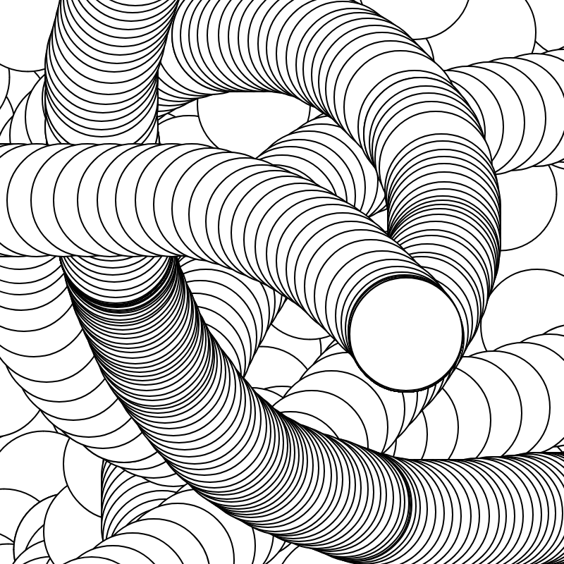
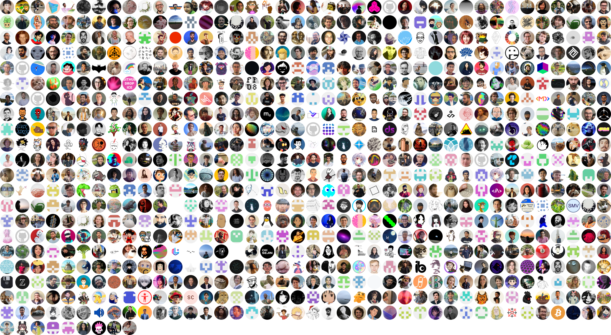

[](https://www.npmjs.com/package/p5)
[](#contributors)
[](https://www.npmjs.com/package/p5)

# [p5.js](https://p5js.org)

Welcome! 👋👋🏿👋🏽👋🏻👋🏾👋🏼

p5.js is a free and open-source JavaScript library for [accessible](https://p5js.org/contribute/access) creative coding. It is a nurturing community, an approachable language, an exploratory tool, an accessible environment, an inclusive platform, welcoming and playful for artists, designers, educators, beginners, and anyone else!

<table>
<tr>
<td>

```js
function setup() {
  createCanvas(400, 400);
  background(255);
}

function draw() {
  circle(mouseX, mouseY, 80);
}
```

</td>
<td>



</td>
</tr>
</table>

[Get Started](https://p5js.org/tutorials/get-started/) — [Reference](https://p5js.org/reference) — [Tutorials](https://p5js.org/tutorials) — [Examples](https://p5js.org/examples/) — [Libraries](https://p5js.org/libraries) — [Forum](https://discourse.processing.org/c/p5js) — [Discord](https://discord.p5js.org)

## About

p5.js is built and organized to prioritize [accessibility, inclusivity, community, and joy](https://p5js.org/community). Similar to sketching, p5.js has a full set of tools to draw. It also supports creating audio-visual, interactive, experimental, and generative works for the web. p5.js enables thinking of a web page as your sketch. p5.js is accessible in multiple languages and has an expansive [documentation](https://p5js.org/reference/) with visual examples. You can find [tutorials](https://p5js.org/tutorials/) on the p5.js website and start coding right now in the [p5.js web editor](https://editor.p5js.org/). You can extend p5.js with many community-created [libraries](https://p5js.org/libraries/) that bring different capabilities. Its community provides endless inspiration and support for creators.

p5.js encourages iterative and exploratory code for creative expression. Its friendly, diverse community shares art, code, and learning resources to help elevate all voices. We share our values in open source and access for all, to learn, create, imagine, design, share and code freely.

## Community

The p5.js community shares an interest in exploring the creation of art and design with technology. We are a community of, and in solidarity with, people from every gender identity and expression, sexual orientation, race, ethnicity, language, neuro-type, size, disability, class, caste, religion, culture, subculture, immigration status, age, skill level, occupation, and background. We stand in solidarity with justice and liberation movements. We work to acknowledge, dismantle, and prevent barriers to access p5.js code and the p5.js community.

Learn more about [our community](https://p5js.org/community/) and read our community statement and [code of conduct](https://github.com/processing/p5.js/blob/main/CODE_OF_CONDUCT.md). You can directly support our work with p5.js by donating to [the Processing Foundation](https://processingfoundation.org/support).

## Issues

If you have found a bug in the p5.js library or want to request new features, feel free to file an issue! See our [contributor guidelines](https://p5js.org/contribute/contributor_guidelines) for a full reference of our contribution process. A set of templates for reporting issues and requesting features are provided to assist you (and us!). Different parts of p5.js are in different repositories. You can open an issue on each of them through these links:

[p5.js](https://github.com/processing/p5.js/issues) — [p5.js website](https://github.com/processing/p5.js-website/issues) —- [p5.js web editor](https://github.com/processing/p5.js-web-editor/issues)

p5.js is maintained mostly by volunteers, so we thank you for your patience as we try to address your issues as soon as we can.

## Get Started for Contributors

p5.js is a collaborative project with many contributors, mostly volunteers, and you are invited to help. All types of involvement are welcome. See the [contribute](https://p5js.org/contribute) for more in-depth details about contributing to different areas of the project, including code, bug fixes, documentation, discussion, and more.

A quick Getting Started with the Build and setting up the repository could be found [here](https://p5js.org/contribute/contributor_guidelines/#quick-get-started-for-developers).

## AI Usage Policy

This project does _not_ accept fully AI-generated contributions. AI tools may be used assistively only. As a contributor, you should be able to understand and take responsibility for changes you make to the codebase.

More details can be found in our [AI Usage Policy](./AI_USAGE_POLICY.md) and [AGENTS.md](./AGENTS.md).

## Stewards

Stewards are contributors who are particularly involved, familiar, or responsive to certain areas of the project. Their role is to help provide context and guidance to others working on p5.js. If you have a question about contributing to a particular area, you can tag the listed steward in an issue or pull request. They may also weigh in on feature requests and guide the overall direction of their area, with the input of the community. You can read more about the organization of the project in our p5.js [Contributor Guidelines](https://p5js.org/contribute/contributor_guidelines) and p5.js [Steward Guidelines](https://p5js.org/contribute/steward_guidelines).

Anyone interested can volunteer to be a steward! There are no specific requirements for expertise, just an interest in actively learning and participating. If you’re familiar with or interested in actively learning and participating in some of the p5.js areas below, please reply to [this issue](https://github.com/processing/p5.js/issues/5719) mentioning which area(s) you are interested in volunteering as a steward! 👋👋👋

p5.js was created by [Lauren Lee McCarthy](https://github.com/lmccart) in 2013 as a new interpretation of Processing for the context of the web. Since then we have allowed ourselves space to deviate and grow, while drawing inspiration from Processing and our shared community. p5.js is sustained by a community of contributors, with support from the Processing Foundation. p5.js follows a rotating leadership model started in 2020. Learn more about the [people](https://p5js.org/people/) behind p5.js.

Current Lead/Mentor

- [@ksen0](https://github.com/ksen0) - p5.js Lead，2024-present
- [@limzykenneth](https://github.com/limzykenneth) - p5.js Mentor，2023-present

Lead/Mentor Alumni

- [@lmccart](https://github.com/lmccart) - p5.js Creator
- [@qianqianye](https://github.com/qianqianye) - p5.js Lead，2021-2025
- [@outofambit](https://github.com/outofambit) - p5.js Co-Lead 2021-22, Mentor 2022-2023
- [@mcturner1995](https://github.com/mcturner1995) - p5.js Lead 2020

<!-- STEWARDS-LIST:START - Do not remove or modify this section -->

| Area                          | Steward(s)                                                                                                                                                                                                                             |
| ----------------------------- | -------------------------------------------------------------------------------------------------------------------------------------------------------------------------------------------------------------------------------------- |
| Maintainers                   | [@davepagurek](https://github.com/davepagurek), [@doradocodes](https://github.com/doradocodes), [@ksen0](https://github.com/ksen0), [@limzykenneth](https://github.com/limzykenneth), [@perminder-17](https://github.com/perminder-17) |
| Accessibility                 | [@calebfoss](https://github.com/calebfoss)                                                                                                                                                                                             |
| Accessibility (p5.js-website) | [@coseeian](https://github.com/coseeian)                                                                                                                                                                                               |
| Color                         | [@limzykenneth](https://github.com/limzykenneth)                                                                                                                                                                                       |
| Core                          | [@davepagurek](https://github.com/davepagurek)                                                                                                                                                                                         |
| DevOps                        | [@Vaivaswat2244](https://github.com/Vaivaswat2244), [@limzykenneth](https://github.com/limzykenneth), [@lirenjie95](https://github.com/lirenjie95)                                                                                     |
| Documentation                 | [@limzykenneth](https://github.com/limzykenneth), [@perminder-17](https://github.com/perminder-17)                                                                                                                                     |
| Graphics (WebGL)              | [@RandomGamingDev](https://github.com/RandomGamingDev), [@davepagurek](https://github.com/davepagurek), [@perminder-17](https://github.com/perminder-17)                                                                               |
| Graphics (WebGPU)             | [@aashu2006](https://github.com/aashu2006), [@davepagurek](https://github.com/davepagurek), [@perminder-17](https://github.com/perminder-17)                                                                                           |
| i18n (es)                     | [@marioguzzzman](https://github.com/marioguzzzman)                                                                                                                                                                                     |
| i18n (hi)                     | [@Divyansh013](https://github.com/Divyansh013)                                                                                                                                                                                         |
| i18n (ko)                     | [@eupthere](https://github.com/eupthere), [@JiwonHaam](https://github.com/JiwonHaam)                                                                                                                                                   |
| i18n (zh)                     | [@limzykenneth](https://github.com/limzykenneth), [@lirenjie95](https://github.com/lirenjie95)                                                                                                                                         |
| p5.js-web-editor              | [@kitlord](https://github.com/kitlord)                                                                                                                                                                                                 |
| p5.js-website                 | [@Nwakaego-Ego](https://github.com/Nwakaego-Ego), [@clairep94](https://github.com/clairep94), [@doradocodes](https://github.com/doradocodes), [@ksen0](https://github.com/ksen0)                                                       |
| p5.sound.js                   | [@ogbabydiesal](https://github.com/ogbabydiesal)                                                                                                                                                                                       |
| Typography                    | [@dhowe](https://github.com/dhowe)                                                                                                                                                                                                     |

<!-- STEWARDS-LIST:END -->

## Contributors

We recognize all types of contributions. This project follows the [all-contributors specification](https://github.com/all-contributors/all-contributors) and the [Emoji Key](https://github.com/all-contributors/all-contributors/blob/master/docs/emoji-key.md) ✨ for contribution types. Instructions to add yourself or add contribution emojis to your name are [here](https://github.com/processing/p5.js/issues/2309). You can also post an issue or comment on a pull request with the text: `@all-contributors please add @YOUR-USERNAME for THINGS` (where `THINGS` is a comma-separated list of entries from the [list of possible contribution types](https://github.com/all-contributors/all-contributors/blob/master/docs/emoji-key.md)) and our nice bot will add you to [CONTRIBUTORS.md](./CONTRIBUTORS.md) automatically!



Thanks to all the wonderful contributors! 💓


## 🌐 Web Resources & Interactive Index
- [FRUIT JAM MERGE PUZZLE GAME](https://studyplaying.github.io/fruit-jam-merge-puzzle-game.html)
- [CATEGORY CARE](https://thelearnquesters.pages.dev/category-care.html)
- [CANNON MERGE](https://studyquests.github.io/cannon-merge.html)
- [KNIFE UP 3D](https://studyquests.github.io/knife-up-3d.html)
- [KINGDOM WARS TD](https://thelearnquesters.pages.dev/kingdom-wars-td.html)
- [CATEGORY SPACE](https://thelearnquesters.pages.dev/category-space.html)
- [MONSTER MERGE LEGENDS ALIVE](https://learnquester.pages.dev/monster-merge-legends-alive.html)
- [THREAD MATCH 2](https://thequizzone.pages.dev/thread-match-2.html)
- [CATEGORY BATTLE524](https://studyplayings.pages.dev/category-battle524.html)
- [BALL DROP](https://studyquesthub.web.app/ball-drop.html)
- [SHANGHAI CHEF](https://studyplayings.pages.dev/shanghai-chef.html)
- [TRICKY ARROW](https://learnquester.pages.dev/tricky-arrow.html)
- [ELLIE CHRISTMAS MAKEUP](https://studyquests.github.io/ellie-christmas-makeup.html)
- [THROUGH THE WALL 3D](https://themindplays.pages.dev/through-the-wall-3d.html)
- [BANK ROBBERY 3](https://studyplayings.web.app/bank-robbery-3.html)
- [RUNNING LATE](https://studyquesthub.web.app/running-late.html)
- [SCREW JAM FUN PUZZLE GAME](https://studyplayings.pages.dev/screw-jam-fun-puzzle-game.html)
- [CATEGORY DRESS UP 2](https://themindplay.pages.dev/category-dress-up-2.html)
- [CATEGORY 2D1 175](https://studyquests.pages.dev/category-2d1-175.html)
- [PIGGY CLICKER](https://theskillquest.pages.dev/piggy-clicker.html)
- [BLOCK BLASTER PUZZLE](https://iskillplay.web.app/block-blaster-puzzle.html)
- [TIE DYE EXPLOSION OF COLOR](https://themindzone.pages.dev/tie-dye-explosion-of-color.html)
- [BRAWL STARS SOUND](https://studyquesthub.web.app/brawl-stars-sound.html)
- [SHANGHAI CHEF](https://themindzone.pages.dev/shanghai-chef.html)
- [SEA BATTLE ADMIRAL](https://themindzone.pages.dev/sea-battle-admiral.html)
- [CHROMA TREK](https://thequizzone.pages.dev/chroma-trek.html)
- [INDEX19](https://studyquests.pages.dev/index19.html)
- [CATEGORY MERGE 2](https://thequizzone.pages.dev/category-merge-2.html)
- [TRIPLE SORT 3D HOME DESIGN](https://themindzone.pages.dev/triple-sort-3d-home-design.html)
- [CAR VS ZOMBIES](https://studyquests.github.io/car-vs-zombies.html)
- [REAL FREEKICK 3D](https://themindplay.pages.dev/real-freekick-3d.html)
- [DIAMONDZ](https://iskillplay.web.app/diamondz.html)
- [STUDENT AND TEACHER](https://themindzone.pages.dev/student-and-teacher.html)
- [ZOMBIE SIEGEIO](https://studyquesthub.web.app/zombie-siegeio.html)
- [CAPYBARA MUKBANG ASMR](https://thelearnquesters.pages.dev/capybara-mukbang-asmr.html)
- [NATURAL DISASTER SURVIVAL OBBY](https://thelearnquester.web.app/natural-disaster-survival-obby.html)
- [FOOTBALL DUEL](https://thelearnquesters.pages.dev/football-duel.html)
- [CATEGORY SOCCER](https://thelearnquesters.pages.dev/category-soccer.html)
- [FALLING ART RAGDOLL SIMULATOR](https://studyplayings.web.app/falling-art-ragdoll-simulator.html)
- [ARMY DEFENCE DINO SHOOT](https://themindplay.pages.dev/army-defence-dino-shoot.html)
- [TAILOR STYLIST FASHION DIARY](https://studyplayings.web.app/tailor-stylist-fashion-diary.html)
- [SPACE SHIFT](https://themindzone.pages.dev/space-shift.html)
- [VOLLEY BEAN](https://themindzone.pages.dev/volley-bean.html)
- [OFFROAD JEEP GAME SIMULATOR](https://learnquester.github.io/offroad-jeep-game-simulator.html)
- [4 COLORS CARD MANIA](https://thelearnquesters.pages.dev/4-colors-card-mania.html)
- [SKILLFUL FINGER](https://themindzone.pages.dev/skillful-finger.html)
- [BALL MANIA](https://themindplay.pages.dev/ball-mania.html)
- [COLOR MIX JELLY MERGE](https://themindzone.pages.dev/color-mix-jelly-merge.html)
- [MIRRORS PUZZLE](https://learnquester.github.io/mirrors-puzzle.html)
- [HIDDEN OBJECTS VACATION IN BRAZIL](https://quizverses.pages.dev/hidden-objects-vacation-in-brazil.html)
- [WORDLER](https://studyquesthub.web.app/wordler.html)
- [LABUBU POP](https://themindplay.pages.dev/labubu-pop.html)
- [CLINIC CLEANUP CREW](https://themindzone.pages.dev/clinic-cleanup-crew.html)
- [INDEX25](https://iskillplay.web.app/index25.html)
- [SID GINNY Y2K GLAM CLASH](https://themindzone.pages.dev/sid-ginny-y2k-glam-clash.html)
- [FISH STORY 4](https://iskillplay.web.app/fish-story-4.html)
- [SINGLE STROKE LINE DRAW](https://quizverses-9d2f2.web.app/single-stroke-line-draw.html)
- [BUS DRIVER SIMULATOR 3D](https://studyquests.github.io/bus-driver-simulator-3d.html)
- [CATEGORY PARTY23](https://studyquests.github.io/category-party23.html)
- [DRAW TO FISH FIGHT](https://learnquester.github.io/draw-to-fish-fight.html)
- [ROYAL JEWELS MATCH](https://iskillplay.web.app/royal-jewels-match.html)
- [CAT SORTER PUZZLE](https://themindplay.pages.dev/cat-sorter-puzzle.html)
- [LIGHT ACADEMIA FASHION](https://themindskillplayplay.pages.dev/light-academia-fashion.html)
- [CURSED TREASURE 11 2](https://themindzone.pages.dev/cursed-treasure-11-2.html)
- [NAIL QUEEN](https://learnquester.github.io/nail-queen.html)
- [SLOPE EMOJI 2](https://learnquester.github.io/slope-emoji-2.html)
- [MOJICON GARDEN JIGSOLITAIRE](https://quizverses-9d2f2.web.app/mojicon-garden-jigsolitaire.html)
- [GIRL RESCUE DRAGON OUT](https://iskillplay.web.app/girl-rescue-dragon-out.html)
- [MOTORCYCLE RACER ROAD MAYHEM](https://thelearnquesters.pages.dev/motorcycle-racer-road-mayhem.html)
- [CRYPTO GALS TIKTOK FASHION](https://learnquester.github.io/crypto-gals-tiktok-fashion.html)
- [YOUR DREAM ROOM](https://themindskillplayplay.pages.dev/your-dream-room.html)
- [SMOKE TRAIL](https://studyquests.github.io/smoke-trail.html)
- [SORT WATER NOW](https://themindzone.pages.dev/sort-water-now.html)
- [STAND ON THE RIGHT COLOR ROBBY](https://iskillplay.web.app/stand-on-the-right-color-robby.html)
- [THE SUPERHERO LEAGUE](https://themindzone.pages.dev/the-superhero-league.html)
- [CATEGORY MISSION207](https://studyquests.github.io/category-mission207.html)
- [BRAINROT CLEANING](https://quizverses-9d2f2.web.app/brainrot-cleaning.html)
- [PAW CLASH](https://iskillplay.web.app/paw-clash.html)
- [TSUNAMI RACE](https://studyquests.github.io/tsunami-race.html)
- [PEW PEW DOSE](https://themindzone.pages.dev/pew-pew-dose.html)
- [OFFROAD CLIMB 4X4](https://studyplayings.pages.dev/offroad-climb-4x4.html)
- [DTA BEST THIEF](https://themindzone.pages.dev/dta-best-thief.html)
- [CATEGORY BIKE 2](https://iskillplay.web.app/category-bike-2.html)
- [POTION MERGE WITCH](https://learnquester.github.io/potion-merge-witch.html)
- [HALLOWEEN CHALLENGE](https://themindskillplayplay.pages.dev/halloween-challenge.html)
- [OIL DIGGING](https://themindplay.pages.dev/oil-digging.html)
- [DIVINEX](https://thelearnquesters.pages.dev/divinex.html)
- [MINEBLOCKS 3D MAZE](https://themindzone.pages.dev/mineblocks-3d-maze.html)
- [BLACK PINK HALLOWEEN CONCERT](https://iskillplay.web.app/black-pink-halloween-concert.html)
- [FIREBOY WATERGIRL 7 AND FRIENDS](https://iskillplay.web.app/fireboy-watergirl-7-and-friends.html)
- [CATEGORY BRAIN](https://learnquester.pages.dev/category-brain.html)
- [GRAVITY MATCHER](https://quizverses.pages.dev/gravity-matcher.html)
- [CATEGORY 3D1 371](https://quizverses.pages.dev/category-3d1-371.html)
- [WATER SORT PUZZLE 3](https://themindplaying.web.app/water-sort-puzzle-3.html)
- [CONNECT THE DOTS COLOR LINES](https://learnquester.github.io/connect-the-dots-color-lines.html)
- [BANANA BOUNCE](https://themindzone.pages.dev/banana-bounce.html)
- [REAL FREEKICK 3D](https://themindzone.pages.dev/real-freekick-3d.html)
- [CATEGORY CUTE62](https://studyquests.github.io/category-cute62.html)
- [DOGGI](https://themindzone.pages.dev/doggi.html)
- [CATEGORY FOOTBALL](https://learnquester.pages.dev/category-football.html)
- [CATEGORY MOUSE1 707 2](https://thequizzone.pages.dev/category-mouse1-707-2.html)
- [DRAWER SORT](https://quizverses.pages.dev/drawer-sort.html)
- [COLOR BLOCK BLAST 3](https://themindzone.pages.dev/color-block-blast-3.html)
- [CATEGORY ANIMAL215](https://iskillplay.web.app/category-animal215.html)
- [CATEGORY MONSTER206](https://learnquester.pages.dev/category-monster206.html)
- [MATHEMATICS RACING](https://studyquesthub.web.app/mathematics-racing.html)
- [CATEGORY DRESS UP](https://studyquests.github.io/category-dress-up.html)
- [PET SALON SIMULATOR](https://studyplayings.pages.dev/pet-salon-simulator.html)
- [NUTS BOLTS SORT COLOR PUZZLE](https://themindplaying.web.app/nuts-bolts-sort-color-puzzle.html)
- [K POP HUNTER FASHION](https://studyquests.github.io/k-pop-hunter-fashion.html)
- [WOOD SCREW PUZZLE](https://themindzone.pages.dev/wood-screw-puzzle.html)
- [ROBBIE STAND ON THE RIGHT COLOR](https://quizverses.pages.dev/robbie-stand-on-the-right-color.html)
- [HAZEL TANGLE ROPE 3D SORTING PUZZLE](https://themindskillplayplay.pages.dev/hazel-tangle-rope-3d-sorting-puzzle.html)
- [STICKMAN RAGDOLL PLAYGROUND](https://studyplayings.pages.dev/stickman-ragdoll-playground.html)
- [ROPE STITCH PUZZLE](https://quizverses-9d2f2.web.app/rope-stitch-puzzle.html)
- [TICTOC BRAIDED HAIRSTYLES](https://studyplayings.pages.dev/tictoc-braided-hairstyles.html)
- [KITTY MATCH 3 PUZZLE GAME](https://learnquesters.pages.dev/kitty-match-3-puzzle-game.html)
- [MATCH MASTERS](https://quizverses.pages.dev/match-masters.html)
- [SAVE THE SHEEP](https://quizverses.pages.dev/save-the-sheep.html)
- [CONTACT](https://studyplayings.web.app/contact.html)
- [LUNAR PHASE BATTLE](https://themindskillplayplay.pages.dev/lunar-phase-battle.html)
- [PYRAMIDZ2](https://themindzone.pages.dev/pyramidz2.html)
- [IDLE TRADE ISLE](https://studyquests.github.io/idle-trade-isle.html)
- [FILL THE BOTTLE](https://themindplaying.web.app/fill-the-bottle.html)
- [BATTLE SIMULATOR SANDBOX](https://thelearnquesters.pages.dev/battle-simulator-sandbox.html)
- [CATEGORY ARENA254](https://iskillplay.web.app/category-arena254.html)
- [INDEX7](https://thelearnquesters.pages.dev/index7.html)
- [CHALLENGER CITY DRIVER](https://studyplayings.web.app/challenger-city-driver.html)
- [RAGDOLL MEGA DUNK](https://themindzone.pages.dev/ragdoll-mega-dunk.html)
- [PENTAWORD](https://studyquesthub.web.app/pentaword.html)
