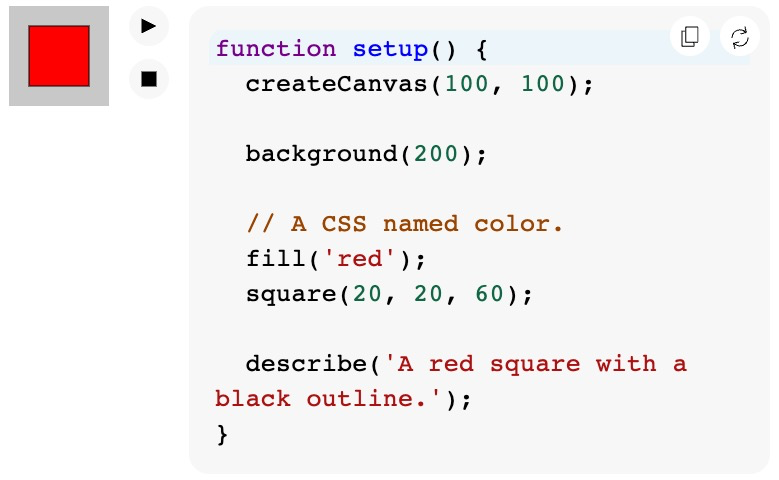

<!-- Write and edit p5.js reference using the right format. -->

<!--
// --- 47 char max width for code examples ----
-->

# Contributing to the p5.js Reference

## Table of Contents
* [A quick introduction to reference comments](#a-quick-introduction-to-reference-comments)
* [Documenting functions](#documenting-functions)
* [Documenting p5.js variables](#documenting-p5js-variables)
* [Adding examples](#adding-examples)
* [Using assets in examples and descriptions](#using-assets)
* [Linking to other p5.js features](#linking)
* [Less common JSDoc tags](#less-common-jsdoc-tags)
* [Generating and previewing the reference](#generating-and-previewing-the-reference)
* [Linting the comments to find errors](#linting-the-docs)
* [Next steps](#next-steps)
* [Appendix: Tags quick reference](#tags-quick-reference)
* [Appendix: Summary of differences with p5.js v1.x](#doc-differences-v1-to-v2)

In p5.js, we author the code reference you see on the [reference](https://beta.p5js.org/reference/) page on the p5.js website by including specialized comments alongside the library’s source code. For each p5 function, for example, a reference comment includes the name and description of the function, details of its parameters and return value, and examples of use. The content you see on each p5.js function/variable’s reference page is built from these reference comments in the source code.

This document will show you how to write and format the reference comments so that they can eventually be rendered onto the website correctly. You should follow this guide whenever you are editing or writing a reference for any p5.js function or variable.

If you are already familiar, you might prefer the [tags quick reference](#tags-quick-reference) included at the end.

If you're looking to learn about the build process that generates the reference documentation from the source-code comments, see instead [Reference generation process](./reference_generation_process/)

### A note about p5.js versions

This document describes how to work with p5.js version 2.x, whose reference documentation is currently being hosted at https://beta.p5js.org/reference/.  If you are documenting code for p5.js v1.x, you should consult [this document](https://p5js.org/contribute/contributing_to_the_p5js_reference/), instead, as some of the syntax and processes are different.

(Most of the differences are detailed in [this appendix](#doc-differences-v1-to-v2)).

## A quick introduction to reference comments

When you look at the source code of p5.js, you will see many lines in the library being reference comments; they vary but often have this sort of form:

```js
/**
 * Draws a circle.
 *
 * A much longer description normally goes here
 *
 * @method circle
 * @param {Number} x x-coordinate of centre.
 * @param {Number} y y-coordinate of centre.
 * @param {Number} diameter Diameter of circle.
 *
 * @example
 * function setup() {
 *   createCanvas(100, 100);
 *   //Draw circle at (50, 0) with diameter 70.
 *   circle(50, 0, 70);
 * }
 */
```

These reference comments are usually followed by the actual JavaScript code that defines the function. Reference comments always start with `/**` and end with `*/`, with each line in between the two starting with `*`.  

Anything in a block in this manner will be interpreted as reference documentation. These generally follow a format called [JSDoc](https://jsdoc.app/).

In this style of reference comments, each comment block is further divided into individual elements, which we will have a look at next.

## Documenting functions

In abstract, a comment block for a p5 _function_ typically looks as follows.  (We've included the tags that will mark each section but the correct syntax will be shown shortly).

```js
/**
 * One-line description of the function.
 *
 * More detail about the function's behavior.  
 * This can be many paragraphs and include 
 * links and images.
 *
 * The name of function - with @method
 * Detail of a function parameter - with @param
 * Detail of a function parameter - with @param
 * ... more parameters
 * Optional detail about return - with @return
 *
 * Example of use - with @example
 * Example of use - with @example
 * ... more examples
 */
```


### A look at a real example function: `sin()`

Let’s take a look at a real reference comment block for a function from the library - the `sin()` function. You can compare what you see in the comment block below with what you can see on the published [reference page for `sin()`](https://beta.p5js.org/reference/p5/sin/).  

It is very long.  If it is overwhelming, notice that it is 80% made up of example sketches.

The reference comment block for the `sin()` function:

```js
/**
 * Calculates the sine of an angle.
 *
 * `sin()` is useful for many geometric tasks
 * in creative coding. The values returned
 * oscillate between -1 and 1 as the input
 * angle increases. `sin()` calculates the
 * sine of an angle, using radians by default,
 * or according to the <a
 * href="#/p5/angleMode">angleMode()</a>
 * setting (RADIANS or DEGREES).
 *
 * @method sin
 * @param  {Number} angle the angle.
 * @return {Number} sine of the angle.
 *
 * @example
 * function setup() {
 *   createCanvas(100, 100);
 *
 *   describe('A white ball on a string oscillates up and down.');
 * }
 *
 * function draw() {
 *   background(200);
 *
 *   // Calculate the coordinates.
 *   let x = 50;
 *   let y = 30 * sin(frameCount * 0.05) + 50;
 *
 *   // Draw the oscillator.
 *   line(50, y, x, y);
 *   circle(x, y, 20);
 * }
 *
 * @example
 * function setup() {
 *   createCanvas(100, 100);
 *
 *   background(200);
 *
 *   describe('A series of black dots form a wave pattern.');
 * }
 *
 * function draw() {
 *   // Calculate the coordinates.
 *   let x = frameCount;
 *   let y = 30 * sin(x * 0.1) + 50;
 *
 *   // Draw the point.
 *   point(x, y);
 * }
 *
 * @example
 * function setup() {
 *   createCanvas(100, 100);
 *
 *   background(200);
 *
 *   describe('A series of black dots form an infinity symbol.');
 * }
 *
 * function draw() {
 *   // Calculate the coordinates.
 *   let x = 30 * cos(frameCount * 0.1) + 50;
 *   let y = 10 * sin(frameCount * 0.2) + 50;
 *
 *   // Draw the point.
 *   point(x, y);
 * }
 */
```

If you like, you can find the source code for this `sin` function in the p5 repo, [here in /src/math/trigonometry.js](https://github.com/processing/p5.js/blob/dev-2.0/src/math/trigonometry.js).  Search for `@method sin` for the start of the comment block (and `fn.sin` for the start of the function code).

Now we'll look at each section in turn.

### <a id="description"></a>Describing the function

Example: 

```js
/**
 * Calculates the sine of an angle.
 *
 * `sin()` is useful for many geometric tasks
 * in creative coding. The values returned
 * oscillate between -1 and 1 as the input
 * angle increases. `sin()` calculates the
 * sine of an angle, using radians by default,
 * or according to the <a
 * href="#/p5/angleMode">angleMode()</a>
 * setting (RADIANS or DEGREES).
 * ...further description omitted...
```

At the very top of the comment is the text description of the function. The description should be concise and describe what the function does and, if necessary, some details about its quirks or behaviors.

This description can contain both [markdown syntax](https://daringfireball.net/projects/markdown/syntax) and [HTML](https://developer.mozilla.org/en-US/docs/Web/HTML/Reference/Elements). In the above example we see examples of both:

* Markdown: The backtick characters around the function name, `sin()`, will cause it to be presented as a snippet of code.
* Markdown: The blank line will be preserved.
* HTML: The use of the html anchor tag `<a/>` makes `angleMode()` a clickable link to navigate to another page of documentation.  See [linking](#linking), later.

In some places, you may see the  `@description` tag used.  It explicitly marks the description section and is only actually necessary if the description text isn't placed at the very beginning of the JSDoc comment.

[Here's the JSDoc documentation on this description section](https://jsdoc.app/tags-description).

#### The first sentence of the description

The first sentence in the description, in particular, should concisely summarize what the function does.  
It may be presented alone with the function name in listings (e.g. in [the function list](https://beta.p5js.org/reference/#Shape) on the front page of the reference website), where it should help the reader understand quickly if the function is what they're looking for.

**Examples of first sentences of function descriptions**

The following examples are all taken directly from the p5.js codebase, from the description of functions.  They demonstrate that even complex functions can have a short first sentence description.

```
Creates a canvas element on the web page.

Sets the color used to draw points, lines, and the outlines of shapes.

Stops the code in <a href="#/p5/draw">draw()</a> from running repeatedly.

Creates a new <a href="#/p5.Element">p5.Element</a> object.   

Creates a <a href="#/p5.Graphics">p5.Graphics</a> object.

Translates the coordinate system.

Draws an image to the canvas.

Applies an image filter to the canvas.

A function that's called once when any key is pressed.

Calculates the distance between two points.

Calculates the magnitude, or length, of a vector.

Re-maps a number from one range to another.

Returns a random number or a random element from an array.

Sets or gets the current text size.

Sets the position and orientation of the current camera in a 3D sketch.

Creates a new 2D unit vector with a random heading.

Multiplies a vector by a scalar and returns a new vector.

```

#### Using images within the description section

In some cases it may be desirable to include, in the description, images or audio or video to help explain or demonstrate a function's working.
For an example of this see the reference for [`applyMatrix`](https://beta.p5js.org/reference/p5/applymatrix/).

_Hosting_ of these images is discussed later in [this section on assets](#using-assets).

To _link_ to it, you would use an HTML `img` element, with `src` property referring to the image in `assets/`.  Be sure to also include an appropriate `alt` property.

Here's a cut-down example from the source of [`applyMatrix`](https://github.com/processing/p5.js/blob/bf773b74975e58ad0978031338a339e990222202/src/core/transform.js#L31):

```js
/**
 * Applies a transformation matrix to the 
 * coordinate system.
 * ...
 * 
 * ...
```

### <a id="method"></a>`@method` - specifying the function name

[`@method`](https://jsdoc.app/tags-function) is used to define the name of the function, in this case `sin`.  Note that the function name does not include the brackets `()`.  

You may sometimes see this missing from the reference.  In that case JSDoc will try to infer it by looking at the name of the function from the following source code.  It is recommended to include the function name using the @method tag where possible.

This tag is also useful when detailing multiple signatures for a function (see later).

### <a id="param"></a>`@param` - specifying details of each parameter

[`@param`](https://jsdoc.app/tags-param) is used to define the parameters or arguments that the function accepts.  It is used once per parameter.

The general format for a parameter is: 

```
@param {type} name Description here.
```

For example, the `sin()` function has: 
```
@param  {Number} angle  the angle.
```

1. Following the keyword `@param`, the _type_ of the parameter is mentioned in curly brackets `{}`. (in this case, `{Number}`)
  - This is strongly recommended but can be omitted in certain cases (notably in p5.strands).

2. After the type, the next _word_ (in this case, `angle`) is the name of the parameter.
  - This must exactly match the name of the relevant parameter in the source code.

3. After the name, the rest of the line is the description of the parameter.

If the parameter is optional, add square brackets around the name:

```
@param {type} [name] Description here.
```

#### Examples of parameter types

An example from [rect()](https://beta.p5js.org/reference/p5/rect/), where the topleft ("tl") parameter is optional:
```
@param  {Number} [tl] optional radius of top-left corner.
```
An example from [createCanvas](https://beta.p5js.org/reference/p5/createcanvas/) where a "renderer" parameter can optionally be supplied:

```
@param  {(P2D|WEBGL)} [renderer] either P2D or WEBGL. Defaults to P2D.
```

A more advanced example from [hue](https://beta.p5js.org/reference/p5/hue/) where the color parameter can be a p5.Color object, an array of numbers, or a string:
```
* @param {p5.Color|Number[]|String} color
```

**"Number" not "number".  "String" not "string"**

Throughout the p5.js documentation, primitive types are all capitalized: String, Number, Boolean, etc.  (This is an example where our convention differs from JSDoc.)


#### Parameters that expect arrays

When specifying an array type, use `type[]` rather than `Array<type>`.  

For example, use:
```
@param {Number[]} colors an array of colors.
```
instead of:
```
@param {Array<Number>} colors an array of colors.
```

#### Parameters that expect constants

If the parameter takes one or more values defined in [`constants.js`](https://github.com/processing/p5.js/blob/main/src/core/constants.js), the valid constants should be listed in the parameter type, separated by `|` characters (pipe characters).

Examples:

```js
/**
 * @method rectMode
 * @param {CENTER|RADIUS|CORNER|CORNERS} mode
 */
```

```js
/**
  * @method textAlign
  * @param {LEFT|CENTER|RIGHT} horizAlign 
  *    horizontal alignment.
 */
 ```
#### Parameters that expect callback functions

If you need to document a parameter which is expected to be a _function_, you can use the type `Function`.  For example: 

```
@param {Function} callback
```

If you can detail the expected function further, use a type of this form: `function(typeOfArgument)`

Example: 

Here's some of the documentation for `loadImage`, which has an optional parameter, `successCallback`.  This received callback function will be passed the loaded `p5.Image` once ready:

```
* @method loadImage
* @param {function(p5.Image)} [successCallback] 
* function called with 
* <a href="#/p5.Image">p5.Image</a> once loaded
```

#### Links in param descriptions

You can include links in the description of a parameter.  For how to link to another reference page see [linking](#linking), later.

Example:
```
* @method rotate
* @param {Number} angle angle of rotation in 
* the current <a href="#/p5/angleMode">angleMode()</a>.
```

### <a id="return"></a>`@return` - specifying the return value

[`@return`](https://jsdoc.app/tags-returns) is used to define the return value of the function.

The general format for this line is:
```
@return {type} Description here.
```

Example, from `sin()` function:

```
@return {Number} sine of the angle.
```

1. Following the keyword `@return`, the _type_ of the return value is stated in curly brackets `{}`.  (e.g. `{Number}` for the `sin()` function)
2. After the type, the rest of the line is the description of the return value.

If the function does not return a value, the `@return` tag can be left out.

If the function returns a value but you want it to be type `any`, use `{*}`, e.g. `@return {*} description here...`

You can include links in the description of a return.  For how to link to another reference page see [linking](#linking), later.

More examples of `@return`:

Linking to the documentation of the returned object.  (From: [createVector()](https://beta.p5js.org/reference/p5/createVector/)):
```
@return {p5.Vector} new 
<a href="#/p5.Vector">p5.Vector</a> object.
```

Returning an array. (From [p5.Image#get()](https://beta.p5js.org/reference/p5.image/get/)):
```
@return {Number[]} color of the pixel at (x, y)
in array format `[R, G, B, A]`.
```

Returning a Promise.  (From [loadFilterShader()](https://beta.p5js.org/reference/p5/loadFilterShader/)):
```
@return {Promise<p5.Shader>} a promise that 
resolves with a shader object.
```

### Advanced function documentation notes

#### Chaining

If the method returns the parent object, you can skip the `@return` tag and add this line instead:

```
@chainable
```

#### Multiple function signatures

If a function has multiple possible parameter options, you can specify each individually. For example, the [`background()`](https://beta.p5js.org/reference/p5/background/) function takes a number of different parameter options (see "Syntax" section on the reference page). Choose one version to list as the first signature using the template above. After the end of the first reference comment block, you can add additional signatures, each in its own block, using only the `@method` and `@param` tags following the example below.

```js
/**
 * @method background
 * @param {String} colorstring color string, 
 *   possible formats include: integer rgb()
 *   or rgba(), percentage rgb() or rgba(),
 *   3-digit hex, 6-digit hex
 * @param {Number} [a] alpha value
 */

/**
 * @method background
 * @param {Number} gray specifies a value 
 *                between white and black
 * @param {Number} [a]
 */
```


#### Multiple signatures vs optional parameter

It is not necessary to create a separate signature if the only difference between two signatures is the addition of an optional parameter. Limit the use of this feature if possible because it can create unnecessary noise in the reference.


#### Static and instance methods with same name

When a class provides instance and static methods of the same name, only one will currently be presented in the online reference.

Document the instance method as normal.  However, at the end of its description, mention that there is also a static version and describe its parameters and return in plain text.

This is the documentation that will be presented in the reference.

In a separate comment block for the static method, document its parameters and return value.  Even though these will not currently be shown on the reference website, they're important in the generation of the library's type declarations (e.g. for intellisense and auto-completion) (and may eventually be incorporated into the reference page).

Example: 

The p5.Vector class has an instance method [add()](https://beta.p5js.org/reference/p5.vector/add/), and a static `add()` method, too.

Here's (a simplification of) the documentation of the _instance_ method.  Note that the description also mentions the static version.

```js
/**
 * Adds to a vector's components.
 *
 * `add()` can use separate numbers, as in `v.add(1, 2, 3)`,
 * another <a href="#/p5.Vector">p5.Vector</a> object, as in `v.add(v2)`, or
 * an array of numbers, as in `v.add([1, 2, 3])`.
 *
 * ... omitted ...
 *
 * The static version of `add()`, as in `p5.Vector.add(v2, v1)`, returns a new
 * <a href="#/p5.Vector">p5.Vector</a> object and doesn't change the
 * originals.
 *
 * @param  {Number|Array} x   x component of 
 * the vector to be added or an array of 
 * components.
 * @param  {Number} [y] y component of the 
 * vector to be added.
 * @param  {Number} [z] z component of the 
 * vector to be added.
 *
 * @example
 * //omitted
 */
add(...args) {
  ...
}
```
Here is the documentation of the static method:

```js
// Adds two vectors together and returns a new one.
/**
  * @static
  * @param  {p5.Vector} v1 A 
  * <a href="#/p5.Vector">p5.Vector</a> to add
  * @param  {p5.Vector} v2 A 
  * <a href="#/p5.Vector">p5.Vector</a> to add
  * @param  {p5.Vector} [target] vector to 
  * receive the result.
  * @return {p5.Vector} resulting 
  * <a href="#/p5.Vector">p5.Vector</a>.
  */
static add(v1, v2, target) {
  //...
}
```

#### Dynamically generated methods

For dynamically generated methods, do the same as usual, but add `@for p5`.

```js
function myAddon(p5, fn) {
  for (const key of ['nameA', 'nameB']) {
    fn[key] = function() {
      return `Hello from ${key}!`;
    };
  }

  /**
   * @method nameA
   * @for p5
   */

  /**
   * @method nameB
   * @for p5
   */
}
```

#### Rare issues with more complex types

The types specified for function parameters, return values, variables, and object properties are used not only to build the online reference but also to build type-declaration files.

These type-declaration files have multiple uses.  For example:
* providing autocompletion and intellisense in IDEs, including web editors
* type-checking JavaScript or TypeScript sketches.

This makes it even more desirable that we correctly specify the exact type of each element of the library.
However, in a very few specialized cases, the normal way of documenting these types cannot support exactly what you need to say.

In this rare situation, it is possible to use a last-resort mechanism to inject the correct types directly into the type-declaration files.  For details on this see [Patching types](./reference_generation_process#patching-types) in the reference generation process documentation.

Bear in mind this is a last resort.  Try to correctly specify the types in the documentation comments wherever possible.

## Documenting p5.js variables

So far, we have looked at how to write references for functions.  Variables follow the same structure but use different tags.

Example: the reference comment block for the built-in variable, `mouseX`:

```js
/**
 * The system variable mouseX always contains
 * the current horizontal position of the
 * mouse, relative to (0, 0) of the canvas.
 * The value at the top-left corner is (0, 0)
 * for 2-D and (-width/2, -height/2) for
 * WebGL.  If touch is used instead of mouse
 * input, mouseX will hold the x value of the
 * most recent touch point.
 *
 * @property {Number} mouseX
 * @readOnly
 *
 * @example
 * // Move the mouse across the canvas
 * function draw() {
 *   background(244, 248, 252);
 *   line(mouseX, 0, mouseX, 100);
 *   describe('horizontal black line moves 
 *   left and right with mouse x-position');
 * }
 */
```

The start of the block contains the description of the variable (`mouseX` in this case).   The same rules apply from function descriptions: Use a clear short first line, you can use markdown and HTML and assets in the description.

### <a id="property"></a>The `@property` tag

To define the name of the variable, we use [`@property`](https://jsdoc.app/tags-property) instead of `@method`. `@property` follows the same syntax as `@param` for defining the type and its name.

Syntax: 
```
@property {type} name
```

Examples:

From [`src/events/pointer.js`](https://github.com/processing/p5.js/blob/dev-2.0/src/events/pointer.js):
```
 * An `Array` of all the current touch points on a touchscreen device.
 * ...
 * @property {Object[]} touches
```

From [`src/image/p5.Image.js`](https://github.com/processing/p5.js/blob/dev-2.0/src/image/p5.Image.js):
```
* An array containing the color of each pixel on the canvas.
* ...
* @property {Number[]} pixels
```

### <a id="readonly"></a>The `@readonly` tag

The `@readonly` tag is present on most p5.js variables and is used internally to indicate this value should not be overwritten directly by a library user.

## Adding examples

One tag that is present in both `sin()` and `mouseX`’s reference comments that we have not talked about yet is the [`@example`](https://jsdoc.app/tags-example) tag. This tag is the main way to define each code example to be shown and run when you visit the reference page.

Here's an example from the documentation of the `fill()` function.



The relevant `@example` tag to create the above is as follows:

```
* @example
* function setup() {
*   createCanvas(100, 100);
*
*   background(200);
*
*   // A CSS named color.
*   fill('red');
*   square(20, 20, 60);
*
*   describe('A red square with a black outline.');
* };
```

Generally, each example should be a self-contained complete sketch that will run on the reference website and which could be run directly if pasted into (for example) the web editor.

It should declare a `setup()` function, and `draw()` if required.

The example’s canvas should be 100x100 pixels.

If there's no sensible way to present the code usage in a small sketch, you can create an example which doesn't run.  See [norender](#norender).

### Providing multiple examples

You can have multiple examples for one feature. These should be separated by a blank line and a new @example tag for each.

Example (from `createCanvas()`):

```
   * @example
   * function setup() {
   *   createCanvas(100, 50);
   *
   *   background(200);
   *
   *   // Draw a diagonal line.
   *   line(0, 0, width, height);
   *
   *   describe('A diagonal line drawn from top-left to bottom-right on a gray background.');
   * }
   *
   * @example
   * // Use WebGL mode.
   * function setup() {
   *   createCanvas(100, 100, WEBGL);
   *
   *   background(200);
   *
   *   // Draw a diagonal line.
   *   line(-width / 2, -height / 2, width / 2, height / 2);
   *
   *   describe('A diagonal line drawn from top-left to bottom-right on a gray background.');
   * }
```

### <a id="inserted-examples"></a>Inserting examples _within_ the description

It is possible, and often desirable, to include early runnable examples _within_ the description section, before the main "Examples" section of the page.  This is particularly useful when a function or class has a lengthy and detailed description section.

The <a href="https://beta.p5js.org/reference/p5/image/">p5.Image reference</a> has a good example of this. ([Source here](https://github.com/processing/p5.js/blob/6a61f7fb3055969fe53d9f82027f891d245b3e9f/src/webgl/material.js#L597)).

To add such an example, instead of using an `@example` tag, surround the example code in a "fenced" markdown code-block with the annotation `js example`.  Here's an example of how it should look:

````
* ```js example
* function setup(){
*   fill('orange');
*   circle(0, 30, 10);
* }
* ```
````

To make the code-block, surround your example code before and after by three backticks on a newline.
The opening backticks should be immediately followed by the annotation `js example`.  Remember, you should not use an `@example` tag in this case.

Why is this important?

Early examples like this allow the reader to quickly play with, and get an early understanding of, a p5.js feature _without_ having to read or scroll through possibly overwhelming amounts of documentation discussing in-depth details of the feature.

### About the complexity of code examples

The basic principle of writing good example code for the reference is to keep things simple and minimal. The example should be meaningful and explain how the feature works without being too complicated.  

While it may be tempting to make a more interesting, engaging, or "cool" example using other functions (e.g. noise()), or using clever math, that makes it harder for readers to understand.  Try to minimize the number of concepts used in your example.

We won’t go through the details about best practices and code style for the example code here; please see the [reference style guide](https://beta.p5js.org/contribute/documentation_style_guide/), instead.

### When examples omit setup()

If the `setup()` function is not included, such as in the example above, the code will be automatically wrapped in a `setup()` function with a default 100x100 pixels gray background canvas created.  While you may see such examples included in this guide for brevity, it is generally preferred that your example be a complete sketch.  This makes it easier for learners to see the intended usage in full context and copy-paste to get a complete runnable example in their own editor.

### <a id="norender"></a>Preventing execution of example code with `norender`

If you do not want the reference page to run an example's code (i.e., you only want the _code_ to be shown, not its result), follow the `@example` tag with `// META:norender` on the next line:

```
* @example
* // META:norender
* arc(50, 50, 80, 80, 0, PI + QUARTER_PI, OPEN);
* describe('ellipse created using arc with its top right open');
```

## <a id="using-assets"></a>Using assets in examples and descriptions

If your example code (or the description section) uses asset files (e.g. images, fonts, sounds), here's how to work with them.
1. Add the asset file(s) in the _p5.js-website_ repo's [/public/assets](https://github.com/processing/p5.js-website/tree/2.0/public/assets) folder.
2. Refer to the asset with the path `assets/filename.ext` in the code example or description.

Examples: 

For a full working example, see the [tint()](https://beta.p5js.org/reference/p5/tint/) reference.

```js
img = await loadImage('assets/rockies.jpg');
```
The above code will load the image file, [/public/assets/rockies.jpg](https://github.com/processing/p5.js-website/blob/2.0/public/assets/rockies.jpg), stored in the p5.js-website repo.

```js
font = await loadFont('assets/inconsolata.otf');
```
The above code will load the font file, [/public/assets/inconsolata.otf](https://github.com/processing/p5.js-website/blob/2.0/public/assets/inconsolata.otf), stored in the p5.js-website repo.

#### Asset hosting differs from p5 v1

Note that hosting in the _p5.js-website repo_ is a significant change from p5 v1.x where such assets were stored instead in the _p5.js_ repo.

### Re-using existing assets

You may wish to make use of an asset that's already in that directory, linking to it in the same way.  (Reusing assets also provides familiarity to the reader across the documentation).  You can see all such assets [here](https://github.com/processing/p5.js-website/tree/2.0/public/assets).  (Cloning that repo and using a file explorer to open `public/assets` will make it easier to browse the assets.)

### Hotlinking asset files in examples

Whilst it is technically possible to hotlink to an asset file hosted elsewhere (such as [wikimedia commons](https://commons.wikimedia.org/wiki/Commons:Reusing_content_outside_Wikimedia/technical)) when permitted by the copyright license and hosting provider, anyone could later change, vandalize, rename, or delete that hotlinked asset.

(It also makes offline copies of the reference much harder to produce.)

It is recommended, instead, to use assets hosted by the p5.js-website itself, as described previously here.

### Add a canvas description using `describe()`

Finally, for every example you add, you are required to use the p5.js function `describe()` in the example to create a screen-reader accessible description for the canvas. Include only one parameter: a string with a brief description of what is happening on the canvas.

```js
* @example
* let xoff = 0.0;
* function draw() {
*   background(204);
*   xoff = xoff + 0.01;
*   let n = noise(xoff) * width;
*   line(n, 0, n, height);
*   describe('A vertical line moves randomly from left to right.');
* }
*
* @example
* let noiseScale = 0.02;
* function draw() {
*   background(0);
*   for (let x = 0; x < width; x += 1) {
*     let noiseVal = noise((mouseX + x) * noiseScale, mouseY * noiseScale);
*     stroke(noiseVal*255);
*     line(x, mouseY + noiseVal * 80, x, height);
*   }
*   describe('A horizontal wave pattern moves in the opposite direction of the mouse.');
* }
```

For more on `describe()` visit the [web accessibility contributor documentation](./web_accessibility/#describe), and the [Writing Accessible Canvas Descriptions](https://beta.p5js.org/tutorials/writing-accessible-canvas-descriptions/) tutorial.


## <a id="linking"></a>Linking to other p5.js features

A hyperlink can be used within a description or `@param` or `@return` to link to the reference documentation of another relevant p5.js feature.

Example: 

```
<a href="#/p5/circle">circle()</a>
```

Note that the URL should _not_ include a direct link to the website.

With the [exception of constants](#linking-to-constants), the URL should be of the following "fragment" or "hash" form: 

`#/class/property`

Example URLs linking to functions and variables:

* `#/p5/circle`
* `#/p5/createCanvas`
* `#/p5/fill`
* `#/p5/mouseX`
* `#/p5.Vector/lerp`
* `#/p5.Vector/dist`
* `#/p5.Image/width`

Example URLs linking to classes:

* `#/p5.Color`
* `#/p5.Image`
* `#/p5.Vector`

As seen above, when there's no property involved, just a class itself, the second slash is generally omitted.

Full examples:

From the description of [dist](https://beta.p5js.org/reference/p5/dist/) in [calculation.js](https://github.com/processing/p5.js/blob/dev-2.0/src/math/calculation.js)
```
* Use <a href="#/p5.Vector/dist">p5.Vector.dist()</a> 
* to calculate the distance between two 
* <a href="#/p5.Vector">p5.Vector</a> objects.
```

From the description of [pmouseX](https://beta.p5js.org/reference/p5/pmousex/):
```
* Its value is <a href="#/p5/mouseX">mouseX</a>
* from the previous frame.
```

From the `@return` statement of [createVector()](https://beta.p5js.org/reference/p5/createVector/):
```
* @return {p5.Vector} new 
* <a href="#/p5.Vector">p5.Vector</a> object.
```


<a id="linking-to-constants"></a>**Exception: Linking to constants**

Links to constants should instead follow this form:

`#/p5/constants/name-of-constant`

Example URLS:

* `#/p5/constants/DEGREES`
* `#/p5/constants/CENTER`
* `#/p5/constants/LEFT`

## Less common JSDoc tags

With all the above you should have most of the tools needed to write and edit p5.js reference comments. However, there are a few more specialized usages of JSDoc reference comments that you may come across in p5.js. These are situationally useful and not something that you need often.

### <a id="private"></a>`@private` tag

You can use the `@private` if a property or variable or class is private. If a feature is marked as `@private` it will not be included as part of the rendered reference on the website.  This is done automatically for methods whose names start with `_`.

The tag is used when documenting internal features for the library itself.

Example: 

Here's `invert` from `src/image/filters.js`:

```js
/**
 * Sets each pixel to its inverse value. 
 * No parameter is used.
 * @private
 * @param  {Canvas} canvas
 */
invert(canvas) {
  //...
}
```

### `@module` and related tags

#### <a id="module"></a>`@module` and `@submodule`

At the top of each source code file will be a comment block with a `@module` tag. A module is a top-level grouping of features in the reference pages on the website.  This does _not_ necessarily correspond to any specific software `module` concept in the code itself.

After the `@module` tag, an optional `@submodule` tag can be used to further group features for the website.  This `@submodule` tag can be set differently on any comment block in the file to change the submodule for a specific feature.

The convention p5.js follows is that each subfolder in the `src/` folder will be one `@module` while each file inside the subfolder will be its own `@submodule` under the overall subfolder’s `@module`. Unless you are adding new subfolders/files to the p5.js source code, you shouldn’t need to edit a file's top-level reference comment block.

On the website, the [top-level reference page](https://beta.p5js.org/reference) presents a list functions and variables grouped by their modules and submodules.

Examples of module + submodule groupings

The ["Image" module](https://beta.p5js.org/reference/#Image) in `src/image/` has the following submodules: "Loading & Displaying", "Pixels", and "p5.Image".

The ["Color" module](https://beta.p5js.org/reference/#Color) in `src/color/` has the following submodules: 
 "Creating & Reading", "Setting", and "Color Conversion".

The _conceptual_ ["3D" module](https://beta.p5js.org/reference/#3D) documents code  mostly from `src/webgl/` (there is no `src/3D/`), and has the following submodules: "Camera", "Interaction", "Lights", "Material", "strands", "p5.Camera", "p5.Shader".

Examples:

For just a category: 
```
/**
 * @module Rendering
 */
```

For both:

```
/**
 * @module Data
 * @submodule LocalStorage
 */
```

#### <a id="for"></a>The `@for` tag

The `@for` tag defines the relationship between this module and the overall `p5` class, effectively saying this module is a part of the `p5` class.

It is also used when documenting class properties, to ensure the documentation attaches to the correct class. (Currently class properties are documented _outside_ their class.)

Example:
```
  /**
   * The x component of the vector
   * @type {Number}
   * @for p5.Vector
   * @property x
   * @name x
   */
```

#### The @requires tag

The `@requires` tag defines the required imported modules that the current module depends on.

Example of `@for` and `@requires`

```js
/**
 * @module Color
 * @submodule Creating & Reading
 * @for p5
 * @requires core
 * @requires constants
 */
```
#### <a id="beta"></a>The @beta tag - marking experimental API features

This tag is used to mark that a feature is experimental and that its details may change or it may be removed.  A warning will be presented explaining this on the reference page.

It should be placed on a separate line in the comment block and does not need any argument.
```js

  /**
   * Create a new shader that can change how 
   * fills are drawn.
   *
   * ...omitted...
   *
   * @method buildMaterialShader
   * @submodule p5.strands
   * @beta
   * @param {Function} callback A function 
   * building a p5.strands shader.
   * @returns {p5.Shader} The material shader.
   */
```

#### <a id="deprecated"></a>The @deprecated tag

Marks that a feature will be removed from a future version of p5.js, possibly also indicating a better option.

Follow the tag with: 
* Text explaining that the feature will be removed from a future version.
* (If possible) A suggested replacement to be used (with link).

Example (imagined):

```js
/**
* Create a p5.Vector from polar coordinates.
*
* @method createVectorFromPolarCoordinates
* @deprecated This will be removed from a 
* future version of p5.js.  
* <a href="#/p5.Vector/fromAngle">
* p5.Vector.fromAngle()</a> is recommended, 
* instead.
*/
```

Example (real):

```js
/**
* Splits a `String` into pieces and returns an 
* array containing the pieces.
*
* @method splitTokens
* @deprecated This will be removed in a future 
*  version of p5.js to make way for a new, 
*  friendlier version :)
* @param  {String} value string to split.
* @param  {String} [delim] character(s) to use 
                      for splitting the string.
* @return {String[]} separated strings.
*
*/
```
### Creating and documenting classes

It's unlikely you'll need the following more advanced material unless you're creating new classes.

Classes are to be created *outside* of the addon function, and assigned to `p5` *inside*.  The class name should be the same always:

```js
class MyClass {
  // ...
}

export default function myAddon(p5, fn) {
    p5.MyClass = MyClass;
}
```

Document class methods directly above the members in classes, *without* a `@method` tag:

```js
class MyClass {
  /**
   * Description goes here
    */
  myMethod() {
    return 4;
  }
}
```

Documentation for the class itself should go at the spot where the class is added to `p5` and not right next to the class definition. This needs to include the `@class` tag, including a `p5.` prefix on the class name. Also include the parameters for the constructor in this description, if they exist.

```js
class MyClass {
  constructor(n) {
    this.n = n;
  }
}

export default function myAddon(p5, fn) {
  /**
   * Description of the class goes here!
    *
    * @class p5.MyClass
    * @param {Number} n A number to pass in
    */
    p5.MyClass = MyClass;
}
```

Here's an excerpt of the `p5.Color` class:

```js
class Color {
  //...
}

function color(p5, fn, lifecycles){
/**
 * A class to describe a color.
 *
 * Each `p5.Color` object stores the color mode
 * and level maxes that were active during its 
 * construction. These values are used to 
 * interpret the arguments passed to the 
 * object's constructor. They also determine 
 * output formatting such as when
 * <a href="#/p5/saturation">saturation()</a> 
 * is called.
 *
 * Color is stored internally as an array of 
 * ideal RGBA values in floating point form, 
 * normalized from 0 to 1. These values are 
 * used to calculate the closest screen colors,
 * which are RGBA levels from 0 to 255. Screen
 * colors are sent to the renderer.
 *
 * When different color representations are 
 * calculated, the results are cached for 
 * performance. These values are normalized, 
 * floating-point numbers.
 *
 * Note: <a href="#/p5/color">color()</a> is 
 * the recommended way to create an instance of
 * this class.
 *
 * @class p5.Color
 * @param {p5} pInst    pointer to p5 instance.
 *
 * @param {Number[]|String} vals       an array
 *  containing the color values for red, green,
 *  blue and alpha channel or CSS color.
 */
/**
 * @class p5.Color
 * @param {Number[]|String} vals
 */
p5.Color = Color;
```


Documentation for class properties should appear after the class is added to `p5`, not within the class itself. It needs to have the `@for` tag referencing its class, and the `@property` tag naming the property itself:

```js
class MyClass {
  myProperty;
  constructor() {
    myProperty = 2;
  }
}

export default function myAddon(p5, fn) {
  /**
   * Description of the class goes here!
    *
    * @class p5.MyClass
    */
    p5.MyClass = MyClass;

    /**
    * Description of the property goes here!
    *
    * @property {Number} myProperty
    * @for p5.MyClass
    */
}
```

## Generating and previewing the reference

### A quick first in-editor preview for vs code users

In some editors, such as vs code, you can hover over a function or variable to see immediately - in a pop-up - a rendering of the information from the documentation above it.  This can be a useful first quick preview, though it won't show everything - it won't run your code examples, or show linked images, for example.

### Previewing your work on the website, locally

At some point you will want to preview how your changes will look on the website.  This involves run the website locally and having it import your p5.js code from a branch of your repo.

Steps: 

1. Commit your changes to a local branch of your fork of the p5.js repo.  The changes don't need to be pushed to github for this purpose, but they do need to be committed on a branch.
1. Clone [the p5.js-website repo](https://github.com/processing/p5.js-website/tree/2.0) locally.
1. Open a terminal in your new p5.js-website repo
1. Check out the branch "2.0"
1. Run `npm install`
1. Run the following command, using the path to **your** local p5.js repo before the `#`, and the name of **your** branch after the `#`:

```sh
npm run custom:dev path/to/YOUR/local/repo#yourBranch
```

For example, if your work is in a branch called `my-amazing-branch` on a local p5.js repo called `p5.js` as a sibling directory next to the current `p5.js-website` directory, you could run the following:

```sh
npm run custom:dev ../p5.js#my-amazing-branch
```

This will build the local website reference pages from the data in your branch and then start a development preview of the website.  

6. Find the URL that is logged in the console and visit it in your browser in order to test out your changes.

If you prefer to preview work that's already on github, you can do so.  Use the repo URL instead of its local path, as follows:

```sh
npm run custom:dev https://github.com/yourUsername/p5.js.git#yourBranch
```

#### Resetting your changes

When you're done with this preview, you can run this command to reset your changes:
```sh
npm run custom:cleanup
```

#### Troubleshooting

* [Run the documentation linter](#linting-the-docs) on your source files.
* Review the log from the above `custom:dev` process, for mentions of your code.
* Don't forget that if you're [using local asset files](#using-assets), they'll need to be in the _website_ repo.
* Note that block comments starting with `/*` rather than `/**` will be _ignored_ and won't be used for the reference (even though they may look otherwise identical in your editor).


#### Limitations

The website won't be _fully_ functional when partially prepared in this way.  Notably:

* Links between pages may be broken:
  * You'll need to ensure local links end with a trailing slash '/', to be matched by Astro.
* The search facility will not work by default
  * Look into `npm run build:search` to build the necessary index files.
  * ...or just find your function/variable in the [top-level listing](https://beta.p5js.org/reference/).


## <a id="linting-the-docs"></a>Linting the comments to find errors

The documentation.js tool can also be used for "linting".  This is a process which will look for content in the comment blocks that the tool doesn't understand, or thinks might be incorrect.

If something from your documentation comments is not showing up correctly on the reference site, running the linting tool may yield some clues.
Alternatively, you might just want to run it to try to find any potential problems _before_ you commit.

We can run it from the command line, in the p5.js repo:

```bash
npx documentation lint "src/**/*.js"
```

This will produce _lots_ of warnings, across many files!  These do not necessarily mean there is a problem: for various reasons, the codebase uses some documentation tags that documentation.js doesn't understand (but tolerates) in order to organize the reference.

However, you can look through for any warnings relating to the file _you_ are working on, to see if anything stands out.  (e.g. a misspelled tag, mismatching parameter name, or "Unknown content")

### Example of a minor issue found by the linter

```
/path/to/p5.js/src/io/p5.TableRow.js
153:1  warning  An explicit parameter named rowID was specified but didn't match inferred information r
```

The above warning says that there's a problem:

* in the file `p5.TableRow.js`
* on line 153, anywhere from character 1
* where @param "rowID" was documented...
* ...but there's no parameter of that name in the function that follows.  
  * (It has inferred we must be talking about "r" - the only parameter the function has.)

Here's a minimal example of hypothetical code in `p5.TableRow.js` that would have caused this warning.  (Content unrelated to the warning is not shown here).

```js
/**
 * Returns a ref to the specified p5.TableRow.
 *
 * @param {Number} rowID  ID of the row to get.
 */
getRow (r) {
  return this.rows[r];
}
```

## Next steps

* If you haven't already, be sure to read the [contributor guidelines](./contributor_guidelines/).
* If you want more detail on JSDoc tags, check out the official documentation [JSDoc](https://jsdoc.app/).
* If you're curious, you can read about p5.js's [reference generation process](./reference_generation_process/) (but it's not required!)
* For examples of issues related to the reference, have a look at [#6519](https://github.com/processing/p5.js/issues/6519) and [#6045](https://github.com/processing/p5.js/issues/6045). 

## Tags quick reference

Click on any tag to go to its section in the text.

| Tag                          | Usage                            | Notes                                              |
|------------------------------|----------------------------------|----------------------------------------------------|
| [@method](#method)           | @method name                     | Omitted in certain cases.                          |
| [@description](#description) | @description text here           | If omitted, uses first text before _any_ tag.      |
| [@param](#param)             | @param \{type\} name Description | Name must match the function parameter.            |
| [@return](#return)           | @return \{type\} Description     | Omit type if it returns undefined.                 |
| [@example](#adding-examples) | @example <br/>//.. example code  | Each gets `@example` before and a newline after.   |
| [\`\`\`js example](#inserted-examples) | \`\`\`js example<br/>//...<br/>\`\`\` | Insert early examples _within_ the description. |
| [@property](#property)       | @property \{type\} name          | Most p5 variables are properties of p5 class.      | 
| [@readonly](#readonly)       | @readonly                        | Mark that a property is not writeable by the user. |
| [@static](#static)           | @static                          | Static method or property of a class.              |
| [@module](#module)           | @module                          | Groups features for display.                       |
| [@submodule](#module)        | @submodule                       | Groups features for display.                       |
| [@class](#class)             | @class                           | Marks a class.                                     |
| [@for](#for)                 | @for className                   | Associate a feature with a class.                  |
| [@chainable](#chaining)      | @chainable                       | Instead of `@return`, if it returns same object.   |
| [@beta](#beta)               | @beta                            | Mark an experimental feature.                      |
| [@deprecated](#deprecated)   | @deprecated                      | A deprecated feature is intended to be removed.    |
| [@private](#private)         | @private                         | Internal details not for publishing.               |


## <a id="doc-differences-v1-to-v2"></a>Appendix: Summary of documentation differences between p5.js v1 and v2

### Overview: Syntax and tooling per p5.js version

* in p5 v2, documentation comments are:
  * written in [JSDoc syntax](https://jsdoc.app/).
  * processed with a [tool called documentation.js](https://documentation.js.org/).
  * (Some non-JSDoc tags remain in use as the p5 documentation build system is quite customized.)

* in p5 v1, documentation comments are:
  * written in [YUIDoc syntax](https://yui.github.io/yuidoc/syntax/index.html) (similar)
  * processed with a [tool called YUIDoc](https://yui.github.io/yuidoc/).

### Syntax differences between YUIDoc and JSDoc

YUIDoc and JSDoc are largely compatible.  Here are some differences.

* YUIDoc requires function names be provided with the `@method` tag, whereas JSDoc can generally extract that information from the implementation source code.

* JSDoc does not have either `@submodule` or `@for` tags (YUIDoc does) but we continue to use them throughout the v2.x codebase as a mechanism by which we group functions, variables, and classes on the website. If you run `documentation lint` you'll see complaints about these tags but Documentation.js collects the tagged information into its output without problem for the subsequent build-processes to use.

### Other documentation differences between versions

* Hosting assets: For v2, code example assets (images, fonts, etc) go in the website repo's `public/assets` folder.  In v1 these went in the `docs/yuidoc-p5-theme/assets` folder of the p5.js repo.

* Previewing the reference: In v2, previewing the reference site locally can no longer be done with the p5.js repo alone, but requires running build:reference on the website repo.  In v1 this was possible without requiring the website repo.

* Constants: In v2, constants accepted in a function parameter are shown as options in that parameter's type, whereas in v1 they are listed only in the parameter's free-text description and the type is set as (literally) `{Constant}`.

Example:

For p5 v1.x: 
```js
/**
 * @method textAlign
 * @param {Constant} horizAlign horizontal
 *    alignment, either LEFT, CENTER, or RIGHT.
 * ...
 */
 ```
 
For p5 v2.x:
```js
/**
  * @method textAlign
  * @param {LEFT|CENTER|RIGHT} horizAlign 
  *    horizontal alignment.
  * ...
 */
 ```
* p5 v2.x no longer uses `<div><code>` wrappers around code examples.