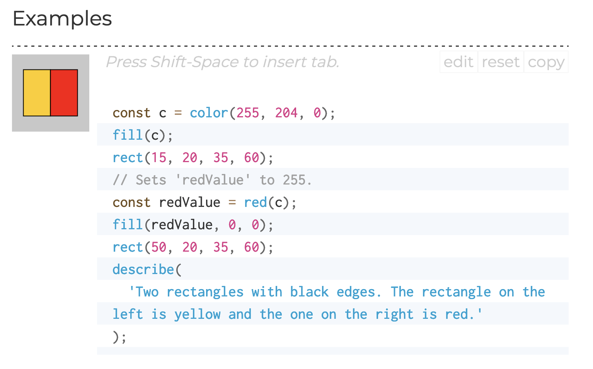
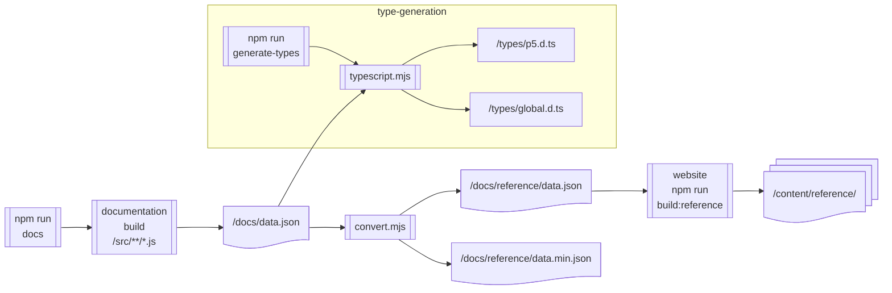
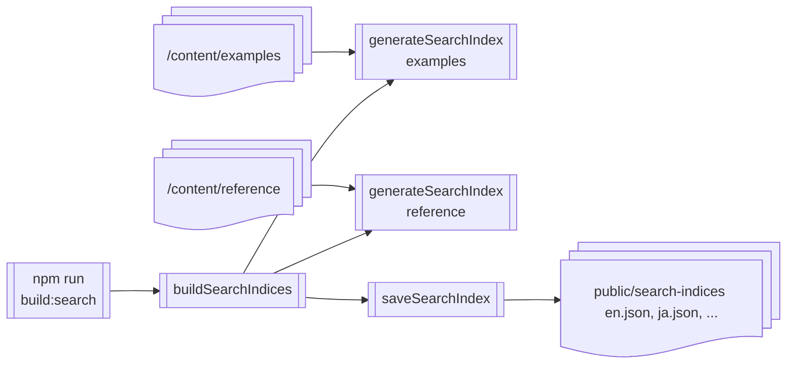

<!-- Write and edit p5.js reference using the right format. -->

# Contributing to the p5.js Reference

In p5.js, we author the code reference you see on the [reference](https://p5js.org/reference/) page on the p5.js website by including them alongside the library’s source code as specialized comments. These reference comments include the description, the function’s signature (its parameters and return value), and usage examples. In other words, the content on each p5.js function/variable’s reference page is built from the reference comments in the source code.

This document will show you how to write and format the reference comments so that they can eventually be rendered onto the website correctly. You should follow this guide whenever you are editing or writing a reference for any p5.js function or variable.

### Aside: A note about versions

This document is updated for p5 version 2.x, whose reference documentation is being hosted at https://beta.p5js.org/reference/ until it eventually replaces v1.x as the recommended stable version.  Until then, the differences in how the two p5 versions handle documentation generation will be mentioned in this document to help the reader who encounters both formats, or systems, in the wild.

## A quick introduction to how reference comments work

When you look at the source code of p5.js, you will see many lines in the library being reference comments; they look like this:

```js
/**
 * Calculates the sine of an angle.
 *
 * `sin()` is useful for many geometric tasks
 * in creative coding. The values returned
 * oscillate between -1 and 1 as the input
 * angle increases. `sin()` calculates the
 * sine of an angle, using radians by default,
 * or according to the <a
 * href="#/p5/angleMode">angleMode()</a>
 * setting (RADIANS or DEGREES).
 *
 * @method sin
 * @param  {Number} angle the angle.
 * @return {Number} sine of the angle.
 *
 * @example
 * <div>
 * <code>
 * function setup() {
 *   createCanvas(100, 100);
 *
 *   describe('A white ball on a string oscillates up and down.');
 * }
 *
 * function draw() {
 *   background(200);
 *
 *   // Calculate the coordinates.
 *   let x = 50;
 *   let y = 30 * sin(frameCount * 0.05) + 50;
 *
 *   // Draw the oscillator.
 *   line(50, y, x, y);
 *   circle(x, y, 20);
 * }
 * </code>
 * </div>
 *
 * <div>
 * <code>
 * function setup() {
 *   createCanvas(100, 100);
 *
 *   background(200);
 *
 *   describe('A series of black dots form a wave pattern.');
 * }
 *
 * function draw() {
 *   // Calculate the coordinates.
 *   let x = frameCount;
 *   let y = 30 * sin(x * 0.1) + 50;
 *
 *   // Draw the point.
 *   point(x, y);
 * }
 * </code>
 * </div>
 *
 * <div>
 * <code>
 * function setup() {
 *   createCanvas(100, 100);
 *
 *   background(200);
 *
 *   describe('A series of black dots form an infinity symbol.');
 * }
 *
 * function draw() {
 *   // Calculate the coordinates.
 *   let x = 30 * cos(frameCount * 0.1) + 50;
 *   let y = 10 * sin(frameCount * 0.2) + 50;
 *
 *   // Draw the point.
 *   point(x, y);
 * }
 * </code>
 * </div>
 */
```

These reference comments are usually followed by the actual JavaScript code that defines the function. Reference comments always start with `/**` and end with `*/`, with each line in between the two starting with `*`.  

Anything in a block in this manner will be interpreted as reference documentation. These follow a format called [JSDoc](https://jsdoc.app/).

In this style of reference comments, each comment block is further divided into individual elements, which we will have a look at next.

Note that block comments starting with `/*` rather than `/**` will be _ignored_ and won't be used for the reference (even though they may look otherwise identical in your editor).

### Differences between p5 v1 and v2

Note that p5 v1.x does _not_ use JSDoc syntax but a slightly  modified [syntax called YUIDoc](https://yui.github.io/yuidoc/syntax/index.html).  In practice the syntaxes are largely compatible but there _are_ differences.

Syntax and tooling per version

* in p5 v1, documentation comments are written in YUIDoc syntax and processed with a [tool called YUIDoc](https://yui.github.io/yuidoc/).

* in p5 v2, documentation comments are written in JSDoc syntax and processed with a [tool called documentation.js](https://documentation.js.org/).


From here on, we'll focus only on reference comments written in JSDoc format, for p5 v2.x.

## Reference comments block for functions

Let’s break down the reference comments block above for the `sin()` function and see what each section does. You can compare what you see in the comments here and what you can see on the reference page for [`sin()`](https://p5js.org/reference/p5/sin/).

(You might later also want to look at the most up-to-date source code and documentation comments for `sin` in the p5 repo, [here in /src/math/trigonometry.js](https://github.com/processing/p5.js/blob/dev-2.0/src/math/trigonometry.js) - search for `fn.sin`)

### Describing the function or variable

Example: 

```js
/**
 * Calculates the sine of an angle.
 *
 * `sin()` is useful for many geometric tasks
 * in creative coding. The values returned
 * oscillate between -1 and 1 as the input
 * angle increases. `sin()` calculates the
 * sine of an angle, using radians by default,
 * or according to the <a
 * href="#/p5/angleMode">angleMode()</a>
 * setting (RADIANS or DEGREES).
 * ...omitted...
```

At the very top of the comment is the text description of the function. This description can contain both markdown syntax and HTML. The description should be concise and describe what the function does and, if necessary, some details about its quirks or behaviors.

In some places, you may see the  `@description` tag used.  This is only actually necessary if the description text isn't placed at the very beginning of the JSDoc comment.

In either case, [here's the JSDoc documentation on this description section](https://jsdoc.app/tags-description).

### Specifying the function name, parameters, return

Example:

```
 * @method sin
 * @param  {Number} angle  the angle.
 * @return {Number} sine of the angle.
```

A function will typically have the three sections above, each starting with an `@` symbol followed by one of the following keywords:

- [`@method`](https://jsdoc.app/tags-function) is used to define the name of the function, in this case `sin` (note that the function name does not include the brackets `()`).  This may often be omitted with JSDoc which will try to read the name from the following source code.  It is also used when detailing multiple signatures for a function (see later).
- [`@param`](https://jsdoc.app/tags-param) is used to define the parameters or arguments that the function accepts.
  - Following the keyword `@param`, stored in curly brackets `{}` is the type of the parameter.
  - After the type, the next word (angle) is the name of the parameter.
  - After the name, the rest of the line is the description of the parameter.
- [`@return`](https://jsdoc.app/tags-returns) is used to define the return value of the function.
  - Following the keyword `@return`, stored in curly brackets `{}` is the type of the return value.
  - After the type, the rest of the line is the description of the return value.
  - If the function does not return a value, the `@return` tag can be left out.

More generically for parameters, you should follow this format:

```
@param {type} name Description here.
```

If the parameter is optional, add square brackets around the name:

```
@param {type} [name] Description here.
```


### Additional info: Constants

If the parameter takes one or more values defined in [`constants.js`](https://github.com/processing/p5.js/blob/main/src/core/constants.js), the valid values should be listed in the parameter type, separated by `|` characters (pipe characters).

Example:

```js
/**
 * @method rectMode
 * @param {CENTER|RADIUS|CORNER|CORNERS} mode
 * ...
 */
```
Constants: A difference with p5 v1.x

Previously for p5 v1.x, such parameter types were specified only as `{Constant}`, and the specific values mentioned only in the free text of the parameter description.

Example difference:

For p5 v1.x: 
```js
/**
 * @method textAlign
 * @param {Constant} horizAlign horizontal
 *      alignment, either LEFT, CENTER, or RIGHT.
 * ...
 */
 ```
 
 As describe above, this changes for p5 v2.x to the following:
 ```js
/**
  * @method textAlign
  * @param {LEFT|CENTER|RIGHT} horizAlign 
  *                        horizontal alignment.
  * ...
 */
 ```


### Additional info: Chaining

If the method returns the parent object, you can skip the `@return` tag and add this line instead:

```
@chainable
```


## Additional function signatures

If a function has multiple possible parameter options, you can specify each individually. For example, the [`background()`](https://p5js.org/reference/p5/background/) function takes a number of different parameter options (see "Syntax" section on the reference page). Choose one version to list as the first signature using the template above. At the end of the first reference comment block, you can add additional signatures, each in its own block, using only the `@method` and `@param` tags following the example below.

```js
/**
 * @method background
 * @param {String} colorstring color string, 
 *   possible formats include: integer rgb()
 *   or rgba(), percentage rgb() or rgba(),
 *   3-digit hex, 6-digit hex
 * @param {Number} [a] alpha value
 */

/**
 * @method background
 * @param {Number} gray specifies a value 
 *                between white and black
 * @param {Number} [a]
 */
```


### Additional info: Multiple signatures

It is not necessary to create a separate signature if the only difference between two signatures is the addition of an optional parameter. Limit the use of this feature if possible because it can create unnecessary noise in the reference.


## Reference for p5.js variables

So far, we have looked at how to write references for functions and constants. Variables follow the same structure but use different tags.

```js
/**
 * The system variable mouseX always contains
 * the current horizontal position of the
 * mouse, relative to (0, 0) of the canvas.
 * The value at the top-left corner is (0, 0)
 * for 2-D and (-width/2, -height/2) for
 * WebGL.  If touch is used instead of mouse
 * input, mouseX will hold the x value of the
 * most recent touch point.
 *
 * @property {Number} mouseX
 * @readOnly
 *
 * @example
 * <div>
 * <code>
 * // Move the mouse across the canvas
 * function draw() {
 *   background(244, 248, 252);
 *   line(mouseX, 0, mouseX, 100);
 *   describe('horizontal black line moves 
 *   left and right with mouse x-position');
 * }
 * </code>
 * </div>
 */
```

The start of the block contains the description of the variable (`mouseX` in this case). To define the name of the variable, we use [`@property`](https://jsdoc.app/tags-property) instead of `@method`. `@property` follows the same syntax as `@param` for defining the type and its name. 

The `@readonly` tag is present on most p5.js variables and is used internally to indicate this value should not be overwritten directly by a library user.


## Adding examples

One tag that is present in both `sin()` and `mouseX`’s reference comments that we have not talked about yet is the [`@example`](https://jsdoc.app/tags-example) tag. This tag is where you define the code examples that are shown and run when you visit the reference page.



The relevant `@example` tag to create the above is as follows:

```
 * @example
 * <div>
 * <code>
 * const c = color(255, 204, 0);
 * fill(c);
 * rect(15, 20, 35, 60);
 * // Sets 'redValue' to 255.
 * const redValue = red(c);
 * fill(redValue, 0, 0);
 * rect(50, 20, 35, 60);
 * describe(
 *   'Two rectangles with black edges. The rectangle on the left is yellow and the one on the right is red.'
 * );
 * </code>
 * </div>
```

After the `@example` tag, you should start an HTML `<div>` tag followed by a `<code>` tag. In between the opening and closing `<code>`  tag, you will insert the relevant example code. 

The basic principle of writing good example code for the reference is to keep things simple and minimal. The example should be meaningful and explain how the feature works without being too complicated. 

The example’s canvas should be 100x100 pixels and if the `setup()` function is not included, such as in the example above, the code will be automatically wrapped in a `setup()` function with a default 100x100 pixels gray background canvas created. 

We won’t go through the details about best practices and code style for the example code here; please see the [reference style guide](https://beta.p5js.org/contribute/documentation_style_guide/), instead.

You can have multiple examples for one feature. To do so, add an additional `<div>` and `<code>` HTML block right after the first closed, separated by a blank line.

```
* @example
* <div>
* <code>
* arc(50, 50, 80, 80, 0, PI + QUARTER_PI, OPEN);
* describe('An ellipse created using an arc with its top right open.');
* </code>
* </div>
*
* <div>
* <code>
* arc(50, 50, 80, 80, 0, PI, OPEN);
* describe('The bottom half of an ellipse created using arc.');
* </code>
* </div>
```

Optionally, you can also include prose after that gap between examples, to add context or more nuanced detail.

### preventing execution of example code

If you do not want the reference page to execute your example code (i.e., you just want the code to show up), include the class "`norender`" in the `<div>`:

```
* @example
* <div class="norender">
* <code>
* arc(50, 50, 80, 80, 0, PI + QUARTER_PI, OPEN);
* describe('ellipse created using arc with its top right open');
* </code>
* </div>
```
### preventing testing of example code

If you do not want the example to be run as part of the automated tests (for example, if the example requires user interaction), include the class "`notest`" in the `<div>`:

```
* @example
* <div class='norender notest'><code>
* function setup() {
*   let c = createCanvas(100, 100);
*   saveCanvas(c, 'myCanvas', 'jpg');
* }
* </code></div>
```
### requiring browser features for example code

In some cases, the example code may be intended to demonstrate  p5.js functionality that depends on a feature that is not universally available on all browsers or devices (most notably, WebGL).  Rather than having this code run and break on incompatible browsers, use the "modernizr" attribute along with the name of the required feature.  At runtime, if that feature is not detected on the user's browser, the code will not be executed.  ([Features are listed here](https://modernizr.com/docs/#features).)

Example:
This example code will not try to run if WebGL is not available to the user's browser.

```js
* @example
* <div modernizr='webgl'>
* <code>
* function setup() {
*   createCanvas(100, 100, WEBGL);
* }
* </code>
* </div>
```

### Including asset files (images, fonts, etc) in examples

If your example code uses external asset files (e.g. images, fonts, sounds), they must be added in the _p5.js-website_ repo's [/public/assets](https://github.com/processing/p5.js-website/tree/2.0/public/assets) folder.  Then, link to the asset with `assets/filename.ext` in the code.  

(Note that this is a change from p5 v1.x where such assets were stored in the p5.js repo.)

Examples: 

For a full working example, see the [tint()](https://beta.p5js.org/reference/p5/tint/) reference.

```js
img = await loadImage('assets/rockies.jpg');
```
The above code will load the image file, [/public/assets/rockies.jpg](https://github.com/processing/p5.js-website/blob/2.0/public/assets/rockies.jpg), stored in the p5.js-website repo.

```js
font = await loadFont('assets/inconsolata.otf');
```
The above code will load the font file, [/public/assets/inconsolata.otf](https://github.com/processing/p5.js-website/blob/2.0/public/assets/inconsolata.otf), stored in the p5.js-website repo.

#### Re-using existing assets

You may wish to make use of an asset that's already in that directory, linking to it in the same way.  (Reusing assets also provides familiarity to the reader across the documentation).  You can see all such assets [here](https://github.com/processing/p5.js-website/tree/2.0/public/assets).  (Cloning that repo and using a file explorer to open `public/assets` will make it easier to browse the assets.)

#### Hotlinking asset files in examples

TODO: check policies here - what follows is just a sketched placeholder.

Whilst it is technically possible to hotlink to an asset file hosted elsewhere (such as [wikimedia commons](https://commons.wikimedia.org/wiki/Commons:Reusing_content_outside_Wikimedia/technical)) when permitted by the copyright license and hosting provider, anyone could later change, vandalise, rename, or delete that hotlinked asset.

(It also makes offline copies of the reference much harder to produce.)

It is recommended, instead, to use assets hosted by the p5.js-website itself as described previously here.

### Add a canvas description using `describe()`

Finally, for every example you add, you are required to use the p5.js function `describe()` in the example to create a screen-reader accessible description for the canvas. Include only one parameter: a string with a brief description of what is happening on the canvas.

```js
* @example
* <div>
* <code>
* let xoff = 0.0;
* function draw() {
*   background(204);
*   xoff = xoff + 0.01;
*   let n = noise(xoff) * width;
*   line(n, 0, n, height);
*   describe('A vertical line moves randomly from left to right.');
* }
* </code>
* </div>
*
* <div>
* <code>
* let noiseScale = 0.02;
* function draw() {
*   background(0);
*   for (let x = 0; x < width; x += 1) {
*     let noiseVal = noise((mouseX + x) * noiseScale, mouseY * noiseScale);
*     stroke(noiseVal*255);
*     line(x, mouseY + noiseVal * 80, x, height);
*   }
*   describe('A horizontal wave pattern moves in the opposite direction of the mouse.');
* }
* </code>
* </div>
```

For more on `describe()` visit the [web accessibility contributor documentation](./web_accessibility/#describe), and the [Writing Accessible Canvas Descriptions](https://p5js.org/tutorials/writing-accessible-canvas-descriptions/) tutorial.

## Less common JSDoc tags

With all the above you should have most of the tools needed to write and edit p5.js reference comments. However, there are a few more specialized usage of JSDoc reference comments that you may come across in p5.js. These are situationally useful and not something that you need often.

TODO: perhaps just link here to [./jsdoc.md](./jsdoc.md)?

<!-- TODO: done to this point -->


### `@private` tag

You can use the `@private` if a property or variable is a private function or variable. If a feature is marked as `@private` it will not be included as part of the rendered reference on the website. The reason to use the `@private` tag to mark a reference comments block as private is when you document internal features for the library itself. For example, see the reference comments for `_start` below:


```js
/**
 * _start calls preload() setup() and draw()
 *
 * @method _start
 * @private
 */
p5.prototype._start = function () {
```


### `@module` and related tags

At the top of each source code file will be a `@module` tag. Modules correspond to a group of features in p5.js which on the rendered reference page on the website are split into the corresponding sections. Inside each module, there are additional submodules defined with the `@submodule` tag.

The `@for` tag defines the relationship between this module and the overall `p5` class, effectively saying this module is a part of the `p5` class.

The `@requires` tag defines the required imported modules that the current module depends on.

```js
/**
 * @module Color
 * @submodule Creating & Reading
 * @for p5
 * @requires core
 * @requires constants
 */
```

The convention p5.js follows is that each subfolder in the `src/` folder will be one `@module` while each file inside the subfolder will be its own `@submodule` under the overall subfolder’s `@module`. Unless you are adding new subfolders/files to the p5.js source code, you shouldn’t need to edit this reference comments block.


### `@class` tag

Class constructors are defined with the `@class` tag and the `@constructor` tag. The format for this block is similar to how a function is defined with the `@method` block, the class’s name will need to be defined with the `@class` tag and the `@constructor` tag will indicate the class has a constructor function. See the example below for the `p5.Color` class:

```js
/**
 * A class to describe a color. Each
 * `p5.Color` object stores the color mode and
 * level maxes that were active during its
 * construction. These values are used to
 * interpret the arguments passed to the
 * object's constructor. They also determine
 * output formatting such as when <a
 * href="#/p5/saturation">saturation()</a> is
 * called.
 *
 * Color is stored internally as an array of
 * ideal RGBA values in floating point form,
 * normalized from 0 to 1. These values are
 * used to calculate the closest screen
 * colors, which are RGBA levels from 0 to
 * 255. Screen colors are sent to the
 * renderer.
 *
 * When different color representations are
 * calculated, the results are cached for
 * performance. These values are normalized,
 * floating-point numbers.
 *
 * <a href="#/p5/color">color()</a> is the
 * recommended way to create an instance of
 * this class.
 *
 * @class p5.Color
 * @constructor
 * @param {p5} [pInst] pointer to p5 instance.
 *
 * @param {Number[]|String} vals an array 
 * containing the color values for red, 
 * green, blue and alpha channel or CSS color.
 */
```


## Generating and previewing the reference

The p5.js repository is set up so that you can generate and preview the reference without needing to build and run the p5.js website as well.

- The main command to generate the reference from the reference comments in the source code is to run the following command.

```
npm run docs
```

This will generate the necessary preview files and the main `docs/reference/data.json` file, which is the same file (after minification) that will be used to render the reference page on the website.

- For continuous work on the reference, you can run the following command.

```
npm run docs:dev
```

This will launch a live preview of the rendered reference that will update each time you make changes (you will need to refresh the page after making changes to see them appear). This is useful, especially for previewing example code running in the browser.

- The main template files are stored in the `docs/` folder and, in most cases, you should not make changes directly to files in this folder, except to add new asset files in the `docs/yuidoc-p5-theme/assets` folder.


## Next steps

* We also have a [JSDoc best practices](https://beta.p5js.org/contribute/jsdoc/) document.
* For additional details about the reference system, you can checkout the documentation for [JSDoc](https://jsdoc.app/)
* For examples of issues related to the reference, have a look at [#6519](https://github.com/processing/p5.js/issues/6519) and [#6045](https://github.com/processing/p5.js/issues/6045). 
* The [contributor guidelines](./contributor_guidelines.md) document is also a good place to start.

## Appendix: Syntax differences between YUIDoc and JSDoc

* YUIDoc requires function names be provided with the `@method` tag, whereas JSDoc can generally extract that information from the implementation source code.

## Appendix: Summary of other documentation differences between p5 v1 and v2

For the syntactic differences between YUIDoc and JSDoc, see above.  Here are some other differences:

* For v2, code example assets (images, fonts, etc) go in the website repo's `public/assets` folder.  In v1 these went in the `docs/yuidoc-p5-theme/assets` folder of the p5.js repo.

* In v2, previewing the reference site locally can no longer be done with the p5.js repo alone, but requires running build:reference on the website repo.  In v1 this was possible without requiring the website repo.

* The documentation is generated with the tool documentation.js, not the YUIDoc tool.

## Appendix: About the reference-generation process

In the p5.js repo, `npm run docs` runs (roughly):
```bash
"documentation build ./src/**/*.js  
  -o ./docs/data.json 
  && node ./utils/convert.mjs",
```
### Flow diagram for reference generation

See [mermaid flowchart syntax reference](https://mermaid.ai/open-source/syntax/flowchart.html)


```mermaid
graph LR
  npmRunDocs[[npm run<br>docs]] --> docBuild[[documentation<br>build<br>/src/**/*.js]]
  docBuild --> /docs/data.json@{ shape: doc }
  /docs/data.json --> convert[[convert.mjs]]
  convert --> /docs/reference/data.json@{ shape: doc }
  convert --> /docs/reference/data.min.json@{ shape: doc }        
  /docs/reference/data.json --> websiteNpmBuildReference[[website<br>npm run<br>build:reference]]
  websiteNpmBuildReference --> /content/reference/@{shape: docs}

  /docs/data.json --> typescript[[typescript.mjs]]  
  
  subgraph type-generation
  typescript --> /types/p5.d.ts
  typescript --> /types/global.d.ts
  npmRunGenerateTypes[[npm run<br>generate-types]]
  npmRunGenerateTypes --> typescript
  end
  
```
### Flow diagram for search index generation

On the p5js-website repo, we run `npm run build:search`


```mermaid
graph LR
  contentReference["/content/reference"]@{shape: docs}
  contentExamples["/content/examples"]@{shape: docs}
  
  npmBuildSearch[[npm run<br>build:search]]
  npmBuildSearch --> buildSearchIndices[[buildSearchIndices]] --> genSearchIndexForExamples[[generateSearchIndex<br>examples]]
  buildSearchIndices --> genSearchIndexForReference[[generateSearchIndex<br>reference]]
  contentReference --> genSearchIndexForReference
  contentExamples --> genSearchIndexForExamples
  buildSearchIndices --> saveSearchIndex[[saveSearchIndex]] --> outDir[[public/search-indices en.json, ja.json, ...]]@{shape: docs}
```
### Type-generation

On the p5js repo...

`npm run generate-types` runs:
```bash
"npm run docs && node utils/typescript.mjs"
```


## TODO:
* move this TODO section out before submitting PR
* document how to use images/videos/sounds _inside_ description.  So far asset-use is only covered for code examples.  [applyMatrix](https://beta.p5js.org/reference/p5/applymatrix/) is an example of images in function description.
* update how to use any asset inside code example
* check how we want to mark parameter optionality
* whether to omit @method tag or not?
* update/deprecate @chainable?
* check if we want to encourage  text between code examples? (e.g. for gradual introduction and explanation of more complex use-cases).  Or is there a risk the user misses critical detail because it was in the "examples" section?
* perhaps acknowledge that there are limits to the types info we can carry in JSDoc and that types are currently sometimes patched in patch.mjs.
* find (and use) any recommended mechanism for adding asides as (e.g.) (accessible) default-collapsed sections.
* add section on minimising unnecessary concept dependencies in code examples? Where's the balance between cool examples vs ones that can be most easily understood?  What's the line with regard to generating engagement with examples?  (If it belongs in the style guide, develop it more there and link to it from here).
* assets: 
  * ? say anything about licensing (e.g. for assets)
  * ? say anything about preferred file formats (for size, for browser compat, for licensing?)
  * ? say anything / link to AI policy?
* ? accessibility, inclusivity considerations for examples?
  * text size
  * color choices (wrt color blindness, also contrast)
  * ?reduced-motion?
* ? run a comprehensive broken-link check? broken example check?  develop one?
* add a ToC?
* check if tagging incomplete snippets in the markdown as js is harmless (e.g. doesn't break the highlighter library).  It provides useful best-effort syntax-highlighting in some contexts, helping to spot errors.