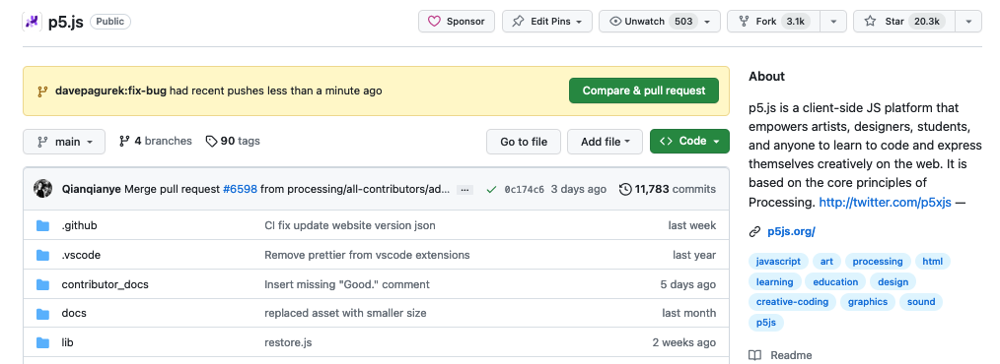

<!-- Essential information about contributing to p5.js on GitHub. -->

# Instrucciones para colaboradores

¡Bienvenidos! Este documento está diseñado para ayudar a nuevos contribuidores que deseen aportar código a la biblioteca de p5.js, así como a aquellos que busquen refrescar sus conocimientos sobre procedimientos técnicos. También es útil para cualquier persona interesada en realizar cualquier tipo de contribución al código de p5.js.

Si estás buscando contribuir más allá de los repositorios de p5.js (escribiendo tutoriales, planeando clases, organizando eventos), por favor consulta la documentación correspondiente para este tipo de colaboraciones. Aquellos que sean Supervisores o Responsables de mantenimiento, encontrarán más útil referirse a las [Instrucciones para Supervisores](https://github.com/processing/p5.js/blob/main/contributor_docs/es/steward_guidelines.md) cuando se trata de revisar 'Issues' (problemas) y 'Pull Requests'. 

Este es un documento relativamente largo e integral, pero trataremos de indicar todos los pasos tan claro como sea posible. Utiliza la tabla de contenidos para encontrar las secciones que son relevantes para ti, y siéntete libre de omitir secciones que no son relevantes para las contribuciones que planeas hacer. 

**Si eres un nuevo contribuidor te sugerimos comenzar con la primera sección: “Todo acerca de los 'Issues' (o problemas)”. Si simplemente quieres una configuración paso-a-paso del  proceso de desarrollo, puedes dirigirte a la sección  de “Inicio Rápido para Desarrolladores”.**


# Tabla de Contenidos

- [Todo acerca de los 'Issues' o problemas](#todo-acerca-de-los-issues-o-problemas)
  - [¿Qué son los 'Issues' en GitHub?](#qué-son-los-issues-en-github)
  - [Plantillas para reportar 'Issues'](#plantillas-para-reportar-issues)
    - [Reportar un error](#reportar-un-error)
    - [Sugerir una mejora a una funcionalidad existente](#sugerir-una-mejora-a-una-funcionalidad-existente)
    - [Sugerir una funcionalidad nueva](#sugerir-una-funcionalidad-nueva)
    - [Abrir una discusión ](#abrir-una-discusión)
- [Trabajando en la base de código de p5.js](#trabajando-en-la-base-de-código-de-p5js)
  - [Inicio Rápido para Desarrolladores](#inicio-rápido-para-desarrolladores)
  - [Utilizando la funcionalidad de edición de Github](#utilizando-la-funcionalidad-de-edición-de-github)
  - [Haciendo un fork de p5.js y trabajando desde tu fork](#haciendo-un-fork-de-p5js-y-trabajando-desde-tu-fork)
    - [Utilizando Github Desktop](#utilizando-github-desktop)
    - [Utilizando la interfaz de línea de comandos de Git](#utilizando-la-interfaz-de-línea-de-comandos-de-git)
  - [Desglose de la base de código ](#desglose-de-la-base-de-código)
  - [Configuración de compilación](#configuración-de-compilación)
  - [Flujo de trabajo de Git](#flujo-de-trabajo-de-git)
    - [Código fuente](#código-fuente)
    - [Pruebas unitarias](#pruebas-unitarias)
    - [Documentación en línea](#documentación-en-línea)
    - [Internacionalización](https://github.com/processing/p5.js/blob/main/contributor_docs/contributor_guidelines.md#internationalization)
    - [Accesibilidad](#accesibilidad)
  - [Estándares de código](#estándares-de-código)
  - [Principios de Diseño de Software](#principios-de-diseño-de-software)
- [Pull Requests](#pull-requests)
  - [Creación de un Pull Request](#creación-de-un-pull-request)
    - [Información sobre el Pull Request](#información-sobre-el-pull-request)
    - [Titulo](#titulo)
    - [Resuelve](#resuelve)
    - [Cambios](#cambios)
    - [Captura de pantalla de los cambios](#captura-de-pantalla-de-los-cambios)
    - [Lista de verificación del Pull Request](#lista-de-verificación-del-pull-request)
    - [Rebase y resolución de conflictos](#rebase-y-resolución-de-conflictos)
  - [Discutir y Corregir](#discutir-y-corregir)

---
# Todo acerca de los “Issues” o problemas

La mayoría de la actividad en los repositorios de GitHub de p5.js (también conocidos como "repo" de forma abreviada) ocurre en los 'Issues', o problemas, lo cual es un excelente lugar para comenzar tu viaje de contribución.


## ¿Qué son los "Issues" en GitHub?


<em>'Issues'</em> es el nombre común que se le da a una publicación en GitHub que apunta a describir, como lo dice su nombre, un problema.  Los <em>Issues</em> pueden ser reportes de error, solicitudes para añadir un nueva funcionalidad, una discusión, o cualquier publicación que se relacione con el desarrollo de la biblioteca de p5.js. Cualquiera con una cuenta de GitHub puede añadir comentarios debajo de cada <em>Issue</em>, ¡incluyendo bots! Este es el lugar donde los contribuidores discuten temas relacionados con el desarrollo del proyecto dentro del repositorio.

Mientras un <em>Issue</em> puede ser creado por diferentes razones, usualmente utilizamos la creación de un <em>Issue</em> para discutir el desarrollo del  código fuente de p5.js. Temas como la corrección de errores de tu propio código, invitación de colaboradores a tu proyecto, u otros temas no relacionados, deben ser discutidos ya sea en el [foro](https://discourse.processing.com) o en otras plataformas de comunicación como [Discord](https://discord.gg/SHQ8dH25r9).

¡Hemos creado plantillas fáciles de usar que puede ayudarte a determinar si un tema es adecuado para ser publicado como un <em>Issue</em> en GitHub, o si sería más apropiado publicarlo en otro lugar!


## Plantillas para reportar "Issues"
Las plantillas  para reportar <em>Issues</em> en p5.js hacen que sea más sencillo para los Supervisores y los responsables de mantenimiento entender y revisar el contenido sugerido por el colaborador. Además, las plantillas le facilitan al colaborador el proceso de completar un <em>Issue</em>  y, así mismo, le permiten recibir una respuesta más rápida. 


Para registrar un <em>Issue</em> por primera vez dentro del repositorio de p5.js, haz click en la  pestaña que dice "Issues", ubicada en la parte superior. Una vez dentro de la página de "Issues"  haz clic en el botón <em>"New Issue"</em> (problema nuevo), que se encuentra al costado derecho. Se te presentarán diferentes opciones de plantilla que te van a dirigir al lugar adecuado para registrar tu <em>Issue</em>. Te recomendamos elegir la plantilla más relevante para tu caso para asegurarte de que tu <em>Issue</em> reciba rápidamente la atención correcta.


### ["Reportar un Error"](https://github.com/processing/p5.js/issues/new?assignees=\&labels=Bug\&projects=\&template=found-a-bug.yml)

Cuando encuentres un comportamiento incorrecto en p5.js, o algo que no se esté comportando como se ha descrito en la documentación, [usa esta plantilla]( https://github.com/processing/p5.js/issues/new?assignees=&labels=Bug&projects=&template=found-a-bug.yml). Por favor, ten en cuenta que si estás  tratado de corregir el código de tu <em>sketch</em> (boceto), y crees que el problema tal vez se encuentra en tu código, primero consulta en el [foro de discusiones]( https://discourse.processing.org/) antes de reportar un error.

Esta plantilla provee campos que debes llenar con la siguiente información relevante: 

1.	**¿Cuál es la subárea más adecuada de p5.js?:** esto añadirá automáticamente las [etiquetas]( https://github.com/processing/p5.js/blob/main/contributor_docs/issue_labels.md) relevantes a tu <em>Issue</em>, lo que nos ayudará a identificar y responder adecuadamente.
2.	**Versión de p5.js:** Puedes verificar la versión de p5.js dentro de la etiqueta `<script>`  que se encuentra en la primera línea del archivo p5.js/p5.min.js. Opcionalmente, en el [editor de p5.js]( https://editor.p5js.org/), puedes dar clic al botón de ‘Ayuda’ que se encuentra en la parte superior. Luego da clic en ‘Acerca de’ y aquí podrás encontrar la versión de p5.js. Esta lucirá algo como `1.9.1`(tres números separados por un punto).
3.	**Navegadores web y versión de los mismos:** esta sección nos ayuda a identificar diversos comportamientos entre los diferentes navegadores web. Para encontrar la versión de tu navegador, sigue las instrucciones proporcionadas en la siguiente tabla según el navegador que estés utilizando.

<table>

<tr>

<td>

Chrome

</td>

<td>

Firefox

</td>

<td>

Safari

</td>

</tr>

<tr>

<td>

Abre una ventana del navegador y en la barra de direcciones, navega a `chrome://version`

</td>

<td>

Abre una ventana del navegador, y en la barra de direcciones navega a `about:support`

</td>

<td>

Abre una venta del navegador y, en el menú superior, haz clic sobre "Safari". Te aparecerá un desplegable con diferentes opciones, deberás seleccionar "Acerca de Safari".

</td>

</tr>

</table>

4.	**Sistema Operativo:** En lo posible,  incluye la versión del Sistema Operativo, por ejemplo, `macOS 12.5`. Algunos errores se pueden derivar de comportamientos del sistema operativo.
5.	**Pasos para reproducir el error:** Esta es una de la piezas de información más importantes. Comparte una lista de pasos detallados con los cuales podemos replicar el error que has encontrado. Compartir una muestra de código que exponga el problema puede ser de gran ayuda para cualquiera que busque replicar el error que estás enfrentando, y comenzar a formular una solución.

**¡La replicación es clave!** La gran mayoría de los campos en esta plantilla tienen como objetivo replicar el error. Entre más información proveas acerca de tu <em>sketch</em> y como otros pueden replicar el error que has encontrado, más fácil será para la comunidad ayudarte a buscar una solución.

**Sé lo más detallado posible y evita las afirmaciones genéricas**, por ejemplo, no digas "la función `image()` no funciona", sino sé más específico, como "la función `image()` no muestra la imagen GIF cargada en el tamaño correcto". Una forma útil de describir el error que estás enfrentando es mencionando los siguientes aspectos:

1.	¿Qué es lo que esperas del código que has compartido? (comportamiento esperado).
2.	¿Qué es lo que está haciendo el código que has compartido? (comportamiento presente).

Si deseas contribuir a la solución del error que has reportado, indícalo en la descripción. Puedes proveer sugerencias sobre cómo el error que has descrito puede ser corregido. Esta descripción nos ayudará a saber cuánto apoyo necesitas para contribuir a la solución del error.

**No debes registrar un <em>Pull Request</em> ni comenzar a trabajar en cambios de código sin antes haber registrado un <em>Issue</em> correspondiente, o antes de que dicho <em>Issue</em> haya sido aprobado para su implementación**. Esto se debe a que la solución propuesta podría no ser aceptada, podría requerir un enfoque completamente diferente o es posible que el problema real esté en otro lugar. Cualquier <em>Pull Request</em> que se registre antes de que se haya aprobado un <em>Issue</em> correspondiente, será cerrado hasta que el <em>Issue</em> haya sido aprobado previamente.

Para que un reporte de error sea aceptado para su corrección, este debe ser aprobado por al menos un [Supervisor de área o Responsable de mantenimiento]( https://github.com/processing/p5.js#stewards), antes de que se pueda comenzar a trabajar en el <em>Pull Request</em>.

### [Sugerir una mejora a una funcionalidad existente](https://github.com/processing/p5.js/issues/new?assignees=\&labels=Enhancement\&projects=\&template=existing-feature-enhancement.yml)

Esta plantilla debe ser usada si deseas proponer cambios o sugerir mejoras a una funcionalidad existente en p5.js (funciones, constantes, renderización, etc ). Por ejemplo, si quisieras proponer una nueva manera de definir un color con la función `color()` u otras funciones que acepten colores, esta sería la plantilla a utilizar. 

Esta plantilla provee campos que debes llenar con la siguiente información relevante: 

1.	**Mejorar la accesibilidad:**  Este es un campo requerido en el cual debes explicar cómo la adición de la mejora o cambio a la funcionalidad existente, ayudará a [mejorar la accesibilidad]( https://github.com/processing/p5.js/blob/main/contributor_docs/access.md) para las personas que han sido históricamente marginadas en las disciplinas de las artes y las tecnologías. **Es importante destacar que ninguna propuesta será aceptada sin esta declaración**. No obstante, si tienes dudas al respecto, puedes incluir "No estoy seguro" en este campo y comenzar una conversación con la comunidad para comprender cómo tu propuesta puede abordar eficazmente el tema de mejorar la accesibilidad en p5.js.

2.	**¿Cuál es la subárea más adecuada de p5.js?:** Esto añadirá automáticamente las [etiquetas]( https://github.com/processing/p5.js/blob/main/contributor_docs/issue_labels.md) relevantes a tu <em>Issue</em>, lo que nos ayudará a identificar y responder adecuadamente.

3.	**Detalles sobre la de mejora de una funcionalidad:** Aquí debes describir tu propuesta para la mejora de una funcionalidad. Una buena propuesta generalmente incluye un caso de uso específico: qué, cuándo, cómo y por qué esta funcionalidad es necesaria.

Para que las propuestas de mejora a una funcionalidad sean aceptadas, estas deben ser aprobadas por al menos un [Supervisor de área o Responsable de mantenimiento]( https://github.com/processing/p5.js#stewards), antes de que se comience a trabajar en el <em>Pull Request</em>.

**No debes registrar un <em>Pull Request</em> ni comenzar a trabajar en cambios de código sin antes haber registrado un <em>Issue</em> correspondiente, o antes de que dicho <em>Issue</em> haya sido aprobado para su implementación**. Esto se debe a que no hay garantía de que la propuesta será aceptada. Cualquier <em>Pull Request</em> que se registre antes de que se haya aprobado un <em>Issue</em> correspondiente, será cerrado hasta que el <em>Issue</em> haya sido aprobado previamente.

### ["Sugerir una funcionalidad nueva"](https://github.com/processing/p5.js/issues/new?assignees=\&labels=Feature+Request\&projects=\&template=feature-request.yml)

Esta plantilla debe ser usada si deseas proponer la adición de una nueva funcionalidad a p5.js. Por ejemplo, imagina que quieres añadir soporte para dibujar elementos `<table>`, propios de HTML, con una nueva función que se llame `createTable`. Si tu propuesta se superpone con otras propuestas de mejora existentes, te sugerimos que evalúes y elijas la plantilla que consideres más apropiada para tu caso (ya sea funcionalidad existente o funcionalidad nueva)

Esta plantilla provee campos que debes llenar con la siguiente información relevante: 
1.	**Mejorar la accesibilidad:**  Este es un campo requerido en el cual debes explicar cómo la adición de la mejora o cambio a la funcionalidad existente, ayudará a [mejorar la accesibilidad]( https://github.com/processing/p5.js/blob/main/contributor_docs/access.md) para las personas que han sido históricamente marginadas en las disciplinas de las artes y las tecnologías. **Es importante destacar que ninguna propuesta será aceptada sin esta declaración**. No obstante, si tienes dudas al respecto, puedes incluir "No estoy seguro" en este campo y comenzar una conversación con la comunidad para comprender cómo tu propuesta puede abordar eficazmente el tema de mejorar la accesibilidad en p5.js.

2.	**¿Cuál es la subárea más adecuada de p5.js?:** Esto añadirá automáticamente las [etiquetas]( https://github.com/processing/p5.js/blob/main/contributor_docs/issue_labels.md) relevantes a tu <em>Issue</em>, lo que nos ayudará a identificar y responder adecuadamente.

3.	**Detalles de la nueva funcionalidad:** Aquí debes describir tu propuesta para proponer la adición de una nueva funcionalidad. Una buena propuesta generalmente incluye un caso de uso específico: qué, cuándo, cómo y por qué esta funcionalidad es necesaria.

Para que una nueva funcionalidad sea aceptada, esta debe ser aprobada por al menos 2 [Supervisores de área o Responsables de mantenimiento]( https://github.com/processing/p5.js#stewards), antes de que se comience a trabajar en el <em>Pull Request</em>.

**No debes registrar un <em>Pull Request</em> ni comenzar a trabajar en cambios de código sin antes haber registrado un <em>Issue</em> correspondiente, o antes de que dicho <em>Issue</em> haya sido aprobado para su implementación**. Esto se debe a que no hay garantía de que la propuesta será aceptada. Cualquier <em>Pull Request</em> que se registre antes de que se haya aprobado un <em>Issue</em> correspondiente, será cerrado hasta que el <em>Issue</em> haya sido aprobado previamente.


### [Abrir una discusión](https://github.com/processing/p5.js/issues/new?assignees=\&labels=Discussion\&projects=\&template=discussion.yml)

Esta plantilla se utiliza cuando el <em>Issue</em> que estas registrando no encaja en ninguna de las plantillas anteriores. Un <em>Issue</em> que no corresponda a ninguna de las plantillas proporcionadas es relativamente inusual. Por ejemplo, si hay una discusión sobre si se debe adoptar una funcionalidad de una API web específica en p5.js, esta debería registrarse como ['Sugerir una funcionalidad nueva](#sugerir-una-funcionalidad-nueva). En otro ejemplo, una discusión acerca de añadir nuevos modos de colores a las funciones de color de p5.js, debe ser registrada como [“Sugerir una mejora a una funcionalidad existente”]( #sugerir-una-mejora-a-una-funcionalidad-existente). Finalmente, si tienes un anuncio sobre un evento local de programación que estás  organizando, este debería ser publicado en el foro e inclusive podrías contactar a la Fundación de Processing si estás buscando apoyo, publicidad, etc.

Al abrir una discusión, puedes utilizar el panel de “Etiquetas”, que encontraras al costado derecho, para agregar etiquetas relevantes y así dirigir tu ‘Issue’ al área correspondiente. La plantilla en sí, consiste en un campo abierto que te permite comenzar una discusión. Puedes encontrar [aquí]( https://github.com/processing/p5.js/issues/6517) un ejemplo de una discusión.

[**⬆ Volver arriba.**](#instrucciones-para-colaboradores)

---

# Trabajando en la base de código de p5.js

## Pre-requisitos

Para proceder, debes tener un conocimiento mínimo sobre cómo trabajar con la línea de comandos, git, node.js (al menos la versión 18 o superior), y haber configurado un entorno de desarrollo local.


##  Introducción 

Ahora que tu <em>Issue</em> ha sido discutido, se ha aprobado una implementación y estás dispuesto a hacer los cambios de código; estás listo para empezar a trabajar en la base de código.

Del mismo modo, si te has encontrado con un <em>Issue</em> o has participado en discusiones sobre un <em>Issue</em> y se ha aprobado una implementación por parte de los supervisores, pero ni el autor original  ni otros miembros de la comunidad han indicado que están dispuestos a trabajar en la solución; puedes ofrecerte como voluntario para enviar una contribución y solicitar que los supervisores te asignen el problema.

**No debes “saltarte la fila”** llenando un <em> Pull Request</em> para un <em>Issue</em> en el que alguien más ya haya indicado su interés de contribuir o que ya se haya asignado a alguien más. Siempre daremos prioridad al orden de asignación para aceptar contribuciones nuevas.

Si abres un <em>Pull Request</em> mientras alguien más aún está trabajando en el mismo <em>Issue</em>, tu <em>Pull Request</em> será cerrado. Si notas que han pasado algunos meses desde la última actividad en un <em> Issue</em> que tiene a una persona asignada, puedes verificar con ellos dejando un comentario amable en el que preguntes por el progreso del <em>Issue</em> o inclusive ofrezcas ayuda con la implementación. Generalmente permitimos un largo período de tiempo para que las personas puedan trabajar en sus contribuciones, ya que entendemos que la gran mayoría trabaja como voluntarios y a menudo les lleva más tiempo desarrollar una funcionalidad.

Del mismo modo, sugerimos que trabajes a tu propio ritmo y que estés seguro de que no hay una fecha límite estricta en la que debas entregar tu contribución. Dicho esto, si estás teniendo problemas en cualquier aspecto de tu contribución, no dudes en pedir ayuda dentro del <em>Issue</em>, a los supervisores y responsables de mantenimiento, o a los miembros de la comunidad. ¡Haremos lo posible para guiarte! 


## Inicio Rápido para Desarrolladores

Si quieres trabajar o contribuir al código base de p5.js 🌸 como desarrollador, ya sea directamente mejorando p5.js o mejorando sus subproyectos como lo es [Friendly Error Systems](https://github.com/processing/p5.js/blob/main/contributor_docs/friendly_error_system.md), puedes seguir los siguiente pasos: 

1. [Crea un fork (copia de repositorio) de p5.js.](https://docs.github.com/en/get-started/quickstart/fork-a-repo)
2. [Clona el fork y crea una copia local.](https://docs.github.com/en/repositories/creating-and-managing-repositories/cloning-a-repository)
3. [Configura git para que tu copia local del repositorio se sincronice con el repositorio original (que suele nombrarse como <em>upstream</em>). Para ello utiliza el siguiente comando en tu terminal.](https://docs.github.com/en/pull-requests/collaborating-with-pull-requests/working-with-forks/configuring-a-remote-repository-for-a-fork):

  ```
  git remote add upstream https://github.com/processing/p5.js
  ```

4. Asegúrate de que [node.js](https://nodejs.org/en/download) está instalado en tu computador. Puedes revisar si node.js está instalado escribiendo en tu terminal el siguiente comando: 
  ```
  node -v
  ```
5. Instala las dependencias necesarias con el siguiente comando: 

  ```
  npm ci
  ```
6. Crea una nueva rama de la rama `main`. Utiliza un nombre descriptivo al crear un nueva rama.

  ```
  git checkout -b [branch_name]
  ```  

7. A medida de que comiences a realizar cambios a la base de código, ejecuta pruebas frecuentemente (toma tiempo, pero garantiza que no se estén deteriorando comportamientos existentes). Para ello utiliza el siguiente comando:

  ```
  npm test
  ``` 
8. Añade pruebas unitarias si estás trabajando en nuevas funcionalidades, o estas mejorando una funcionalidad existente.

9.	Una vez hayas terminado, puedes hacer un <em>commit</em> de los cambios y crear un [<em>Pull Request</em>](#pull-requests).

## Utilizando la funcionalidad de edición de Github

Cuando estás viendo un archivo en la interfaz web de GitHub, en la parte superior del contenido que estas revisando, vas a poder ver un botón con el icono de un lápiz. Este botón proporciona una función de edición conveniente que provee GitHub, y que simplifica muchos de los procesos que vamos a estar cubriendo más adelante. Esta funcionalidad te permite realizar cambios simples a tus archivos de manera rápida.


Sin embargo, no es recomendado utilizar esta funcionalidad a menos de que se trate de cambios muy simples. Una de las razones principales es que para adicionar cambios más complejos al código fuente, estos tuvieron que haber sido compilados y validados localmente antes de ser registrados en un <em> Pull Request</em>. Usar un entorno de desarrollo local suele ser mucho más fluido en comparación con el entorno de edición básico que GitHub proporciona.

## Haciendo un fork de p5.js y trabajando desde tu fork

El primer paso para trabajar en el código fuente de p5.js es haciendo un fork (copia) de su repositorio. <em>’Forking’</em> tiene una definición especifica dentro de la comunidad Open Source (Código Abierto), pero para el propósito de esta documentación, significa la creación de una copia del repositorio dentro de tu cuenta de GitHub. Para hacer un <em> fork</em>, simplemente haz clic en el botón que dice ‘Fork’ en la parte superior de la página donde se encuentra el repositorio. GitHub creará  una copia del repositorio dentro de tu cuenta.


Trabajar desde el <em>fork</em>  que has creado del repositorio de p5.js es necesario para poder realizar cambios. Es muy seguro que no tengas acceso directo para enviar cambios al repositorio oficial de p5.js, por lo que trabajar en un <em>fork</em> te permitirá hacer modificaciones y luego enviarlas de vuelta al repositorio oficial.

### Utilizando Github Desktop

GitHub Desktop es un programa que te permite trabajar mediante una interfaz de usuario gráfica en lugar de escribir comandos en la terminal. Es una buena opción si eres nuevo en git, y siempre puedes alternar entre Github Desktop y la terminal a tu conveniencia.

Primero [descarga e instala GitHub Desktop]( https://desktop.github.com/). Una vez instalado, abre la aplicación. Esta te pedirá que inicies sesión con tu cuenta de GitHub. Una vez hayas iniciado sesión, GitHub Desktop hará una lista de tus proyectos, incluyendo tu <em>fork</em> de p5.js. Selecciona tu <em>fork</em>, el cual tendrá el nombre de `tuUsuario/p5.js`, y luego haz clic en el botón azul que dice ‘Clone’ (clonar). Luego, se te van a preguntar algunos detalles acerca de donde ubicar tu proyecto. Tienes la opción de cambiar la ubicación, o continuar con la configuración predefinida.


Una vez lo hayas clonado, se te va a preguntar como planeas usar el <em>fork</em> de este repositorio. Selecciona la opción que dice “To contribute to the parent project” (Contribuir al proyecto original) y haz clic en “Continuar”.


### Utilizando la interfaz de línea de comandos de Git

Cuando hayas realizado el _fork_ (copia), navega a la página de tu _fork_ y copia la URL de git haciendo clic en el botón verde que dice “_Code_”. Debería ser algo así como `https://github.com/limzykenneth/p5.js.git`


Después, ve a la línea de comandos de tu entorno local y clona este repositorio de git. “Clonar” simplemente significa descargar una copia del repositorio en tu máquina local. Corre el siguiente comando en una carpeta en donde quieras almacenar la carpeta del código fuente de p5.js. 

```
git clone [git_url]
```

Sustituye `[git_url]` por la URL acabas de copiar. Esto puede llevar varios minutos, dependiendo de la velocidad de tu conexión a internet, ¡un buen momento para preparar un poco de café! Una vez que el proceso finalice, puedes abrir la carpeta que descargaste llamada `p5.js` en tu editor de código preferido y comenzar a explorar. 

## Desglose de la base de código

Algunos de los archivos y carpetas clave que encontrarás en la carpeta de p5.js son los siguientes:

- `src` - Aquí es donde reside todo el código que eventualmente se combina en los archivos finales p5.js y p5.min.js.
- [`test`](https://github.com/processing/p5.js/blob/main/contributor_docs/unit_testing.md) - En esta carpeta se encuentran las pruebas unitarias y el código para probar todos los ejemplos de documentación.
- `tasks` - Donde se encuentra el código de compilación detallado y personalizado. `Gruntfile.js` - Este es el archivo de configuración de compilación principal.
- `contributor_docs` - Aquí es donde reside la documentación y toda la demás documentación para las, los y les colaboradores.

Los demás archivos y carpetas son principalmente configuraciones u otros tipos de archivos de soporte; en la mayoría de los casos, no debería ser necesario realizar ninguna modificación.

## Configuración de compilación 

Antes de hacer cualquier cosa, necesitarás configurar la carpeta del proyecto local para poder construir y ejecutar pruebas para p5.js. Suponiendo que tienes node.js instalado, ejecuta:


```
npm ci
```

Es probable que esto lleve un tiempo, ya que npm descarga todas las dependencias necesarias. Sin embargo, una vez hecho esto, eso es todo, estará todo configurado. Bastante simple, ¿verdad?


## Flujo de trabajo de Git

Ahora estás lista, listo o liste para hacer los cambios necesarios. Para más detalles sobre las diferentes partes del repositorio y cómo puedes hacer cambios relevantes, consulta las subsecciones a continuación. Para empezar, ejecuta:

```
npm test
```

Para intentar compilar p5.js desde cero y ejecutar todas las pruebas unitarias, esto debería completarse sin errores. Si solo quieres construir la biblioteca sin ejecutar las pruebas, puedes ejecutar:

```
npm run build
```

Cualquiera de los comandos anteriores construirá la biblioteca en la carpeta `lib/` como  `p5.js`  y `p5.min.js`. Puedes usar estos archivos creados para tus propias pruebas si es necesario.

A continuación, te recomendamos que hagas una rama aparte de la rama `main` antes de comenzar a trabajar. Una rama o _branch_ en git es, como su nombre lo indica, una versión ramificada del repositorio a la que puedes agregar _commits_ sin afectar la rama _main_ u otras ramas. Las ramas te permiten trabajar en múltiples funciones a la vez (utilizando múltiples ramas aisladas) y tener la confianza de que si cometes un error en una rama, no afectará a la rama _main_ (principal).

En GitHub Desktop, esto se puede hacer haciendo clic en el botón de Rama Actual en la parte superior de la ventana. Desde aquí, puedes cambiar de ramas o ingresar un nombre de rama para crear una nueva. Para nuestros propósitos, ingresa un nuevo nombre de rama que describa el cambio que realizarás y haz clic en Crear Nueva Rama.


Desde la terminal, ejecuta`git checkout -b branch_name` mientras estés en la rama `main`, sustituyendo `branch_name` con algo descriptivo y estarás ahora en una rama separada.

Mientras realizas tus cambios, te recomendamos que ejecutes `npm test` con frecuencia, especialmente si estás trabajando en el código fuente. Ejecutar esto te llevará algo de tiempo, pero asegura que los cambios que hagas no rompan comportamientos existentes. Debe ejecutar `npm test` antes de pasar el _commit_, o confirmación,  de los cambios como se describe a continuación.

Una vez que hayas realizado tus cambios en el código base, deberás hacer un _commit_ en git. Un _commit_ es una colección de cambios guardados en el repositorio git; esencialmente registra el estado actual de los archivos en el repositorio en el momento del _commit_.


Una pregunta que puede surgir es ¿con qué frecuencia deberías hacer _commit_ en git? En general, es preferible que te esfuerces por hacer _commit_  con frecuencia en lugar de agrupar múltiples cambios grandes en un solo _commit_ . Una buena pauta es hacer _commit_  cada vez que hayas completado una subtarea que pueda describirse en una frase.

Para hacer _commit_ de todos los cambios actuales desde GitHub Desktop, abre la aplicación después de realizar tus cambios. Mostrará una lista de los archivos que has modificado en la barra lateral izquierda y los cambios específicos dentro de cada archivo a la derecha. Escribe una breve descripción de alto nivel en el campo junto a tu icono de usuario en la esquina inferior izquierda de la ventana. Este será el título del _commit_. Puedes dar más detalles en el campo de descripción a continuación o simplemente dejarlo en blanco. Haz clic en el botón azul "Commit" para finalizar el cambio.


Para confirmar todos los cambios actuales desde la terminal, ejecuta lo siguiente:

1. Verifica que solo se enumeren los archivos que has cambiado con el siguiente comando.

```
git status
```

Si hay archivos enumerados que no has cambiado, necesitarás o bien [restaurar](https://git-scm.com/docs/git-restore) los archivos a su estado original o asegurarte de que los cambios son intencionados. Para mostrar cambios más detallados para cada archivo, utiliza el siguiente comando.

```
git diff
```

No debes hacer _commit_ de ningún cambio de archivo que no tengas la intención de cambiar para tu Pull Request.

2. Organiza todos los cambios para hacer _commit_ en git con el siguiente comando.

```
git add .
```

3. Para hacer _commit_ de los cambios en git, ejecuta el siguiente comando.

``` 
git commit -m "[your_commit_message]"
```

`[your_commit_message]` debe ser reemplazado por un mensaje relevante que describa los cambios, evitando descripciones genéricas. Por ejemplo, en lugar de decir `Documentation fix 1`, di `Add documentation example to circle() function`.

```
git commit -m "Add documentation example to circle() function"
```

Repite los pasos anteriores para todos los commits que realizarás mientras te aseguras de ejecutar `npm test` con regularidad para asegurarte de que todo funcione de la manera adecuada.

### Código fuente

Si vas a trabajar en el código fuente, un buen lugar para empezar, si sabes en qué características de p5.js vas a trabajar, es visitar la documentación y en la parte inferior de cada funcionalidad documentada de p5.js habrá un enlace a su código fuente.


### Pruebas unitarias

Si vas a trabajar en pruebas unitarias, por favor consulta [aquí](https://github.com/processing/p5.js/blob/main/contributor_docs/unit_testing.md). Ten en cuenta que para cualquier mejora de características, nuevas funcionalidades y ciertas correcciones de errores, las pruebas unitarias que cubren las nuevas implementaciones deben ser incluidas en el PR.


### Documentación en línea

Si vas a trabajar en la documentación en línea, por favor consulta [aquí](https://p5js.org/contribute/contributing_to_the_p5js_reference/).

### Accesibilidad

Si vas a trabajar en características de accesibilidad, por favor revisa [aquí](https://github.com/processing/p5.js/blob/main/contributor_docs/web_accessibility.md). Para un sistema de errores amigable, consulta [acá](https://github.com/processing/p5.js/blob/main/contributor_docs/friendly_error_system.md).


## Estándares de código

El estándar de código o estilo de código de p5.js aplica mediante [ESLint](https://eslint.org/). Cualquier _commit_ y _pull request_ de git debe pasar la verificación de estilo antes de que sea aceptada. La forma más fácil para que sigas el estándar de codificación correcto es usar la extensión ESLint disponible para tu editor de texto con resaltado de errores de estilo (disponible para la mayoría de los editores de texto más populares).


## Principios de Diseño de Software

Mientras trabajas en cualquier característica de p5.js, es importante tener en cuenta los principios de diseño de p5.js. Nuestras prioridades pueden diferir de las prioridades de otros proyectos, por lo que si vienes de un proyecto diferente, te recomendamos que te familiarices con los principios de diseño de p5.js.

- **Acceso:** Priorizamos la accesibilidad ante todo, las decisiones que tomamos deben tener en cuenta cómo aumenta el acceso a grupos históricamente marginados. Lee más al respecto en nuestra declaración de acceso.
- **Amigable para principiantes:** La API de p5.js tiene como objetivo ser amigable para las, los y les programadores principiantes, brinda un acceso sencillo para crear contenido web interactivo y visual con las API de HTML5/Canvas/DOM más avanzadas.

- **Educativo:** p5.js se centra en una API y un plan de estudios que respalda el uso educativo, incluyendo una referencia completa a la API con ejemplos de apoyo, así como tutoriales y planes de estudio de muestra que introducen principios básicos de codificación creativa en un orden claro y atractivo.

- **JavaScript y su comunidad:** p5.js busca hacer que las prácticas de desarrollo web sean más accesibles para los principiantes modelando patrones de diseño y uso adecuados de JavaScript, mientras los abstrae cuando es necesario. Como una librería de código abierto, p5.js también incluye a la comunidad JavaScript más amplia en su creación, documentación y difusión.

- **Processing y su comunidad:** p5.js se inspira en el lenguaje Processing y su comunidad, y tiene como objetivo hacer que la transición de Processing Java a JavaScript sea fácil y clara.

[**⬆ volver arriba**](#contributor-guidelines)

---

# Pull Requests

Ahora que has realizado los cambios necesarios, incluidas las pruebas unitarias si corresponde, `npm test` no muestra errores y has hecho _commit_ de los cambios, puedes comenzar a preparar _pull request_ para que tus nuevos _commits_ se fusionen en el repositorio oficial de p5.js. Un _pull request_, más formalmente, es una solicitud a un repositorio (en este caso, el repositorio oficial de p5.js) para extraer o fusionar cambios de otro repositorio (en este caso, tu repositorio bifurcado de p5.js) en su historial de _commits_.

## Creación de un Pull Request

El primer paso aquí es subir tus nuevos _commits_ a tu _fork_ de p5.js; piensa en ello como subir los cambios a tu copia remota.

Desde GitHub Desktop, justo a la derecha del botón para cambiar de ramas en la parte superior, hay un botón para enviar tus cambios a GitHub. Haz clic ahí para enviar tus cambios.


Una vez subido el código, aparecerá un botón que te pedirá crear un _pull request_. Al hacer clic en el botón una vez se mostrará una vista previa con otro botón para crear realmente la solicitud. Presiona el botón "Crear Pull Request" para iniciar el proceso.


Desde la terminal, ejecuta el siguiente comando:

```
git push -u origin [branch_name]
```

Una vez que la subida esté completa, es posible que veas un enlace en la terminal que te permite abrir un _pull request_. Si no, puedes navegar a tu _fork_ en tu navegador web, cambiar a la rama en la que estás trabajando con el botón desplegable en la parte superior de la lista de archivos, haz clic en "Contribuir" y luego en "Abrir pull request".


También puedes ver un botón para abrir un _pull request_ cuando visites el repositorio de p5.js en Github. Al hacer clic en él también funcionará para abrir un nuevo  _pull request_.



### Información sobre el Pull Request

  

Antes de enviar el _pull request_., deberás completar la plantilla de _pull request_.

### Titulo

El título del _pull request_ debería describir brevemente cuáles son los cambios, evitando descripciones genéricas aquí también.


### Resuelve

En la plantilla, hay esta línea `Resuelve #[Agregar número de issue aquí]`, la cual debes reemplazar `[Agregar número de issue aquí]` con el número de _issue_ del problema que estás abordando/solucionando [arriba](https://github.com/processing/p5.js/blob/main/contributor_docs/contributor_guidelines.md#all-about-issues) (por ejemplo, `Resuelve #1234`). Esto asegurará que el _issue_ se cierre automáticamente una vez fusionado el _pull request_. Si no deseas cerrar automáticamente el _issue_ después de fusionar este PR (tal vez porque hay más cambios en un PR separado), cambia `Resuelve` a `Aborda`.


### Cambios

Debes describir claramente los cambios que has realizado en esta solicitud de extracción. Incluye cualquier detalle de implementación y decisiones que hayas tomado aquí que sean relevantes para quien lo revisará.


### Captura de pantalla de los cambios

Esto es opcional dependiendo de las circunstancias y debería incluirse al realizar cambios relacionados con cómo p5.js renderiza visuales en el _canvas_ o lienzo. Ten en cuenta que no se trata de una captura de pantalla del editor de texto, sino una captura de pantalla del comportamiento de un _sketch_ de ejemplo después de tus cambios.


### Lista de verificación del Pull Request

Contiene algunos elementos de lista de verificación relevantes que debes marcar reemplazando `[ ]` con `[x]` donde corresponda a tus cambios.

Una vez hecho, haz clic en "Crear pull request".


### Rebase y resolución de conflictos


Ahora debes inspeccionar _pull request_ abierto y prestar atención a algunas cosas:

1. El número de commits debe coincidir con el número de commits que has realizado, lo que significa que si has hecho dos commits mientras trabajabas en esta solicitud de extracción, solo debería mostrar dos commits en la pestaña "Commits".
2. La pestaña "Archivos cambiados" debe mostrar los cambios que has realizado en comparación con el repositorio de p5.js y nada más.
3. Cerca de la parte inferior, debería decir "Esta rama no tiene conflictos con la rama base," y no "Esta rama tiene conflictos que deben resolverse."

Si alguna de las afirmaciones anteriores no es cierta (hay más _commits_ de los que esperabas o hay conflictos), es posible que necesites [rebase](https://git-scm.com/book/en/v2/Git-Branching-Rebasing) o ayuda para resolver conflictos. Los conflictos aquí significan que has hecho cambios a un archivo al que también se le han aplicado cambios recientemente, y git no está seguro de qué conjunto de cambios mantener o dejar fuera. Si no estás seguro de resolver estos problemas, avísanos y te guiaremos a través del proceso. Las instrucciones básicas son las siguientes.

A veces, Github te permite resolver conflictos directamente en el navegador mostrándote un botón de `Resolver conflictos`:


Los conflictos se muestran entre `<<<<<<<` y `>>>>>>>`, separados por `=======`. Una sección muestra tu código, y la otra sección muestra lo que ha cambiado en la rama principal.


Elimina los marcadores de conflicto y conserva solo el código final que deseas en tu PR. Puedes hacer clic en "Marcar como resuelto"  cuando se hayan resuelto todos los conflictos.


Cuando todos los archivos con conflictos hayan sido resueltos, puedes hacer _commit_ de tus cambios.


A veces, los conflictos son demasiado complicados para que GitHub los muestre en la web. En este caso, o si simplemente prefieres el método manual, puedes resolver tus conflictos localmente:

1. Ejecuta `git remote add upstream https://github.com/processing/p5.js`
2. Ejecuta `git fetch upstream`
3. Ejecuta `git rebase upstream/main`
4. ¡Es posible que tengas algunos conflictos! Si solo se trata de lib/p5.js y lib/p5.min.js, es fácil de arreglar; simplemente construye el proyecto nuevamente. Si tienes conflictos en otros archivos y no estás seguro de cómo resolverlos, ¡pide ayuda!

```
npm test
git add -u
git rebase --continue
```

5. Ejecuta `git push`

Es posible que la lista de comprobación anterior se borre después de estos pasos, pero si no es así, te guiaremos en cualquier corrección que sea necesaria.

## Discutir y Corregir

Ahora que tu _pull request_ está abierto, una persona que supervisa o mantiene el código revisará tu PR. Pueden pasar varios días antes de que una o un supervisor pueda responder a tu PR, así que ten paciencia. ¿Por qué no aprovechar el tiempo para revisar algunos de los otros _issues_ abiertos mientras tanto?

Una vez que quien supervisa haya revisado tu PR, pueden suceder una de dos cosas: 1. Tu PR es aprobada y fusionada, ¡yuju! 2. Quien administra puede hacer algunas preguntas sobre el PR o solicitar algunos cambios en el PR. Si es lo segundo, no entres en pánico; es perfectamente normal, ¡y las, los y les supervisores siempre están aquí para ayudarte a completar tu contribución!

Si se solicitan cambios en tu PR y puedes hacer esos cambios, sigue el [mismo proceso que antes](https://github.com/processing/p5.js/blob/main/contributor_docs/contributor_guidelines.md#git-workflow) pero simplemente continúa desde tu copia local del repositorio y la rama relevante, realiza esos cambios, haz _commit_ de ellos en git, y súbelos a tu repositorio remoto. Una vez que hayas subido _commits_ adicionales a tu repositorio remoto, verás que los nuevos _commits_ aparecen automáticamente en el PR. Deja un comentario en la PR para informar al revisor que has realizado los cambios solicitados, y si no se necesitan cambios adicionales, ¡tu PR será fusionado!

[**⬆ volver arriba**](#contributor-guidelines)

