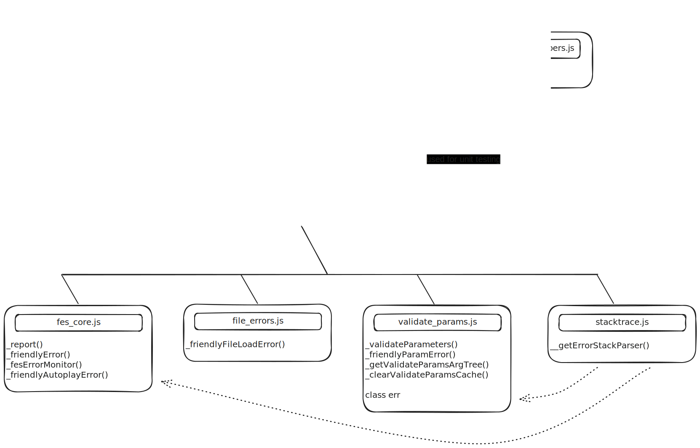

<!-- An overview of the Friendly Error System codebase and a reference for developers. -->

# Friendly Errors System Contribution Guide

The `core/friendly_errors` folder contains the code for the p5js’ Friendly Error Systems (FES) responsible for generating Friendly Error messages or Friendly Errors. You may have seen Friendly Error messages starting with “`🌸 p5.js says:`” in your console, supplementing default, browser-generated error messages.

FES houses several functions responsible for generating Friendly Error messages for different types of errors. These functions gather errors from various locations, including error handling at file load errors and autoplay errors, parameter checking within the library, and other custom error handling implemented by the p5.js contributors.

This document starts with an overview of FES's main functions and their locations. In the following reference section, you will find full information (description, syntax, parameters, location) about these individual functions. In the last part of the document, you will find notes from our previous contributors (Development Notes) outlining known limitations of FES and possible future directions. Please take a look at the [Development Notes](#-development-notes) if you are considering contributing to FES!


## Overview

The main functions for generating the Friendly Error messages are:

- `p5._friendlyError()`: formats and prints (through `_report()`) an input message into Friendly Errors
- `p5._validateParameters()`: validate received input values for the wrong type or missing value(s)
- `p5._friendlyFileLoadError()`: guide users about errors related to file load functions
- `p5._friendlyAutoplayError()`: guide users about errors related to the browser's autoplay policy

Here is a diagram that outlines the location of all functions in FES and how they connect to others:



Individual files contain the following main FES functions:

- `fes_core.js`: contains `_report()`, `_friendlyError()`, and `_friendlyAutoplayError(),` along with other helper functions for formatting and testing Friendly Errors.
- `validate_params.js`: contains `_validateParameters()` along with other helper functions for parameter validation.
- `file_errors.js`: contains `_friendlyFileLoadError() `and other helper functions for file load errors.
- `browser_errors.js`: contains a list of browser errors that will be generated with the global error class of FES (`fes.globalErrors`).
- `stacktrace.js`: contains the code to parse the error stack (borrowed from [stacktrace.js](https://github.com/stacktracejs/stacktrace.js)).


## 📚 Reference: FES Functions

### `_report()`

#### Description

`_report()` is the primary function that prints directly to the console with the output of the error helper message.

**Note:** If `p5._fesLogger` is set ( i.e., we are running tests ), it will be used instead of `console.log`. This can be useful when we are running tests via Mocha. In this case, `_fesLogger` will let `_report` to pass an error message to Mocha as a string, which will be tested against the asserted string.


#### Syntax

```js
_report(message);

_report(message, func);

_report(message, func, color);
```


#### Parameters

```
@param  {String}        message   Message to be printed
@param  {String}        [func]    Name of function
@param  {Number|String} [color]   CSS color code
```

The `[func]` input is used to append a reference link to the end of the error message.

The `[color]` input is used to set the color property of the error message. This is not used in the current version of Friendly Error messages.


#### Location

core/friendly\_errors/fes\_core.js

### `_friendlyError()`

#### Description

`_friendlyError()` creates and prints a Friendly Error message. Any p5 function can call this function to offer a Friendly Error message.

`_friendlyFileLoadError()` is inside the following functions:

- `image/loading_displaying/loadImage()`
- `io/files/loadFont()`
- `io/files/loadTable()`
- `io/files/loadJSON()`
- `io/files/loadStrings()`
- `io/files/loadXML()`
- `io/files/loadBytes()`.

The call sequence to `_friendlyFileLoadError` looks something like this:

```
_friendlyFileLoadError
  _report
```


#### Syntax

```js
_friendlyFileLoadError(errorType, filePath);
```


#### Parameters

```
@param  {Number}  errorType   Number of file load error type
@param  {String}  filePath    Path to file caused the error
```

The `errorType` input refers to the specific type of file load error as enumerated in `core/friendly_errors/file_errors.js`. File load errors in p5.js are categorized into various distinct cases. This categorization is designed to facilitate the delivery of precise and informative error messages corresponding to different error scenarios. For example, when it can't read the data in a font file, it can show a different error than it would when it tries to load a file that is too large to read.


#### Examples

File Loading Error Example:

```js
/// missing font file
let myFont;
function preload() {
  myFont = loadFont('assets/OpenSans-Regular.ttf');
}
function setup() {
  fill('#ED225D');
  textFont(myFont);
  textSize(36);
  text('p5*js', 10, 50);
}
function draw() {}
```

FES will generate the following message in the console in addition to browser’s “unsupported” error:

```
🌸 p5.js says: It looks like there was a problem loading your font. Try checking if the file path (assets/OpenSans-Regular.ttf) is correct, hosting the file online, or running a local server.

+ More info: https://github.com/processing/p5.js/wiki/Local-server
```


#### Location

/friendly\_errors/file\_errors.js


### `_friendlyAutoplayError()`

#### Description

`_friendlyAutoplayError()` is called internally if there is an error linked to playing a media (for example, a video), most likely due to the browser's autoplay policy.

It calls `translator()` to generate and print a Friendly Error message using key `fes.autoplay`. You can see all the available keys at `translations/en/translation.json`.


#### Location

core/friendly\_errors/fes\_core.js


### `_validateParameters()`

#### Description

`_validateParameters()` runs parameter validation by matching the input parameters with information from `docs/reference/data.json`, which is created from the function's inline documentation. It checks that a function call contains the correct number and the correct types of parameters.

It calls `translator()` to generate and print a Friendly Error message using key `fes.friendlyParamError.*`. You can see all the available keys at `translations/en/translation.json`.

This function can be called through `p5._validateParameters(FUNCT_NAME, ARGUMENTS)` or, `p5.prototype._validateParameters(FUNCT_NAME, ARGUMENTS)` inside the function that requires parameter validation. It is recommended to use the static version `p5._validateParameters`, for general purposes. `p5.prototype._validateParameters(FUNCT_NAME, ARGUMENTS)` mainly remained for debugging and unit testing.

`_validateParameters()` function is inside these functions:

- `accessibility/outputs`
- `color/creating_reading`
- `color/setting`
- `core/environment`
- `core/rendering`
- `core/shape/2d_primitives`
- `core/shape/attributes`
- `core/shape/curves`
- `core/shape/vertex`
- `core/transform`
- `data/p5.TypedDict`
- `dom/dom`
- `events/acceleration`
- `events/keyboard`
- `image/image`
- `image/loading_displaying`
- `image/p5.Image`
- `image/pixel`
- `io/files`
- `math/calculation`
- `math/random`
- `typography/attributes`
- `typography/loading_displaying`
- `utilities/string_functions`
- `webgl/3d_primitives`
- `webgl/interaction`
- `webgl/light`
- `webgl/loading`
- `webgl/material`
- `webgl/p5.Camera`

The call sequence from `_validateParameters` looks something like this:

```
validateParameters
   buildArgTypeCache
      addType
    lookupParamDoc
    scoreOverload
      testParamTypes
      testParamType
    getOverloadErrors
    _friendlyParamError
      ValidationError
      report
        friendlyWelcome
```


#### Syntax

```js
_validateParameters(func, args);
```


#### Parameters

```
@param  {String}  func    Name of the function being called
@param  {Array}   args    User input arguments
```


#### Examples

Example of a Missing Parameter:

```js
arc(1, 1, 10.5, 10);
```

FES will generate the following message in the console:

```
🌸 p5.js says: [sketch.js, line 13] arc() was expecting at least 6 arguments, but received only 4. (http://p5js.org/reference/#/p5/arc)
```

Example of a type mismatch

```js
arc(1, ',1', 10.5, 10, 0, Math.PI);
```

FES will generate the following message in the console:

```
🌸 p5.js says: [sketch.js, line 14] arc() was expecting Number for the first parameter, received string instead. (http://p5js.org/reference/#/p5/arc)
```


#### Location

core/friendly\_errors/validate\_params.js


### `fesErrorMonitor()`

#### Description

`fesErrorMonitor()` monitors browser error messages to guess the source of the error and provide additional guidance to the users. This includes the stack trace,  which is a sequential list of the functions called in a program leading up to the point of the thrown error. Stack traces are useful for determining if an error is internal or caused by something the user called directly.

It calls `translator()` to generate and print a Friendly Error message using key `fes.globalErrors.*`. You can see all the available keys at `translations/en/translation.json`.

Here is a comprehensive list of error messages generated through `fesErrorMonitor()`:

- a Friendly Error message using key: `fes.globalErrors.syntax.*`, `fes.globalErrors.reference.*`, `fes.globalErrors.type.*`.
- an "internal library" error message via `processStack()` using key: `fes.wrongPreload`, `fes.libraryError`.
- a stacktrace message via `printFriendlyStack()` using key: `fes.globalErrors.stackTop`, `fes.globalErrors.stackSubseq`.
- a spell-check message (from a reference error) via `handleMisspelling()` using key: `fes.misspelling`.

`_fesErrorMonitor()` is automatically triggered by `error` events and unhandled promise rejections (`unhandledrejection` events) at `window`. However, it can be manually called in a catch block as follows:

```js
try { someCode(); } catch(err) { p5._fesErrorMonitor(err); }
```

The function currently works with a subset of `ReferenceError`, `SyntaxError`, and `TypeError`. You can find the complete list of supported errors in `browser_errors.js`.

The call sequence for `_fesErrorMonitor` roughly looks something like this:

```
 _fesErrorMonitor
     processStack
       printFriendlyError
     (if type of error is ReferenceError)
       _handleMisspelling
         computeEditDistance
         _report
       _report
       printFriendlyStack
     (if type of error is SyntaxError, TypeError, etc)
       _report
       printFriendlyStack
```


#### Syntax

```js
fesErrorMonitor(event);
```


#### Parameters

```
@param {*}  e     Error event
```


#### Examples

Internal Error Example 1:

```js
function preload() {
  // error in background() due to it being called in
  // preload
  background(200);
}
```

FES will generate the following message in the console:

```
🌸 p5.js says: [sketch.js, line 8] An error with message "Cannot read properties of undefined (reading 'background')" occurred inside the p5js library when "background" was called. If not stated otherwise, it might be due to "background" being called from preload. Nothing besides load calls (loadImage, loadJSON, loadFont, loadStrings, etc.) should be inside the preload function. (http://p5js.org/reference/#/p5/preload)
```

Internal Error Example 2:

```js
function setup() {
  cnv = createCanvas(200, 200);
  cnv.mouseClicked();
}
```

FES will generate the following message in the console:

```js
🌸 p5.js says: [sketch.js, line 12] An error with message "Cannot read properties of undefined (reading 'bind')" occurred inside the p5js library when mouseClicked was called. If not stated otherwise, it might be an issue with the arguments passed to mouseClicked. (http://p5js.org/reference/#/p5/mouseClicked)
```

Example of an Error (Scope):

```js
function setup() {
  let b = 1;
}
function draw() {
  b += 1;
}
```

FES will generate the following message in the console:

```
🌸 p5.js says:

[sketch.js, line 5] "b" is not defined in the current scope. If you have defined it in your code, you should check its scope, spelling, and letter-casing (JavaScript is case-sensitive).

+ More info: https://p5js.org/examples/data-variable-scope.html
```

Example of an Error (Spelling):

```js
function setup() {
  xolor(1, 2, 3);
}
```

FES will generate the following message in the console:

```
🌸 p5.js says: [sketch.js, line 2] It seems that you may have accidentally written "xolor" instead of "color". Please correct it to color if you wish to use the function from p5.js. (http://p5js.org/reference/#/p5/color)
```


#### Location

core/friendly\_errors/fes\_core.js


### `checkForUserDefinedFunctions()`

#### Description

Checks if any user-defined function (`setup()`, `draw()`, `mouseMoved()`, etc.) has been used with a capitalization mistake.

It calls `translator()` to generate and print a Friendly Error message using key `fes.checkUserDefinedFns`. You can see all the available keys at `translations/en/translation.json`.


#### Syntax

```js
checkForUserDefinedFunctions(context);
```


#### Parameters

```
@param {*} context  Current default context.
                    Set to window in "global mode" and
                    to a p5 instance in "instance mode"
```


#### Examples

```js
function preload() {
  loadImage('myimage.png');
}
```

FES will generate the following message in the console:

```
🌸 p5.js says: It seems that you may have accidentally written preLoad instead of preload. Please correct it if it's not intentional. (http://p5js.org/reference/#/p5/preload)
```


#### Location

/friendly\_errors/fes\_core.js


### `helpForMisusedAtTopLevelCode()`

#### Description

`helpForMisusedAtTopLevelCode()` is called by `fes_core.js` on window load to check for use of p5.js functions outside of `setup()` or `draw()`.

It calls `translator()` to generate and print a Friendly Error message using the key `fes.misusedTopLevel`. You can see all the available keys at `translations/en/translation.json`.


#### Parameters

```
@param {*}        err    Error event
@param {Boolean}  log    false
```


#### Location

/friendly\_errors/fes\_core.js


## 💌 Development Notes

### Known Limitations

#### False Positive versus False Negative Cases

In FES, you might encounter two types of errors: false positives and false negatives. Think of a false positive like a false alarm. It’s when FES warns you of an error, but your code is actually fine. On the other hand, a false negative is like missing a mistake. This happens when there’s an error in your code, but FES doesn’t alert you about it.

It's important to identify and fix these errors because they can save debugging time, make things less confusing, and make fixing real problems easier.

In certain less-than-ideal situations, the design of error handling may need to be chosen to eliminate either false positives or false negatives. If you have to choose, it’s usually better to eliminate false positives. This way, you avoid generating incorrect warnings that could distract or mislead our users.


#### Limitations Related to `fes.GlobalErrors`

FES can only detect overwritten global variables if they are declared using `const` or `var`. Variables declared with let go undetected. This limitation is due to the specific way `let` handles variable instantiation, and it currently cannot be resolved.

The functionality described under `fesErrorMonitor()` currently only works on the web editor or if running on a local server. For more details, see pull request \[[#4730](https://github.com/processing/p5.js/pull/4730)].


### Performance Issue with the FES

By default, FES is enabled for p5.js and disabled in `p5.min.js` to prevent FES functions from slowing down the process. The error-checking system can significantly slow down your code (up to \~10x in some cases). See the [Friendly Error performance test](https://github.com/processing/p5.js-website/tree/main/src/assets/learn/performance/code/friendly-error-system).

You can disable the FES with one line of code at the top of your sketch:

```js
p5.disableFriendlyErrors = true; // disables FES
function setup() {
  // Do setup stuff
}
function draw() {
  // Do drawing stuff
}
```

Please note that this action will disable certain features of the FES that are known to reduce performance, such as argument checking. However, Friendly Error messages that do not impact performance will still be enabled. This includes providing detailed error messages if a file fails to load or warnings if you attempt to override p5.js functions in the global space.


### Thoughts for Future Work

- Decouple FES \[[#5629](https://github.com/processing/p5.js/issues/5629)]
- Eliminate false positive cases
- Identify false negative cases
- Add more unit tests for comprehensive test coverage
* More intuitive, clear, and translatable messages. For more discussion about the internationalization of Friendly Errors, please take a look at [Friendly Errors i18n Book](https://almchung.github.io/p5-fes-i18n-book/en/).
- Identify more common error types and generalize with FES (e.g. `bezierVertex()`, `quadraticVertex()` - required object not initiated; checking Number parameters positive for `nf()`, `nfc()`, `nfp()`, `nfs()`)


## Conclusion

In the README document, we have outlined the structure of the `core/friendly_errors` folder. This section explains the organization and purpose of this folder, making it easier to navigate and understand. Additionally, for each function within this folder, we have provided a reference guide.

In the latter part of this documentation, we have included notes from previous contributors that discuss the current limitations of FES and potential areas for improvement in future development.

Additionally, we are excited to share insights from our community through the FES Survey conducted in 2021-2022. The findings are available in two formats:

- [21-22 FES Survey Report Comic](https://almchung.github.io/p5jsFESsurvey/)
- [21-22 FES Survey Full Report](https://observablehq.com/@almchung/p5-fes-21-survey).

<!-- TODO: uncomment when we publish the article below -->
<!-- If you're looking for ways to add Friendly Error messages to your methods, we recommend looking at the [How to add Friendly Error Messages](#). It takes you through the process of adding these error messages to your methods step-by-step. -->