<!-- GitHub पर p5.js में योगदान देने के बारे में आवश्यक जानकारी। -->

# योगदानकर्ता दिशानिर्देश

योगदानकर्ता दिशानिर्देशों में आपका स्वागत है! यह दस्तावेज़ उन नए योगदानकर्ताओं के लिए है जो p5.js में कोड का योगदान करना चाहते हैं, योगदानकर्ता कुछ तकनीकी कदमों पर फिर से विचार करना चाह रहे हैं, या p5.js में किसी अन्य प्रकार के कोड योगदान के बारे में हैं।

यदि आप p5.js रिपॉजिटरी के बाहर योगदान करना चाहते हैं (ट्यूटोरियल लिखना, कक्षाओं की योजना बनाना, कार्यक्रमों का आयोजन करना), तो कृपया इसके बजाय अन्य प्रासंगिक पृष्ठों पर एक नज़र डालें। प्रबंधकों या अनुरक्षकों को समस्याएँ की समीक्षा करने और अनुरोधों के संबंध में [प्रबंधक दिशानिर्देश](https://github.com/processing/p5.js/blob/main/contributor_docs/steward_guidelines.md) अधिक उपयोगी लग सकते हैं।

यह अपेक्षाकृत लंबा और व्यापक दस्तावेज़ है लेकिन हम सभी चरणों और बिंदुओं को यथासंभव स्पष्ट रूप से इंगित करने का प्रयास करेंगे। अपने लिए प्रासंगिक अनुभाग ढूंढने के लिए विषय-सूची का उपयोग करें। यदि अनुभाग आपके नियोजित योगदान के लिए प्रासंगिक नहीं हैं, तो बेझिझक उन्हें छोड़ दें।

**यदि आप एक नए योगदानकर्ता हैं, तो आप पहले खंड, "सभी समस्याएँ के बारे में" से शुरुआत करना चाहेंगे। यदि आप विकास प्रक्रिया का चरण-दर-चरण सेटअप चाहते हैं, तो आप "डेवलपर्स के लिए त्वरित शुरुआत करें" अनुभाग देख सकते हैं.**

# विषयसूची

- [योगदानकर्ता दिशानिर्देश](#योगदानकर्ता-दिशानिर्देश)
- [विषयसूची](#विषयसूची)
- [समस्याएँ के बारे में सब कुछ](#समस्याएँ-के-बारे-में-सब-कुछ)
  - [समस्याएँ क्या हैं?](#समस्याएँ-क्या-हैं)
  - [समस्या खाका](#समस्या-खाका)
    - ["कोई बग मिला"](#कोई-बग-मिला)
    - ["मौजूदा सुविधा में सुधार"](#मौजूदा-सुविधा-में-सुधार)
    - ["नई सुविधा का अनुरोध"](#नई-सुविधा-का-अनुरोध)
    - ["चर्चा"](#चर्चा)
- [p5.js कोडबेस पर कार्य करना](#p5js-कोडबेस-पर-कार्य-करना)
  - [पूर्वावश्यकताएँ](#पूर्वावश्यकताएँ)
  - [परिचय](#परिचय)
  - [डेवलपर्स के लिए त्वरित शुरुआत करें](#डेवलपर्स-के-लिए-त्वरित-शुरुआत-करें)
  - [गिटहब संपादन कार्यक्षमता का उपयोग करना](#गिटहब-संपादन-कार्यक्षमता-का-उपयोग-करना)
  - [p5.js को फोर्क करना और अपने फोर्क से काम करना](#p5js-को-फोर्क-करना-और-अपने-फोर्क-से-काम-करना)
    - [गिटहब डेस्कटॉप का उपयोग करना](#गिटहब-डेस्कटॉप-का-उपयोग-करना)
    - [गिट कमांड लाइन इंटरफ़ेस का उपयोग करना](#गिट-कमांड-लाइन-इंटरफ़ेस-का-उपयोग-करना)
  - [कोडबेस ब्रेकडाउन](#कोडबेस-ब्रेकडाउन)
  - [सेटअप बनाएं](#सेटअप-बनाएं)
  - [गिट वर्कफ़्लो](#गिट-वर्कफ़्लो)
    - [सोर्स कोड](#सोर्स-कोड)
    - [इकाई का परीक्षण](#इकाई-का-परीक्षण)
    - [इनलाइन दस्तावेज़ीकरण](#इनलाइन-दस्तावेज़ीकरण)
    - [अभिगम्यता](#अभिगम्यता)
  - [कोड मानक](#कोड-मानक)
  - [सॉफ़्टवेयर डिज़ाइन सिद्धांत](#सॉफ़्टवेयर-डिज़ाइन-सिद्धांत)
- [पुल रिक्वेस्ट](#पुल-रिक्वेस्ट)
  - [पुल रिक्वेस्ट बनाना](#पुल-रिक्वेस्ट-बनाना)
    - [पुल रिक्वेस्ट के बारे में जानकारी](#पुल-रिक्वेस्ट-के-बारे-में-जानकारी)
    - [शीर्षक](#शीर्षक)
    - [हल](#हल)
    - [परिवर्तन](#परिवर्तन)
    - [परिवर्तन के स्क्रीनशॉट](#परिवर्तन-के-स्क्रीनशॉट)
    - [पीआर चेकलिस्ट](#पीआर-चेकलिस्ट)
    - [विवादों को पुनः स्थापित करें और हल करें](#विवादों-को-पुनः-स्थापित-करें-और-हल-करें)
  - [चर्चा करें और संशोधन करें](#चर्चा-करें-और-संशोधन-करें)

---

# समस्याएँ के बारे में सब कुछ

p5.js के गिटहब रिपॉजिटरी (संक्षेप में रेपो) पर अधिकांश गतिविधि समस्याएँ में होती है, जो आपकी योगदान यात्रा शुरू करने के लिए एक शानदार जगह है।

## समस्याएँ क्या हैं?

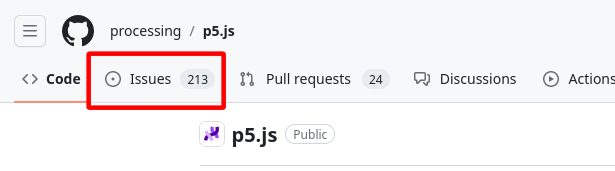

"समस्या" गिटहब रिपॉजिटरी पर सामान्य क्रिया है जिसका उद्देश्य किसी समस्या का वर्णन करना है।। यह समस्या एक त्रुटि रिपोर्ट, नई विशेषता जोड़ने का अनुरोध, एक चर्चा, या p5.js लाइब्रेरी विकास से संबंधित किसी भी उद्देश्य के रूप में काम कर सकती है। प्रत्येक समस्या के नीचे किसी भी गिटहब खाते वाले व्यक्ति, सहित बॉट्स, द्वारा टिप्पणियाँ जोड़ी जा सकती हैं! यह वह स्थान है जहां योगदानकर्ताओं ने परियोजना के विकास से संबंधित विषयों पर चर्चा करते हैं।

जबकि एक समस्या कई विभिन्न कारणों के लिए खोली जा सकती है, हम आमतौर पर केवल p5.js स्रोत कोड के विकास पर चर्चा करने के लिए समस्याएँ का उपयोग करते हैं। अपने कोड का पुन: निरीक्षण, अपने परियोजना में सहयोगी निमंत्रण करने, या अन्य असंबंधित विषयों पर हम [फोरम](https://discourse.processing.com) या अन्य प्लेटफ़ॉर्मों जैसे [डिस्कोर्ड](https://discord.gg/SHQ8dH25r9) पर चर्चा करते हैं।

हमने आपको गिटहब समस्या होनी चाहिए या कहीं और पोस्ट करनी चाहिए को निर्धारित करने में मदद करने के लिए आसान-से-उपयोग निर्देशिका बनाई हैं!

## समस्या खाका

p5.js के समस्या खाका उपाध्यक्षों और रखरखावकर्ताओं को समस्याओं को समझने और समीक्षा करने में सुविधा प्रदान करते हैं। ये आपको भी उचित समस्या को दर्ज करने और त्वरित उत्तर प्राप्त करने में सहायक होते हैं।

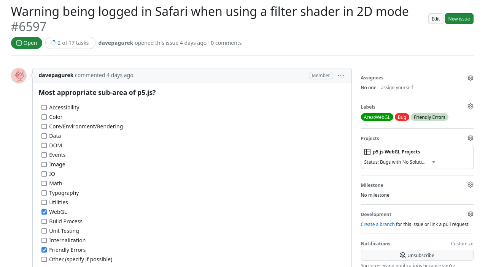

नई समस्या दर्ज करने के लिए, पहले "Issues" टैब पर जाएं p5.js रेपो पर और फिर दाएं ओर "New issue" बटन पर क्लिक करें। आपको कई विभिन्न विकल्पों के साथ प्रस्तुत किया जाएगा, जिसमें से प्रत्येक किसी संबंधित समस्या खाका का अनुसरण करता है या आपको आपके प्रश्न को दर्ज करने के लिए उचित स्थान पर पुनःनिर्देशित करता है। हम सुझाव देते हैं कि आप प्रस्तुत किए गए सभी विकल्पों में से सबसे संबंधित विकल्प का चयन करें ताकि आपकी समस्या को सही ध्यान और समय से संबोधित किया जा सके।

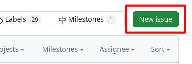

### ["कोई बग मिला"](https://github.com/processing/p5.js/issues/new?assignees=\&labels=Bug\&projects=\&template=found-a-bug.yml)

जब आप p5.js में संभावित अप्रत्याशित व्यवहार का सामना करते हैं या दस्तावेज़ में वर्णित अनुसार व्यवहार नहीं करते हैं, तो [इस खाका](https://github.com/processing/p5.js/issues/new?assignees=\&labels=Bug\&projects=\&template=found-a-bug.yml) उपयोग करें।

कृपया ध्यान दें कि यदि आप अपने स्केच को पुनः निरीक्षण करने का प्रयास कर रहे हैं और आपको लगता है कि यह आपके कोड में कोई समस्या हो सकती है, तो आपको पहले [डिस्कोर्स फोरम](https://discourse.processing.org) पर पूछना चाहिए।

इस खाका में आपको भरने के लिए कुछ फ़ील्ड हैं:

1. *p5.js का सबसे उपयुक्त उप-क्षेत्र?* - यह हमें संबंधित [लेबल](https://github.com/processing/p5.js/blob/main/contributor_docs/issue_labels.md) के साथ समस्या को स्वचालित रूप से टैग करके आपकी समस्या को पहचानने और उसका जवाब देने में मदद करता है।
2. *p5.js संस्करण* - आप p5.js संस्करण संख्या या तो `<script>` टैग लिंक में या p5.js/p5.min.js फ़ाइल की पहली पंक्ति में पा सकते हैं। यह कुछ हद तक `1.4.2` (अवधि द्वारा अलग की गई तीन संख्याएँ) जैसा दिखेगा।
3. *वेब ब्राउज़र और संस्करण* - यह हमें ब्राउज़रों के बीच विभिन्न व्यवहारों को अलग करने में मदद करता है। ब्राउज़र संस्करण संख्या खोजने के लिए, आप जिस ब्राउज़र का उपयोग कर रहे हैं उसके लिए नीचे दी गई तालिका में दिए गए निर्देशों का पालन करें।

<table>

<tr>

<td>

क्रोम

</td>

<td>

फ़ायरफ़ॉक्स

</td>

<td>

सफारी

</td>

</tr>

<tr>

<td>

एड्रेस बार में, `chrome://version` लिखें

</td>

<td>

एड्रेस बार में, `about:support` लिखें

</td>

<td>

शीर्ष पट्टी के नीचे “Safari” मेनू में से, “About Safari” का चयन करें

</td>

</tr>

</table>

4. *ऑपरेटिंग सिस्टम* - यदि संभव हो तो आपको ओएस संस्करण संख्या शामिल करनी चाहिए, उदाहरण के लिए, `macOS 12.5`। कुछ त्रुटि ओएस व्यवहार से उत्पन्न हो सकते हैं।
5. *इसे पुन: प्रस्तुत करने के चरण* - यह संभवतः साझा करने के लिए सबसे महत्वपूर्ण जानकारी है। आप जो त्रुटि देख रहे हैं उसकी प्रतिकृति बनाने के लिए आपको विस्तृत चरणों की सूची बनानी चाहिए। एक बुनियादी प्रतिदर्श कोड साझा करना जो समस्या को प्रदर्शित करता है, उस व्यक्ति के लिए बहुत मददगार साबित हो सकता है जो उस त्रुटि को दोहराना चाहता है जिसका आप सामना कर रहे हैं और समाधान तैयार करना शुरू कर सकते हैं।

**प्रतिकृति कुंजी है!** इस खाका में कई फ़ील्ड का उद्देश्य त्रुटि की प्रतिलिपि बनाना है। जितनी अधिक जानकारी आप हमें अपने स्केच के परिवेश के बारे में प्रदान कर सकते हैं और जो आप देख रहे हैं उसे दूसरे कैसे दोहरा सकते हैं, किसी के लिए भी आपकी समस्या को समझना और समाधान खोजना शुरू करना उतना ही आसान होगा।

**जितना संभव हो उतना विस्तृत रहें और सामान्य कथनों से बचें**, उदाहरण के लिए, यह न कहें कि "छवि() फ़ंक्शन काम नहीं करता है" बल्कि अधिक विशिष्ट रहें, जैसे कि "छवि() फ़ंक्शन लोड की गई GIF छवि को प्रदर्शित नहीं करता है सही आकार।" आप जिस त्रुटि का सामना कर रहे हैं उसका वर्णन करने का एक उपयोगी तरीका दो चीजों का वर्णन करना है:

1. आपके द्वारा साझा किए गए प्रतिदर्श कोड से आप क्या अपेक्षा करते हैं (अपेक्षित व्यवहार)।
2. प्रतिदर्श कोड वास्तव में क्या कर रहा है (वास्तविक व्यवहार)।

यदि आप अभी रिपोर्ट की गई त्रुटि को ठीक करने में योगदान देना चाहते हैं, तो आप विवरण में इसका संकेत दे सकते हैं। आप एक सरल सुझाव दे सकते हैं कि आप अभी बताए गए त्रुटि को कैसे ठीक करेंगे, इससे हमें पता चलेगा कि समाधान में योगदान देने के लिए आपको कितने समर्थन की आवश्यकता हो सकती है।

**आपको संबंधित समस्या के बिना या कार्यान्वयन के लिए किसी समस्या को मंजूरी मिलने से पहले पुल अनुरोध दर्ज नहीं करना चाहिए (या कोड परिवर्तनों पर काम करना शुरू नहीं करना चाहिए)**; ऐसा इसलिए है क्योंकि प्रस्तावित सुधार को स्वीकार नहीं किया जा सकता है, पूरी तरह से एक अलग दृष्टिकोण की आवश्यकता है, या वास्तविक समस्या कहीं और है। समस्या को ठीक करने के लिए मंजूरी मिलने से पहले दायर किए गए किसी भी पुल अनुरोध को समस्या को मंजूरी मिलने तक बंद कर दिया जाएगा।

त्रुटि रिपोर्ट को ठीक करने के लिए स्वीकार करने के लिए, पुल अनुरोध पर काम शुरू करने से पहले उन्हें कम से कम एक [क्षेत्र प्रबंधक या रखरखाव](https://github.com/processing/p5.js#stewards) द्वारा अनुमोदित किया जाना चाहिए।

### ["मौजूदा सुविधा में सुधार"](https://github.com/processing/p5.js/issues/new?assignees=\&labels=Enhancement\&projects=\&template=current-feature-enhancement.yml)

यदि आप परिवर्तनों का प्रस्ताव करना चाहते हैं या p5.js की मौजूदा सुविधाओं (फ़ंक्शन, स्थिरांक, रेंडरिंग, आदि) में कार्यक्षमता जोड़ना चाहते हैं तो इस खाका का उपयोग किया जाना चाहिए। उदाहरण के लिए, यदि आप `रंग()' फ़ंक्शन और रंगों को स्वीकार करने वाले अन्य फ़ंक्शन में रंग को परिभाषित करने का एक नया तरीका जोड़ना चाहते हैं, तो यह उपयोग करने के लिए खाका है।

इस खाका के लिए कुछ फ़ील्ड हैं जिन्हें आपको भरना चाहिए।

1. *एक्सेस बढ़ाना* - यह आवश्यक फ़ील्ड वह है जहां आप एक विवरण डालते हैं कि प्रस्तावित सुविधा संवर्धन को जोड़ने से p5.js को कैसे मदद मिलेगी [एक्सेस बढ़ाएं](https://github.com/processing/p5.js/blob/main/contributor_docs/access.md) रचनात्मक कला या प्रौद्योगिकी के क्षेत्र में ऐतिहासिक रूप से हाशिए पर रहे लोगों के लिए। **इसके बिना कोई प्रस्ताव स्वीकार नहीं किया जाएगा**, हालांकि आप "सुनिश्चित नहीं" भर सकते हैं और समुदाय के अन्य सदस्यों को यह तर्क प्रदान करने की पेशकश कर सकते हैं यदि वे सोच सकते हैं कि यह पी5.जेएस की पहुंच को कैसे संबोधित करता है।
2. *p5.js का सबसे उपयुक्त उप-क्षेत्र?* - इससे हमें आपकी समस्या को पहचानने और उसका जवाब देने में मदद मिलती है। यह स्वचालित रूप से समस्या को प्रासंगिक [लेबल](https://github.com/processing/p5.js/blob/main/contributor_docs/issue_labels.md) के साथ टैग कर देगा।
3. *सुविधा वृद्धि विवरण* - यह वह जगह है जहां आप सुविधा वृद्धि के लिए अपने प्रस्ताव का वर्णन करते हैं। एक अच्छे सुविधा संवर्धन प्रस्ताव में अक्सर एक स्पष्ट उपयोग का मामला शामिल होता है: क्या, कब, कैसे और क्यों इस सुविधा संवर्धन की आवश्यकता है।

सुविधा संवर्धन प्रस्तावों को स्वीकार करने के लिए पुल अनुरोध पर काम शुरू करने से पहले उन्हें कम से कम 1 [क्षेत्र प्रबंधक या रखरखाव] (<https://github.com/processing/p5.js#stewards>) द्वारा अनुमोदित किया जाना चाहिए।

**आपको संबंधित समस्या के बिना या कार्यान्वयन के लिए किसी समस्या को मंजूरी मिलने से पहले पुल अनुरोध दर्ज नहीं करना चाहिए (या कोड परिवर्तनों पर काम करना शुरू नहीं करना चाहिए), क्योंकि इस बात की कोई गारंटी नहीं है कि प्रस्ताव स्वीकार कर लिया जाएगा। किसी प्रस्ताव को मंजूरी मिलने से पहले दायर किया गया कोई भी पुल अनुरोध समस्या को मंजूरी मिलने तक बंद कर दिया जाएगा।

### ["नई सुविधा का अनुरोध"](https://github.com/processing/p5.js/issues/new?assignees=\&labels=Feature+Request\&projects=\&template=feature-request.yml)

यदि आप p5.js में जोड़ने के लिए एक नई सुविधा का प्रस्ताव करना चाहते हैं तो इस खाका का उपयोग किया जाना चाहिए। उदाहरण के लिए एक नए `createTable` फ़ंक्शन के साथ मूल HTML `<table>` तत्वों को चित्रित करने के लिए समर्थन जोड़ना। कुछ प्रस्ताव मौजूदा सुविधा संवर्धन प्रस्तावों के साथ ओवरलैप हो सकते हैं, इन मामलों में आपको बस वही खाका चुनना चाहिए जो आपको सबसे उपयुक्त लगे।

तदनुसार, टेम्प्लेट फॉर्म फ़ील्ड "मौजूदा फ़ीचर एन्हांसमेंट" के फ़ील्ड के लगभग समान हैं। अतः कृपया प्रत्येक फ़ील्ड को भरने के तरीके के बारे में विवरण के लिए [पिछला अनुभाग] (#मौजूदा-सुविधा-संवर्द्धन) देखें।

नए विशेषता अनुरोध प्रस्तावों को स्वीकार करने के लिए, पुल अनुरोध पर काम शुरू करने से पहले उन्हें कम से कम 2 [क्षेत्र प्रबंधकों या अनुरक्षकों](https://github.com/processing/p5.js#stewards) द्वारा अनुमोदित किया जाना चाहिए।

**आपको संबंधित समस्या के बिना या किसी समस्या को कार्यान्वयन के लिए अनुमोदित किए जाने से पहले पुल अनुरोध दर्ज नहीं करना चाहिए (या कोड परिवर्तनों पर काम करना शुरू नहीं करना चाहिए), ऐसा इसलिए है क्योंकि इस बात की कोई गारंटी नहीं है कि प्रस्ताव स्वीकार कर लिया जाएगा। किसी प्रस्ताव को मंजूरी मिलने से पहले दायर किया गया कोई भी पुल अनुरोध समस्या को मंजूरी मिलने तक बंद कर दिया जाएगा।

### ["चर्चा"](https://github.com/processing/p5.js/issues/new?assignees=\&labels=Discussion\&projects=\&template=discussion.yml)

इस खाका का उपयोग तब किया जाता है जब आप जो मुद्दा दाखिल कर रहे हैं वह किसी भी तरह से उपरोक्त में से किसी में उपयुक्त नहीं बैठता है। उपरोक्त किसी भी खाका में फिट न होने वाला मुद्दा व्यवहार में अपेक्षाकृत दुर्लभ होना चाहिए। उदाहरण के लिए, p5.js में एक विशिष्ट वेब एपीआई सुविधा को अपनाने के बारे में चर्चा को [नई सुविधा अनुरोध](https://github.com/processing/p5.js/blob/main/contributor_docs/contributor_guidelines.md#new-feature-request); विभिन्न रंग कार्यों में एक अतिरिक्त रंग मोड जोड़ने के बारे में चर्चा को [सुविधा संवर्धन](https://github.com/processing/p5.js/blob/main/contributor_docs/contributor_guidelines.md#existing-feature-enchancement); आपके द्वारा आयोजित किए जा रहे स्थानीय रचनात्मक कोडिंग कार्यक्रम के बारे में एक घोषणा मंच पर पोस्ट की जानी चाहिए और यदि आप समर्थन या प्रचार की तलाश में हैं तो प्रोसेसिंग फाउंडेशन से संपर्क करें।

किसी चर्चा समस्या को खोलते समय, आप अतिरिक्त प्रासंगिक लेबल जोड़ने के लिए साइड पैनल पर "Label" पैनल का उपयोग कर सकते हैं ताकि आप अपने समस्या को संबंधित स्थान पर प्रमुखता से दिखा सकें। टेम्प्लेट स्वयं न्यूनतम पाठ फ़ील्ड है। उदाहरण चर्चा समस्या के लिए यह लिंक आप [यह लिंक](https://github.com/processing/p5.js/issues/6517) देख सकते हैं।

[**⬆ शीर्ष पर वापस**](#योगदानकर्ता-दिशानिर्देश)

---

# p5.js कोडबेस पर कार्य करना

## पूर्वावश्यकताएँ

आगे बढ़ने के लिए आपको कमांड लाइन, गिट, नोड.जेएस (कम से कम v18 और ऊपर) के साथ काम करने से न्यूनतम परिचित होना चाहिए, और एक स्थानीय विकास पर्यावरण सेटअप होना चाहिए।

## परिचय

अब जब आपके समस्या पर चर्चा हो चुकी है, कार्यान्वयन स्वीकृत हो गया है, और आप कोड में बदलाव करने के इच्छुक हैं, तो आप कोडबेस पर काम शुरू करने के लिए तैयार हैं।

इसी तरह, यदि आपके सामने कोई समस्या आया है या आप किसी समस्या पर चर्चा में शामिल हुए हैं और कार्यान्वयन को प्रबंधकों द्वारा अनुमोदित किया गया है, लेकिन न तो मूल समस्या के लेखक और न ही समुदाय के अन्य सदस्यों ने संकेत दिया है कि वे इस समस्या पर काम करने के इच्छुक हैं, तो आप ऐसा कर सकते हैं। यहां योगदान देने के लिए स्वयंसेवा करें और प्रबंधकों से इस समस्या को आपको सौंपने के लिए कहें।

**आपको किसी ऐसे समस्या के लिए पीआर दाखिल करके कतार में नहीं कूदना चाहिए** जिसमें या तो किसी और ने योगदान जमा करने की इच्छा का संकेत दिया है या पहले से ही किसी और को सौंपा गया है। किसी समस्या के लिए कोड योगदान स्वीकार करने के लिए हम हमेशा "पहले सौंपे, पहले पाएँ" आदेश को प्राथमिकता देंगे।

यदि आप किसी समस्या के लिए पीआर दाखिल करते हैं जबकि कोई अन्य व्यक्ति अभी भी उसी समस्या पर काम कर रहा है, तो आपका पीआर बंद कर दिया जाएगा। यदि आप देखते हैं कि किसी निर्दिष्ट व्यक्ति के साथ किसी समस्या पर अंतिम गतिविधि को कुछ महीने हो गए हैं, तो आप प्रगति के बारे में पूछते हुए और यदि उन्हें कार्यान्वयन में सहायता की आवश्यकता है, तो उस समस्या पर एक विनम्र टिप्पणी छोड़ कर उनके साथ जांच कर सकते हैं। हम आम तौर पर लोगों को उनके योगदान पर काम करने के लिए उचित रूप से लंबी समय सीमा की अनुमति देते हैं क्योंकि हम समझते हैं कि ज्यादातर लोग अक्सर स्वैच्छिक आधार पर काम करेंगे, या उन्हें सुविधा पर काम करने में अधिक समय लगेगा।

इसी तरह, आपको अपनी गति से काम करना चाहिए और आश्वस्त रहना चाहिए कि आप किसी चीज़ पर काम करने में कितना समय लगा सकते हैं, इसकी कोई कठिन समय सीमा नहीं है। कहा जा रहा है कि, यदि आपको अपने कोड योगदान के किसी भी पहलू से परेशानी हो रही है, तो इस समस्या पर मदद मांगने में संकोच न करें, प्रबंधक और अनुरक्षक, साथ ही हमारे समुदाय के सदस्य, आपका मार्गदर्शन करने की पूरी कोशिश करेंगे!

## डेवलपर्स के लिए त्वरित शुरुआत करें

यदि आप एक डेवलपर के रूप में p5.js'🌸 कोडबेस पर काम/योगदान करना चाहते हैं, या तो सीधे p5.js को बेहतर बनाने के लिए या इसके उप-प्रोजेक्ट्स जैसे [फ्रेंडली एरर सिस्टम्स](https://github.com/processing/p5.js/blob/main/contributor_docs/friendly_error_system.md), आप निम्न चरणों का पालन कर सकते हैं:

1. [p5.js का एक कांटा बनाएं](https://docs.github.com/en/get-started/quickstart/fork-a-repo)
2. [अपने बनाए गए फोर्क को अपने कंप्यूटर पर क्लोन करें।](https://docs.github.com/en/repositories/creating-and-maneasing-repositories/cloning-a-repository)
3. [निम्न कमांड का उपयोग करके अपस्ट्रीम जोड़ें](https://docs.github.com/en/pull-requests/collaborating-with-pull-requests/working-with-forks/configuring-a-remote-repository-ffor-a-fork):

  ```
  git remote add upstream https://github.com/processing/p5.js
  ```

4. सुनिश्चित करें कि आपकी मशीन में [NodeJs](https://nodejs.org/en/download) स्थापित है; इसे निम्न आदेश से जांचें:

  ```
  node -v
  ```

5. इसके साथ निर्भरता स्थापित करें:

  ```
  npm ci
  ```

6. 'मुख्य' शाखा की एक गिट शाखा बनाएं जिसमें वर्णनात्मक शाखा नाम का उपयोग किया जाए:

  ```
  git checkout -b [branch_name]
  ```

7. जैसे ही आप कोडबेस में बदलाव करना शुरू करते हैं, बार-बार परीक्षण चलाएं (इसमें समय लगता है, लेकिन यह सुनिश्चित करता है कि मौजूदा व्यवहार को तोड़ा नहीं जा रहा है)।

  ```
  npm test
  ```

8. यदि आप नई सुविधाएँ जोड़ने या सुविधा बढ़ाने पर काम कर रहे हैं तो कोई भी इकाई परीक्षण जोड़ें।

9. एक बार हो जाने के बाद, आप परिवर्तन कर सकते हैं और एक [पुल अनुरोध](https://p5js.org/contributor-docs/#/./contributor_guidelines?id=pull-requests) बना सकते हैं।

## गिटहब संपादन कार्यक्षमता का उपयोग करना

गिटहब वेब इंटरफ़ेस पर किसी फ़ाइल को देखते समय, आप जिस फ़ाइल को देख रहे हैं उसकी सामग्री के शीर्ष के पास एक पेंसिल आइकन बटन होगा। यह बटन गिटहब द्वारा प्रदान की गई एक सुविधाजनक संपादन सुविधा है जो उन कई प्रक्रियाओं को सरल बनाती है 

जिन्हें हम नीचे कवर करेंगे और इसका उपयोग आपके द्वारा देखी जा रही फ़ाइल में त्वरित और सरल संपादन करने के लिए किया जा सकता है।

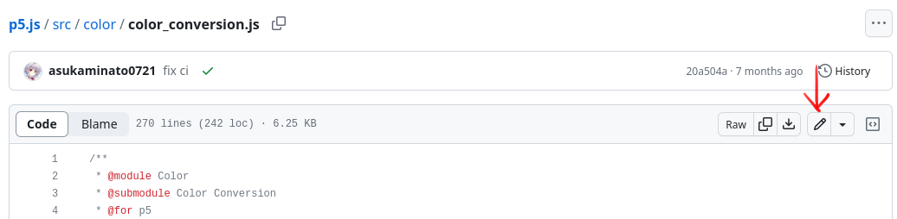

हालाँकि, बहुत ही साधारण परिवर्तनों के अलावा इस सुविधा का उपयोग करने की अनुशंसा नहीं की जाती है। इसका एक मुख्य कारण यह है कि स्रोत कोड में अधिक जटिल परिवर्तनों के लिए, इसे पीआर के रूप में दायर करने से पहले स्थानीय रूप से बनाया और परीक्षण किया जाना चाहिए। इस संपादन कार्यक्षमता द्वारा प्रदान किए गए बुनियादी संपादन वातावरण की तुलना में अधिकांश लोगों के लिए स्थानीय विकास परिवेश का उपयोग करना अक्सर अधिक सहज होता है।

## p5.js को फोर्क करना और अपने फोर्क से काम करना

P5.js स्रोत कोड पर काम करने का पहला चरण p5.js रिपॉजिटरी को फोर्क करना है। ओपन सोर्स में फोर्किंग का एक विशिष्ट अर्थ है, लेकिन हमारे उद्देश्य के लिए, इसका मतलब रिपॉजिटरी की एक प्रति बनाना और इसे अपने गिटहब खाते में संग्रहीत करना है। रेपो को फोर्क करने के लिए, बस पृष्ठ के शीर्ष के पास "फोर्क" बटन पर क्लिक करें, और गिटहब आपके खाते में रेपो की एक प्रति बना देगा।

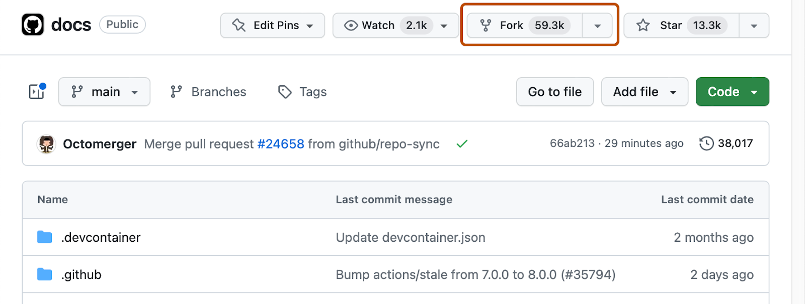

p5.js रिपॉजिटरी के अपने फोर्क से काम करना आवश्यक है क्योंकि आपके पास आधिकारिक p5.js रिपॉजिटरी तक सीधे लिखने की पहुंच नहीं होगी, और फोर्क पर काम करने से आप बदलाव कर सकते हैं और बाद में उन्हें आधिकारिक रिपॉजिटरी में वापस सबमिट कर सकते हैं।

### गिटहब डेस्कटॉप का उपयोग करना

गिटहब डेस्कटॉप एक प्रोग्राम है जो आपको टर्मिनल में कमांड टाइप करने के बजाय ग्राफिकल यूजर इंटरफेस के माध्यम से git के साथ काम करने देता है। यदि आप git में नए हैं तो यह एक अच्छा विकल्प है, और जब भी आपका मन करे आप Github डेस्कटॉप और टर्मिनल के बीच आगे और पीछे स्विच कर सकते हैं।

सबसे पहले, [गिटहब डेस्कटॉप डाउनलोड करें और इंस्टॉल करें।](https://desktop.github.com/) इंस्टॉल होने के बाद, एप्लिकेशन खोलें। यह आपसे आपके गिटहब खाते में साइन इन करने के लिए कहेगा। आपके साइन इन करने के बाद, यह आपकी परियोजनाओं को सूचीबद्ध करेगा, जिसमें आपका p5.js का कांटा भी शामिल होगा। अपना कांटा चुनें, जिसका नाम `yourUsername/p5.js` होगा, और नीले "क्लोन" बटन पर क्लिक करें। यह आपके प्रोजेक्ट को कहां रखा जाए, इसके बारे में कुछ विवरण मांगेगा; आप या तो उन्हें बदल सकते हैं या डिफ़ॉल्ट सेटिंग्स छोड़ कर जारी रख सकते हैं।

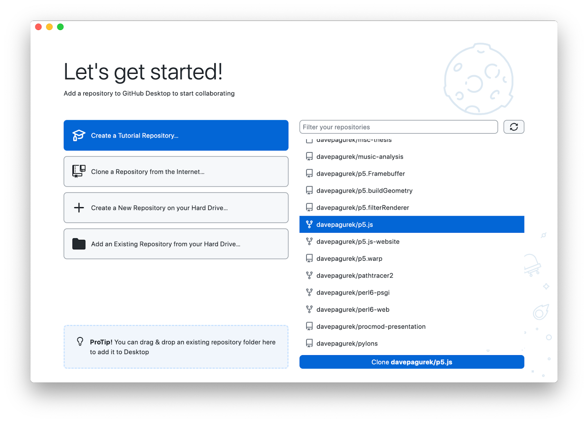

एक बार क्लोन हो जाने पर, यह पूछेगा कि आप अपने फोर्क का उपयोग कैसे करने की योजना बना रहे हैं। मूल प्रोजेक्ट में योगदान करने का विकल्प चुनें और "जारी रखें" पर क्लिक करें।

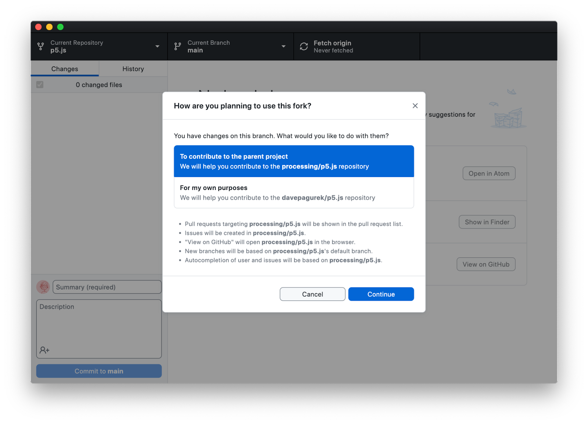

### गिट कमांड लाइन इंटरफ़ेस का उपयोग करना

एक बार फोर्क बन जाने के बाद, अपने फोर्क के पेज पर जाएं और हरे "कोड" बटन पर क्लिक करके गिट यूआरएल को कॉपी करें। इसे कुछ इस तरह दिखना चाहिए `https://github.com/limzykenneth/p5.js.git`.

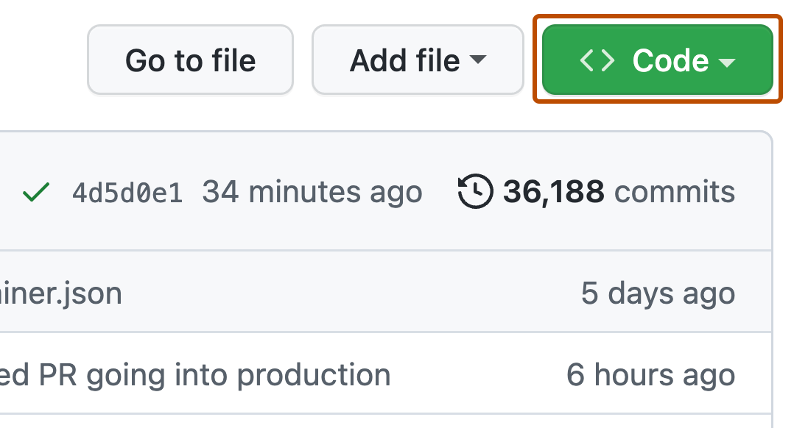

इसके बाद अपने स्थानीय वातावरण में कमांड लाइन पर जाएं और इस गिट रिपॉजिटरी को क्लोन करें। "क्लोन" का सीधा सा अर्थ है अपने स्थानीय मशीन पर रेपो की एक प्रति डाउनलोड करना। उस फ़ोल्डर में निम्न आदेश चलाएँ जहाँ आप p5.js स्रोत कोड फ़ोल्डर संग्रहीत करना चाहते हैं।

```
git clone [git_url]
```

`[git_url]` को उस यूआरएल से बदलें जिसे आपने अभी ऊपर कॉपी किया है। आपके इंटरनेट कनेक्शन की गति के आधार पर इसमें कई मिनट लग सकते हैं, कुछ कॉफ़ी बनाने का यह एक अच्छा समय है! एक बार प्रक्रिया समाप्त हो जाने पर, आप अपने पसंदीदा टेक्स्ट एडिटर में `p5.js` नामक डाउनलोड किए गए फ़ोल्डर को खोल सकते हैं और चारों ओर देखना शुरू कर सकते हैं।

## कोडबेस ब्रेकडाउन

आपके पास p5.js फ़ोल्डर में मौजूद कुछ प्रमुख फ़ाइलें और फ़ोल्डर इस प्रकार हैं:

- `src` - जहां सभी कोड जो अंततः अंतिम p5.js और p5.min.js फ़ाइलों में संयुक्त हो जाते हैं, रहते हैं
- [`test`](https://github.com/processing/p5.js/blob/main/contributor_docs/unit_testing.md) - जहां सभी दस्तावेज़ उदाहरणों के परीक्षण के लिए इकाई परीक्षण और कोड रहता है
- `कार्य` - जहां विस्तृत और कस्टम बिल्ड कोड रहता है
- `Gruntfile.js` - यह मुख्य बिल्ड कॉन्फ़िगरेशन फ़ाइल है
- `contributor_docs` - जहां दस्तावेज़ और अन्य सभी योगदानकर्ता दस्तावेज़ रहते हैं

अन्य फ़ाइलें और फ़ोल्डर्स या तो कॉन्फ़िगरेशन हैं या अन्य प्रकार की समर्थन फ़ाइलें हैं; अधिकांश मामलों में, आपको कोई संशोधन करने की आवश्यकता नहीं होनी चाहिए।

## सेटअप बनाएं

कुछ भी करने से पहले, आपको स्थानीय प्रोजेक्ट फ़ोल्डर सेट करना होगा ताकि आप p5.js के लिए परीक्षण बना और चला सकें। यह मानते हुए कि आपके पास नोड.जेएस स्थापित है, चलाएँ:

```
npm ci
```

इसमें कुछ समय लगने की संभावना है, क्योंकि एनपीएम सभी आवश्यक निर्भरताएँ डाउनलोड करता है। हालाँकि, एक बार हो जाने के बाद, बस, आप पूरी तरह तैयार हैं। बहुत सरल, है ना?

## गिट वर्कफ़्लो

अब, आप आवश्यक परिवर्तन करने के लिए तैयार हैं; रिपॉजिटरी के विभिन्न हिस्सों के बारे में अधिक जानकारी के लिए और आप प्रासंगिक परिवर्तन कैसे कर सकते हैं, नीचे दिए गए उपखंड देखें। आरंभ करने के लिए, चलाएँ:

```
npm test
```

शुरुआत से p5.js बनाने का प्रयास करने और सभी यूनिट परीक्षण चलाने के लिए, इसे बिना किसी त्रुटि के पूरा करना चाहिए। यदि आप परीक्षण चलाए बिना केवल लाइब्रेरी बनाना चाहते हैं, तो आप चला सकते हैं:

```
npm run build
```

उपरोक्त में से कोई भी आदेश लाइब्रेरी को `lib/` फ़ोल्डर में `p5.js` और `p5.min.js` के रूप में बनाएगा। यदि आवश्यक हो तो आप इन निर्मित फ़ाइलों का उपयोग अपने परीक्षणों के लिए कर सकते हैं।

इसके बाद, हम अनुशंसा करते हैं कि आप अपना काम शुरू करने से पहले `मुख्य' शाखा से एक शाखा बना लें। जैसा कि नाम से पता चलता है, गिट में एक शाखा रेपो का एक शाखित संस्करण है जिसे आप 'मुख्य' या अन्य शाखाओं को प्रभावित किए बिना कमिट जोड़ सकते हैं। शाखाएँ आपको एक साथ कई सुविधाओं पर काम करने में सक्षम बनाती हैं (कई अलग-अलग शाखाओं का उपयोग करके) और आपको विश्वास है कि यदि आप किसी शाखा में गड़बड़ी करते हैं तो यह 'मुख्य' शाखा को प्रभावित नहीं करेगी।

गिटहब डेस्कटॉप में, यह विंडो के हेडर में करंट ब्रांच बटन पर क्लिक करके किया जा सकता है। यहां से, आप शाखाएं बदल सकते हैं, या नई शाखा बनाने के लिए शाखा का नाम दर्ज कर सकते हैं। हमारे उद्देश्यों के लिए, आपके द्वारा किए जाने वाले परिवर्तन का वर्णन करते हुए एक नई शाखा का नाम दर्ज करें और नई शाखा बनाएं पर क्लिक करें।


टर्मिनल से, जब आप `मुख्य` शाखा पर हों तो `git checkout -b ब्रांच_नाम` चलाएँ, `branch_name` को किसी वर्णनात्मक चीज़ से बदलें, और अब आप एक अलग शाखा पर होंगे।

जैसे ही आप अपने परिवर्तन करते हैं, हम `npm test` को बार-बार चलाने की सलाह देते हैं, खासकर यदि आप स्रोत कोड पर काम कर रहे हैं। इसे चलाने में कुछ समय लगेगा, लेकिन यह सुनिश्चित करता है कि आपके द्वारा किए गए परिवर्तन मौजूदा व्यवहार को नहीं तोड़ रहे हैं। नीचे बताए अनुसार परिवर्तन करने से पहले आपको `npm test` चलाना चाहिए।

एक बार जब आप कोडबेस में अपने परिवर्तन कर लेते हैं, तो आपको इसे गिट में प्रतिबद्ध करना होगा। कमिट गिट रिपॉजिटरी में सहेजे गए परिवर्तनों का एक संग्रह है; यह अनिवार्य रूप से प्रतिबद्धता के समय रेपो में फ़ाइलों की वर्तमान स्थिति को रिकॉर्ड करता है।

एक प्रश्न उठ सकता है कि आपको कितनी बार गिट के लिए प्रतिबद्ध होना चाहिए? सामान्य तौर पर यह प्राथमिकता दी जाती है कि आप कई बड़े बदलावों को एक प्रतिबद्धता में डालने के बजाय बार-बार प्रतिबद्ध होने का लक्ष्य रखें। एक अच्छा दिशानिर्देश यह है कि जब भी आप कोई ऐसा उपकार्य पूरा कर लें जिसे एक वाक्य में वर्णित किया जा सके तो उसे प्रतिबद्ध कर दें।

गिटहब डेस्कटॉप से ​​सभी मौजूदा परिवर्तन करने के लिए, अपने परिवर्तन करने के बाद ऐप खोलें। यह बाएं साइडबार में आपके द्वारा बदली गई फ़ाइलों की एक सूची दिखाएगा, और दाईं ओर प्रत्येक फ़ाइल के भीतर विशिष्ट परिवर्तन दिखाएगा। विंडो के निचले बाएँ कोने में अपने उपयोगकर्ता आइकन के त्रुटिल वाले फ़ील्ड में एक संक्षिप्त, उच्च-स्तरीय विवरण टाइप करें। यह कमिट का शीर्षक होगा. आप नीचे विवरण फ़ील्ड में और विस्तार से बता सकते हैं या इसे खाली छोड़ सकते हैं। परिवर्तन को अंतिम रूप देने के लिए नीले "प्रतिबद्ध" बटन पर क्लिक करें।

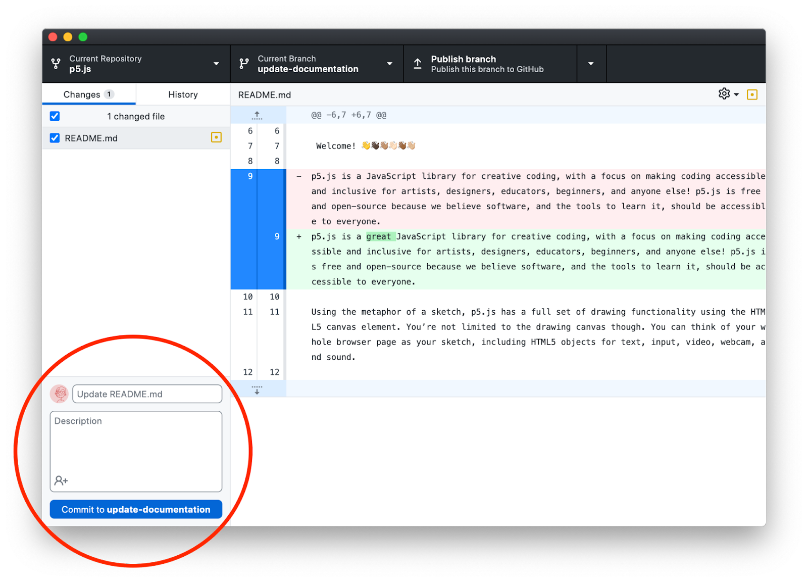

टर्मिनल से सभी मौजूदा परिवर्तन करने के लिए, निम्नलिखित चलाएँ:

1. जांचें कि यह केवल उन फ़ाइलों को सूचीबद्ध करता है जिन्हें आपने निम्न आदेश के साथ बदला है।

```
git status
```

यदि सूचीबद्ध फ़ाइलें हैं जिन्हें आपने नहीं बदला है, तो आपको या तो उन्हें मूल रूप में [पुनर्स्थापित](https://git-scm.com/docs/git-restore) करना होगा या सुनिश्चित करना होगा कि वे इच्छित परिवर्तन हैं। प्रत्येक फ़ाइल के लिए अधिक विस्तृत परिवर्तन दिखाने के लिए निम्न आदेश का उपयोग करें।

```
git diff
```

आपको कोई भी फ़ाइल परिवर्तन नहीं करना चाहिए जिसे आप अपने पीआर के लिए बदलने का इरादा नहीं रखते हैं।

2. निम्नलिखित आदेश के साथ गिट में प्रतिबद्ध होने के लिए सभी परिवर्तनों को चरणबद्ध करें।

```
git add .
```

3. गिट में परिवर्तन करने के लिए, निम्न कमांड चलाएँ।

```
git commit -m "[your_commit_message]"
```

`[your_commit_message]` को प्रासंगिक प्रतिबद्ध संदेश से बदला जाना चाहिए। इसमें परिवर्तनों की संक्षिप्त जानकारी होनी चाहिए, असंबंधित संदेश से बचना चाहिए। उदाहरण के लिए, 'Documentation fix 1' कहने के बजाय, 'Add documentation example to circle() function' कहें।

```
git commit -m "Add documentation example to circle() function"
```

यह सुनिश्चित करने के लिए कि चीजें काम कर रही हैं, समय-समय पर `npm test` चलाना सुनिश्चित करते हुए आपके द्वारा किए जा रहे सभी कमिट के लिए उपरोक्त चरणों को दोहराएं।

### सोर्स कोड

यदि आप स्रोत कोड पर काम करने जा रहे हैं, तो शुरुआत करने के लिए एक अच्छी जगह है, यदि आप जानते हैं कि आप किस p5.js सुविधाओं पर काम करने जा रहे हैं, तो प्रलेखन पर जाएँ और p5.js की प्रत्येक प्रलेखित कार्यक्षमता के नीचे जाएँ। इसके सोर्स कोड का लिंक होगा।


### इकाई का परीक्षण

यदि आप इकाई परीक्षण पर काम करने जा रहे हैं, तो कृपया [यहां](https://github.com/processing/p5.js/blob/main/contributor_docs/unit_testing.md) देखें। ध्यान दें कि किसी भी सुविधा वृद्धि, नई सुविधाओं और कुछ त्रुटि फिक्स के लिए, नए कार्यान्वयन को कवर करने वाले यइकाई परीक्षणों को पीआर में शामिल किया जाना चाहिए।

### इनलाइन दस्तावेज़ीकरण

यदि आप इनलाइन दस्तावेज़ीकरण पर काम करने जा रहे हैं, तो कृपया [यहां](https://p5js.org/contribute/contributing_to_the_p5js_reference/) देखें।

### अभिगम्यता

यदि आप अभिगम्यता सुविधाएँ पर काम करने जा रहे हैं, तो कृपया [यहां](https://github.com/processing/p5.js/blob/main/contributor_docs/web_accessibility.md) देखें। एक अनुकूल त्रुटि प्रणाली के लिए, कृपया [यहां](https://github.com/processing/p5.js/blob/main/contributor_docs/friendly_error_system.md) देखें।

## कोड मानक

p5.js का कोड मानक या कोड शैली [ESLlint](https://eslint.org/) द्वारा लागू की जाती है। किसी भी गिट कमिट और पुल अनुरोध को स्वीकार करने से पहले उसे लिंटिंग से गुजरना होगा। आपके लिए सही कोडिंग मानक का पालन करने का सबसे आसान तरीका आपके टेक्स्ट एडिटर के लिए लिंटिंग एरर हाइलाइटिंग (अधिकांश लोकप्रिय टेक्स्ट संपादकों के लिए उपलब्ध) के साथ उपलब्ध ESLint प्लगइन का उपयोग करना है।

## सॉफ़्टवेयर डिज़ाइन सिद्धांत

p5.js की किसी भी विशेषता पर काम करते समय, p5.js के डिज़ाइन सिद्धांतों को ध्यान में रखना महत्वपूर्ण है। हमारी प्राथमिकताएँ अन्य परियोजनाओं की प्राथमिकताओं से भिन्न हो सकती हैं, इसलिए यदि आप किसी भिन्न परियोजना से आ रहे हैं, तो हम अनुशंसा करते हैं कि आप स्वयं को p5.js के डिज़ाइन सिद्धांतों से परिचित करा लें।

- **पहुंच** हम सबसे पहले और सबसे महत्वपूर्ण सभी तक पहुंच और उपलब्धता को प्राथमिकता देते हैं, और हमारे द्वारा लिए गए निर्णयों में इस बात को ध्यान में रखना चाहिए कि यह ऐतिहासिक रूप से हाशिए पर रहने वाले समूहों तक पहुंच कैसे बढ़ाता है। हमारे पहुंच विवरण में इसके बारे में और पढ़ें।
- **शुरुआती अनुकूल** p5.js एपीआई का लक्ष्य शुरुआती कोडर्स के लिए अनुकूल होना है, जो अत्याधुनिक HTML5/Canvas/DOM एपीआई के साथ परस्पर संवादात्मक और दृश्य वस्तु वेब सामग्री बनाने में कम बाधा प्रदान करता है।
- **शैक्षिक** p5.js एक एपीआई और पाठ्यक्रम पर केंद्रित है जो शैक्षिक उपयोग का समर्थन करता है, जिसमें सहायक उदाहरणों के साथ एपीआई का पूरा संदर्भ, साथ ही शिक्षक और प्रतिदर्श कक्षा पाठ्यक्रम शामिल हैं जो मुख्य रचनात्मक कोडिंग सिद्धांतों को स्पष्ट रूप से पेश करते हैं।
- **जावास्क्रिप्ट और उसका समुदाय** p5.js का उद्देश्य उचित जावास्क्रिप्ट डिज़ाइन पैटर्न और उपयोग को मॉडलिंग करके शुरुआती लोगों के लिए वेब विकास प्रथाओं को अधिक सुलभ बनाना है, जबकि आवश्यक होने पर उनका सार तैयार करना है। एक ओपन-सोर्स लाइब्रेरी के रूप में, p5.js में इसके निर्माण, दस्तावेज़ीकरण और प्रसार में व्यापक जावास्क्रिप्ट समुदाय भी शामिल है।
- **प्रोसेसिंग और उसका समुदाय** p5.js प्रोसेसिंग भाषा और उसके समुदाय से प्रेरित है और इसका उद्देश्य प्रोसेसिंग जावा से जावास्क्रिप्ट में परिवर्तन को आसान और स्पष्ट बनाना है।

[**⬆ शीर्ष पर वापस**](#योगदानकर्ता-दिशानिर्देश)

---

# पुल रिक्वेस्ट 

अब जब आपने आवश्यक परिवर्तन कर लिए हैं, यदि लागू हो तो इकाई परीक्षण भी शामिल है, `npm test` में गलती नहीं होती है, और आपने कमिट  कर दिए हैं, तो आप अपने नए कमिट को आधिकारिक p5.js में मर्ज करने के लिए पुल रिक्वेस्ट तैयार करना शुरू कर सकते हैं जो p5.js रिपॉजिटरी में मर्ज हो जाएगा। एक पुल रिक्वेस्ट, अधिक औपचारिक रूप से, एक रेपो (इस मामले में, आधिकारिक p5.js रेपो) के लिए एक अन्य रेपो (इस मामले में, आपके फोर्कड p5.js रेपो) से परिवर्तनों को उसके प्रतिबद्ध इतिहास में पुल या मर्ज करने का अनुरोध है।


## पुल रिक्वेस्ट बनाना 

यहां पहला कदम आपके नए कमिट को आपके p5.js के फोर्क पर धकेलना है; इसे अपने फोर्क में परिवर्तन अपलोड करने के रूप में सोचें।


GitHub डेस्कटॉप से, हेडर में शाखाएँ बदलने के बटन के ठीक दाईं ओर आपके परिवर्तनों को GitHub पर भेजने के लिए एक बटन है। अपने परिवर्तनों को आगे बढ़ाने के लिए इस पर क्लिक करें।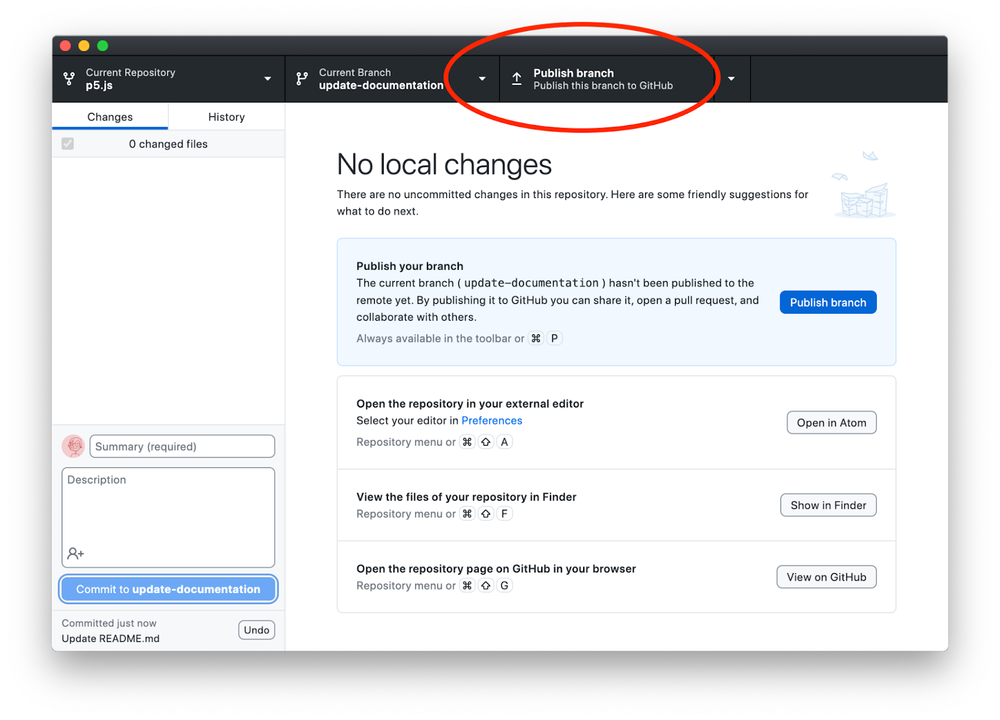


एक बार आपका कोड अपलोड हो जाने पर, यह एक बटन दिखाएगा जो आपको पुल रिक्वेस्ट बनाने के लिए प्रेरित करेगा। बटन पर एक बार क्लिक करने से वास्तव में रिक्वेस्ट बनाने के लिए दूसरे बटन के साथ पूर्वावलोकन दिखाई देगा। प्रक्रिया शुरू करने के लिए "क्रिएट पुल रिक्वेस्ट" बटन दबाएँ।


टर्मिनल से, निम्नलिखित कमांड चलाएँ:

```
git push -u origin [branch_name]
```

एक बार पुश पूरा हो जाने पर, आप टर्मिनल में एक लिंक देख सकते हैं जो आपको पुल रिक्वेस्ट खोलने की सुविधा देता है, यदि नहीं तो आप अपने वेब ब्राउज़र में अपने फोर्क पर नेविगेट कर सकते हैं, शीर्ष पर ड्रॉपडाउन बटन के साथ उस ब्रांच पर स्विच करें जिस पर आप काम कर रहे हैं फ़ाइल सूची में, "Contribute" पर क्लिक करें और फिर "Open pull request." पर क्लिक करें।

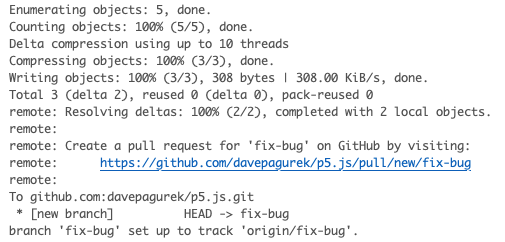

जब आप p5.js Github रेपो पर जाते हैं तो आपको पुल रिक्वेस्ट खोलने के लिए एक बटन भी दिखाई दे सकता है। इसे क्लिक करने से एक नया पुल रिक्वेस्ट खोलने का भी काम किया जा सकता है।


### पुल रिक्वेस्ट के बारे में जानकारी

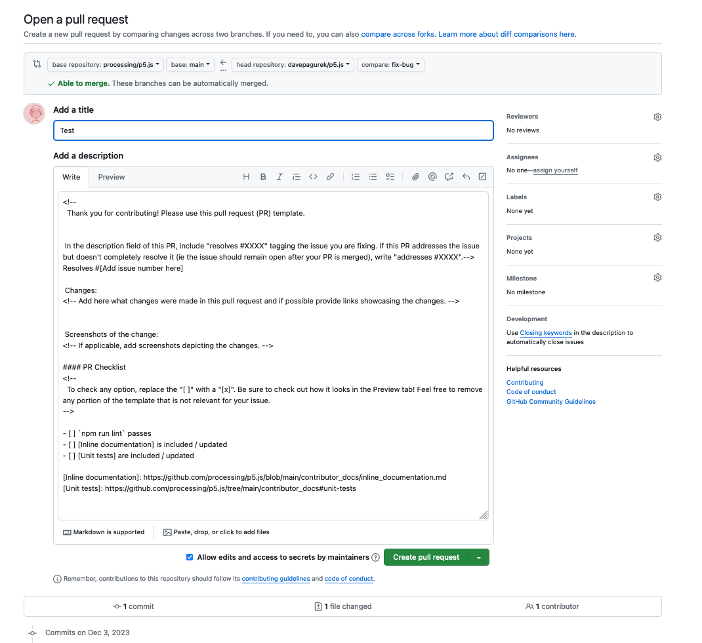

पुल रिक्वेस्ट दाखिल करने से पहले, आपको पुल रिक्वेस्ट टेम्पलेट भरना होगा।


### शीर्षक

पुल रिक्वेस्ट शीर्षक में संक्षेप में वर्णन होना चाहिए कि परिवर्तन क्या हैं, फिर से यहां सामान्य बयानों से बचें।


### हल

टेम्प्लेट में, यह पंक्ति है `Resolves #[यहां समस्या संख्या जोड़ें]`, जिसे आपको `[यहां समस्या संख्या जोड़ें]` को उस समस्या की समस्या संख्या से बदलना चाहिए जिसे आप संबोधित/ठीक कर रहे हैं [above](https://github.com/processing/p5.js/blob/main/contributor_docs/contributor_guidelines.md#all-about-issues) (e.g., `Resolves #1234`). इससे यह सुनिश्चित हो जाएगा कि इस पीआर के विलय के बाद मुद्दा स्वचालित रूप से बंद हो जाएगा। यदि आप इस पीआर के विलय के बाद समस्या को स्वचालित रूप से बंद नहीं करना चाहते हैं (शायद इसलिए कि एक अलग पीआर में अधिक परिवर्तन आ रहे हैं), तो `Resolves` को `Addresses` में बदलें।


### परिवर्तन

आपको इस पीआर में आपके द्वारा किए गए परिवर्तनों का स्पष्ट रूप से वर्णन करना चाहिए। यहां आपके द्वारा किए गए किसी भी कार्यान्वयन विवरण और निर्णयों को शामिल करें जो इसकी समीक्षा करने वाले के लिए प्रासंगिक हों।


### परिवर्तन के स्क्रीनशॉट

परिस्थितियों के आधार पर यह वैकल्पिक है और p5.js कैनवास पर दृश्य कैसे प्रस्तुत करता है, उससे संबंधित परिवर्तन करते समय इसे शामिल किया जाना चाहिए। ध्यान दें कि यह टेक्स्ट एडिटर का स्क्रीनशॉट नहीं है बल्कि आपके परिवर्तनों के बाद एक उदाहरण स्केच के व्यवहार का स्क्रीनशॉट है।


### पीआर चेकलिस्ट

इसमें कुछ प्रासंगिक चेकलिस्ट आइटम शामिल हैं जिन्हें आपको अपने परिवर्तनों के लिए प्रासंगिक होने पर `[ ]` को `[x]` से प्रतिस्थापित करके टिक करना चाहिए।

एक बार हो जाने पर, "Create pull request." पर क्लिक करें।


### विवादों को पुनः स्थापित करें और हल करें 


अब आपको खुले हुए पुल रिक्वेस्ट का निरीक्षण करना चाहिए और कुछ बातों पर ध्यान देना चाहिए:

1. कमिट की संख्या आपके द्वारा किए गए कमिट की संख्या से मेल खाना चाहिए, जिसका अर्थ है कि यदि आपने इस पीआर पर काम करते समय दो बार कमिट किया है, तो इसे "Commits" टैब में केवल दो कमिट दिखाना चाहिए।
2. "Files changed" टैब को आपके द्वारा p5.js रेपो की तुलना में किए गए परिवर्तनों को दिखाना चाहिए और इससे अधिक कुछ नहीं।
3. नीचे के पास, यह लिखा होना चाहिए, "This branch has no conflicts with the base branch," न कि "This branch has conflicts that must be resolved."

यदि उपरोक्त में से कोई भी सत्य नहीं है (आपकी अपेक्षा से अधिक कमिट हैं या विवाद हैं), तो आपको इसकी आवश्यकता हो सकती है[rebase](https://git-scm.com/book/en/v2/Git-Branching-Rebasing) या विवादों को सुलझाने में मदद करें। यहां विवाद का मतलब है कि आपने उस फ़ाइल में परिवर्तन किए हैं जिसमें हाल ही में परिवर्तन लागू किए गए थे, और गिट निश्चित नहीं है कि परिवर्तनों का कौन सा सेट रखा जाए या छोड़ दिया जाए। यदि आप इन मुद्दों को हल करने में आश्वस्त नहीं हैं, तो हमें बताएं और हम इस प्रक्रिया में आपका मार्गदर्शन करेंगे। बुनियादी निर्देश नीचे दिया गया है.

कभी-कभी, Github आपको विवादों को हल करें बटन दिखाकर सीधे ब्राउज़र में विवादों को हल करने देता है: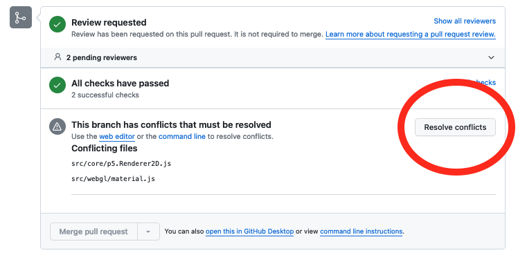

विवादों को `<<<<<<<` और `>>>>>>>` के बीच दिखाया जाता है, जिसे `=======` से अलग किया जाता है। एक अनुभाग आपका कोड दिखाता है, और दूसरा अनुभाग दिखाता है कि मुख्य ब्रांच में क्या परिवर्तन हुआ है।

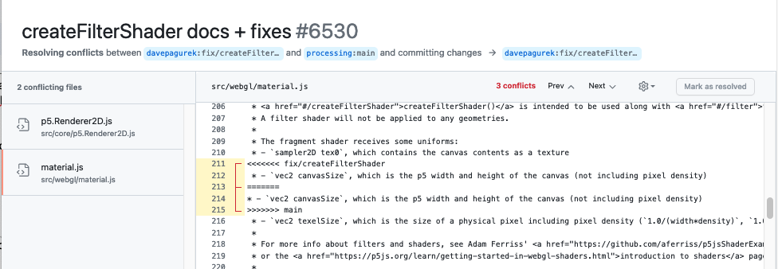

विवाद चिह्न हटाएं और केवल अंतिम कोड रखें जो आप अपने पीआर में चाहते हैं। जब सभी विवादों का समाधान हो जाए तो आप "Mark as resolved" पर क्लिक कर सकते हैं।

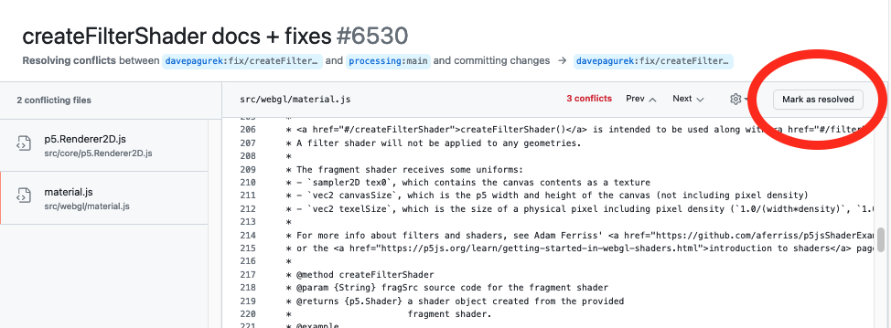

जब विवादों वाली सभी फ़ाइलों का समाधान हो जाए, तो आप अपने परिवर्तन कर सकते हैं।

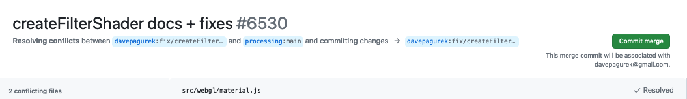

कभी-कभी, Github को वेब पर दिखाने के लिए विवाद बहुत जटिल होते हैं। इस मामले में, या यदि आप केवल मैन्युअल विधि पसंद करते हैं, तो आप अपने विवादों को स्थानीय स्तर पर हल कर सकते हैं:

1. Run `git remote add upstream https://github.com/processing/p5.js`
2. Run `git fetch upstream`
3. Run `git rebase upstream/main`
4. आपके कंप्यूटर पर कुछ विवाद हो सकते हैं! यदि यह सिर्फ lib/p5.js और lib/p5.min.js है, तो इसे ठीक करना आसान है; बस प्रोजेक्ट फिर से बनाएं। यदि आपकी अन्य फ़ाइलों में विवाद है और आप निश्चित नहीं हैं कि उन्हें कैसे हल किया जाए, तो सहायता माँगें!

```
npm test
git add -u
git rebase --continue
```

5. Run `git push`

इन चरणों के बाद उपरोक्त चेकलिस्ट साफ़ हो सकती है, लेकिन यदि नहीं, तो हम आपको किसी भी आवश्यक सुधार के माध्यम से मार्गदर्शन करेंगे।


## चर्चा करें और संशोधन करें

अब जब आपका पीआर खुल गया है, तो एक प्रबंधक या अनुरक्षक आपके पीआर की समीक्षा करेगा। किसी प्रबंधक को आपके पीआर का जवाब देने में कई दिन लग सकते हैं, इसलिए धैर्य रखें। इस बीच कुछ अन्य खुले मुद्दों की जांच करने के लिए समय का उपयोग क्यों न करें?

एक बार जब कोई प्रबंधक आपके पीआर की समीक्षा कर लेता है, तो दो चीजों में से एक हो सकती है: 1. आपका पीआर स्वीकृत और विलय हो गया है, 2. प्रबंधक पीआर के संबंध में कुछ प्रश्न पूछ सकता है या पीआर में कुछ बदलावों का अनुरोध कर सकता है। यदि यह बाद वाला है, तो घबराएं नहीं; यह बिल्कुल सामान्य है, और आपका योगदान पूरा करने में मदद के लिए प्रबंधक हमेशा यहाँ मौजूद हैं!

यदि आपके पीआर में परिवर्तन का अनुरोध किया गया है और आप वे परिवर्तन करने में सक्षम हैं, तो इस का पालन करें [same process as before](https://github.com/processing/p5.js/blob/main/contributor_docs/contributor_guidelines.md#git-workflow) लेकिन केवल रेपो और संबंधित ब्रांच की अपनी स्थानीय प्रतिलिपि से जारी रखें, उन परिवर्तनों को करें, उन्हें गिट में कमिट करें, और उन्हें अपने फोर्क किए गए रिमोट रेपो पर धकेलें। एक बार जब आप अपने फोर्कड रिमोट रेपो में अतिरिक्त कमिट्स डाल देते हैं, तो आप देखेंगे कि नए कमिट्स स्वचालित रूप से पीआर में दिखाई देंगे। समीक्षक को यह बताने के लिए पीआर में एक टिप्पणी छोड़ें कि आपने अनुरोधित परिवर्तन कर दिए हैं, और यदि कोई अतिरिक्त परिवर्तन की आवश्यकता नहीं है, तो आपका पीआर विलय कर दिया जाएगा!

[**⬆ back to top**](#contributor-guidelines)
