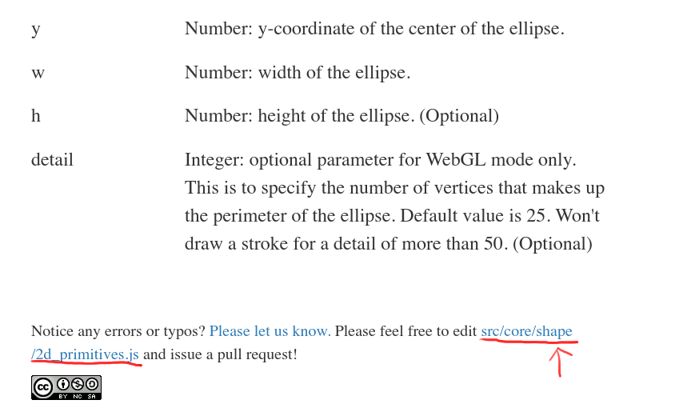

<!-- GitHub 上の p5.js への貢献に関する重要な情報。 -->

# コントリビューターガイド

p5.jsコントリビューターガイドへようこそ！このドキュメントは、p5.jsにコードを貢献したい新しいコントリビューター、一部の技術的な手順を見直したいコントリビューター、そしてp5.jsにコードを貢献することに関連するその他のすべての事柄に適しています。

p5.jsのコードベース以外で貢献をしたい場合（例えばチュートリアルの執筆、教育コースの計画、イベントの組織など）は、他の関連ページをご覧ください。管理者やメンテナーは[管理者ガイド](./steward_guidelines.md)から、問題の審査やプルリクエストに関する内容を参照できます。

このドキュメントは内容が多岐にわたり広範囲に及びますが、すべてのステップと要点をできるだけ明確に示すよう努めています。目次を使用して特定のセクションを検索することができます。ドキュメントの一部のセクションが関連性がない場合は、その部分をスキップすることができます。


**新しいコントリビューターの場合は、第1章「Issuesについて」から読み始めることをお勧めします。開発プロセスについて詳細なガイドを見たい場合は、「開発者クイックスタートガイド」セクションに進んでください。**

# 目次

- [コントリビューターガイド](#コントリビューターガイド)
- [目次](#目次)
- [Issuesについて](#Issuesについて)
   * [「Issues」とは何か？](#「Issues」とは何か)
   * [Issueテンプレート](#Issueテンプレート)
      + [バグ発見](#バグ発見)
      + [既存機能の強化](#既存機能の強化)
      + [新機能開発のリクエスト](#新機能開発のリクエスト)
      + [議論の開始](#議論の開始)
- [p5.jsコードベースの修正](#p5jsコードベースの修正)
   * [必要条件](#必要条件)
   * [紹介](#紹介)
   * [開発者クイックスタートガイド](#開発者クイックスタートガイド)
   * [GitHubの編集機能を使用する](#GitHubの編集機能を使用する)
   * [p5.jsをフォークし、あなたのフォークで作業する](#p5jsをフォークし、あなたのフォークで作業する)
      + [GitHubデスクトップ版の使用](#GitHubデスクトップ版の使用)
      + [gitコマンドラインインターフェースの使用](#gitコマンドラインインターフェースの使用)
   * [コードベースの分解](#コードベースの分解)
   * [構築設定](#構築設定)
   * [Gitワークフロー](#Gitワークフロー)
      + [ソースコード](#ソースコード)
      + [ユニットテスト](#ユニットテスト)
      + [インラインドキュメント](#インラインドキュメント)
      + [アクセシビリティ](#アクセシビリティ)
   * [コード規範](#コード規範)
   * [設計原則](#設計原則)
- [プルリクエスト](#プルリクエスト)
   * [プルリクエストの作成](#プルリクエストの作成)
      + [プルリクエスト情報](#プルリクエスト情報)
      + [タイトル](#タイトル)
      + [解決](#解決)
      + [変更](#変更)
      + [変更のスクリーンショット](#変更のスクリーンショット)
      + [PRチェックリスト](#PRチェックリスト)
      + [リベースとコンフリクトの解決](#リベースとコンフリクトの解決)
   * [議論と修正](#議論と修正)

---

# 問題について

p5.j​​s GitHub リポジトリ上のアクティビティのほとんどは、問題セクションで発生します。おそらく、ここから投稿プロセスが開始されます。

### 「Issues」とは何ですか？


「Issues」はGitHub上で問題を記述する投稿の一般的な名称です。このIssueは、バグレポート、新機能のリクエスト、ディスカッション、またはp5.jsリポジトリの開発に関連するその他の投稿が含まれます。任意のGitHubアカウント、さらにはロボットでも、各問題にコメントを追加することができます！ここがコントリビューターたちがプロジェクトの開発に関連するトピックについて話し合う場所です。

問題を提起する理由は様々ですが、通常、p5.jsのソースコード開発に関連するトピックについてのみ問題を使用します。個人のコードのデバッグ、プロジェクトへのコラボレーターの招待、または上記のトピックと関連しないその他の内容は、[フォーラム](https://discourse.processing.com)や[Discord](https://discord.gg/SHQ8dH25r9)などの他のプラットフォームで議論するべきです。

私たちは、Issueテンプレートを作成して、あなたがGitHubで問題を抱えているのか、他の場所で問題を投稿すべきかを判断するのを手助けします！

## Issueテンプレート

p5.jsのIssueテンプレートは、管理者やメンテナーが問題をよりよく理解し、審査するのを助けるだけでなく、問題を効率的に提出し、返答を受けるのを容易にします。


新しいIssueを提出するには、p5.jsリポジトリの「Issues」タブに移動し、右側の「New issue」ボタンをクリックします。クリックすると、いくつかの異なるオプションが表示され、それぞれが関連するIssueテンプレートに対応しています。あなたのニーズに最も近いオプションを選択することで、あなたの問題が迅速に注目されることを保証します。


### [バグ発見](https://github.com/processing/p5.js/issues/new?assignees=%5C&labels=Bug%5C&projects=%5C&template=found-a-bug.yml)

p5.jsを使用していて潜在的なエラーや、ドキュメントの記述と異なる現象に遭遇した場合は、[このテンプレート](https://github.com/processing/p5.js/issues/new?assignees=%5C&labels=Bug%5C&projects=%5C&template=found-a-bug.yml)を使用してください。ただし、コードのデバッグを行い、問題が自分のコードにあると思われる場合は、最初に[フォーラム](https://discourse.processing.org)で質問する必要があります。

このテンプレートには以下のフィールドが含まれています：

1. _p5.jsのどのサブエリアが最も関連していますか？_ - この質問に答えることで自動的に[ラベル](https://github.com/processing/p5.js/blob/main/contributor_docs/issue_labels.md)が適用され、私たちはあなたの問題に対してより良く対応することができます。
2. _p5.jsのバージョン_ - `<script>`タグのリンクやp5.js/p5.min.jsファイルの最初の行でp5.jsのバージョン番号を見つけることができます。これは「1.4.2」のような形式（3つの数字がドットで区切られている）であります。
3. _Webブラウザとそのバージョン_ - この情報は、コードが異なるブラウザでどのように動作するかを区別するのに役立ちます。ブラウザのバージョン番号は、以下の表に従って異なるブラウザの手順で見つけることができます。

<table>

<tr>

<td>

Chrome

</td>

<td>

Firefox

</td>

<td>

Safari

</td>

</tr>

<tr>

<td>

アドレスバーに「chrome://version」と入力します

</td>

<td>

アドレスバーに「about:support」と入力します

</td>

<td>

上部の「Safari」メニューを開き、「Safariについて」を選択します。

</td>

</tr>

</table>

4. _オペレーティングシステム_ - 可能であれば、オペレーティングシステムのバージョン番号を提供してください。例: `macOS 12.5`。一部のエラーはオペレーティングシステムに由来する場合があります。
5. _エラーの再現手順_ - これは最も重要な情報かもしれません。遭遇したエラーを再現する手順を詳細にリストしてください。問題が発生する簡単なサンプルコードを提示することで、他の人がエラーを再現し、解決策を見つけやすくなります。

**エラーの再現は非常に重要です** このテンプレートの多くのフィールドは、Bug を再現可能にすることを目的としています。スケッチ環境に関する情報を多く提供し、問題を再現する手順を詳細にするほど、他の人があなたの問題を理解し、解決策を探求するのが容易になります。

**できるだけ詳細な情報を提供し、一般的な表現は避けてください**。例えば、「image() 関数が使えない」と言うのではなく、具体的に「image() 関数が読み込んだ GIF 画像を正しいサイズで表示できない」と述べてください。以下の二つの側面を説明することで、問題の説明がより明確になります：

1. 共有されたサンプルコードがどのような動作をすることを期待しているか（期待される動作）；
2. サンプルコードが実際に行ったこと（実際の動作）。

もし報告したエラーの修正コードに貢献したい場合は、その旨を説明できます。記述したエラーを修正するための簡単な提案があれば、問題のレビュアーにとって非常に有用です。彼らはどれだけのサポートが必要かを知る必要があります。

**適切な問題がない場合や問題が承認される前にプルリクエスト（またはコード変更）を提出するべきではありません**。提案が受け入れられるとは限らず、行った作業がマージされない可能性があるためです。

Bug 報告は、少なくとも一名の[領域管理者またはメンテナー](https://github.com/processing/p5.js#stewards)によって承認される場合のみ、修正が受け入れられます。その後、プルリクエストの作業が開始されます。

### [既存機能の強化](https://github.com/processing/p5.js/issues/new?assignees=%5C&labels=Enhancement%5C&projects=%5C&template=existing-feature-enhancement.yml)

p5.js の既存機能（関数、定数、レンダリングなど）を変更したり、新しい仕様を追加したい場合は、このテンプレートを使用してください。例えば、`color()`関数や他の色を受け取る関数に新しい色の定義方法を追加したい場合などです。

このテンプレートには、次のフィールドを記入する必要があります：

1. _アクセシビリティの

向上_ - これは必須項目です。提案された機能強化がクリエイティブおよび技術分野で長期間マイノリティとされてきた人々にとって、p5.js を[よりアクセシブル](./access.md)にする方法について説明してください。通常、**この項目が記入されていない場合、提案は拒否されます**。しかし、「わからない」と記入し、コミュニティの他のメンバーに協力を求めて、提案された機能強化が p5.js のアクセシビリティをどのように向上させるかを議論してもらうこともできます。
2. _p5.js のどのサブエリアが最も適切か？_ - これにより、あなたの問題に対応しやすくなります。あなたの回答はまた、関連する[タグ](./issue_labels.md)を使って問題を自動的にマークするトリガーとなります。
3. _機能強化の詳細_ - ここで機能強化の提案について説明します。良い機能強化提案には通常、明確な使用例が含まれます：この機能強化が何であるか、いつ使用されるか、どのように使用されるか、なぜこの機能強化が必要か。

機能強化提案が受け入れられるためには、少なくとも一名の[領域管理者またはメンテナー](https://github.com/processing/p5.js#stewards)の承認が必要です。その後、プルリクエストの処理が開始されます。

**問題に対応するプルリクエストが存在しない場合や、問題がまだ承認されていない場合は、プルリクエスト（またはコードの変更）を提出すべきではありません**。提案が受け入れられない可能性があり、承認される前に提出されたプルリクエストはすべて閉じられます。

### [新機能開発の要求](https://github.com/processing/p5.js/issues/new?assignees=%5C&labels=Feature+Request%5C&projects=%5C&template=feature-request.yml)

このテンプレートは、p5.js に新機能を追加する提案をするために使用します。例えば、ネイティブの HTML `<table>` 要素を描画する新しい `createTable` 関数の作成などです。一部の提案は既存の機能強化提案と重複する場合があり、その場合はどちらのテンプレートが適切か選択してください。

また、このテンプレートのフォームフィールドは「既存機能の強化」セクションのフィールドとほぼ同じです。各フィールドの詳細については、[前のセクション](#existing-feature-enchancement)を参照してください。

新機能の開発要求は、少なくとも二名の[領域管理者またはメンテナー](https://github.com/processing/p5.js#stewards)によって承認される場合のみ承認されます。その後、プルリクエストの作業が開始されます。

**プルリクエストに対応する問題が存在しない場合や、問題がまだ承認

されていない場合は、プルリクエスト（またはコードの変更）を提出すべきではありません**。提案が受け入れられない可能性があり、承認される前に提出されたプルリクエストはすべて閉じられます。

### [討論の開始](https://github.com/processing/p5.js/issues/new?assignees=%5C&labels=Discussion%5C&projects=%5C&template=discussion.yml)

このテンプレートは、上記の他のすべてのテンプレートに適用されない問題を提出するために使用します。実際には、このようなケースは比較的少ないはずです。例えば、p5.js で特定の Web API 機能を採用するかどうかは、[新機能開発の要求](#new-feature-request)として提出するべきです；さまざまな色関数に追加の色モードを追加する場合は、[既存機能の強化](#existing-feature-enchancement)として提出するべきです；地元のクリエイティブプログラミングイベントの発表を行う場合は、フォーラムで投稿し、Processing Foundation からのサポートや宣伝を求めるべきです。

討論を開始する際には、サイドバーの「Labels（ラベル）」オプションを使用して、関連するラベルを追加し、問題を関連分野に導くことができます。このテンプレート自体には基本的なテキストフィールドのみが含まれています。[このリンク](https://github.com/processing/p5.js/issues/6517)から討論問題の例を参照できます。

[**⬆ トップに戻る**](#貢献者ガイド)

---

# p5.js コードベースの変更

## 必須条件

進める前に、コマンドライン、git、node.js（最低でもバージョン18以上）の基本的な使用方法を理解し、ローカル開発環境を設定していることが必要です。

## 紹介

問題が議論され、解決策が承認され、コード変更を行う意志がある場合に、コードベースの変更に取り掛かることができます。

同様に、問題に遭遇し、その問題について議論し、管理者が解決策を承認したが、問題の元の作者や他のコミュニティメンバーが対応を希望しない場合、自発的に貢献申請を提出し、管理者に問題を自分に割り当ててもらうことができます。

**“割り込み”でプルリクエストを提出すべきではありません**。他の人がすでに貢献を意図しているか、すでに誰かに割り当てられている問題に対しては、私たちは常に「先着順」の原則に従ってコード貢献の申請を受け入れます。

問題に対するプルリクエストを提出したものの、他にも同じ問題に取り組んでいる人がいた場合、あなたのプルリクエストは閉じられます。もし、何ヶ月も進展がないと割り当てられた人の問題を発見した場合は、その問題について礼儀正しく進捗状況を尋ね、必要に応じて助けを申し出ることができます。私たちは、多くの人がボランティアで作業していること、または一部の人にとって機能を書くのに時間がかかることを理解しており、皆にかなりの時間を与えています。

同様に、自分のペースで作業し、私たちが問題の対応に厳しい時間制限を設けていないことを信じてください。それにもかかわらず、コード貢献のいずれかの面で困難に直面した場合は、遠慮なく問題内で助けを求めてください。管理者、メンテナンススタッフ、その他のコミュニティメンバーが指導を提供するために最善を尽くします！

## 開発者クイックスタートガイド

p5.js のコードベースに参加し、直接 p5.js を改善するか、[Friendly Error Systems](https://github.com/processing/p5.js/blob/main/contributor_docs/friendly_error_system.md) のようなサブプロジェクトを改善するために貢献したい場合は、以下の手順に従ってください：

1. [p5.js の fork を作成する](https://docs.github.com/en/get-started/quickstart/fork-a-repo)
2. [作成した fork を自分のコンピュータにクローンする](https://docs.github.com/en/repositories/creating-and-managing-repositories/cloning-a-repository)
3. [以下のコマンドを使用して upstream を追加する](https://docs.github.com/en/pull-requests/collaborating-with-pull-requests/working-with-f

orks/configuring-a-remote-repository-for-a-fork)

    ```
   git remote add upstream https://github.com/processing/p5.js
   ```

4. [NodeJs](https://nodejs.org/en/download) がコンピューターにインストールされていることを確認してください。 これは次のコマンドで確認できます。

   ```
   node -v
   ```

5. 次のコマンドを使用して依存関係をインストールします:

   ```
   npm ci
   ```

6. 次のコマンドを使用して、わかりやすいブランチ名を付けて`main`ブランチから git ブランチを作成します:

   ```
   git checkout -b [branch_name]
   ```

7. コード ベースに変更を加え始めたら、頻繁にテストする必要があります (テストには時間がかかりますが、既存の動作が壊れていないことが保証されます)。
   
   ```
   npm test
   ```

8. 新しい機能を追加する場合、または既存の機能を拡張する場合は、単体テストを追加します。
9. 完了したら、変更をコミットし、プル リクエスト (https://p5js.org/contributor-docs/#/./contributor_guidelines?id=pull-requests) を作成できます。

## GitHub の編集機能の使用

GitHub のウェブインターフェースでファイルを閲覧するとき、ファイル内容の上部近くに鉛筆アイコンのボタンがあります。このボタンをクリックすると、GitHub の便利な編集機能が起動し、以下に紹介する多くのプロセスを簡素化することができます。現在閲覧しているファイルを素早く編集するためにこれを使用することができます。


ただし、非常に単純な変更を行う場合を除き、この機能の使用は推奨されません。ソースコードに複雑な変更を加える必要がある場合は、ローカルでビルドとテストを行った後にプルリクエストを提出すべきです。ほとんどの人にとって、この編集機能が提供する基本的な編集環境よりも、ローカル開発環境を使用する方がスムーズです。

## Fork p5.js および Fork での作業

最初のステップは、p5.js リポジトリを Fork することです。オープンソースプロジェクトでは、Fork には特定の意味がありますが、ここではリポジトリのコピーを作成し、それを自分の GitHub アカウントに保存することを意味します。リポジトリを Fork するには、ページ上部近くの「Fork」ボタンをクリックするだけです。GitHub はあなたのアカウント内にリポジトリのコピーを作成します。


公式の p5.js リポジトリに直接書き込む権限がない可能性があるため、Fork から作業を行うことが必要です。Fork 上で作業を行うことにより、変更を加えてそれを公式リポジトリに送信することができます。

### GitHub デスクトップの使用

GitHub デスクトップは、グラフィカルユーザーインターフェースを通じて git を使用するプログラムであり、ターミナルでコマンドを入力する必要はありません。git 初心者の場合、GitHub デスクトップは良い選択肢です。また、GitHub デスクトップとターミナルの間を自由に切り替えることができます。

まず、[GitHub デスクトップ](https://desktop.github.com/)をダウンロードしてインストールします。インストールが成功すると、アプリケーションを開くことができます。プロンプトに従って GitHub アカウントにログインします。ログインに成功すると、あなたのプロジェクトが表示されます。これには、あなたが Fork した p5.js も含まれています。`あなたのユーザ名/p5.js`という名前のプロジェクトを選択し、青色の「Clone」ボタンをクリックします。プロジェクトの保存場所を選択するプロンプトに従います。保存場所を変更することも、デフォルトのオプションを維持して続行することもできます。


クローンが成功した後、その Fork を使用する目的を選択する必要があります。「親プロジェクトに貢献する」と選び、「Continue」をクリックします。


### git コマンドラインインターフェースの使用

Fork を作成した後、Fork ページに行って緑色の「Code」ボタンをクリックして git リンクをコピーします。リンクの形式は次のようになります：`https://github.com/limzykenneth/p5.js.git`。


その後、ローカル環境でコマンドラインを開き、このリポジトリをクローンします。簡単に言うと、「クローン」とはリポジトリのコピーをローカルコンピュータにダウンロードすることです。p5.js のソースコードファイルを保存したいフォルダ内で以下のコマンドを実行します：

```
git clone [git_url]
```

`[git_url]` を前の手順でコピーした git リンクに置き換えます。 インターネットの速度によっては数分かかる場合がありますので、コーヒーを淹れても大丈夫です。 クローン作成が完了したら、好みのテキスト エディターで `p5.js`という名前のフォルダーを開いて表示を開始します。

## コードベースの解析

p5.js フォルダー内には、いくつかの重要なファイルやフォルダーがあります。具体的には以下の通りです：

- `src` - `p5.js` および `p5.min.js` ファイルを最終的に生成するすべてのコードが格納されています。
- [`test`](../unit_testing.md) - 単体テストのコードとすべてのドキュメントサンプルコードをテストするための場所。
- `tasks` - 詳細なカスタムビルドコードが置かれている場所。
- `Gruntfile.js` - 主要なビルド設定ファイル。
- `contributor_docs` - ドキュメントやその他の貢献者向けドキュメントが置かれている場所。

その他のファイルやフォルダーは、設定ファイルやその他のサポートファイルであり、ほとんどの場合、これらに対する変更は必要ありません。

## ビルド設定

p5.js をビルドしてテストを実行するためには、まずローカルプロジェクトフォルダを作成する必要があります。`Node.js` がすでにインストールされていると仮定して、以下のコードを実行してください：

```
npm ci
```

npm が必要な依存関係をすべてダウンロードするため、これには時間がかかる場合があります。 ただし、ダウンロードが完了すると、準備は完了です。 とてもシンプルですよね？

## Git ワークフロー

必要に応じて変更を加えられるようになりました。 リポジトリの他の部分の詳細と、それに応じてそれらを変更する方法については、次のサブセクションを参照してください。 開始するには、次を実行します。

```
npm test
```

p5.j​​s を最初から構築し、すべての単体テストを実行してもエラーは発生しません。 テストを実行せずにリポジトリを構築するだけの場合は、次を実行できます。

```
npm run build
```

以上のいずれかのコマンドを実行すると、`lib/` フォルダ内に `p5.js` および `p5.min.js` ファイルが生成されます。必要に応じて、これらのビルド済みファイルを使用してテストを行うことができます。

次に、作業を開始する前に `main` メインブランチから新しいブランチを作成することをお勧めします。git では、ブランチはリポジトリの分岐版であり、ブランチ上でコミットを追加することでメインブランチや他のブランチに影響を与えることなく作業を進めることができます。ブランチを使用すると、複数の機能を同時に（異なるブランチを使用して）処理し、メインブランチに影響を与えることなく失敗から回復することが可能です。

GitHub デスクトップを使用する場合、ウィンドウ上部の「Current Branch」ボタンをクリックしてブランチを作成できます。ここでブランチを切り替えることも、新しいブランチ名を入力して新しいブランチを作成することもできます。変更を行う内容を記述したブランチ名を入力し、「Create New Branch」をクリックします。


ターミナルを使用する場合、メインブランチで `git checkout -b branch_name` を実行し、`branch_name` を記述的な内容に置き換えると、新しいブランチに移動します。

変更を行う際には、特にソースコードを変更する場合は、定期的に `npm test` を実行することをお勧めします。このコマンドを実行すると時間がかかることがありますが、現在の動作を破壊しないことを保証できます。以下の説明に従って変更をコミットする前に、最初に `npm test` を実行してください。

コードベースに変更を加えたら、git にそれをコミットする必要があります。コミットは git リポジトリに保存される一連の変更であり、基本的にはコミット時にリポジトリ内のファイルがどのような状態にあったかを記録します。

どれくらいの頻度で git にコミットすべきかという疑問があるかもしれません。通常、多くの変更を一度にコミットするのではなく、一つの説明可能なサブタスクが完了するたびにコミットすることをお勧めします。

GitHub デスクトップからすべての変更をコミットするには、変更が完了した後にアプリケーションを開きます。左サイドバーには変更されたファイルが表示され、右側には各ファイルの変更内容が表示されます。ウィンドウの左下角、ユーザーアイコンの隣のエリアには、変更のタイトルを記入します。これが今回のコミットのタイトルになります。下の説明エリアでさらに詳細を述べたり、空白のままにしたりすることができます。青色の「Commit」ボタンをクリックして変更を完了します。


ターミナルからすべての変更をコミットする場合、以下のコマンドを実行してください：

1. 次のコマンドを実行し、変更されたファイルのみがリストされていることを確認します。

```
git status
```

変更していないファイルがリストされている場合は、それらを元の状態に[復元](https://git-scm.com/docs/git-restore)するか、変更が意図したとおりであることを確認する必要があります。 各ファイルへの変更の詳細を確認するには、次のコマンドを実行します。

```
git diff
```

不要なファイル変更は PR で送信しないでください。

2. 次のコマンドを実行して、すべての変更を git ステージング領域に追加します。

```
git add .
```

3. 次のコマンドを実行して、すべての変更を git にコミットします。

```
git commit -m "[your_commit_message]"
```

`[your_commit_message]` をこの変更を説明するメッセージに置き換え、広範なステートメントの使用を避けてください。 例: 「ドキュメント修正 1」の代わりに、「circle() 関数のドキュメント例を追加」を使用します。

```
git commit -m "Add documentation example to circle() function"
```

すべてのコミットは上記の手順を繰り返し、定期的に `npm test` を実行してすべてが正常に動作していることを確認してください。

### ソースコード

ソースコードを扱う場合、どの p5.js の機能に取り組むかが明確であれば、ドキュメントを見ることが良いスタートです。p5.js のドキュメントでは、記載されている各機能の下部にそのソースコードへのリンクがあります。



### 単体テスト

単体テストを行う場合は、[こちら](./unit_testing.md)を参照してください。機能強化、新機能の追加、バグ修正には、PRに関連する単体テストを追加する必要があります。

### インラインドキュメント

インラインドキュメントを扱う場合は、[こちら](./inline_documentation.md)を参照してください。

### アクセシビリティ

アクセシビリティ機能を扱う場合は、[こちら](./web_accessibility.md)を参照してください。フレンドリーエラーシステムについては、[こちら](./friendly_error_system.md)を参照してください。

## コーディングスタンダード

p5.js のコーディングスタンダードは [ESLint](https://eslint.org/) によって実施されます。受け入れられるためのすべての git コミットとプルリクエストは、ESLint のコードチェックを通過する必要があります。正しいコーディングスタンダードに従う最も簡単な方法は、ESLint プラグインを使用することであり、これはほとんどの一般的なテキストエディタでエラーをハイライト表示することができます。

## デザイン原則

p5.jsの機能を開発する際には、p5.jsのデザイン原則を念頭に置くことが重要です。私たちの優先順位は他のプロジェクトと異なる場合がありますので、他のプロジェクトから来た場合は、まずp5.jsのデザイン原則に慣れることをお勧めします。

- **アクセシビリティ**：私たちはアクセシビリティを最優先に考え、意思決定の際には、歴史的にマージナライズされてきた集団のアクセシビリティをどのように向上させるかを考慮します。アクセシビリティ報告書で詳細を確認できます。

- **初心者に優しい**：p5.jsのAPIは初心者に適しており、最先端のHTML5/Canvas/DOM APIを使用して、インタラクティブな視覚コンテンツの作成を容易にします。

- **教育的**：p5.jsは、教育目的のAPIと教育プログラムをサポートに特化しており、APIの完全なリファレンスとサポート例、コアのクリエイティブプログラミング原則を紹介するチュートリアルとサンプルコースが整理されています。

- **JavaScriptとそのコミュニティ**：初心者がWeb開発の実践に容易にアクセスできるように、適切なJavaScriptのデザインパターンと使用をモデリングし、必要に応じてそれらを抽象化します。オープンソースライブラリとして、p5.jsはさらに広範なJavaScriptコミュニティをその創作、ドキュメント、普及に取り入れています。

- **Processingとそのコミュニティ**：p5.jsはProcessing言語とそのコミュニティに触発されており、Processing JavaからJavaScriptへの変換をシンプルでクリアにすることに専念しています。

[**⬆ トップに戻る**](#貢献者ガイド)

# プルリクエスト

すべての変更、包括的なユニットテストを含む、を完了し、`npm test`を実行してエラーがないことを確認し、変更をコミットした後、p5.jsの公式リポジトリに新しいコミットをマージするためのプルリクエストを準備することができます。プルリクエストとは、あるリポジトリ（この場合はp5.jsの公式リポジトリ）に対して、別のリポジトリ（この場合はフォークしたp5.jsリポジトリ）から変更を取り込むかマージするように要求するものです。

## プルリクエストの作成

まず、新しいコミットをあなたのフォークしたp5.jsにプッシュします。これはあなたのフォークに変更をアップロードすることを意味します。

GitHubデスクトップを使用している場合、ウィンドウ上部の分岐切り替えボタンの右側にあるボタンをクリックして変更をGitHubにプッシュします。


コードがアップロードされると、プルリクエストを作成するためのボタンが表示されます。このボタンをクリックするとプレビューが表示され、その中に別のボタンがあり、実際にリクエストを作成することができます。「Create Pull Request」ボタンをクリックしてプルリクエストを作成します。


ターミナルを使用している場合、以下のコマンドを実行してください：

```
git push -u origin [支店名]
```

## プルリクエストの作成後

プッシュ完了後、ターミナルに表示されるリンクをクリックしてプルリクエストを作成できます。リンクが表示されない場合は、ブラウザであなたのフォークに移動し、作業中のブランチに切り替えた後、「Contribute」をクリックし、「Open pull request」を選択します。


p5.js の Github リポジトリにアクセスしたときにも、新しいプルリクエストを作成するボタンが表示されることがあります。そのボタンをクリックしても新しいプルリクエストを作成できます。


### プルリクエスト情報


プルリクエストを送信する前に、プルリクエストテンプレートを記入する必要があります。

### タイトル

プルリクエストのタイトルは、変更内容を簡潔に説明するもので、一般的な表現を避けるべきです。

### 解決

テンプレートには次のような行が含まれます：`解決 #[ここに issue 番号を追加]`。`[ここに issue 番号を追加]`をあなたが取り組んでいる/修正している issue の番号に置き換えてください（例：`解決 #1234`）。これにより、PR がマージされた後にその issue が自動的に閉じられるようになります。もし PR がマージされた後にその issue を自動的に閉じたくない場合（他の PR でさらに変更が行われる予定がある場合など）、`解決`を`対応`に変更してください。

### 変更内容

PR に行った変更を明確に記述し、レビュアーにとって重要な実装の詳細や意思決定についても説明してください。

### 変更のスクリーンショット

変更が p5.js のキャンバス上で視覚的な内容を表示するものである場合は、スクリーンショットが必要です。テキストエディタのスクリーンショットではなく、変更後のページのプレビューのスクリーンショットが必要です。

### PR チェックリスト

チェックリストにはいくつかの関連項目が含まれています。`[ ]`を`[x]`に置き換えて、変更に関連する項目にチェックを入れてください。

チェックが完了したら、「Create pull request」をクリックします。

### リベースとコンフリクト

の解決


提出されたプルリクエストを確認し、次の点に注意してください：

1. 「Commits」タブに表示されるコミットの数が、この PR で行ったコミットの数と一致すること。
2. 「Files changed」タブに表示されるのは、p5.js リポジトリとの差分のみです。
3. ページの下部近くに「This branch has no conflicts with the base branch」と表示されるべきであり、「This branch has conflicts that must be resolved」とは表示されていないこと。

上記のいずれかが正しくない場合（予想より多くのコミットがあるか、コンフリクトが存在する場合）、[リベース](https://git-scm.com/book/en/v2/Git-Branching-Rebasing)を行うか、コンフリクトを解決する必要があります。ここでの「コンフリクト」とは、あなたが変更したファイルが最近更新されたため、gitがどの変更を保持するかを判断できない状況を指します。解決方法がわからない場合は、支援を求めてください。基本的な手順は以下の通りです：

時々、GitHub は「Resolve Conflicts」ボタンを表示し、ブラウザで直接コンフリクトを解決できるようにします。


コンフリクトは `<<<<<<<` と `>>>>>>>` の間に表示され、`=======` で区切られます。前半部はあなたのコード、後半部はメインブランチにすでにある変更されたコードです。


コンフリクトマーカーを削除し、PRに残す最終的なコードを保持します。すべてのコンフリクトが解決された後、「Mark as resolved」をクリックします。


すべてのファイルのコンフリクトが解決された後、変更をコミットします。


時には、コンフリクトが GitHub で表示するには複雑すぎる場合や、手動で操作を好む場合は、ローカルでコンフリクトを解決することも

できます：

1. `git remote add upstream https://github.com/processing/p5.js` を実行します。
2. `git fetch upstream` を実行します。
3. `git rebase upstream/main` を実行します。
4. コンフリクトが発生するかもしれません！`lib/p5.js` と `lib/p5.min.js` に関連するものであれば、プロジェクトを再構築するだけで解決できます。他のファイルでコンフリクトが発生し、解決方法がわからない場合は、助けを求めてください！
```
npm test
git add -u
git rebase --continue
```

## ディスカッションと修正

PRを提出した後、管理者やメンテナンス担当者がレビューを行います。返信を得るまで数日かかることがありますので、気長に待つことが大切です。その間、解決されていない他のissuesを見てみると良いでしょう。

管理者があなたのPRをレビューした後、2つの結果が考えられます：1. あなたのPRが承認されてマージされる、素晴らしい！ 2. 管理者があなたのPRに対していくつかの問題を指摘したり、いくつかの修正を要求する場合があります。後者の場合でも慌てないでください。これは全く普通のことであり、管理者は常にあなたが貢献を完了するのを手助けする意志があります！

もしPRにさらなる変更が必要で、それを行うことができる場合は、以前の[同じプロセス](#git-ワークフロー)に従ってください。しかし、必ずローカルリポジトリのコピーの関連ブランチで修正を行い、コミットし、そのコミットをフォークしたリモートリポジトリにプッシュしてください。コミットが成功すると、新しいコミットは自動的にあなたのPRに表示されます。その後、PRにコメントを残して、要求された変更を行ったことをレビュアーに知らせてください。追加の変更が必要ない場合、あなたのPRはマージされます！

[**⬆ トップに戻る**](#貢献者ガイド)
