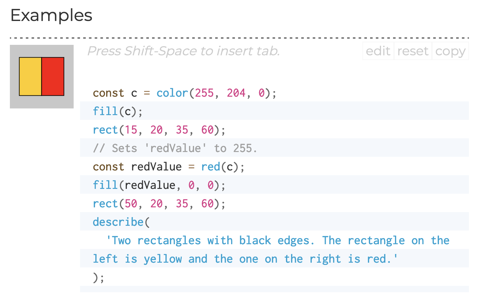

# p5.js 레퍼런스에 기여하기

p5.js에서는 소스 코드에 특별한 형태의 주석을 함께 작성하는 방법을 통해 공식 웹사이트 [레퍼런스](https://p5js.org/reference/) 페이지에서 확인할 수 있는 코드 레퍼런스를 생성합니다. 레퍼런스 주석(reference comments)에는 설명, 함수의 시그니처(매개변수와 반환 값), 그리고 사용 예제가 포함됩니다. 다시 말해, p5.js 함수 및 변수의 레퍼런스 페이지에서 보여지는 모든 내용은 소스코드와 함께 작성된 레퍼런스 주석을 통해 만들어집니다.

이 문서에서 우리는 웹사이트에서 레퍼런스가 올바르게 렌더링될 수 있도록 레퍼런스 주석을 작성하고 형식을 지정하는 법을 알아보겠습니다. p5.js 함수 및 변수의 레퍼런스를 수정하거나 작성할 때 반드시 다음 가이드를 준수해 주시기 바랍니다.

## 레퍼런스 주석(reference comments) 작동 방식에 대한 간단한 소개

p5.js 소스 코드를 보면 많은 라인이 레퍼런스 주석으로 작성되어 있는 것을 확인할 수 있습니다. 일반적으로 다음과 같은 모습입니다.

```
/**
 * Calculates the sine of an angle. `sin()` is useful for many geometric tasks
 * in creative coding. The values returned oscillate between -1 and 1 as the
 * input angle increases. `sin()` takes into account the current
 * <a href="#/p5/angleMode">angleMode</a>.
 *
 * @method sin
 * @param  {Number} angle the angle.
 * @return {Number} sine of the angle.
 *
 * @example
 * <div>
 * <code>
 * function draw() {
 *   background(200);
 *
 *   let t = frameCount;
 *   let x = 50;
 *   let y = 30 * sin(t * 0.05) + 50;
 *   line(x, 50, x, y);
 *   circle(x, y, 20);
 *
 *   describe('A white ball on a string oscillates up and down.');
 * }
 * </code>
 * </div>
 *
 * <div>
 * <code>
 * function draw() {
 *   let x = frameCount;
 *   let y = 30 * sin(x * 0.1) + 50;
 *   point(x, y);
 *
 *   describe('A series of black dots form a wave pattern.');
 * }
 * </code>
 * </div>
 *
 * <div>
 * <code>
 * function draw() {
 *   let t = frameCount;
 *   let x = 30 * cos(t * 0.1) + 50;
 *   let y = 10 * sin(t * 0.2) + 50;
 *   point(x, y);
 *
 *   describe('A series of black dots form an infinity symbol.');
 * }
 * </code>
 * </div>
 */
```

레퍼런스 주석 뒤에는 일반적으로 함수를 정의하는 실제 자바스크립트 코드가 뒤따릅니다. 레퍼런스 주석은 항상 `/**`로 시작하고 `*/`로 끝나며, 시작과 끝 사이의 각 라인은 `*`로 시작합니다.

이러한 방식으로 작성된 블록 안에 있는 모든 내용은 레퍼런스 문서로 해석될 것입니다. 만약 여러분이 [JSDoc](https://jsdoc.app/)을 접해본 적이 있다면, 이런 스타일의 코드 주석이 익숙하게 느껴질 수 있습니다. p5.js는 JSDoc을 사용하는 것은 아니지만, JSDoc과 매우 유사한 문법을 가진 [YUIDoc](https://yui.github.io/yuidoc/)을 사용하고 있습니다. 이 스타일의 레퍼런스 주석에서는 각 주석 블록이 더 작은 개별 요소로 나뉘어 집니다. 이제부터 그 요소들을 더 자세히 알아보겠습니다.

## 레퍼런스 주석 블록

앞서 보았던 `sin()` 함수의 레퍼런스 주석 블록을 조금 더 자세히 살펴보고, 각 섹션이 어떤 역할을 하는지 알아봅시다. 주석으로 작성한 내용이 실제 [`sin()`](https://p5js.org/reference/#/p5/sin) 레퍼런스 페이지에서는 어떻게 보여지는지 비교해보세요.

```
/**
 * Calculates the sine of an angle. `sin()` is useful for many geometric tasks
 * in creative coding. The values returned oscillate between -1 and 1 as the
 * input angle increases. `sin()` takes into account the current
 * <a href="#/p5/angleMode">angleMode</a>.
```

주석의 맨 위에는 함수의 설명이 텍스트로 작성되어 있습니다. 이 설명에는 마크다운 구문과 HTML이 모두 포함될 수 있어요. 설명은 간결하게 작성되어야 하며, 필요하다면 함수의 특이사항이나 작동 방식에 관한 세부 내용을 추가하여 함수가 어떤 일을 하는지 최대한 잘 설명해야 합니다.

```
 * @method sin
 * @param  {Number} angle  the angle.
 * @return {Number} sine of the angle.
```

함수에 대한 주석은 일반적으로 위 세 개의 섹션을 포함하는데, 각각 `@` 기호 뒤에 다음 중 하나의 키워드가 따라옵니다.

- `@method`는 함수의 이름을 정의할 때 사용합니다. 이 예시에서 함수의 이름은 `sin`입니다.(함수 이름에는 괄호 `()`가 포함되지 않는다는 점을 주의하세요)
- `@param`은 함수가 받는 매개변수나 인자(argument)를 정의할 때 사용합니다.
  - `@param` 키워드 다음에 중괄호 `{}`가 감싸고 있는 부분은 매개변수의 타입을 의미합니다.
  - 타입 다음에 나오는 단어는(이 예시의 angle) 매개변수의 이름을 의미합니다.
  - 이름 다음에 나오는 나머지 부분은 매개변수를 설명하는 부분입니다.
- `@return`은 함수의 반환 값을 정의할 때 사용합니다.
  - `@return` 키워드 다음에 중괄호 `{}`가 감싸고 있는 부분은 반환 값의 타입을 의미합니다.
  - 타입 다음에 나오는 나머지 부분은 반환 값을 설명하는 부분입니다.

일반적으로 매개변수는 다음 형식을 따라야 합니다.

```
@param {type} name Description here.
```

매개변수가 선택 사항(optional parameter)인 경우에는 이름을 대괄호로 감싸주세요.

```
@param {type} [name] Description here.
```

### 더 알아보기: 상수(constants)

만약 매개변수가 취하는 값이 [`constants.js`](https://github.com/processing/p5.js/blob/main/src/core/constants.js)에 정의된 값들 중 하나라면, 타입은 `{Constant}`로 지정되어야 하며, `either` 키워드와 함께 유효한 값들을 나열해야 합니다. 예를 들면, 다음과 같습니다.

```
@param {Constant} horizAlign horizontal alignment, either LEFT, CENTER, or RIGHT
```

반환 값은 아래 형식을 따라야 합니다.

```
@return {type} Description of the data returned.
```

만약 반환 값이 없는 함수라면, `@return` 태그를 생략해도 됩니다.

### 더 알아보기: 체이닝(chaining)

만약 함수가 부모 객체를 반환하는 경우라면, `@return` 태그를 생략하고 대신 다음 줄을 추가할 수 있습니다.

```
@chainable
```

## 추가 시그니처

만약 함수가 여러 개의 매개변수 옵션을 가지고 있다면, 각각을 개별적으로 명시할 수 있습니다. 예를 들어, [`background()`](http://p5js.org/reference/#p5/background) 함수는 다양한 매개변수 옵션을 지원하고 있습니다(background() 레퍼런스 페이지에서 "문법" 섹션을 확인해 보세요). 먼저 여러 옵션 중 하나를 선택하여, 앞서 살펴본 형식에 따라 첫 번째 시그니처에 관한 주석을 작성합니다. 첫 번째 주석 블록이 끝나면, 뒤이어 다른 시그니처를 추가 작성할 수 있습니다. 각각의 추가 시그니처는 ’@method’와 ‘@param’ 태그만 사용하여 작성할 수 있으며, 각자의 블록 범위 내에 작성되어야 합니다. 아래 예시를 참고해 주세요.

```
/**
 * @method background
 * @param {String} colorstring color string, possible formats include: integer
 *                         rgb() or rgba(), percentage rgb() or rgba(),
 *                         3-digit hex, 6-digit hex
 * @param {Number} [a] alpha value
 */

/**
 * @method background
 * @param {Number} gray specifies a value between white and black
 * @param {Number} [a]
 */
```

### 더 알아보기: 다중 시그니처

만약 두 시그니처 간의 유일한 차이점이 선택적 매개변수의 추가뿐이라면, 별도의 시그니처를 만들 필요는 없습니다. 가능한 이 기능의 사용을 제한해주세요. 레퍼런스를 필요 이상으로 복잡하게 만들 수 있기 때문입니다.

## p5.js 변수 레퍼런스

지금까지 우리는 함수와 상수에 대한 레퍼런스를 작성하는 방법에 대해 알아보았습니다. 변수 레퍼런스도 비슷한 구조를 따르지만 사용되는 태그가 다릅니다.

```
/**
 * The system variable mouseX always contains the current horizontal
 * position of the mouse, relative to (0, 0) of the canvas. The value at
 * the top-left corner is (0, 0) for 2-D and (-width/2, -height/2) for WebGL.
 * If touch is used instead of mouse input, mouseX will hold the x value
 * of the most recent touch point.
 *
 * @property {Number} mouseX
 * @readOnly
 *
 * @example
 * <div>
 * <code>
 * // Move the mouse across the canvas
 * function draw() {
 *   background(244, 248, 252);
 *   line(mouseX, 0, mouseX, 100);
 *   describe('horizontal black line moves left and right with mouse x-position');
 * }
 * </code>
 * </div>
 */
```

블록의 시작 부분에는 변수의 설명이 작성되어 있습니다(이 예시에서는 `mouseX`). 변수의 이름을 정의하기 위해, `@method` 대신 `@property`를 사용합니다. `@property`는 `@params`와 같은 방식으로 타입과 이름을 정의할 수 있습니다. `@readonly` 태그는 대부분의 p5.js 변수에 설정되어 있으며, 사용자에 의해 값이 덮어씌워지지 않아야 함을 내부적으로 나타내기 위해 사용됩니다.

## 예제 추가하기

`sin()`과 `mouseX` 각각의 주석에서 모두 찾아볼 수 있지만, 아직 다루지 않은 태그가 하나 있습니다. 바로 `@example` 태그입니다. 이 태그는 레퍼런스 페이지를 방문할 때 실행될 예제 코드를 작성하는 곳입니다.



위의 예제를 만들어내는 `@example` 태그는 다음과 같습니다.

```
 * @example
 * <div>
 * <code>
 * const c = color(255, 204, 0);
 * fill(c);
 * rect(15, 20, 35, 60);
 * // Sets 'redValue' to 255.
 * const redValue = red(c);
 * fill(redValue, 0, 0);
 * rect(50, 20, 35, 60);
 * describe(
 *   'Two rectangles with black edges. The rectangle on the left is yellow and the one on the right is red.'
 * );
 * </code>
 * </div>
```

`@example` 태그 다음에는 HTML `<div>` 태그가 시작되고, 그 다음에 `<code>` 태그가 뒤따라옵니다. 그리고 열린 `<code>` 태그와 닫힌 `</code>` 태그 사이에, 예제 코드를 작성하면 됩니다. 좋은 예제 코드를 작성하기 위한 기본 원칙은 가능한 단순하고 작게 작성하는 겁니다. 예제는 의미가 있어야 하고, 기능이 어떻게 작동하는지 너무 복잡하지 않게 설명할 수 있어야 합니다. 예제의 캔버스는 100x100 픽셀의 크기를 가져야 합니다. 만약 위의 예제와 같이 `setup()` 함수가 작성되지 않은 경우라면, 100x100 픽셀 크기의 회색 배경 캔버스를 만드는 `setup()` 함수가 자동으로 래핑(wrapping)됩니다. 예제 코드에 대한 모범 사례 및 코드 스타일에 대한 자세한 내용은 여기서 다루지 않습니다. 대신 레퍼런스 스타일 가이드를 참고해 주세요.

하나의 기능에 대해서 여러 개의 예제를 작성할 수 있습니다. 첫 번째 예제 코드 블록이 닫힌 후에 한 줄을 구분해서 비워두고, `<div>` 및 `<code>` 블록을 추가하여 작성하면 됩니다.

```
* @example
* <div>
* <code>
* arc(50, 50, 80, 80, 0, PI + QUARTER_PI, OPEN);
* describe('An ellipse created using an arc with its top right open.');
* </code>
* </div>
*
* <div>
* <code>
* arc(50, 50, 80, 80, 0, PI, OPEN);
* describe('The bottom half of an ellipse created using arc.');
* </code>
* </div>
```

만약, 레퍼런스 페이지에서 예제 코드가 실행되길 원하지 않는다면(단지 코드를 보여주고 싶을 뿐이라면), `<div>`에 "`norender`" 클래스를 추가해주세요.

```
* @example
* <div class="norender">
* <code>
* arc(50, 50, 80, 80, 0, PI + QUARTER_PI, OPEN);
* describe('ellipse created using arc with its top right open');
* </code>
* </div>
```

만약, 예제 코드가 자동화된 테스트 과정에서 실행되길 원하지 않는다면(예를 들어, 사용자 상호작용이 필요한 경우), `<div>`에 "`notest`" 클래스를 추가해주세요.

```
* @example
* <div class='norender notest'><code>
* function setup() {
*   let c = createCanvas(100, 100);
*   saveCanvas(c, 'myCanvas', 'jpg');
* }
* </code></div>
```

만약, 예제 코드가 외부 애셋 파일을 사용해야 한다면, 필요한 파일들을 [/docs/yuidoc-p5-theme/assets](https://github.com/processing/p5.js/tree/main/docs/yuidoc-p5-theme/assets) 폴더에 넣어두세요(이미 해당 폴더에 존재하는 파일을 재사용해도 됩니다). 그리고 코드에서 "assets/filename.ext" 경로로 파일을 불러와 사용하면 됩니다. [tint()](http://p5js.org/reference/#/p5/tint) 레퍼런스를 참고하세요.

### `describe()`로 캔버스 설명 추가하기

마지막으로, 여러분이 추가한 모든 예제에 대해, 스크린 리더가 읽어낼 수 있도록 캔버스 설명을 추가해야 합니다. p5.js 함수 `describe()`를 사용해서요. 매개 변수는 딱 하나입니다. 캔버스에서 어떤 일이 벌어지고 있는지 간략하게 설명하는 문자열 하나면 됩니다.

```
* @example
* <div>
* <code>
* let xoff = 0.0;
* function draw() {
*   background(204);
*   xoff = xoff + 0.01;
*   let n = noise(xoff) * width;
*   line(n, 0, n, height);
*   describe('A vertical line moves randomly from left to right.');
* }
* </code>
* </div>
*
* <div>
* <code>
* let noiseScale = 0.02;
* function draw() {
*   background(0);
*   for (let x = 0; x < width; x += 1) {
*     let noiseVal = noise((mouseX + x) * noiseScale, mouseY * noiseScale);
*     stroke(noiseVal*255);
*     line(x, mouseY + noiseVal * 80, x, height);
*   }
*   describe('A horizontal wave pattern moves in the opposite direction of the mouse.');
* }
* </code>
* </div>
```

`describe()`에 관한 더 자세한 설명은 [web accessibility contributor documentation](https://p5js.org/contributor-docs/#/web_accessibility?id=user-generated-accessible-canvas-descriptions)를 참고하세요.

지금까지의 설명으로 p5.js 레퍼런스 주석을 작성하고 편집하는 작업에 필요한 준비를 모두 마쳤습니다. 그러나, p5.js에는 아직 JSDoc 스타일의 레퍼런스 주석을 더 전문적으로 활용하는 방법이 몇 가지 더 남아있습니다. 이 방법들은 상황에 따라 유용할 수 있지만, 자주 필요한 것은 아닙니다.

### `@private` 태그

만약 속성이나 변수가 비공개(private) 함수이거나 비공개 변수라면 `@private` 태그를 쓸 수 있습니다. 어떤 기능에 `@private` 태그가 있다면, 그 기능은 웹사이트의 레퍼런스로 렌더링되지 않습니다. `@private` 태그를 사용하여 레퍼런스 주석 블록을 비공개(private)로 만드는 이유는 라이브러리 자체에 대한 내부 기능을 문서화하기 위해서입니다. 아래에 작성된 `_start`의 레퍼런스 주석이 바로 그런 사례입니다.

```
/**
 * _start calls preload() setup() and draw()
 *
 * @method _start
 * @private
 */
p5.prototype._start = function () {
```

### `@module` 태그 및 관련 태그들

각 소스 코드 파일 최상단에는 `@module` 태그가 있습니다. 모듈은 p5.js에서 다루는 기능들을 그룹화한 것으로, 공식 웹사이트의 레퍼런스 페이지에서 각각의 섹션으로 나뉘어 보여집니다. 각 모듈 내부에는 `@submodule` 태그로 정의된 추가적인 하위 모듈이 있습니다.

`@for` 태그는 이 모듈과 `p5` 전체 클래스 사이의 관계를 정의하여, 이 모듈이 `p5` 클래스의 일부라는 것을 효과적으로 나타냅니다.

`@requires` 태그는 현재 모듈이 의존하고 있어, 반드시 임포트되는(imported) 필수 모듈들을 정의합니다.

```
/**
 * @module Color
 * @submodule Creating & Reading
 * @for p5
 * @requires core
 * @requires constants
 */
```

p5.js에서 따르는 규칙은 `src/` 폴더 내의 각 서브폴더가 하나의 `@module`이 되며, 서브폴더 내의 각 파일이 `@module`에 속한 `@submodule`이 된다는 것입니다. p5.js 소스 코드에 새로운 서브폴더나 파일을 추가하지 않는 한, 이 레퍼런스 주석 블록을 편집할 필요가 없습니다.

### `@class` 태그

클래스 생성자는 `@class` 태그와 `@constructor` 태그로 정의됩니다. 이 블록의 형식은 `@method` 블록으로 함수를 정의하는 방식과 유사하며, 클래스의 이름은 `@class` 태그로 정의되어야 하고, `@constructor` 태그는 클래스에 생성자 함수가 있음을 나타냅니다. `p5.Color` 클래스에 대한 아래 예시를 참고하세요.

```
/**
 * A class to describe a color. Each `p5.Color` object stores the color mode
 * and level maxes that were active during its construction. These values are
 * used to interpret the arguments passed to the object's constructor. They
 * also determine output formatting such as when
 * <a href="#/p5/saturation">saturation()</a> is called.
 *
 * Color is stored internally as an array of ideal RGBA values in floating
 * point form, normalized from 0 to 1. These values are used to calculate the
 * closest screen colors, which are RGBA levels from 0 to 255. Screen colors
 * are sent to the renderer.
 *
 * When different color representations are calculated, the results are cached
 * for performance. These values are normalized, floating-point numbers.
 *
 * <a href="#/p5/color">color()</a> is the recommended way to create an instance
 * of this class.
 *
 * @class p5.Color
 * @constructor
 * @param {p5} [pInst]                  pointer to p5 instance.
 *
 * @param {Number[]|String} vals        an array containing the color values
 *                                      for red, green, blue and alpha channel
 *                                      or CSS color.
 */
```

## 레퍼런스 생성과 미리보기

p5.js 리포지토리는 p5.js 웹사이트를 빌드하고 실행하지 않아도 레퍼런스를 생성하고 미리 볼 수 있도록 설정되어 있습니다.

- 소스 코드의 레퍼런스 주석으로부터 레퍼런스를 생성하기 위한 명령어는 다음과 같습니다.

```
npm run docs
```

이 과정을 통해 필요한 미리보기 파일들과 주요 `docs/reference/data.json` 파일이 생성됩니다. 이 파일은 웹 사이트에서 레퍼런스 페이지를 렌더링하는데 사용되는 것과 동일한 (경량화 후의) 파일입니다.

- 레퍼런스 작업을 연속적으로 수행하기 위해 다음 명령어를 실행할 수 있습니다.

```
npm run docs:dev
```

이 명령어는 변경사항이 생길때마다 레퍼런스 렌더링을 업데이트하는 실시간 미리보기(live preview) 기능을 시작합니다(변경 후에는 페이지를 새로고침해야 변경 사항이 나타납니다). 이는 특히 브라우저에서 실행 중인 예제 코드를 미리 보는데 유용합니다.

- 주요 템플릿 파일들은 `docs/` 폴더에 저장되어 있으며, 대부분의 경우 이 폴더 내의 파일들을 직접 변경해서는 안됩니다. 단, `docs/yuidoc-p5-theme/assets` 폴더에 새로운 애셋 파일을 추가하는 경우에는 예외입니다.

## 다음 단계로

레퍼런스 시스템에 대한 추가 세부 사항을 알고 싶다면 [JSDoc](https://jsdoc.app/) 및 [YUIDoc](https://yui.github.io/yuidoc/) 문서를 확인해 보세요.

레퍼런스와 관련된 주요 이슈(issues)를 살펴보고 싶다면, [#6519](https://github.com/processing/p5.js/issues/6519)와 [#6045](https://github.com/processing/p5.js/issues/6045)를 확인해 보세요. [기여자 가이드라인](https://docs.google.com/document/d/1roBu-7s9xspuie3M6EhEokYWc82DZhDNYO2SQiY4k68/edit?tab=t.0#heading=h.627q50vo09fb) 문서도 시작하기에 좋은 자료입니다.
