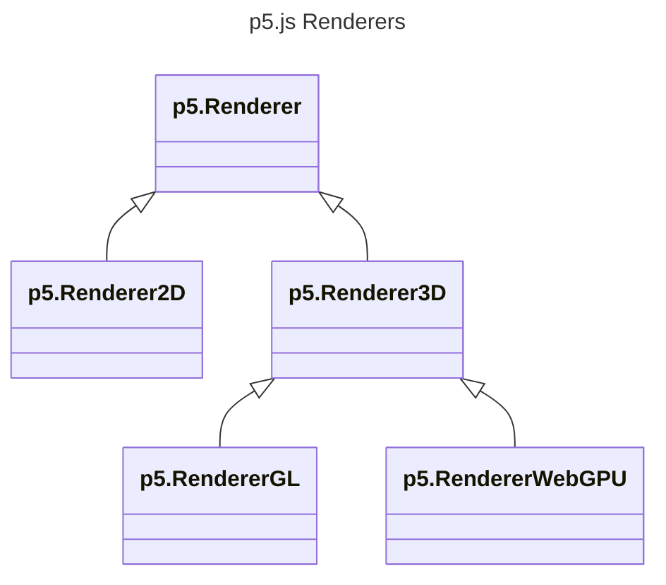

<!-- 실험적인 WebGPU 모드의 목표와 지향점. -->

p5.js에는 최근 실험적인 WebGPU 모드가 추가되었습니다. 이 모드는 WebGL 모드처럼 3D를 지원하는 렌더러이며, WebGL 모드에서 사용할 수 있는 모든 함수를 지원합니다. 다만 내부적으로는 다른 기반 기술로 구현되어, p5.js가 발전하는 브라우저 기술 흐름에 맞춰 나아갈 수 있도록 합니다.

아직 초기 단계이므로, 많은 분들이 직접 사용해 보시면서 피드백을 남기고, 개발에도 함께해 주시면 좋겠습니다!

## WebGPU 모드 사용하기

WebGPU 모드는 현재 실험 단계이기 때문에 p5.js의 기본 빌드에는 포함되어 있지 않습니다. 대신 별도 파일로 제공되며, 다른 애드온과 마찬가지로 기본 p5.js `script` 태그 뒤에 추가해 사용할 수 있습니다.

```html
<html>
  <head>
    <!-- 라이브러리들 -->
    <script type="text/javascript" src="p5.js" />
    <script type="text/javascript" src="p5.webgpu.js" />

    <!-- 여러분의 코드 -->
    <script type="text/javascript" src="sketch.js" />
  </head>
  <body>
  </body>
</html>
```

WebGPU에서는 이전보다 더 많은 작업이 비동기로 처리됩니다. WebGPU 캔버스를 만드는 작업도 `async`이므로, 이제 `await`을 사용해야 합니다.

```js
async function setup() {
  await createCanvas(400, 400, WEBGPU);
}
```

픽셀을 읽어 오는 작업도 모두 `async`입니다. 따라서 `loadPixels()`와 `get()`도 이제 `await`해야 합니다. 애니메이션의 매 프레임마다 이런 작업이 필요하다면, 픽셀 수준의 드로잉에는 셰이더를, 이미지 복사에는 프레임버퍼 사용을 고려해 보세요.

## 기여하기

더 많은 분들이 WebGPU 모드 개발에 함께해 주시기를 바랍니다! 다음과 같은 방식으로 도움을 주실 수 있습니다.

- 직접 테스트해 보세요! 사용 중 발견한 버그가 있다면 GitHub 이슈로 알려주세요.
- 새로운 렌더링 시스템의 최적화를 도와주세요. 여기서도 첫 단계는 직접 사용해 보는 것입니다. 보다 안정적인 WebGL 모드와 비교했을 때 어떤 부분이 더 빠르고 어떤 부분이 더 느린지 확인해 주세요. 그런 정보를 바탕으로 렌더링 시스템을 어떻게 개선할지 결정하고, 코드베이스에 반영할 수 있습니다.
- 새로운 아이디어를 함께 나눠 주세요! WebGPU 사양에는 p5에 도입할 수 있는 새로운 기능들이 있습니다. 대표적인 예가 컴퓨트 셰이더입니다. 예를 들어 GPU에서 파티클 시스템을 만들 때 어떤 식으로 코드를 작성하고 싶은지 디스코드에서 이야기해 주세요. 그러면 그에 맞는 API를 어떻게 설계할지 함께 살펴볼 수 있습니다.

## 목표

지금까지 p5.js의 렌더러는 크게 2D, 3D 지원 렌더러로 나눌 수 있었습니다. 처음에는 각각 하나씩 있었고, 그것이 기본 2D 모드와 WebGL 모드였습니다. WebGPU 모드의 첫 번째 목표는 WebGL 모드와 동등한 기능을 갖추는 것입니다. 다시 말해, WebGL 모드가 할 수 있는 일은 WebGPU 모드에서도 할 수 있도록 하는 것이 목표입니다. 하지만 이는 어디까지나 출발점일 뿐입니다. **우리는 WebGPU 모드를 기술 발전에 맞춰 예술가들에게 새로운 도구를 제공하는 수단이자, 앞으로 10년 동안 p5.js가 브라우저 기술의 변화에 뒤처지지 않도록 하는 기반으로 보고 있습니다.**

WebGPU 모드의 목표는 더 효율적인 렌더러가 되는 것이 아닙니다. 이 점은 WebGL 모드와 비슷합니다. WebGL 모드가 자동으로 2D 모드보다 더 빠른 것은 아니며, 특정 작업에 더 적합한 다른 도구들을 제공합니다. WebGL과 WebGPU 모드는 GPU를 활용한 드로잉과 3D 드로잉을 위한 도구를 제공합니다.

### 새로운 계산 도구

기반이 되는 WebGPU 기술은 아직 비교적 새롭지만, 오래된 WebGL보다 더 많은 기능을 지원하는 방향으로 발전할 가능성이 큽니다. p5.js의 WebGPU 모드는 이러한 새로운 계산 기능을 예술가와 프로그래머가 쉽게 활용할 수 있는 형태로 제공하는 공간이 될 것입니다. 컴퓨트 셰이더는 그 첫 번째 예시가 될 가능성이 큽니다. WebGL과 WebGPU는 모두 셰이더를 지원하며, 현재 셰이더는 도형의 정점을 배치하고 삼각형 내부 픽셀의 색을 GPU에서 병렬로 계산하는 데 사용됩니다. 여기에 더해 WebGPU 사양에는 [컴퓨트 셰이더](https://webgpufundamentals.org/webgpu/lessons/webgpu-compute-shaders.html)가 있으며, 이는 렌더링과 직접 연결되지 않은 임의의 데이터를 병렬로 처리하는 데 사용할 수 있습니다.

WebGPU 모드는 WebGPU가 제공하는 모든 기능을 프로그래머에게 그대로 드러내는 방향을 목표로 하지는 않습니다. 대신 **창의적 가능성의 확장**과 **배우기 쉬움** 사이의 균형을 맞추면서, 무엇을 어떤 방식으로 제공할지 전략적으로 선택해야 합니다. 예를 들어 p5.js의 컴퓨트 셰이더 API는 저수준 WebGPU 컴퓨트 셰이더가 할 수 있는 모든 일을 그대로 지원할 필요는 없습니다. 일반적인 작업에 충분히 유용하고, 학습 곡선이 너무 가파르지 않다면 그것으로 충분합니다.

### 미래를 준비하기

이 글을 쓰는 시점(2025년 12월) 기준으로, WebGPU는 아직 모든 주요 브라우저와 플랫폼에서 기본으로 활성화되어 있지는 않습니다. 하지만 모든 주요 브라우저가 WebGPU 지원을 적극적으로 개발하고 있습니다. WebGPU 개발과 기능 추가에는 많은 관심과 노력이 쏟아지고 있는 반면, 브라우저의 WebGL API는 사라지지는 않더라도 대체로 레거시 단계에 접어든 것으로 보이며 새로운 기능도 거의 추가되지 않고 있습니다. p5.js는 웹에서 프로그래밍을 활용한 예술을 만들기 위한 접근성 높은 도구를 지향합니다. 그리고 앞으로 웹의 새로운 도구들은 WebGL보다 WebGPU를 중심으로 등장할 가능성이 크기 때문에, 시간이 지날수록 p5의 WebGPU 모드는 더 중요해질 것입니다.

다만 현재로서는 WebGL이 안정적이고 신뢰할 수 있으며 널리 사용되고 있습니다. 그런 이유로 p5.js의 WebGPU 모드는 당분간 사용자가 직접 활성화해야 하는 실험적 기능으로 유지될 예정입니다.

## 설계 결정

### 클래스 구조

WebGPU 모드가 추가되면서 p5에 내장된 렌더러는 다음과 같은 구조를 갖게 되었습니다.



`p5.Geometry`, `p5.Framebuffer`, `p5.Texture`, `p5.Camera`, `p5.Shader`처럼 모든 3D 렌더러가 공유하는 엔티티는, 내부에 WebGL과 WebGPU를 모두 처리하는 코드를 넣는 대신 각 3D 렌더러의 메서드를 호출합니다. 이 메서드들은 `Renderer3D` 베이스 클래스에는 구현되어 있지 않고, `RendererGL`과 `RendererWebGPU`에서 플랫폼별 로직으로 구현됩니다. 앞으로 새로운 플랫폼별 로직은 엔티티가 아니라 렌더러 클래스에 추가해야 합니다.

### 렌더링

WebGL 모드는 모든 그리기(draw) 명령을 즉시 제출하지만, WebGPU 모드는 가능한 마지막 순간까지 제출을 미뤄 그리기 명령을 묶어서 처리합니다. 바로 그리는 대신 명령을 배열에 쌓아 두고 `_hasPendingDraws`를 `true`로 설정합니다. 그리고 각 프레임의 끝에서 호출되는 `finishDraw`에서 이 명령들을 하나의 렌더 패스(pass)로 묶어 GPU에 최종 제출합니다. 다만 경우에 따라서는 다른 렌더 패스에서 더 일찍 제출되기도 합니다. 예를 들어 프레임버퍼에 그리는 것처럼 그리기 대상이 바뀌면, 대기 중인 그리기도 렌더 패스로 제출됩니다. 이렇게 해야 다음 렌더 패스에서 프레임버퍼를 안전하게 읽을 수 있습니다. 또한 `loadPixels`처럼 GPU에서 데이터를 다시 읽어 오는 함수를 호출할 때도 렌더 패스를 제출합니다.

그리기가 일괄 처리되기 때문에 셰이더 유니폼 값을 GPU로 보내는 데 사용하는 버퍼는 공유될 수 없습니다. 버퍼를 공유하면 이전 그리기가 GPU에 도달하기도 전에 다음 그리기가 같은 버퍼를 다시 써 버릴 수 있기 때문입니다. 그래서 셰이더 유니폼과 정점 정보를 저장할 때는 미리 준비해 둔 버퍼 풀에서 필요한 버퍼를 가져와 사용합니다.
