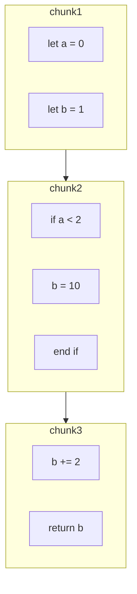
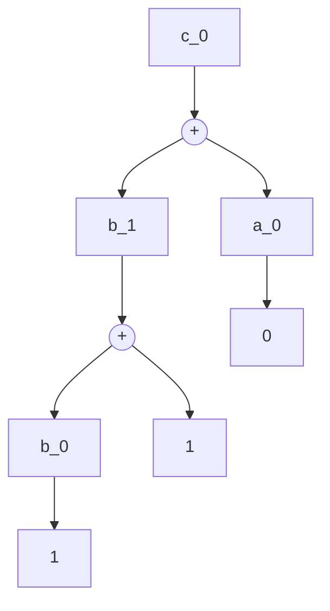

<!-- An overview of the goals of p5's shader system and where it hopes to go in the future. -->

# p5.strands Overview

p5.strands is a shader programming environment that p5.js provides, starting from p5 version 2. It aims to put the visual opportunities uniquely afforded by shaders within reach of people familiar with p5 without a huge learning curve. It does so by letting you write shader code in JavaScript, and by letting you focus on small changes rather than requiring a full rendering pipeline. The specifics of these APIs are still changing: a valuable contribution to the project is to give us feedback on what parts are still awkward or confusing and need smoothing out!

If you're looking to start writing p5.strands shaders yourself, take a look at <a href="https://p5js.org/tutorials/intro-to-p5-strands/">our p5.strands tutorial</a> or the <a href="https://p5js.org/reference/p5/buildMaterialShader/">examples in the reference for the p5.js base shaders.</a> The rest of this document will describe how p5.strands works behind the scenes. If you are interested in contributing to the p5.strands, read on!

## Project goals

p5.strands aims to address a number of issues at once:

- **Learning shaders**: traditional shader programming is notoriously difficult to get into, requiring you to learn a new language, a parallel programming paradigm, and an execution pipeline before you can truly get started. p5.strands aims to create an environment as familiar as possible for those used to non-shader programming in p5.js, and requiring you to learn incrementally only what is relevant for your task at hand. It should do so without being just a "toy" environment; you should be able to use p5.strands in your work or art in p5.
- **Teaching shaders**: to teach shader programming, one often ends up building *scaffolding* so that you may abstract away the many concepts and boilerplate code required to get to an output, and then slowly remove the scaffolding as you teach. p5.strands is built with this in mind as an alternative to building this yourself, with further development of code educational materials built in.
- **Using custom shaders**: while one could always provide custom shaders to extend the rendering capabilities of p5, it was difficult to integrate new shaders into the rest of p5's systems (working with spatial transformations, lighting, etc.) without both an intimate knowledge of internal p5 code, and the time to keep up to changes to those internals between versions to keep integrations working. p5.strands as a system lets you make *updates* to the built-in shaders without replacing them from scratch or knowing about anything beyond the part of the pipeline you are taking over.
- **Futureproofing code**: today, most shaders are written for WebGL. Development on WebGL as a technology is decelerating as momentum on WebGPU, its successor, increases, where new functionality and programming paradigms are being introduced in a new shader programming language. p5.strands offers a way to target both systems with the same code to smooth the transition between technologies, and offer an openings to experiment with the new parts of WebGPU without having to completely start from scratch.

## What needs feedback

The main thing you can do to help out is to test out p5.strands and let us know what parts are the hardest to understand, and what parts are the most difficult to use: what took longest to figure out, where did you get tripped up along the way, etc. We continue to iterate on the programming interface to try to make this easier.

At this point, the general technical framework has been set up (see the technical overview below), but may still include implementation bugs. Testing and reporting these bugs (and helping fix them if you are up for it!) helps the project reach maturity.

Finally, since the system is still so new and is still changing, it lacks extensive tutorials and examples. If you want to write or make videos to help people understand how to use p5.strands, or show examples illustrating the kinds of things you can make with it, reach out!

## Technical overview

At its core, p5.strands works in four steps:

1. The user writes a function in pseudo-JavaScript.
2. p5.strands transpiles that into actual JavaScript and rewrites aspects of your code.
3. The transpiled code is run. Variable modification function calls are tracked in a graph data structure.
4. p5.strands generates GLSL code from that graph.

### What functionality is available in JavaScript?

We expose JavaScript versions of the following GLSL functions in [`strands_builtins.js`](https://github.com/processing/p5.js/blob/main/src/strands/strands_builtins.js):
- Trigonometry
  - `acos()`
  - `acosh()`
  - `asin()`
  - `asinh()`
  - `atan()`
  - `atanh()`
  - `cos()`
  - `cosh()`
  - `degrees()`
  - `radians()`
  - `sin()`
  - `sinh()`
  - `tan()`
  - `tanh()`
- Math
  - `abs()`
  - `ceil()`
  - `clamp()`
  - `dFdx()`
  - `dFdy()`
  - `exp()`
  - `exp2()`
  - `floor()`
  - `fma()`
  - `fract()`
  - `fwidth()`
  - `inversesqrt()`
  - `log()`
  - `log2()`
  - `max()`
  - `min()`
  - `mix()`
  - `mod()`
  - `pow()`
  - `round()`
  - `roundEven()`
  - `sign()`
  - `smoothstep()`
  - `sqrt()`
  - `step()`
  - `trunc()`
- Vector
  - `cross()`
  - `distance()`
  - `dot()`
  - `equal()`
  - `faceForward()`
  - `length()`
  - `normalize()`
  - `notEqual()`
  - `reflect()`
  - `refract()`
- Color
  - `texture()`
- State
  - `gl_InstanceID` via `instanceIndex`

In [`strands_api.js`](https://github.com/processing/p5.js/blob/main/src/strands/strands_api.js), we make the following p5 functionality available in strands shaders:

- Environment
  - `width`
  - `height`
  - `mouseX`
  - `mouseY`
  - `pmouseX`
  - `pmouseY`
  - `winMouseX`
  - `winMouseY`
  - `pwinMouseX`
  - `pwinMouseY`
  - `frameCount`
  - `deltaTime`
  - `displayWidth`
  - `displayHeight`
  - `windowWidth`
  - `windowHeight`
  - `mouseIsPressed`
  - `millis()`
- Math
  - `lerp()`
  - `map()`
- Color
  - `color()`
  - `lerpColor()`
  - `red()`
  - `green()`
  - `blue()`
  - `alpha()`
  - `saturation()`
  - `brightness()`
  - `lightness()`
  -
- Random
  - `random()`
  - `randomSeed()`
  - `randomGaussian()`
  - `noise()`
  - `noiseDetail()`

### Why pseudo-JavaScript?

The code the user writes when using p5.strands is mostly JavaScript, with some extensions. Shader code heavily encourages use of vectors, and the extensions all make this as easy in JavaScript as in GLSL.

- In JavaScript, there is not a vector data type. In p5.strands, you create vectors by creating array, e.g. `myVec = [1, 0, 0]`. You can't use actual arrays in p5.strands; all arrays are fixed-size vectors.
- In JavaScript, you can only use mathematical operators like `+` between numbers and strings, not with vectors. In p5.strands, we allow use of these operators between vectors.
- In GLSL, you can do something called _swizzling_, where you can create new vectors out of the components of an existing vector, e.g. `myvec.xy`, `myvec.bgr`, or even `myvec.zzzz`. p5.strands adds support for this on its vectors.

When we transpile the input code, we rewrite these into valid JavaScript. Array literals are turned into function calls like `vec3(1, 0, 0)` which return vector class instances. These instances are wrapped in a `Proxy` that handles property accesses that look like swizzles, and converts them into sub-vector references. Operators between vectors like `a + b` are rewritten into method calls, like `a.add(b)`.

If a user writes something like this:

```js
baseMaterialShader().modify(() => {
  const t = uniformFloat(() => millis());
  getWorldInputs(inputs => {
    inputs.position += [20, 25, 20] * sin(inputs.position.y * 0.05 + t * 0.004);
    return inputs;
  });
});
```

...it gets transpiled to something like this:

```js
baseMaterialShader().modify(() => {
  const t = uniformFloat('t', () => millis());
  getWorldInputs(inputs => {
    inputs.position = inputs.position.add(
      strandsNode([20, 25, 20]).mult(
        sin(inputs.position.y.mult(0.05).add(strandsNode(t).mult(0.004)))
      )
    );
    return inputs;
  });
});
```

### The program graph

The overall structure of a shader program is represented by a **control-flow graph (CFG)**. This divides up a program into chunks that need to be outputted in linear order based on control flow. A program like the one below would get chunked up around the if statement:

```js
// Start chunk 1
let a = 0;
let b = 1;
// End chunk 1

// Start chunk 2
if (a < 2) {
  b = 10;
}
// End chunk 2

// Start chunk 3
b += 2;
return b;
// End chunk 3
```



We store the individual states that variables can be in as nodes in a **directed acyclic graph (DAG)**. This is a fancy name that basically means each of these variable states may depend on previous variable states, and outputs can't feed back into inputs. Each time you modify a variable, that represents a new state of that variable. For example, below, it is not sufficient to know that `c` depends on `a` and `b`; you also need to know _which version of `b`_ it branched off from:

```js
let a = 0;
let b = 1;
b += 1;
let c = a + b;
return c;
```

We can imagine giving each of these states a separate name to make it clearer. In fact, that's what we do when we output GLSL, because we don't need to preserve variable names.

```js
let a_0 = 0;
let b_0 = 1;
let b_1 = b_0 + 1;
let c_0 = b_1 + a_0;
return c_0;
```

When we generate GLSL from the graph, we start from the variables we need to output, the return values of the function (e.g. `c_0` in the example above.) From there, we can track dependencies through the DAG (in this case, `b_1` and `a_1`). Each dependency has their own dependencies. We make sure we output the dependencies for a node before the node itself.



Each node in the DAG belongs to a chunk in the CFG. This helps us keep track of key points in the code. If we need to, for example, generate a temporary variable at the end of an if statement, we can refer to that CFG chunk rather than whatever the last value node in the if statement happens to be.

### Control flow

p5.strands has to convert any control flow that should show up in GLSL into function calls instead of JavaScript keywords. If we don't, they run in JavaScript, and are invisible to GLSL generation. For example, if you had a loop that runs 10 times that adds 1 each time, it would output the add 1 line 10 times rather than outputting a for loop.

<table>
<tr>
<th>Input</th>
<th>Output without converting control flow</th>
</tr>
<tr>
<td>

```js
let a = 0;
for (let i = 0; i < 10; i++) {
  a += 2;
}
return a;
```

</td>
<td>

```glsl
float a = 0.0;
a += 2.0;
a += 2.0;
a += 2.0;
a += 2.0;
a += 2.0;
a += 2.0;
a += 2.0;
a += 2.0;
a += 2.0;
a += 2.0;
return a;
```

</td>
</tr>
</table>

However, once we have a function call instead of real control flow, we also need a way to make sure that when the users' javascript subsequently references nodes that were updated in the control flow, they properly reference the modified value after the `if` or `for` and not the original value.

<table>
<tr>
<th>Input</th>
<th>Transpiled without updating references</th>
<th>States without updating references</th>
</tr>
<tr>
<td>

```js
let a = 0;
for (let i = 0; i < 10; i++) {
  a += 2;
}
let b = a + 1;
return b;
```

</td>
<td>

```js
let a = 0;
p5.strandsFor(
  () => 0,
  i => i.lessThan(10),
  i => i.add(1),

  () => {
    a = a.add(2);
  }
);
let b = a.add(1);
return b;
```

</td>
<td>

```js
let a_0 = 0;

p5.strandsFor(
  // ...
);
// At this point, the final state of a is a_n

// ...but since we didn't actually run the loop,
// b still refers to the initial state of a!
let b_0 = a_0.add(1);
return b;
```

</td>
</tr>
</table>

For that, we make the function calls return updated values, and we generate JS code that assigns these updated values back to the original JS variables. So for loops end up transpiled to something like this, inspired by the JavaScript `reduce` function:

<table>
<tr>
<th>Input</th>
<th>Transpiled with updated references</th>
</tr>
<tr>
<td>

```js
let a = 0;
for (let i = 0; i < 10; i++) {
  a += 2;
}
let b = a + 1;
return b;
```

</td>
<td>

```js
let a = 0;

const outputState = p5.strandsFor(
  () => 0,
  i => i.lessThan(10),
  i => i.add(1),

  // Explicitly output new state based on prev state
  (i, prevState) => {
    return { a: prevState.a.add(2) };
  },

  { a } // Pass in initial state
);
a = outputState.a; // Update reference

// b now correctly is based off of the final state of a
let b = a.add(1);
return b;
```

</td>
</tr>
</table>

We use a special kind of node in the DAG called a **phi node**, something used in compilers to refer to the result of some conditional execution. In the example above, the state of `a` in the output state is represented by a phi node.

In the CFG, we surround chunks producing phi nodes by a `BRANCH` and a `MERGE` chunk. In the `BRANCH` chunk, we can initialize phi nodes, sometimes giving them initial values. In the `MERGE` chunk, the value of the phi node has stabilized, and other nodes can use them as a dependency.

### GLSL generation

GLSL is currently the only output format we support, but p5.strands is designed to be able to generate multiple formats. Specifically, in WebGPU, they use the WebGPU Shading Language (WGSL). Our goal is that your same JavaScript p5.strands code can be used in WebGL or WebGPU without you having to do any modifications.

To support this, p5.strands separates out code generation into **backends.** A backend is responsible for converting each type of CFG chunk into a string of shader source code. We currently have a GLSL backend, but in the future we'll have a WGSL backend too!
