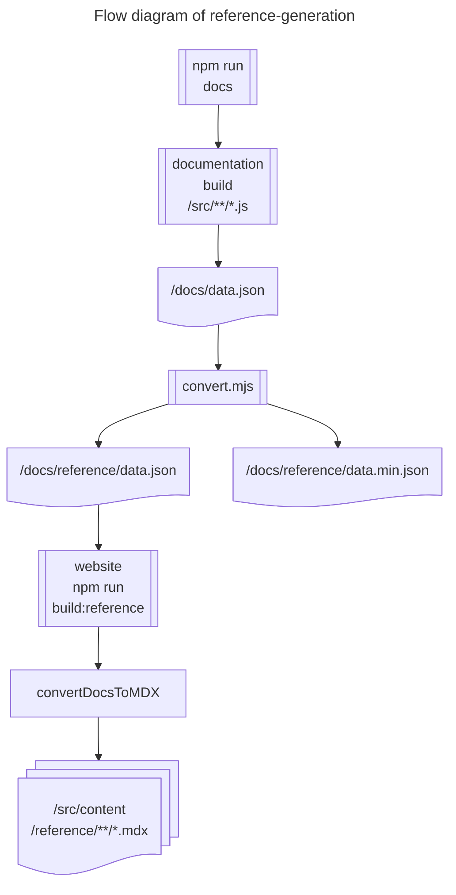
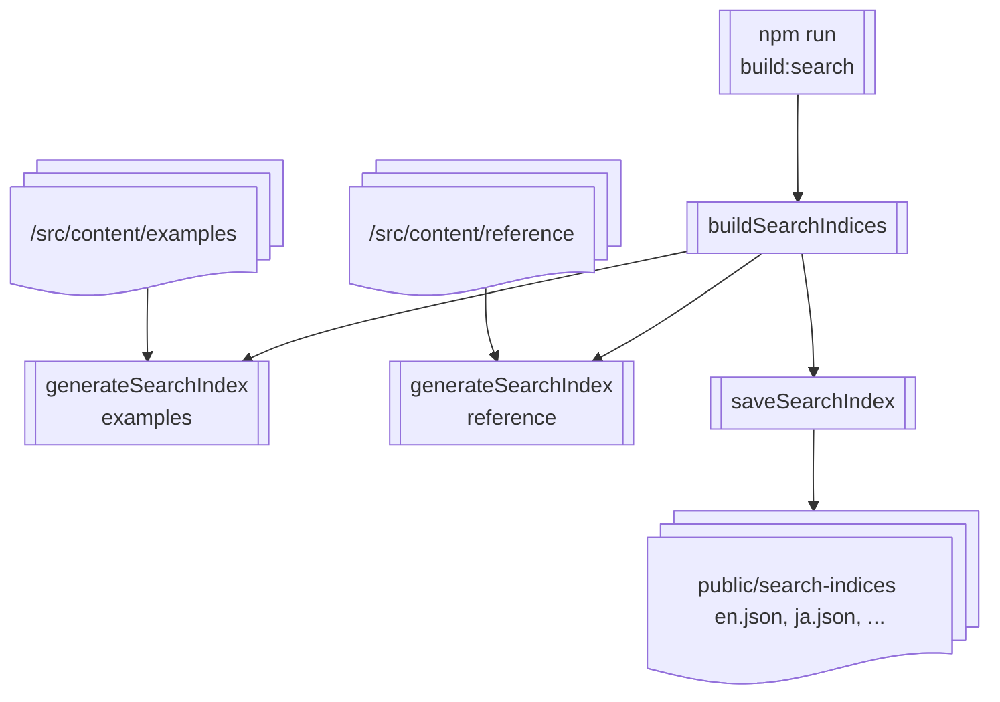
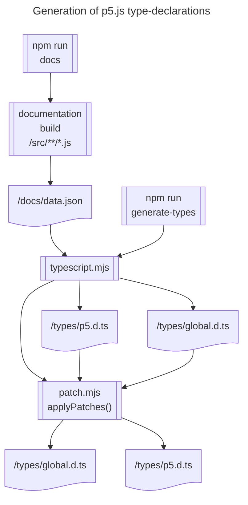
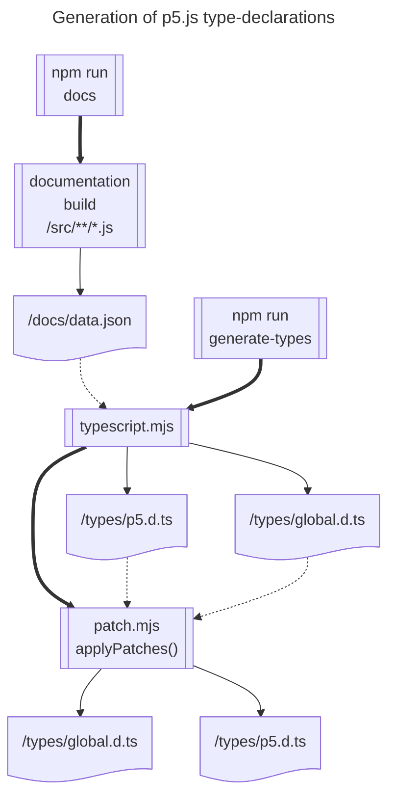
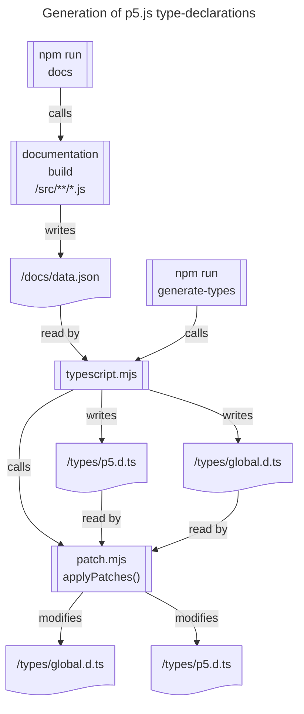

<!-- How the p5.js reference is generated. -->

# Reference-generation process

This document will describe the documentation-generation process which takes the p5.js v2.x source code and generates from it the pages of the [reference website](https://beta.p5js.org/reference/).

In addition, it will also cover the generation of other artifacts from the same source:
* type declarations supporting autocompletion, intellisense, and type-checking
* parameter validation data for the Friendly Error System (FES)

You don't need to know _any_ of this to successfully write and maintain the reference comments in the p5.js library!  If you've questions about that, see [Contributing to the p5.js reference](./contributing_to_the_p5js_reference.md).

Warning: This describes how things work in February 2026 and is quite likely out of date!

## Flow diagram for reference generation



## Reference generation explained

<!-- TODO: When does this command get run? -->

The process is started with the execution of the following command from the p5.js-website repo:

```bash
npm build:reference
```

This clones the p5.js repo into a working directory on the website and there runs:

```bash
npm run docs
```

### p5.js: npm run docs

You can run it locally and observe the outputs.

It is currently run by [a release process workflow](../.github/workflows/release-workflow-v2.yml) on Github Actions CI.

In turn this command runs the following single-line command:

```bash
"documentation build 
    ./src/**/*.js ./src/**/**/*.js 
    -o ./docs/data.json 
    && node ./utils/convert.mjs"
```

This is actually _two_ commands in sequence: First, `documentation build ...`, and then - if the first command was successful `node ./utils/convert.mjs`.  We'll look at these in turn.

#### Step 1: `documentation build...` command

This command turns JSDoc comment blocks across all the javascript files into a single structured json file ready for further processing.

In more detail:

```bash
documentation build 
    ./src/**/*.js ./src/**/**/*.js 
    -o ./docs/data.json 
```

`documentation build` is the [standard way](https://github.com/documentationjs/documentation?tab=readme-ov-file) to invoke the tool [documentation.js](https://documentation.js.org/) to build documentation.

Next we tell it which files to work on.

`./src/**/*.js ./src/**/**/*.js` is an expression which will expand to match all .js files under the src directory at depths of one and two subdirectories.  That covers all the .js files that currently have documentation comment blocks in them.

Examples of files which will match:

* `src/image/pixels.js`
* `src/color/color_spaces/hsb.js`

* The `-o` is used to specify the output file.
* `documentation.js`'s default output format is JSON, so JSON content is written into the output file.

It's important to note this output does not generate HTML pages, even though that's a common use for tools like documentation.js.

This initial JSON file will be converted further by the next process, to prepare the data for the website build process.

It will _also_ be used by another build process to build the types - see [the type-generation process](#type-generation-process)

You can run this command yourself locally and inspect the output file to see the gathered data.

You can also run `npx documentation build --help` to read the manual page for documentation.js.

#### Step 2: `node ./utils/convert.mjs` command

The second command is
```bash
node ./utils/convert.mjs
```

This will _only_ run if the documentation build command runs successfully.

The `./utils/convert.mjs` script reads the output file generated by the `documentation build` command (the JSON file `/docs/data.json`), and creates three new output files: 
* `/docs/reference/data.json` - Used by the p5.js-website to generate the reference pages
* `/docs/reference/data.min.json` - A smaller version of the above
* `/docs/parameterData.json` - Used by the FES\*

The file generated initially by `documentation build` is _very_ large with a lot of data our pages won't need.  Further, pieces of information are also scattered over the file -  we'd like to group them together into a structure that will make it easier to use in later webpage generation.
The convert script has taken only what's necessary and grouped it together into the new data file `/docs/reference/data.json` and its minified version.

This file will be used by the p5.js-website to generate the final pages.

\* The convert script has _also_ generated `/docs/parameterData.json` which is used by the friendly error system (FES) at runtime to validate function parameters.  We won't discuss that further here.

#### Excerpt of /docs/reference.data.json

Here's an excerpt from `/docs/reference/data.json`, showing how our `sin` function documentation is now represented at the end of both steps taken by `npm run docs`:

```json
{
  "name": "sin",
  "file": "src/math/trigonometry.js",
  "line": 526,
  "itemtype": "method",
  "description": "<p>Calculates the sine of an angle.</p>\n<p><code>sin()</code> is useful for many geometric tasks in creative coding. The values\nreturned oscillate between -1 and 1 as the input angle increases. <code>sin()</code>\ncalculates the sine of an angle, using radians by default, or according to\nif <a href=\"#/p5/angleMode\">angleMode()</a> setting (RADIANS or DEGREES).</p>\n",
  "example": [
    "<div>\n<code>\nfunction setup() {\n  createCanvas(100, 100);\n\n  describe('A white ball on a string oscillates up and down.');\n}\n\nfunction draw() {\n  background(200);\n\n  // Calculate the coordinates.\n  let x = 50;\n  let y = 30 * sin(frameCount * 0.05) + 50;\n\n  // Draw the oscillator.\n  line(50, y, x, y);\n  circle(x, y, 20);\n}\n</code>\n</div>\n\n<div>\n<code>\nfunction setup() {\n  createCanvas(100, 100);\n\n  background(200);\n\n  describe('A series of black dots form a wave pattern.');\n}\n\nfunction draw() {\n  // Calculate the coordinates.\n  let x = frameCount;\n  let y = 30 * sin(x * 0.1) + 50;\n\n  // Draw the point.\n  point(x, y);\n}\n</code>\n</div>\n\n<div>\n<code>\nfunction setup() {\n  createCanvas(100, 100);\n\n  background(200);\n\n  describe('A series of black dots form an infinity symbol.');\n}\n\nfunction draw() {\n  // Calculate the coordinates.\n  let x = 30 * cos(frameCount * 0.1) + 50;\n  let y = 10 * sin(frameCount * 0.2) + 50;\n\n  // Draw the point.\n  point(x, y);\n}\n</code>\n</div>"
  ],
  "overloads": [
    {
      "params": [
        {
          "name": "angle",
          "description": "the angle, in radians by default, or according to if <a href=\"/reference/p5/angleMode/\">angleMode()</a> setting (RADIANS or DEGREES).",
          "type": "Number"
        }
      ],
      "return": {
        "description": "sine of the angle.",
        "type": "Number"
      }
    }
  ],
  "return": {
    "description": "sine of the angle.",
    "type": "Number"
  },
  "class": "p5",
  "static": false,
  "module": "Math",
  "submodule": "Trigonometry"
},
```

### after p5.js npm run docs - p5.js-website continues

Once the p5.js `npm run docs` script has finished, the p5.js-website's `npm run build:reference` command continues, as follows:

#### Summary: 
Loads the generated `./docs/reference/data.json`
Generates an MDX file for each entry in the data.

That's it!  (The Astro web app will read these MDX files at runtime.)

#### More detail:


For each module:
  * generates the file path to which generated pages will be stored
For each feature: 
  * generates the MDX content for the relevant page


e.g. here's one item loaded from the reference file: 
```json
{
  itemtype: "property",
  name: "RGB",
  file: "src/scripts/parsers/in/p5.js/src/color/creating_reading.js",
  line: 16,
  type: "RGB",
  description: "",
  module: "Color",
  submodule: "Creating & Reading",
  class: "p5",
}
```
Here's the path decided for it: 
`'src/content/reference/en/p5/constants'`

(TODO: why?)
### convertDocsToMDX

This builds an array of objects:
```js
{ mdx, savePath, name: doc.name }
```
and fills in a modulePath tree as it goes, with discovered module, submodule hierarchy.

```js
addDocToModulePathTree():
  itemPath = 'p5/constants/RGB'
  modulePath = "Color"
  subPath= "Creating & Reading",
  merges the following into modulePathTree: {
    Color: {
      "Creating & Reading": {
        RGB: "p5/constants/RGB",
      },
    },
  }
//fix doc description
correctRelativeLinksInDescription(doc.description)
correctRelativeLinksToExampleAssets(doc.description)

//fix doc.example (a string[])
doc.example = correctRelativeLinksToExampleAssets(doc.example) 

//generate MDX from the doc object
mdx = convertToMDX(doc);
#### convertToMDX(doc)
   let frontMatterArgs = {
      title: sanitizeName(doc.name),
      module: doc.module,
      submodule: doc.submodule ?? "",
      file: doc.file.replace(/.*p5\.js\/(.*)/, "$1"),
      description: doc.description ?? "",
      line: doc.line,
      deprecated: doc.deprecated,
  }
  //generate front matter as a string
  //e.g. "---title: RGBmodule: Constantssubmodule: Creating & Readingfile: src/color/creating_reading.jsdescription: ''line: 16isConstructor: falseitemtype: propertyclass: p5type: RGB---"

  // Convert the markdown content to MDX
  const mdxContent = remark().use(remarkMDX).processSync(markdownContent);
  //returns this text: 
  example="---title: RGBmodule: Constantssubmodule: Creating & Readingfile: src/color/creating_reading.jsdescription: ''line: 16isConstructor: falseitemtype: propertyclass: p5type: RGB---\n# RGB\n"

  //remove the old .mdx files from the repo
  //save the new MDX content objects to their appropriate paths


## Bonus: Flow diagram for search index generation

<!-- TODO: Do this properly or leave it out -->
On the p5js-website repo, we run `npm run build:search`


See [mermaid flowchart syntax reference](https://mermaid.ai/open-source/syntax/flowchart.html)


## <a id="type-generation-process"></a>Bonus: The type-generation process
<!-- TODO - in a separate document -->
The JSON file `/docs/data.json` generated by `documentation build` from the p5.js source code is also used to generate type declarations - .d.ts files - which enable:

* auto-completion & intellisense
  - inline documentation on hover
  - display of available methods and properties on the current object
  - display of possible constants or object keys to pass as the current function argument
* type-checking (of javascript or typescript code)

It is more common for such type-declarations to be generated by the TypeScript compiler (tsc) or similar.


The process is started by running the following command on the p5js repo:

`npm run generate-types` runs:
```bash
"npm run docs && node utils/typescript.mjs"
```

### <a id="patching-types></a>Patching types
In a few specialized cases, the normal way of documenting function parameter and return types fails.

To deal with these situatios, a patching mechanism is in place which allows us to inject the correct types directly into the type-declaration files as they are built.

This is done in [./utils/patch.mjs](./utils/patch.mjs) through a series of calls to `replace()` which replaces the generated type coming out of the first phase of type-generation with the correct type.

**Examples:**

In the following example, we correct the type for the `mouseButton` variable, which is initially generated incompletely from the JSDoc as: `'mouseButton: object;'`
This call to replace will look through the `p5.d.ts` file, looking for the above line, and replacing it with the corrected type - an object with three boolean properties.

```js
replace(
    'p5.d.ts',
    'mouseButton: object;',
    'mouseButton: { left: boolean; center: boolean; right: boolean };'
  );
```
The next example replaces, in _both_ files, the generated type of the `shuffle` function with a corrected generic version which states the input and output arrays will have the same type of elements.

```js
  replace(
    ['p5.d.ts', 'global.d.ts'],
    'shuffle(array: any[], modify?: boolean): any[];',
    'shuffle<T>(array: T[], modify?: boolean): T[];'
  );
```

### Flow diagram for type-generation

<!-- TODO: show patch.mjs and any other clean-up operations -->




### Flow diagram experiment 1 - line types
This one has different lines to show
* thick: "calls" / "invokes"
* dashed: "reads"
* normal: "writes"



### Flow diagram experiment 2 - line labels

