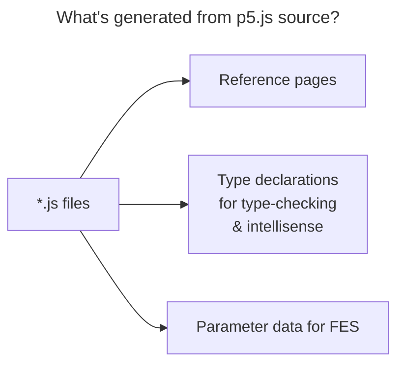
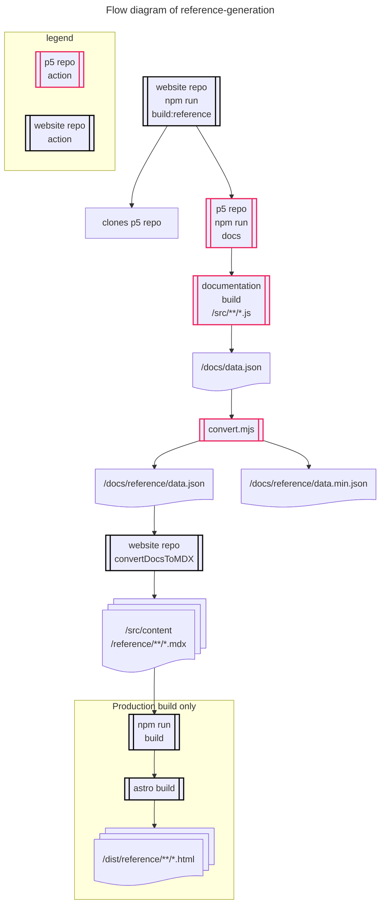
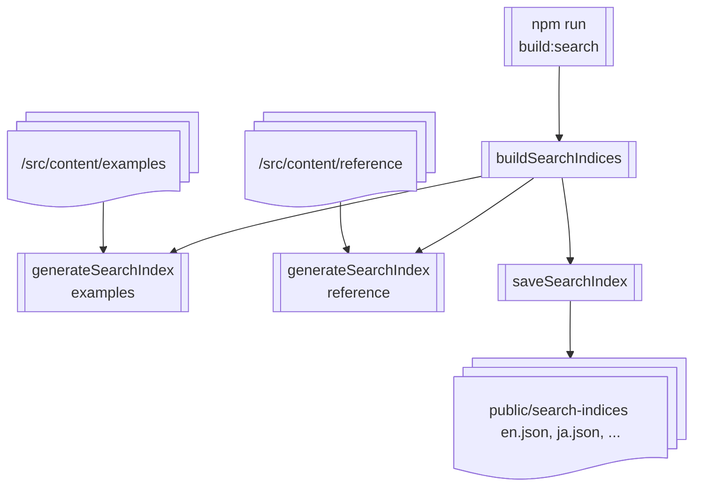

<!-- How the p5.js reference is generated. -->

# Reference-generation process

This document will describe the documentation-generation process which takes the p5.js v2.x source code and generates from it the pages of the [reference website](https://beta.p5js.org/reference/).

## Need to know?

You don't need to know _any_ of this to successfully write and maintain the reference comments in the p5.js library!  If you've questions about that, see [Contributing to the p5.js reference](./contributing_to_the_p5js_reference.md).

## Table of Contents

 * [The reference-generation process](#ref-gen-process)
 * [Search index gen process (WIP)](#search-index-gen-process)

## A warning: stale information?

This document describes how things work at time of writing, but might be out of date!  Check for changes in the key scripts listed in the following section, if in doubt.

(Please consider contributing to bring this up-to-date if you notice it is incorrect.)

## Key scripts

Here are the most important documents in the process, currently.

| Repo          | Path |
| :------------ | :--- |
| p5.js-website | [/package.json](https://github.com/processing/p5.js-website/blob/2.0/package.json) |
| p5.js-website | [/src/scripts/builders/reference.ts](https://github.com/processing/p5.js-website/blob/2.0/src/scripts/builders/reference.ts)|
| p5.js         | [/package.json](https://github.com/processing/p5.js/blob/dev-2.0/package.json) |
| p5.js         | [/utils/convert.mjs](https://github.com/processing/p5.js/blob/dev-2.0/utils/convert.mjs) |

## What's generated from the source?

There are some other artifacts generated from the same source:

* Type declarations supporting autocompletion, intellisense, and type-checking.  See [type-generation process](./type_generation_process.md)

* Parameter validation data for the Friendly Error System (FES).


```mermaid
---
title: What's generated from p5.js source?
---
graph LR
  js[*.js files]
  js --> ref[Reference pages]
  js --> typedecls[Type declarations<br>for type-checking<br>& intellisense]
  js --> fesParamData[Parameter data for FES]
```

## <a id="ref-gen-process"></a>The reference-generation process

<a id="ref-gen-flow-diagram"></a>


```mermaid
---
title: Flow diagram of reference-generation
---
graph TD
  
  %% nodes

  websiteNpmBuildReference[[website repo<br>npm run<br>build:reference]]
  
  cloneP5Repo[clones p5 repo]

  npmRunDocs[[p5 repo<br>npm run<br>docs]]
  
  docBuild[[documentation<br>build<br>/src/**/*.js]]

  convertDocsToMDX[[website repo<br>convertDocsToMDX]]

  contentReferenceMDX["/src/content<br>/reference/**/*.mdx"]@{shape: docs}
  


  %% connections

  websiteNpmBuildReference --> cloneP5Repo
  websiteNpmBuildReference --> npmRunDocs
    
  npmRunDocs --> docBuild

  docBuild --> /docs/data.json@{ shape: doc }
  
  /docs/data.json --> convert[[convert.mjs]]
  
  convert --> /docs/reference/data.json@{ shape: doc }
  
  convert --> /docs/reference/data.min.json@{ shape: doc }        

  /docs/reference/data.json --> convertDocsToMDX

  convertDocsToMDX --> contentReferenceMDX
  
  contentReferenceMDX --> npmRunBuild[[npm run<br>build]]
  
  subgraph "Production build only"
  contentReferenceHTML["/dist/reference/**/*.html"]@{shape: docs}
  
  npmRunBuild --> astroBuild[[astro build]]
  astroBuild --> contentReferenceHTML
  end


  subgraph legend
  p5RepoActionExample[[p5 repo<br>action]]
  websiteRepoActionExample[[website repo<br>action]]
  end
  
  %% styling - class declarations and assignments
    
  class npmRunDocs,docBuild,convert,p5RepoActionExample p5RepoAction;
  class websiteNpmBuildReference,convertDocsToMDX,npmRunBuild,astroBuild,websiteRepoActionExample websiteRepoAction;
  
  classDef p5RepoAction stroke:#ED225D,stroke-width:2px;
  classDef websiteRepoAction stroke:#000000,stroke-width:2px;

```

### How the process starts:

For a production deploy, the process _currently_ happens in [a release process workflow](https://github.com/processing/p5.js/blob/dev-2.0/.github/workflows/release-workflow-v2.yml) on Github Actions CI.  However, you can follow these steps on a local clone of the p5.js-website repo.

The process is started with the execution of the following command from a check-out of p5.js-website repo:

```bash
npm build:reference
```

This calls [p5.js-website:/src/scripts/builders/reference.ts](https://github.com/processing/p5.js-website/blob/2.0/src/scripts/builders/reference.ts), which starts by: 
1. cloning the _p5.js_ repo into a temporary working directory, and
2. from there running:

```bash
npm run docs
```

### p5.js: npm run docs

In turn this command runs the following single-line command:

```bash
"documentation build 
    ./src/**/*.js ./src/**/**/*.js 
    -o ./docs/data.json 
    && node ./utils/convert.mjs"
```

This is actually _two_ commands in sequence: 
* First, `documentation build ...`, and then - if the first command was successful
* `node ./utils/convert.mjs`.  

We'll look at these in turn.

#### Step 1: `documentation build...` command

This command turns JSDoc comment blocks across all the javascript files into a single structured JSON file ready for further processing.

In more detail:

```bash
documentation build 
    ./src/**/*.js ./src/**/**/*.js 
    -o ./docs/data.json 
```

`documentation build` is the [standard way](https://github.com/documentationjs/documentation?tab=readme-ov-file#user-guide) to invoke the tool [documentation.js](https://documentation.js.org/) to build documentation.

Next we tell it which files to work on.

`./src/**/*.js ./src/**/**/*.js` is an expression which will expand to match all .js files under the src directory at depths of one and two subdirectories.  That covers all the .js files that currently have documentation comment blocks in them.

Examples of files which will match:

* `src/image/pixels.js`
* `src/color/color_spaces/hsb.js`

The `-o` is used to specify the output file.  `documentation.js`'s default output format is JSON, so JSON content is written into the output file.

Aside: It's important to note that the tool _does not_ generate HTML pages, even though that's a common use for tools like documentation.js.

This generated JSON file will be converted further by the next step, to prepare the data for the website build process.

It will _also_ be used by other build processes - e.g. to build the types - see [the type-generation process](#type-gen-process).

You can run this command yourself locally and inspect the output file to see the gathered data.

You can also run `npx documentation build --help` to read the manual page for documentation.js.

#### Step 2: `node ./utils/convert.mjs` command

The second command is
```bash
node ./utils/convert.mjs
```

Note this will _only_ run if the documentation build command runs successfully.

Here's the [/utils/convert.mjs](https://github.com/processing/p5.js/blob/dev-2.0/utils/convert.mjs) from the p5 repo.

The `./utils/convert.mjs` script reads the output file generated by the `documentation build` command (the JSON file `/docs/data.json`), and creates three new output files: 
* `/docs/reference/data.json` - Used by the p5.js-website to generate the reference pages
* `/docs/reference/data.min.json` - A smaller version of the above
* `/docs/parameterData.json` - Used by the FES\*

The file generated initially by `documentation build` is _very_ large with a lot of data our pages won't need.  Further, pieces of information are also scattered over the file -  we'd like to group them together into a structure that will make it easier to use in later webpage generation.
The convert script has taken only what's necessary and grouped it together into the new data file `/docs/reference/data.json` and its minified version.

This file will be used by the p5.js-website to generate the final pages.

\* The convert script has _also_ generated `/docs/parameterData.json` which is used by the friendly error system (FES) at runtime to validate function parameters.  We won't discuss that further here.

#### Excerpt of /docs/reference/data.json

Here's an excerpt from `/docs/reference/data.json`, showing how our [noFill()](https://beta.p5js.org/reference/p5/noFill/) function documentation is now represented at the end of both steps taken by `npm run docs`:

```json
{
      "name": "noFill",
      "file": "src/color/setting.js",
      "line": 1342,
      "itemtype": "method",
      "description": "<p>Disables setting the fill color for shapes.</p>\n<p>Calling <code>noFill()</code> is the same as making the fill completely transparent,\nas in <code>fill(0, 0)</code>. If both <a href=\"#/p5/noStroke\">noStroke()</a> and\n<code>noFill()</code> are called, nothing will be drawn to the screen.</p>\n",
      "example": [
        "function setup() {\n  createCanvas(100, 100);\n\n  square(32, 10, 35);\n\n  noFill();\n  square(32, 55, 35);\n}",
        "...second example goes here..."
      ],
      "overloads": [
        {
          "params": [],
          "chainable": 1
        }
      ],
      "class": "p5",
      "static": false,
      "module": "Color",
      "submodule": "Setting"
    },
```

(I've shortened the examples)

### after p5.js npm run docs - p5.js-website continues

Once the p5.js `npm run docs` script has finished, the p5.js-website's `npm run build:reference` command continues, as follows:

#### Summary: 

* Loads the generated `./docs/reference/data.json`
* Generates an MDX file for each entry in the data (e.g. each p5 function or p5 variable gets its own .mdx file).
* That's all!  The production of these MDX files is as far as `npm run build:reference` goes.  

Who consumes this work?

  * For developers, the astro dev server can now read these MDX files directly to show a preview of the website.
  * In CI, a separate step will commit the MDX files into git.
  * In CI, a separate step will run `astro build` to convert the MDX files into HTML.
  
#### More detail on MDX generation:

From the input `./docs/reference/data.json`...

For each module:
  * generates the file path to which generated pages will be stored
For each feature: 
  * generates the MDX content for the relevant page


Example
We've seen previously the entry for `noFill` in the docs/reference/data.json. 

Here's the path decided for its mdx file: 
`src/content/reference/en/p5/noFill.mdx`

And here's what the contents of noFill.mdx looks like:


```mdx
---
title: noFill
module: Color
submodule: Setting
file: src/color/setting.js
description: >
  <p>Disables setting the fill color for shapes.</p>

  <p>Calling <code>noFill()</code> is the same as making the fill completely
  transparent,

  as in <code>fill(0, 0)</code>. If both <a
  href="/reference/p5/noStroke/">noStroke()</a> and

  <code>noFill()</code> are called, nothing will be drawn to the screen.</p>
line: 1340
isConstructor: false
itemtype: method
example:
  - |-
    function setup() {
      createCanvas(100, 100);

      background(200);

      // Draw the top square.
      square(32, 10, 35);

      // Draw the bottom square.
      noFill();
      square(32, 55, 35);

      describe('A white square on above an empty square. Both squares have black outlines.');
    }
  - |-
    function setup() {
      //second example cuts short for brevity
    }

class: p5
overloads:
  - params: []
    chainable: 1
chainable: false
---


# noFill

```
#### Run npm run dev 

For developers who are running the dev server to preview their work (e.g. with `npm run dev` or `npm run custom:dev`), the artifacts have now been generated that allow them to do that.

Commands like `npm run dev` run astro's dev server which reads our generated MDX files as it runs, and will even monitor them for changes, allowing you to make quick experimental edits.

If you haven't before, try running 
```bash
npm run dev
```

visiting `/reference/p5/noFill/` on the url that appears, 

and then editing (and saving!) `src/content/reference/en/p5/noFill.mdx` to see your changes reflected.

For many p5 contributors, this is enough. but there is a final step!

### Final astro build: converting MDX to HTML

For final preparation of the production website, there is one last conversion step for our data to go through.

`npm run build` delegates to the astro tool with `astro build`.

The "astro build" process converts all MDX files to HTML files (applying common page layouts and more), preparing the HTML files into a `dist/` folder, ready for deployment to a web host (like netlify or cloudflare).

(Feasibly, you could also distribute that folder of HTML files on a USB drive, say, for users to have _offline_ access to the p5 reference).

## <a id="search-index-gen-process"></a> Search index generation

More info is needed in this section.  Consider contributing!

<!-- TODO: Do this properly or leave it out -->
On the p5js-website repo, we run `npm run build:search`


```mermaid
graph TD
  contentReferenceMDX["/src/content/reference"]@{shape: docs}
  contentExamples["/src/content/examples"]@{shape: docs}
  
  npmBuildSearch[[npm run<br>build:search]]
  npmBuildSearch --> buildSearchIndices[[buildSearchIndices]] --> genSearchIndexForExamples[[generateSearchIndex<br>examples]]
  buildSearchIndices --> genSearchIndexForReference[[generateSearchIndex<br>reference]]
  contentReferenceMDX --> genSearchIndexForReference
  contentExamples --> genSearchIndexForExamples
  buildSearchIndices --> saveSearchIndex[[saveSearchIndex]] --> outDir[[public/search-indices en.json, ja.json, ...]]@{shape: docs}
```


## Contributing to this document

Notice any errors or places for improvement?  Please consider contributing to this document!  It lives at [/contributor_docs/reference_generation_process.md](https://github.com/processing/p5.js/blob/dev-2.0/contributor_docs/reference_generation_process.md) in the p5.js repo.  Alternatively, [let us know](https://github.com/processing/p5.js/issues)!