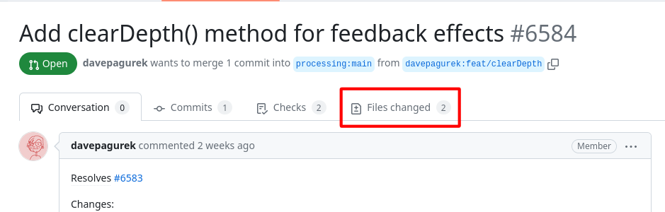
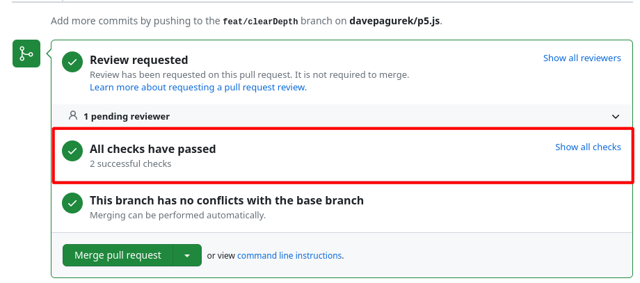
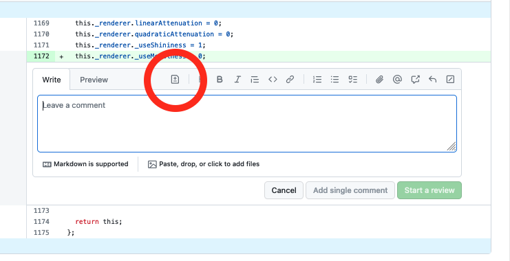
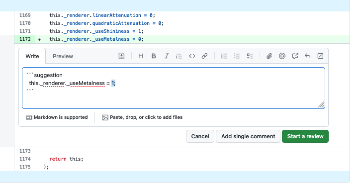
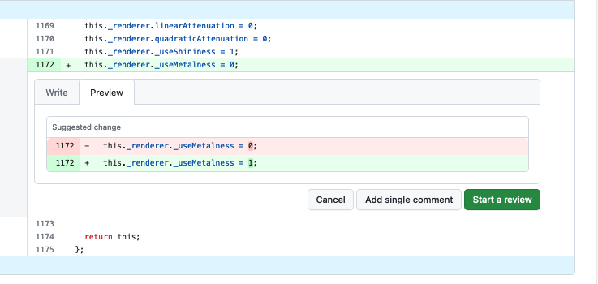
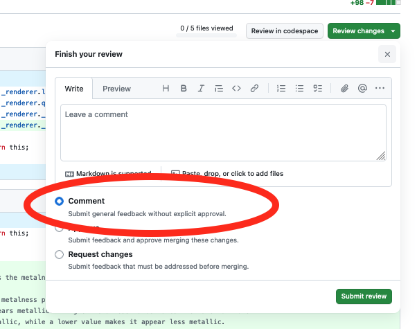
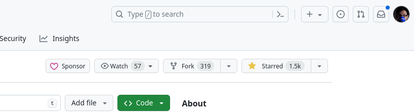

<!-- What to expect as a steward, and a playbook for common situations. -->

# Steward Guidelines

Whether you have just joined us as a steward, are a seasoned maintainer of p5.js, or are somewhere in between, this guide contains information as well as tips and tricks that will help you effectively contribute to p5.js. Most of what is written here are guidelines unless otherwise stated, which means you can adapt the practices shown here to suit your workflow.


## Table of Contents

- [Issues](steward_guidelines.md#issues)
  - [Bug report](steward_guidelines.md#bug-report)
  - [Feature request](steward_guidelines.md#feature-request)
  - [Feature enhancement](steward_guidelines.md#feature-enhancement)
  - [Discussion](steward_guidelines.md#discussion)
- [Pull Requests](steward_guidelines.md#pull-requests)
  - [Simple fix](steward_guidelines.md#simple-fix)
  - [Bug fix](steward_guidelines.md#bug-fix)
  - [New feature/feature enhancement](steward_guidelines.md#new-feature-feature-enhancement)
  - [Dependabot](steward_guidelines.md#dependabot)
- [Build Process](steward_guidelines.md#build-process)
  - [Main build task](steward_guidelines.md#main-build-task)
  - [Miscellaneous tasks](steward_guidelines.md#miscellaneous-tasks)
- [Release Process](steward_guidelines.md#release-process)
- [Tips & Tricks](steward_guidelines.md#tips--tricks)
  - [Reply templates](steward_guidelines.md#reply-templates)
  - [GitHub CLI](steward_guidelines.md#github-cli)
  - [Managing notifications](steward_guidelines.md#managing-notifications)

---


## Issues

We encourage most source code contributions to start with an issue, and as such, issues are the place where most of the discussions will take place. The steps to take when reviewing an issue will depend on what kind of issue it is. The repo uses [GitHub issue templates](https://github.com/processing/p5.js/blob/main/.github/ISSUE_TEMPLATE) in order to better organize different kinds of issues and encourage issue authors to provide all relevant information about their problems. The first step in reviewing the issue will often be looking through the filled-out template and determining if you need additional information (e.g., because some fields weren't filled in or the incorrect template was used).


### Bug report

Bug report issues should use the "Found a bug" issue template. The following workflow is typical for addressing bug reports:

1. Replicate the bug
   - The goal of the template is to provide enough information for a reviewer to attempt to replicate the bug in question.
   - If the reported bug is not relevant to the repo it is opened in (p5.js, p5.js-website, or otherwise):
     - Transfer the issue to the relevant repo if you have access to it.
     - Otherwise, leave a comment about where the bug report should be filed (with a direct link provided) and close the issue.
   - The first step in reviewing a bug report is to see if enough information is provided for a bug replication, and if so, attempt to replicate the bug as described.
2. If the bug can be replicated:
   - Some discussion may be required to determine the best way to fix a particular bug. Sometimes, it may be straightforward; sometimes, it may be tricky. Please refer to [p5.js' design principles](./contributor_guidelines.md#software-design-principles) when making this decision on a case-by-case basis.
   - If the issue author indicated in the issue they are willing to contribute a fix:
     - Approve the issue for fixing by the issue author by leaving a comment and assigning them to the issue. Use the cog button on the right side next to "Assignee".
   - If the issue author does not wish to contribute a fix:
     - Leave a comment recognizing the bug is replicable.
     - Attempt to fix yourself or add the `help wanted` label to signal an issue needing a fix.
3. If the bug cannot be replicated:
   - Ask for additional info if not already provided in the template (p5.js version, browser version, OS version, etc.).
   - If your testing environment differs from what is reported in the issue (e.g., a different browser or OS):
     - Leave a comment saying you are not able to replicate in your specific environment.
     - Add a `help wanted` label to the issue and ask for someone else with the setup specified in the issue to try to replicate the bug.
   - Sometimes, bugs only occur when using the web editor and not when testing locally. In this case, the issue should be redirected to the [web editor repo](https://github.com/processing/p5.js-web-editor).
   - If replication is possible later, go back to step 2.
4. If the bug stems from the code the user provided in the bug report and not p5.js' behavior:
   - Determine if p5.js' documentation, code implementation, or friendly error system can be improved to prevent the same mistake from being made.
   - Kindly redirect any further questions to the [forum](https://discourse.processing.org/) or [Discord](https://discord.com/invite/SHQ8dH25r9) and close the issue if no further changes are to be made to p5.js.


### Feature request

Feature request issues should use the "New Feature Request" issue template. The following workflow is typical for addressing feature requests:

1. As part of p5.js' commitment to increase access, a feature request must make a case for how it increases access of p5.js to communities that are historically marginalized in the field. More details are available [here](access.md).
   - If a feature request does not have the "Increasing Access" field sufficiently filled out, you can ask the issue author how the feature increases access.
   - The access statement of a feature can be provided by a different member of the community, including the issue reviewers.
2. The new feature request can be assessed for inclusion based on the following criteria.
   - Does the feature fit into the project scope and [design principles](design_principles.md) of p5.js?
     - For example, a request to add a new drawing primitive shape may be considered, but a request to adopt a browser-based IOT protocol will likely be out of scope.
     - Overall, the scope of p5.js should be relatively narrow in order to avoid excessive bloat from rarely used features.
     - If a feature does not fit into the scope of p5.js, suggest that the issue author implement the feature as as an addon library.
     - If it is unclear whether or not it fits, it can be a good idea to suggest making an addon library as a proof-of-concept. This helps give users a way to use the feature, provides a much more concrete example of its usage and importance, and does not necessarily need to be as complete of a solution as a fully integrated feature. It can be integrated into the core of p5.js later if appropriate.
   - Is the feature likely to cause a breaking change?
     - Will it conflict with existing p5.js functions and variables?
     - Will it conflict with typical sketches already written for p5.js?
     - Features that are likely to cause conflicts such as  the ones above  are  considered breaking changes. Without a [major version release](https://docs.npmjs.com/about-semantic-versioning), we should not make breaking changes to p5.js.
   - Can the proposed new feature be achieved using existing functionalities already in p5.js, relatively simple native JavaScript code, or existing easy-to-use libraries?
     - For example, instead of providing a p5.js function to join an array of strings such as `join(["Hello", "world!"])`, the native JavaScript `["Hello", "world!"].join()` should be preferred instead.
3. If the access requirement and other considerations have been fulfilled, at least two stewards or maintainers must approve the new feature request before work should begin toward a PR. The PR review process for new features is documented below.


### Feature enhancement

Feature enhancement issues should use the "Existing Feature Enhancement" issue template. The process is very similar to new feature requests. The difference between a new feature request and feature enhancement can be blurry sometimes. Feature enhancement mainly deals with existing functions of p5.js while a new feature request could be requesting entirely new functions to be added.

1. Similar to new feature requests, feature enhancement should only be accepted if they increase access to p5.js. Please see point 1 of [section above](steward_guidelines.md#feature-request).
2. Inclusion criteria for feature enhancements are similar to those for feature requests, but particular attention should be paid to potential breaking changes.
   - If modifying existing functions, all previous valid and documented function signatures must behave in the same way.
3. Feature enhancements must be approved by at least one steward or maintainer before work should begin toward a PR. The PR review process for feature enhancement is documented below.


### Discussion

This type of issue has a minimal template ("Discussion") and should be used to gather feedback around a topic in general before coalescing it into something more specific, like a feature request. These sorts of discussion issues can be closed when the conversation finishes and the resulting more specific issues have been created:

- If an issue is opened as a discussion but should be, for example, a bug report, the correct label should be applied and the "discussion" label removed. Additional info about the bug should also be requested from the author if not already included.
- If an issue is opened as a discussion but isn't relevant to source code contribution or otherwise relevant to the GitHub repositories/contribution process/contribution community, they should be redirected to the forum or Discord and the issue closed.
- If relevant, additional labels should be added to discussion issues to further signal what type of discussion it is at a glance.

---


## Pull Requests

Almost all code contributions to the p5.js repositories happen through pull requests. Stewards and maintainers may have push access to the repositories but are still encouraged to follow the same issue > PR > review process when contributing code. Here are the steps to review a PR:

- Pull request template can be found [here](https://github.com/processing/p5.js/blob/main/.github/PULL_REQUEST_TEMPLATE.md).
- Almost all pull requests must have associated issues opened and discussed first, meaning the relevant [issue workflow](steward_guidelines.md#issues) must have been followed first before a PR should be reviewed by any steward or maintainer.
  - The only instances where this does not apply are very minor typo fixes, which do not require an open issue and can be merged by anyone with merge access to the repo, even if they are not stewards of a particular area.
  - While this exception exists, we will apply it in practice only while contributors are still encouraged to open new issues first. In other words, if in doubt about whether this exception applies, just open an issue anyway.
- If a pull request does not fully solve the referenced issue, you can edit the original post and change "Resolves #OOOO" to "Addresses #OOOO" so that it does not automatically close the original issue when the PR is merged.


### Simple fix

Simple fixes, such as a small typo fix, can be merged directly by anyone with merge access.  Check on the PR "Files Changed" tab to ensure  that the automated CI test passes.






### Bug fix

1. Bug fixes should be reviewed by the relevant area steward, ideally the same one that approved the referenced issue for fixing.
2. The PR "Files Changed" tab can be used to initially review whether the fix is implemented as described in the issue discussion.
3. The PR should be tested locally whenever possible and relevant. The GitHub CLI can help streamline some of the process. (See more below in [Tips & Tricks](steward_guidelines.md#tips-tricks)).
   - [ ] The fix should address the original issue sufficiently.
   - [ ] The fix should not change any existing behaviors unless agreed upon in the original issue.
   - [ ] The fix should not have a significant performance impact on p5.js.
   - [ ] The fix should not have any impact on p5.js' accessibility.
   - [ ] The fix should use the modern standard of JavaScript coding.
   - [ ] The fix should pass all automated tests and include new tests if relevant.
4. If any additional changes are required, line comments should be added to the relevant lines as described [here](https://docs.github.com/en/pull-requests/collaborating-with-pull-requests/reviewing-changes-in-pull-requests/commenting-on-a-pull-request#adding-line-comments-to-a-pull-request).
   - A suggestion block can also be used to suggest specific changes:\
     \
     \
     
   - If multiple changes are required, don’t add single-line comments many times. Instead, follow the procedure documented [here](https://docs.github.com/en/pull-requests/collaborating-with-pull-requests/reviewing-changes-in-pull-requests/reviewing-proposed-changes-in-a-pull-request) to make multiple-line comments and a single request for changes.
   - If line comments are just for clarification or discussion, choose “Comment” instead of "Request changes":\
     
5. Once the PR has been reviewed and no additional changes are required, a steward can mark the PR as "Approved" by choosing the "Approve" option in the previous step, with or without additional comments. The steward can then either request additional review by another steward or maintainer if desired, merge the PR if they have merge access, or request a merge from a maintainer.

6. @[all-contributors](https://allcontributors.org/docs/en/emoji-key) bot should be called to add any new contributors to the list of contributors in the README.md file. Each type of contribution can be indicated in place of `[contribution` `type]` below, the full list of available types of contributions can be found in the link above.

`@all-contributors` `please` `add` `@[GitHub` `handle]` `for` `[contribution` `type]`


### New feature/feature enhancement

The process for new feature or feature enhancement PR is similar to bug fixes with just one notable difference:

- A new feature/feature enhancement PR must be reviewed and approved by at least two stewards or maintainers before it can be merged.


### Dependabot

Dependabot PRs are usually only visible to repo admins so if this does not apply to you, please skip this section.

- Dependabot PRs can be merged directly if the version update is a [semver](https://semver.org/) patch version and the automated CI test has passed.
- Dependabot PRs with semver minor version changes can usually be merged directly as long as automated CI test passes. A quick check on the changelog of the updated dependency is recommended.
- Dependabot PRs with semver major version changes may likely affect either the build process or p5.js functionalities. The reviewer, in this case, is encouraged to review the changelog from the current version to the target version if possible and test the PR locally to ensure all processes are functioning and make any required changes due to potential breaking changes in the dependencies.
  - Many dependencies bump major version numbers only because they drop official support for very old versions of Node.js. In many cases, major version changes don't necessarily mean breaking changes resulting from dependency API changes.

---


## Build process

This section will not cover the general build setup nor commands but rather details about what's happening behind the scenes. Please see the [contributor’s guidelines](contributor_guidelines.md#working-on-p5js-codebase) for more detailed build info.

The Gruntfile.js file contains the main build definitions for p5.js. Among the different tools used to build the library and documentation includes but not limited to Grunt, Browserify, YUIDoc, ESLint, Babel, Uglify, and Mocha. It may be helpful for us to start with the `default` task and work backward from there. It may be helpful at this point to open up the Gruntfile.js document while going through the explainer below.


### Main build task

```
grunt.registerTask('default', ['lint', 'test']);
```

When we run `grunt` or the npm script `npm test`, we run the default task consisting of `lint` then `test`.


#### `lint` Task

```
grunt.registerTask('lint', ['lint:source', 'lint:samples']);
```

The `lint` task consists of two sub tasks: `lint:source` and `lint:samples`. `lint:source` is further subdivided into three more sub tasks `eslint:build`, `eslint:source`, and `eslint:test`, which uses ESLint to check the build scripts, the source code, and the test scripts.

The `lint:samples` task will first run the `yui` task which itself consists of `yuidoc:prod`, `clean:reference`, and `minjson`, which extract the documentation from the source code into a JSON document, remove unused files from the previous step, and minify the generated JSON file into `data.min.json` respectively.

Next in `lint:samples` is `eslint-samples:source`, which is a custom written task whose definition is in [./tasks/build/eslint-samples.js](tasks/build/eslint-samples.js); it will run ESLint to check the documentation example code to make sure they follow the same coding convention as the rest of p5.js (`yui` is run first here because we need the JSON file to be built first before we can lint the examples).


#### `test` Task

```js
grunt.registerTask('test', [
  'build',
  'connect:server',
  'mochaChrome',
  'mochaTest',
  'nyc:report'
]);
```

First let's look at the `build` task under `test`.

```js
grunt.registerTask('build', [
  'browserify',
  'browserify:min',
  'uglify',
  'browserify:test'
]);
```

Tasks that start with `browserify` are defined in [./tasks/build/browserify.js](tasks/build/browserify.js). They all  similar steps with minor differences. These are the main steps to build the full p5.js library from its many source code files into one:

- `browserify` builds p5.js while `browserify:min` builds an intermediate file to be minified in the next step. The difference between `browserify` and `browserify:min` is that `browserify:min` does not contain data needed for FES to function.
- `uglify` takes the output file of `browserify:min` and minify it into the final p5.min.js (configuration of this step is in the main Gruntfile.js).
- `browserify:test` is building a version identical to the full p5.js except for added code that is used for test code coverage reporting (using [Istanbul](https://istanbul.js.org/)).

First, use of the `fs.readFileSync()` node.js specific code is replaced with the file's actual content using `brfs-babel`. This is used mainly by WebGL code to inline shader code from source code written as separate files.

Next, the source code, including all dependencies from node\_modules, is transpiled using Babel to match the [Browserslist](https://browsersl.ist/) requirement defined in package.json as well as to make the ES6 import statements into CommonJS `require()` that browserify understands. This also enables us to use newer syntax available in ES6 and beyond without worrying about browser compatibility.

After bundling but before the bundled code is written to file, the code is passed through `pretty-fast`, if it is not meant to be minified, it should be cleaned up so the final formatting is a bit more consistent (we anticipate the p5.js source code can be read and inspected if desired).

A few small detailed steps are left out here; you can check out the browserify build definition file linked above to have a closer look at everything.

```
connect:server
```

This step spins up a local server hosting the test files and built source code files so that automated tests can be run in Chrome.

```
mochaChrome
```

This step is defined in [./tasks/test/mocha-chrome.js](tasks/test/mocha-chrome.js). It uses Puppeteer to spin up a headless version of Chrome that can be remote controlled and runs the tests associated with the HTML files in the `./test` folder, which includes testing the unminified and minified version of the library against the unit test suites as well as testing all reference examples.

```
mochaTest
```

This step differs from `mochaChrome` in that it is run in node.js instead of in Chrome and only tests a small subset of features in the library. Most features in p5.js will require a browser environment, so this set of tests should only be expanded if the new tests really don't need a browser environment.

```
nyc:report
```

Finally, after all builds and tests are complete, this step will gather the test coverage report while `mochaChrome` was testing the full version of the library and print the test coverage data to the console. Test coverage for p5.js is mainly for monitoring and having some additional data points; having 100% test coverage is not a goal.

And that covers the default task in the Gruntfile.js configuration!


### Miscellaneous tasks

All of the steps can be run directly with `npx grunt [step]`. There are also a few tasks that are not covered above but could be useful in certain cases.

```
grunt yui:dev
```

This task will run the documentation and library builds described above, followed by spinning up a web server that serves a functionally similar version of the reference page you will find on the website on [http://localhost:9001/docs/reference/](http://localhost:9001/docs/reference/). It will then monitor the source code for changes and rebuild the documentation and library.

`grunt` `yui:dev` is useful when you are working on the reference in the inline documentation because you don't have to move built files from the p5.js repository to a local p5.js-website repository and rebuild the website each time you make a change, and you can just preview your changes with this slightly simplified version of the reference in your browser. This way, you can also be more confident that the changes you made are likely to show up correctly on the website. Note that this is only meant for modifications to the inline documentation; changes to the reference page itself, including styling and layout, should be made and tested on the website repository.

```
grunt watch
grunt watch:main
grunt watch:quick
```

The watch tasks will watch a series of files for changes and run associated tasks to build the reference or the library according to what files have changed. These tasks all do the same thing, with the only difference being the scope.

The `watch` task will run all builds and tests similar to running the full default task on detecting changes in the source code.

The `watch:main` task will run the library build and tests but not rebuild the reference on detecting changes in the source code.

The `watch:quick` task will run the library build only on detecting changes in the source code.

Depending on what you are working on, choosing the most minimal watch task here can save you from having to manually run a rebuild whenever you want to make some changes.

---


## Release process

Please see [release\_process.md](release_process.md).

---


## Tips & tricks

Sometimes, the number of issues and PR that require review can get a bit overwhelming.  While we try to put in place processes that make things easier, there are some tips and tricks that you can utilize to help with reviewing issues and PRs.


### Reply templates

A handy GitHub feature that you can use is the [Saved Replies](https://docs.github.com/en/get-started/writing-on-github/working-with-saved-replies/about-saved-replies) feature, which is available to use when authoring a reply to issues or pull requests. Some of the workflow described above may require responding to issues or PRs with identical or very similar replies (redirecting questions to the forum, accepting an issue for fixing, etc.), and using Saved Replies can just ever so slightly make this more efficient.

Below are some of the Saved Replies that are being used by p5.js maintainers. You can use them yourself or create your own!


##### Closing: Can’t Reproduce

> We're not able to reproduce this, but please feel free to reopen if you can provide a code sample that demonstrates the issue. Thanks!


##### Closing: Need Snippet

> I'm closing this for organizational purposes. Please reopen if you can provide a code snippet that illustrates the issue. Thanks!


##### Closing: Use the Forum

> The GitHub issues here are a good place for bugs and issues with the p5.js library itself. For questions about writing your own code, tests, or following tutorials, the [forum](https://discourse.processing.org/) is the best place to post. Thanks!


##### Closing: GSOC

> Thanks! The best place to discuss GSOC proposals is on our [forum](https://discourse.processing.org/c/summer-of-code).


##### Closing: Access

> I'm not seeing a lot of interest in this feature, and we don't have a clear explanation of how it [expands access](access.md), so I will close this for now. If an access statement can be added to the issue request, please feel welcome to reopen.

> We do not see a further explanation of how this issue [expands access](access.md), so I will close this issue for now. If a more detailed access statement can be added to the feature request, please feel welcome to reopen it. Thank you!


##### Closing: Addon

> I think this function is beyond the scope of the p5.js API (we try to keep it as minimal as possible), but it could be a great starting point for an addon library. See the docs here for how to create an addon: [https://github.com/processing/p5.js/blob/main/contributor\_docs/creating\_libraries.md](creating_libraries.md)


##### Closing PR: Need Issue First

> Thank you. As a reminder, issues need to be opened before pull requests are opened and tagged with the issue. This is necessary for tracking development and keeping discussion clear. Thanks!


##### Approve issue for fixing

> You can go ahead with a fix. Thanks.


##### Merged PR

> Looks good. Thanks!


### GitHub CLI

Reviewing a complex PR can be difficult with complex git commands required to get the PR's version of code locally for you to test. Fortunately, the [GitHub CLI](https://cli.github.com/) tool can help greatly with this process and more.

After installing the CLI and logging in, reviewing a PR locally can be done by running the command `gh pr checkout [pull_request_id]`, and the process of fetching a remote fork, creating a branch, and checking out the branch are all done automatically for you. Going back to the main branch will be the same as switching a branch by running `git checkout main`. You can even leave a comment in the PR from the CLI without needing to visit the webpage at all!

There are many other commands available in the GitHub CLI as well that you may or may not find useful, but it is a good tool to have around in any case.


### Managing notifications

Instead of manually monitoring the "Issues" or "Pull Requests" tabs of the repo for new issues or PRs, you can "watch" the repo by clicking on the "Watch" button with an eye icon on the top of the repo page opposite the repo name.



By watching a repo, events such as new issues, new pull requests, mentions of your user handle, and other activities you subscribed to on the repo will be sent as notifications to your [notification page](https://github.com/notifications), where they can be marked as read or dismissed much like an email inbox.

In some cases, you may receive emails from GitHub about events in the repo you are watching as well, and you can customize these (including unsubscribing from them completely) from your [notifications settings page](https://github.com/settings/notifications).

Setting these up to fit the way you work can be the difference between having to find relevant issues/PRs to review manually and being overwhelmed by endless notifications from GitHub. A good balance is required here. As a starting suggestion, stewards should watch this repo for "Issues" and "Pull Requests" and set it to only receive emails on "Participating, @mentions and custom."

