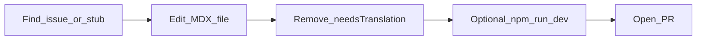
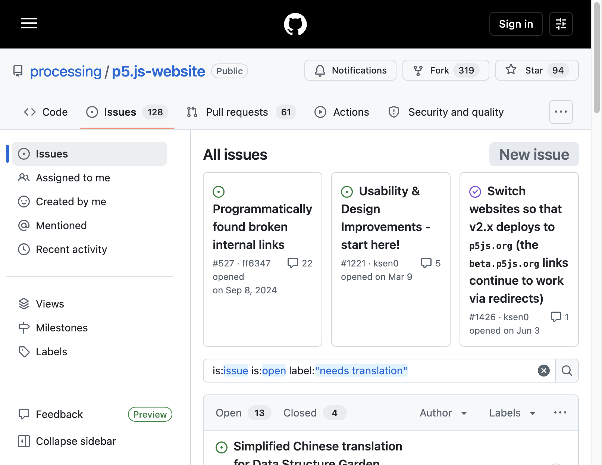
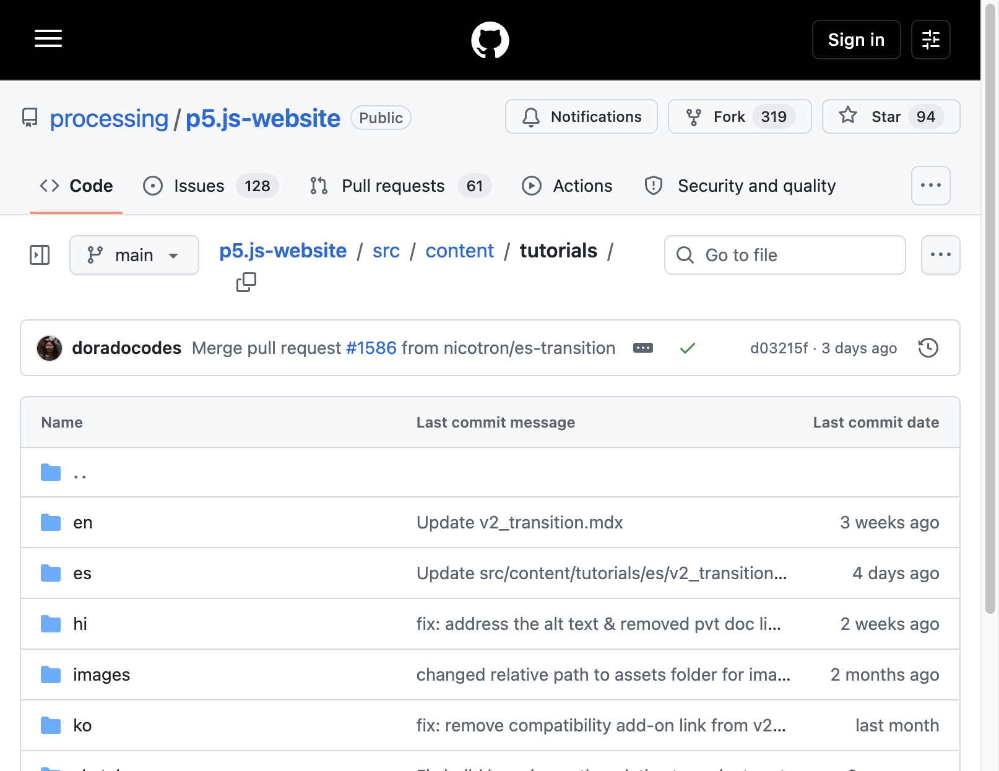
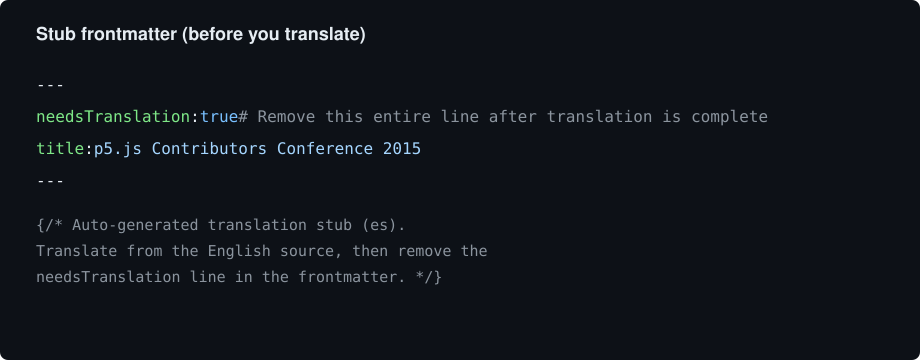
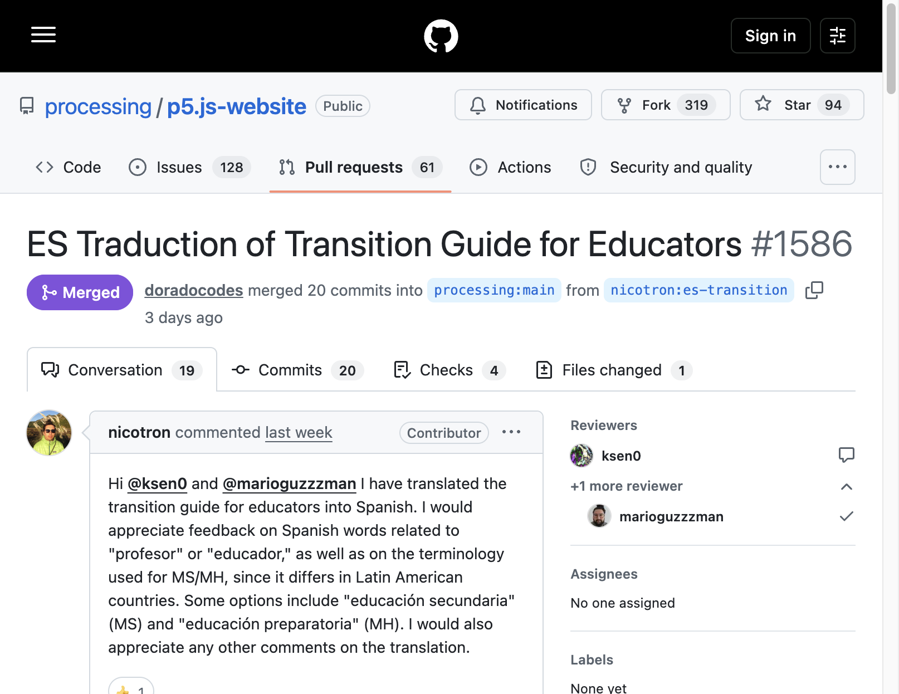

<!-- A short beginner guide to translating p5.js website content. -->

# Translating the p5.js Website

Many people start contributing to p5.js by translating website content. This guide walks through finding a page to translate, editing it, and opening a pull request on the [p5.js-website](https://github.com/processing/p5.js-website) repository.

This is about **website** pages (examples, tutorials, events, and similar content). It is not about translating the p5.js library API reference comments in the [p5.js](https://github.com/processing/p5.js) source code.



## 1. Find something to translate

Open the website Issues page and filter for the `needs translation` label:

[Open translation issues](https://github.com/processing/p5.js-website/issues?q=is%3Aissue+is%3Aopen+label%3A%22needs+translation%22)



Each issue usually lists:

- which English file needs work
- which languages still need a translation (`lang-es`, `lang-hi`, `lang-ko`, `lang-zh-Hans`, …)

Comment on the issue to say you are working on it (for example, “I’d like to translate this to Spanish”).

Sometimes a **stub file** already exists for your language. Stubs are placeholder MDX files that copy the English structure so you can fill in the translation. Look under `src/content/<type>/<your-language>/` for a file with `needsTranslation: true` at the top.

## 2. Find the file in the repository

Website content lives under `src/content/`. Each collection (for example `tutorials`, `examples`, `events`) has a folder per language:



Pick your language folder (for example `es` for Spanish), open the matching `.mdx` file, and edit it.

If you prefer editing on GitHub without cloning first, you can use the pencil icon on the file page after [forking](https://docs.github.com/en/pull-requests/collaborating-with-pull-requests/working-with-forks/fork-a-repo) the repository. For larger edits, cloning locally is more comfortable (see preview below).

## 3. Edit the translation

A stub often looks like this at the top of the file:



What to do:

1. Translate the visible text in the frontmatter (for example `title`, `description`) and the page body.
2. Keep code samples, links, and structure aligned with the English source unless a steward asks otherwise.
3. When you are done, **delete the entire** `needsTranslation: true` line (including the `#` comment on that line). That line tells the site the page is still a placeholder.

You do not need to machine-translate anything. Human translation is what we want.

## 4. Preview locally (recommended)

To see your page on a local copy of the site:

```bash
git clone https://github.com/processing/p5.js-website.git
cd p5.js-website
npm install
npm run dev
```

Then open the URL for your language and page in the browser (non-English pages use a locale prefix, for example `/es/...`).

You can also fork the repo on GitHub, clone **your** fork, and work on a branch before opening a pull request.

## 5. Open a pull request

1. Push your branch to your fork of `p5.js-website`.
2. Open a pull request into the website’s default contribution branch (follow whatever the PR template or maintainers ask for).
3. In the PR description, mention the issue number (for example `#1234`) so reviewers can connect your work to the tracker issue.



Keep the PR focused when you can (one language, one page or a small related set). That makes review easier.

GitHub’s own guide: [Creating a pull request](https://docs.github.com/en/pull-requests/collaborating-with-pull-requests/proposing-changes-to-your-work-with-pull-requests/creating-a-pull-request).

## More technical detail

For how localization is structured in the website codebase (routes, UI strings, fallbacks), see:

[Localization architecture (`docs/localization.md`)](https://github.com/processing/p5.js-website/blob/main/docs/localization.md)

Thank you for helping make p5.js welcoming in more languages!
