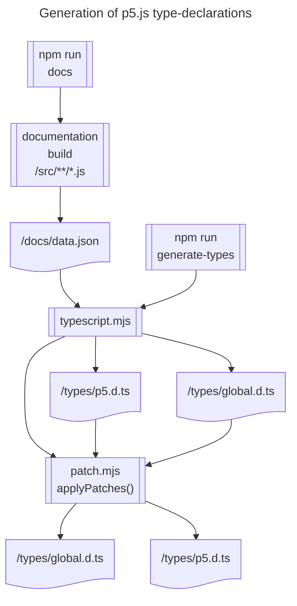

<!-- How the p5.js type declarations are generated. -->

# The type-generation process

This document outlines the process that generates type-declaration files for the p5 v2 library. (Types for v1 are not discussed here).

## What are the type declarations useful for?

The type-declaration files contain lists of every function, variable, and class in the p5.js library, the description and details of those elements.

These can be used by any compatible editor or code to provide (for example):

* Auto-completion & intellisense, including...
  - On-hover documentation of the P5 functions and variables
  - Completion suggestions: e.g. display of available methods and properties on the current object
  - Parameter hints: the name and required type of the current argument being passed to a function 
* Type-checking of typescript OR javascript sketches

It is *not* the case that the declarations are only for TypeScript!  The above functionality can be provided when the sketches in question are in JavaScript, too!

## Inputs

There are currently *two* inputs for the library's type declarations:
* The JSDoc comments in the javascript files in the source directory
* Ad-hoc overrides and additions for certain cases, stored in a patching script

## Outputs

* `types/p5.d.ts`
* `types/global.d.ts`

## Flow diagram for type-generation


## The process described

### Starting the process

The process is run with the following command on the p5js repo:

`npm run generate-types` runs:
```bash
"npm run docs && node utils/typescript.mjs"
```

### Step 1. npm run docs

The first step in the process is common to the reference-generation process, and so is documented in: [Reference-generation process](./reference_generation_process.md)

Specifically, the JSON file `/docs/data.json` is generated by `documentation build` from the p5.js source code.  This will be used as an input to the next step.

### Step 2. utils/typescript.mjs

A better name for this script might be `generate-types`.

This script: 

1. takes an initial pass at generating types from `docs/data.json`, producing: 

* `types/p5.d.ts`
* `types/global.d.ts`

2. it then delegates to the patching script, which amends the above files in place, into a final form.

### Step 2.1. <a id="patching-types"></a>Patching types
In a few specialized cases, the normal JSDoc way of documenting function parameter and return types fails.

To deal with these situations, a patching mechanism is in place which allows us to inject the correct types directly into the type-declaration files.

This is done in [./utils/patch.mjs](./utils/patch.mjs) through a series of calls to `replace()` which replaces the generated type coming out of the first phase of type-generation with the correct type.

#### Examples of patching:

In the following example, we correct the type for the `mouseButton` variable, which is initially generated incompletely from the JSDoc as: `'mouseButton: object;'`
This call to replace will look through the `p5.d.ts` file, looking for the above line, and replacing it with the corrected type - an object with three boolean properties.

```js
replace(
    'p5.d.ts',
    'mouseButton: object;',
    'mouseButton: { left: boolean; center: boolean; right: boolean };'
  );
```
The next example replaces, in _both_ files, the generated type of the `shuffle` function with a corrected generic version which states the input and output arrays will have the same type of elements.

```js
  replace(
    ['p5.d.ts', 'global.d.ts'],
    'shuffle(array: any[], modify?: boolean): any[];',
    'shuffle<T>(array: T[], modify?: boolean): T[];'
  );
```


## What about p5 v1 types?

The process described in this document does not apply to the types for the p5 v1 library.  There are (often out-of-date) types at [definitely-typed](https://github.com/DefinitelyTyped/DefinitelyTyped/tree/master/types/p5), packaged to npm as @types/p5. This document only discusses the types for p5 v2.


## Aside: "Why not just do X..."

It is more common in industry for such type-declarations to be generated by the TypeScript compiler (tsc) or similar.  However, in prioritising the ease-of-use experience for the library end user, the p5 library does some things in ways that mean this standard process is unsuitable.

## See also

The [reference-generation process](./reference_generation_process.md).

