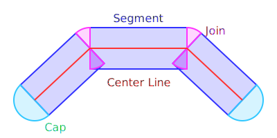
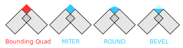
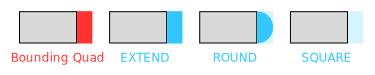
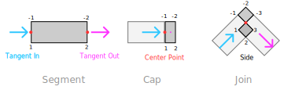

# p5.js WebGL Mode Architecture

This document is intended for contributors and library makers who want to extend the WebGL codebase. If you are looking for help using WebGL mode in your sketches, consider reading the WebGL tutorials [on the p5.js Learn page](https://p5js.org/learn/) instead.

## What is WebGL mode?

There are two renderers that p5.js can run in, 2D and WebGL mode. WebGL mode in p5.js allows the user to make use of the [WebGL API](https://developer.mozilla.org/en-US/docs/Web/API/WebGL_API) built into the web browser for rendering high-performance 2D and 3D graphics. The key difference between 2D mode and WebGL mode is that the latter provides more direct access to the computer's GPU, allowing it to performantly render shapes in 3D or perform other graphics and image processing tasks. 

We keep track of the progress of WebGL issues in [a GitHub Project.](https://github.com/orgs/processing/projects/20)

## Goals of WebGL mode

When evaluating a new feature, we consider whether it aligns with the goals of p5.js and WebGL mode:

1. **Features should be beginner friendly:** It should provide a **beginner-friendly introduction to WebGL** and the features it offers. This means that we should offer simple APIs for 3D shapes, cameras, lighting, and shaders. We can still support advanced features, but only if they do not interfere with the simplicity of core features.
2. **Improving feature parity with 2D mode:** It should be a **frictionless transition from 2D mode,** making 3D and WebGL "click" more easily for users. This means that we try to create features that work in 2D mode and also in WebGL mode. Since WebGL also has 3D and shader features, this means WebGL mode aims to have a superset of 2D mode's features.
3. **Simplicity and Extensibility are paramount:** It should **have a small core and be extensible for libraries.** Keeping WebGL mode small makes it easier to optimize core features and reduce bug surface area. Extension provides an avenue to include more advanced features via libraries.
4. **Improve p5.js performance:** It should **run as fast as possible without interfering with the previous goals.** Good performance keeps sketches accessible to a wide variety of viewers and devices. When designing new APIs, we try to ensure the design has a performant implementation. However, we give preference to simplicity and parity with 2D mode.

## Design Differences with 2D Mode

The browser's 2D and WebGL canvas context APIs offer very different levels of abstraction, with WebGL being generally lower-level and 2D being higher-level. This motivates some fundamental design differences between p5.js's WebGL and 2D modes.

- **WebGL mode creates more deeply nested data structures.** 2D mode generally passes commands to the browser, leading to relatively shallow call stacks. In contrast, WebGL mode is responsible for breaking down shapes into triangles, rendering them, and often caching them for future reuse. The more complicated rendering logic necessitates splitting code into a number of classes like `p5.Texture`, `p5.RenderBuffer`, and `p5.DataArray` to keep implementations readable and maintainable.
- **WebGL mode offers more customization.** For example, while 2D mode does not control how curves get rendered, WebGL is responsible for converting them into triangles. While it picks a sensible default, the `curveDetail()` API lets users control how many line segments to use, as we cannot predict the best balance of quality and performance for every use case.
- **WebGL mode must balance high- and low-level APIs.** Since finer-grained control is available with the browser WebGL API, p5.js's WebGL mode is able to offer users some of that control where 2D mode cannot. We then are faced with the task of picking the right level of abstraction for users. Too high, and they are unable to take advantage of some of what the browser has to offer; too low, and we pass too much of the work of managing complexity and performance onto the user.

## Drawing Shapes

### Creating Shapes: Fills, Strokes, and 3D Geometry

Everything drawn by p5.js, both in 2D and WebGL, consists of fills and strokes. Sometimes, we only draw one or the other, but every shape must be ready to draw either component.

All shapes in webGL are composed of triangles. When a user calls a function like `circle()`, `beginShape(),` or `vertex()`, the renderer must [break the shape down into a series of points](https://github.com/processing/p5.js/blob/main/src/webgl/3d_primitives.js). The points are connected into lines, and the lines into triangles. For example, `circle()` uses trigonometry to figure out where to place points along a circle. `curveVertex()` and `bezierVertex()` create look-up tables to turn any Bezier curve into points.

#### Fills

To create fills, the outline of a shape needs to be filled in with triangles. Some drawing functions like `beginShape(TRIANGLE_STRIP)` already provide triangles for fills. If the shape being drawn is not already made using triangles, we use the library [libtess](https://github.com/brendankenny/libtess.js/) to break it down: in [p5.RendererGL.Immediate.js](https://github.com/processing/p5.js/blob/main/src/webgl/p5.RendererGL.Immediate.js), we run polygon outlines through `_processVertices()`. After libtess turns them into triangles, they are in a format where a shader can draw them to the screen.

#### Strokes

Despite their name, strokes also need to be filled in to support strokes of varying widths and styles. The lines along the outline of a shape need to expand out from their centers to form shapes with area. Expansion of strokes creates three types of shapes: joins, caps, and segments, illustrated below.

<!-- Generated via https://codepen.io/davepvm/pen/ZEVdppQ -->

Where two line segments connect, we add a join. 

- A miter join extends the edges of the rectangles until they intersect at a point. 
- A bevel join connects the corners of the rectangles with a straight line. 
- A round join connects the corners with a circular arc. 

We support switching join styles without having to recompute line triangles. To do this, we make each line join a quad, composed of two triangles. The quad extent bounds all possible join styles. We use a shader to only display pixels within the quad that are present in the selected join style. We illustrate how each style fits into the quad below.

We use a similar strategy for stroke caps, present at the disconnected ends of lines. Each cap is a quad that bounds round, square, and extended cap styles. The line shader determines which pixels it needs to draw within those bounds. Below, we illustrate how each style fits into the quad.

3D shapes can also have strokes, but stroke shapes are calculated in 2D. This means they can change based on the camera's perspective. We want to avoid as much recalculation as possible, so we store all the information about the line that is not camera-dependent:

- We include the **center points of the line** in model space, shown below in red.
- We include the **direction of the line**, its tangent, at the start and end of each shape, shown in blue and pink, respectively. This helps us compute the shape of joins where two lines connect.
- We include **a flag that uniquely identifies each corner of the shape.** Combined with the tangent and the normal (a 90-degree rotation of the tangent), it helps determine in what direction to expand the line to give it thickness.

To draw the line, we combine that information with camera intrinsics in a shader to produce the final line positions in screen space.

### Rendering Shapes: Immediate and Retained Modes

There are two routes that p5.js uses to draw shapes onto the screen: **immediate mode** and **retained mode.**

**Immediate mode** is optimized for shapes that change every frame. If you were drawing a curve that changes each frame, its shape data would be different every time you drew it. Because of this, immediate mode fits it best. It indicates to p5.js that it does not need to spend time storing the shape for reuse, and it saves graphics memory from being filled up with all the shape variations over time. The following functions use this mode:

- `vertex()`, `curveVertex()`, `bezierVertex()`, and `quadraticVertex()`, called between `beginShape()` and `endShape()`
- `rect()` when using rounded corners
- `bezier()`
- `curve()`
- `line()`
- `image()`

Retained mode is optimized for shapes that you will need to keep redrawing and don’t change shape. Once a shape is made of triangles and has been sent to the GPU to draw, retained mode keeps it there. It can then be drawn again without having to spend time re-triangulating it or sending it to the GPU again. The saved shape data is kept in a p5.Geometry object. p5.Geometry stores triangle data and keeps track of its uploaded buffers on the GPU. Calling `freeGeometry()` clears the GPU data to make space. Drawing it again after that will re-upload the data. Many 3D shape drawing functions in p5.js, such as `sphere()` or `cone()`, use this internally.

You can use buildGeometry() to make a p5.Geometry out of immediate mode commands. You call it with a function that runs a series of any p5.js shape drawing functions. It runs the function, collects the shapes into a new p5.Geometry, and returns it. The p5.Geometry can then be drawn and redrawn efficiently in the future.

## Materials, Lights, and Shaders

Every shape we draw uses a single shader for its fills, and a single shader for its strokes. There are a few default shaders that one can pick from in p5.js. You can also write and use your own shader instead of the default ones.

The default shaders work with p5.js's lighting and materials system. The user can specify what lights are in the scene with a shape and how each object reacts to light, including color and shininess. This information is given to the shader for each object being drawn. Custom shaders can also access the same lighting and material information, allowing users and library makers to extend the default rendering behavior.

### Shaders

P5 has a few shaders built in:

- **Color Shader:** for drawing flat colors, activated by using `fill()` or `stroke()`.
- **Lighting Shader:** for drawing 2D and 3D shapes with complex lighting and textures. Activated by calling `lights()`, `ambientLight()`, `directionalLight()`, `pointLight()`, and `spotLight()`. Each adds a light to the lighting list. All added lights contribute to the shading of the shape. If you do not use lights, the shape will be drawn using the color shader, which only uses the fill color.
- **Normal/Debug Shader:** for drawing 2D and 3D shapes using the surface normal as a color. It is activated by calling `normalMaterial()`.

### Lights

Users can set `ambientLight()`, `directionalLight()`, `pointLight()`, and `spotLight()`. Each adds a light to the lighting list. All added lights contribute to the shading of the shape. They all have a color, and some have a few other parameters, such as position or direction.

For all but `ambientLight()`, each light added contributes to the view-independent lighting of shapes and the view-dependent reflections. The reflection of each light, by default, matches the color of that light. If desired, one can change the color of all reflections by setting `specularColor()`.

If you do not use lights, the shape will be drawn using the **color shader,** which only uses the fill color.

### Materials

Each 3D object has a few material properties that can be set by the user:

- **Fill color:** This is the color you see when there are no lights. Set it with `fill()`. If done before drawing the shape, it applies to the whole shape. If called before a `vertex()` between `beginShape()`/`endShape()`, it will apply only to that vertex. A texture, if present from a call to `texture()`, will override the fill. When there are lights, this color will be mixed with the diffuse component of the light. The diffuse component describes the bright and dark areas of the surface due to light being directly cast on it.
- **Specular material:** This is the color that gets mixed with the specular component of the light. The specular component describes the reflected highlights seen on the shape's surface. Set this parameter with `specularMaterial()`. If unspecified, the shape will have no reflections.
- **Shininess:** Set with `shininess()`, this is how sharp the specular reflections are.
- **Ambient material:** This is the color that gets mixed with the ambient light. Ambient light describes constant omnidirectional light on the shape. Set this parameter with `ambientMaterial()`. If unspecified, it will be the same as the fill color.
- **Emissive material**: Set with `emissiveMaterial()`, this adds a constant color to the lighting of the shape, as if it were producing its own light of that color.

### Shader Implementation

The lighting and material parameters get turned into shader attributes and uniforms. If you reference them in a custom shader, p5.js will supply them automatically.

While advanced shader writers can take advantage of these properties, it can be unclear for new users. In the Future Goals section, we describe some plans for improving the API. We may want to improve it before publicly documenting and supporting it.

#### Global

For all objects in all contexts, the following global uniforms are available:

- `uniform mat4 uModelViewMatrix`: A matrix to convert object-space positions into camera-space
- `uniform mat4 uProjectionMatrix`: A matrix to convert camera-space positions into screen space
- `uniform mat3 uNormalMatrix`: A matrix to convert object-space normals into camera-space

Additionally, these per-vertex properties are available as attributes:

- `attribute vec3 aPosition`: The position of the vertex in object space
- `attribute vec3 aNormal`: For fills, a direction pointing outward from the surface
- `attribute vec2 aTexCoord`: For fills, a coordinate between 0 and 1 in x and y referring to a location on a texture image
- `attribute vec3 aVertexColor`: For fills, an optional per-vertex color

#### Lights

- `uniform bool uUseLighting`: Whether or not lights have been provided

If `uUseLighting` has been set, further lighting information will be passed in:

##### Ambient lights

- `uniform int uAmbientLightCount`: How many ambient lights are present, up to a maximum of 5
- `uniform vec3 uAmbientColor[5]`: Ambient light colors

##### Directional lights

- `uniform int uDirectionalLightCount`: How many directional lights are present, up to a maximum of 5
- `uniform vec3 uLightingDirection[5]`: Light directions
- `uniform vec3 uDirectionalDiffuseColors[5]`: Light diffuse colors
- `uniform vec3 uDirectionalSpecularColors[5]`: Light specular colors

##### Point lights

- `uniform int uPointLightCount`: How many point lights are present, up to a maximum of 5
- `uniform vec3 uPointLightLocation[5]`: Locations of point lights
- `uniform vec3 uPointLightDiffuseColors[5]`: Diffuse colors of point lights
- `uniform vec3 uPointLightSpecularColors[5]`: Specular colors of point lights

##### Spot lights

- `uniform int uSpotLightCount`: How many spot lights are present, up to a maximum of 5
- `uniform float uSpotLightAngle[5]`: Spot light cone radii
- `uniform float uSpotLightConc[5]`: Concentration (focus) of each spot light
- `uniform vec3 uSpotLightDiffuseColors[5]`: Light diffuse colors
- `uniform vec3 uSpotLightSpecularColors[5]`: Light specular colors
- `uniform vec3 uSpotLightLocation[5]`: Spot light locations
- `uniform vec3 uSpotLightDirection[5]`: Spot light directions

#### Materials

##### Fill color

- `uniform vec4 uMaterialColor`: shape fill color
- `uniform bool uUseVertexColor`: Whether there are per-vertex colors that override the shape fill color
- `attribute vec4 aVertexColor`: Per-vertex fill color
- `uniform bool isTexture`: Whether a texture is specified
- `uniform sampler2D uSampler`: A texture
- `uniform vec4 uTint`: A tint multiplier for the texture

##### Specular reflections

- `uniform bool uSpecular`: Whether to show reflections
- `uniform float uShininess`: The shininess of the material
- `uniform vec4 uSpecularMatColor`: The material color to blend with specular light

##### Ambient color

- `uniform bool uHasSetAmbient`: Whether an ambient color has been set or if it should default to the fill color
- `uniform vec4 uAmbientMatColor`: The material color to blend with ambient light

#### Other shader inputs

##### Lines

The default line shader is automatically supplied with these global properties in uniforms:

- `uniform vec4 uViewport`: A vector containing `[minX, minY, maxX, maxY]` of the screen rectangle
- `uniform int uPerspective`: A boolean specifying whether to apply perspective projection to line thickness
- `uniform int uStrokeJoin`: An enum representing the join style. 0, 1, and 2 represent `ROUND`, `MITER`, `BEVEL`.
- `uniform int uStrokeCap`: An enum representing the cap style. 0, 1, and 2 represent `ROUND`, `PROJECT`, `SQUARE`.

It also has the following per-vertex attributes:

- `attribute vec3 aTangentIn`: The 3D direction at the start of the line segment
- `attribute vec3 aTangentOut`: The 3D direction at the end of the line segment
- `attribute float aSide`: An enum representing what part of the stroke shape the point is on. See the Strokes section for details.

##### Points

- `uniform float uPointSize`: The radius of the point being drawn

## Classes

The entrypoint to most WebGL code is through **p5.RendererGL**. Top-level p5.js functions are passed to the current renderer. Both 2D and WebGL modes have renderer classes that conform to this common interface. Immediate mode and retained mode functions are split up into **p5.RendererGL.Immediate.js** and **p5.RendererGL.Retained.js**.

Within the renderer, references to models are stored in the **retainedMode.geometry** map. Each value is an object storing the buffers of a **p5.Geometry**. When calling model(yourGeometry) for the first time, the renderer adds an entry in the map. It then stores references to the geometry's GPU resources there. If you draw a p5.Geometry to the main canvas and also to a WebGL p5.Graphics, it will have entries in two renderers.

Each material is represented by a **p5.Shader.** You set the current shader in the renderer via the shader(yourShader) function. This class handles compiling shader source code and setting shader uniforms.

When setting a shader uniform, if the uniform type is an image, then the renderer creates a p5.Texture for it. Each p5.Image, p5.Graphics, p5.MediaElement, or p5.Framebuffer asset will get one. It is what keeps track of the image data's representation on the GPU. Before using the asset in a shader, p5.js will send new data to the GPU if necessary. For images, this happens when a user has manually updated the pixels of an image. This happens every frame for assets with data that may have changed each frame, such as a video or a p5.Graphics.

Textures corresponding to **p5.Framebuffer** objects are unique. Framebuffers are like graphics: they represent surfaces that can be drawn to. Unlike p5.Graphics, framebuffers live entirely on the GPU. If one uses a p5.Graphics as a texture in a shader, the data needs to be transferred to and from the CPU. This can often be a performance bottleneck. In contrast, when drawing to a framebuffer, you draw directly to its GPU texture. Because of this, no extra data transfer is necessary. WebGL mode tries to use p5.Framebuffers over p5.Graphics where possible for this reason.

## Future Goals

Currently, WebGL mode is functional for a variety of tasks, but many users and library makers want to extend it in new directions. We aim to create a set of building blocks for users and library makers from which they can craft extensions. A block can be considered "done" when it has an extensible API we can confidently commit to supporting. A major milestone for WebGL mode will be when we have a sufficient set of such blocks for an ecosystem of libraries. The main areas currently lacking in extension support are geometry and materials.

- **Extend p5.Geometry to support richer content.** One can create geometry, but many tasks a user might want to accomplish are not yet supported with a stable API. One might want to efficiently update geometry, which is necessary to support animated gltf models. One might want to group multiple materials in one object, if they are present in an imported model. One might want to add custom vertex attributes for a shader to work with. These tasks are currently unsupported.
- **Enable less brittle custom shaders.** To create a shader that integrates p5.js's lighting and materials system, a user is currently forced to create shaders from scratch. These shaders often copy and paste parts of default shaders. This may break between versions if internal naming or structure changes. To be less brittle, libraries should be able to import and reuse default pieces. This lets libraries reuse positioning logic or augment positioning logic but reuse shading logic. There is currently [an issue open for this task.](https://github.com/processing/p5.js/issues/6144)
- **Improve performance.** WebGL mode tries to strike a balance between features and performance. One method is to introduce APIs to tune output quality, like how `curveDetail()` allows faster but lower-quality curves. Line rendering is one of the common performance bottlenecks in its present state, and it could benefit from having lower fidelity but higher performance options. Another method is to introduce new types of objects and rendering methods that are optimized for different usage patterns, like how `endShape(shouldClose, count)` now supports WebGL 2 instanced rendering for more efficient drawing of many shapes.

