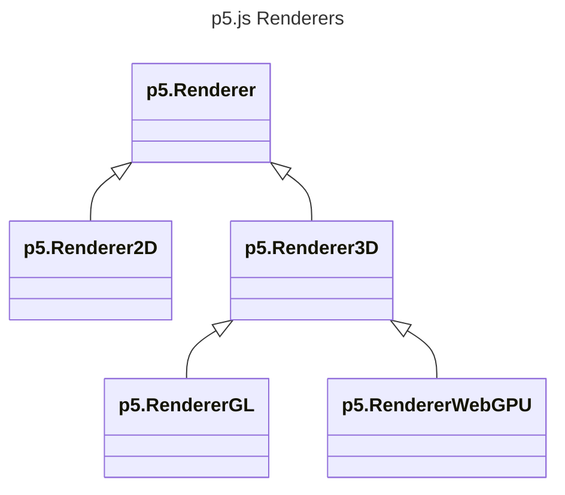

<!-- The goals and aspirations of our experimental WebGPU mode. -->

p5.js has recently added an experimental WebGPU mode. It is a 3D-capable renderer like WebGL mode, and supports all the functions available in WebGL mode, but has been built using different underlying technology that will help p5.js stay up-to-date as browsers evolve.

It's still in the early days, so we would love for people to test it out, give feedback, and get involved!

## Using WebGPU mode

WebGPU mode is currently experimental, so it is not in the standard build of p5.js. Instead, it comes in a separate file, which you can add to your project after the standard p5.js `script` tag like any other addon:

```html
<html>
  <head>
    <!-- Libraries -->
    <script type="text/javascript" src="p5.js" />
    <script type="text/javascript" src="p5.webgpu.js" />

    <!-- Your code -->
    <script type="text/javascript" src="sketch.js" />
  </head>
  <body>
  </body>
</html>
```

In WebGPU, some more things are asynchronous than before. Creating the WebGPU canvas is `async`, and must now be `await`ed:

```js
async function setup() {
  await createCanvas(400, 400, WEBGPU);
}
```

Anything that involves loading pixels is also `async`, so `loadPixels()` and `get()` must now also be `await`ed. Consider using shaders for pixel-level drawing and framebuffers for image copying if you need to do these every frame of an animation.

## Contributing

We'd love to have more people involved with WebGPU mode! Here are some ways you can help:

- Test it out! Let us know what bugs you encounter by filing issues on GitHub.
- Help us optimize the new rendering system. The first step is also testing: what parts are faster or slower than the more stable WebGL mode? Based on that, we can decide on changes to the rendering system to address those issues and implement them in the codebase.
- Brainstorm new ideas! There are new capabilities in the WebGPU spec that we can bring to p5, such as compute shaders. Talk to us on Discord about what you'd love your code to look like when creating, for example, a particle system on the GPU, and we can see how we can build an API around that.

## Goals

So far, the renderers in p5.js can be grouped into 2D and 3D-capable renderers. Initially, there was one renderer for each: the default 2D mode and WebGL mode. The initial goal for WebGPU mode is to be an equivalent of WebGL mode: anything it can do, WebGPU mode aims to also be able to do. But that is also just the starting point. **We view WebGPU mode as a way to give new tools to artists as technology advances, and as a way to ensure p5.js stays up-to-date with browser technology for the next decade.**

WebGPU mode is not aiming to be a more efficient renderer. This is similar to WebGL mode: WebGL mode will not automatically be faster than 2D mode; instead, it provides a different set of tools that may be more appropriate for some tasks. WebGL and now WebGPU modes provide tools for drawing using the GPU and for drawing in 3D.

### New computational tools

The underlying WebGPU technology is still relatively new, but it seems like it will grow to support more than the older WebGL technology can. WebGPU mode in p5.js will be a spot for us to give artists and programmers access to these new computing capabilities, in an accessible package. Compute shaders will likely be the first example of this. Both WebGL and WebGPU support shaders, which currently are used to position vertices of shapes and to pick pixel colors within a triangle all in parallel on the GPU. The WebGPU specification additionally has [compute shaders](https://webgpufundamentals.org/webgpu/lessons/webgpu-compute-shaders.html), which can be used to process arbitrary data in parallel without it being attached to rendering.

WebGPU mode will not try expose everything WebGPU has to offer to programmers. Instead, it should strategically pick what it exposes, balancing the goals of **expanding creative possibilities** and **being easy to learn.** As an example, a p5.js compute shader API does not need to do everything raw WebGPU compute shaders can do as long as it is still helpful for common tasks, and can be easily adopted without a steep learning curve.

### Preparing for the future

At the time of writing (December 2025), WebGPU is not yet turned on by default in all major browsers on all platforms, but all major browsers are actively developing WebGPU support. There is a lot of energy behind WebGPU development and features while browser WebGL APIs, while not going away, seem largely to be in legacy mode, no longer adding new features. Since p5.js aims to be an accessible way to create programmatic art for the web, and new tools for the web are likely to be created in WebGPU but not WebGL, p5's WebGPU mode will take on a greater importance over time.

Currently, though, WebGL is stable, reliable, and widely available. For that reason, p5.js WebGPU mode will be opt-in and experimental for some time.

## Design decisions

### Class structure

With the addition of WebGPU mode, the built-in p5 renderers have the following structure:



Entities that are shared by all 3D renderers such as `p5.Geometry`, `p5.Framebuffer`, `p5.Texture`, `p5.Camera`, and `p5.Shader`, rather than including code in each entity to handle both WebGL and WebGPU cases, instead call methods on their 3D renderers. These methods are unimplemented on the base `Renderer3D` class, but are implemented in `RendererGL` and `RendererWebGPU` with platform-specific logic. All new platform-specific logic should be added to renderer classes now rather than being on the entities.

### Rendering

While WebGL mode submits all draw commands immediately, WebGPU mode defers submitting until the last possible moment so that it can submit draw commands in batches. Rather than drawing, commands are built up in an array and `_hasPendingDraws` is set to `true`. In `finishDraw`, called at the end of each frame, these are all finally submitted to the GPU as one render pass. There are a few other times where they get submitted early in other render passes. When switching draw targets, such as when drawing to a framebuffer, pending draws are submitted in a render pass too. This makes sure that you can then read from the framebuffer safely in the next render pass. We also submit a render pass when you call `loadPixels` or another function that involves reading back data from the GPU.

Since draws get batched up, this means that buffers used to send shader uniform values to the GPU cannot be shared. If they were shared, they would get rewritten by the next thing getting drawn before the previous one gets to the GPU! Instead, we build up a pool of buffers that we can pull from for shader uniforms and vertex information.
