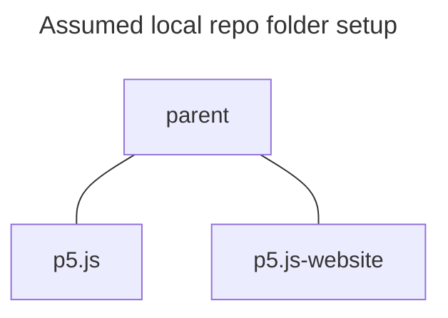

<!-- How to write, edit, and preview contributor documents. -->
# Working with contributor documents

## Table of Contents
* [Where are they?](#where-are-they)
* [Build process overview](#build-process-overview)
* [Generating and previewing contributor documents](#generating-and-previewing-contributor-documents)
* [Adding a new contributor document](#adding-a-new-contributor-document)

## Where are they?
Contributor documents are displayed on the p5.js website at either:

* https://p5js.org/contribute/ (for p5.js v1)
* https://beta.p5js.org/contribute/ (for p5.js v2)

Their source materials are kept in: 
* repo: `p5.js`
* path: `contributor_docs/`

(Note: The v1.x and v2.x branches have different documents.)

## Build process overview

During the website build process `build:contributor-docs`, the documents are cloned from the requested branch of the p5.js repo into the relevant website file-system locations.

## Generating and previewing contributor documents

### Quick preview 
For a quick preview, various editors have a feature to render markdown files.  For example, if you're using vs code here's how to do that:

* open the .md file you wish to preview
* open the command-palette (`F1` or `cmd-shift-p` or `ctrl-shift-p`)
* type `Markdown: open preview`

<!-- TODO: list limitations of this quick-preview approach: e.g.the website styling (including line width) will not be applied. -->

### Preview on local p5.js-website clone

At some point you will want to preview how your changes will look on the website.  This involves run the website locally and having it import the contributor docs from a branch of your p5.js repo.

In the following steps we'll assume your p5.js repository is in a folder called `p5.js` and your p5.js-website repo is in a folder next to it called `p5.js-website`.



#### Steps:

1. Commit your changes to a local branch of your fork of the p5.js repo.  The changes don't need to be pushed to github for this purpose, but they do need to be committed on a branch.
1. Clone [the p5.js-website repo](https://github.com/processing/p5.js-website/tree/2.0) locally.
1. Open a terminal in your new p5.js-website repo
1. Check out the branch "2.0"
1. Run `npm install`
1. Modify and run the following command, using the path to **your** local p5.js repo, and the name of **your** branch: 

(Note the following is a single line, not two lines!)

```sh
P5_REPO_URL=path/to/your/p5/repo P5_BRANCH=your-branch-goes-here npm run build:contributor-docs && npm run dev
```

For example, if your work is in a branch called `my-amazing-branch` on a local p5.js repo called `p5.js` as a sibling folder next to the current `p5.js-website` folder, you could run the following:

```sh
P5_REPO_URL=../p5.js P5_BRANCH=my-amazing-branch npm run build:contributor-docs && npm run dev
```

This will do three things:
1. import and build local website `.mdx` pages from the `.md` files in `contributor_docs/` in your branch
2. start a development preview of the website
3. display a URL in the console where you can visit the local website

Use your browser to visit the URL mentioned in the last step, in order to test out your changes.

#### Alternative: Building from a branch on github

If you prefer to preview work that's already on github, you can do so.  In the final command, use the repo URL instead of its local path, as follows:

(Again, note the following is a single line, not two lines!)

```sh
P5_REPO_URL=https://github.com/yourUsername/p5.js.git P5_BRANCH=your-branch-goes-here npm run build:contributor-docs && npm run dev
```

#### Troubleshooting

If your file isn't appearing in the list the website shows at the path `contribute/`:

* Note that it will appear with a title taken from the first level 1 markdown heading, NOT the name of the file.

* Check that a corresponding `.mdx` file is being generated in `src/content/contributor-docs/en` in the website file-structure.  If not, check if your .md file is git in the branch you've specified, in the correct location, and check the logs, during the website build:contributor-docs

* Review the log from the above run of the npm `build:contributor-docs` process, for mentions of your file(s).

* If you see that an .mdx file _is_ being generated, check that you can access it directly on the website by typing its URL.  e.g. if your file is called myFile.md, the path in the URL would be: `contribute/myFile/`

* Ensure you see in the log that your repo _has_ actually been cloned.  There is a caching mechanism in the website build process which prevents a recently cloned repo from being cloned again.  Removing the website folder `in/p5.js/` will force the build process to make a new clone.

#### Limitations

The website won't be _fully_ functional when partially prepared in this way.  Notably:

* Links between pages may be broken:
  * You'll need to ensure local links end with a trailing slash '/', to be matched by Astro when it is in development mode.
* The search facility will not work by default
  * Look into `npm run build:search` to build the necessary index files.
  

## Adding a new contributor document

We'll consider file path, filename, file extension, title, subtitle, and eventual URL path for your new document.

#### The file path

It should be stored in `contributor_docs/` folder in the _p5.js_ repo.

It should be stored as a direct child of that folder, _not_ in a subfolder.

#### The filename and extension

The filename won't be used as the document title but _will_ be used in URLs.  The filename should be all in lowercase, and use underscore characters `_` instead of spaces or dashes.

It should have a `.md` file extension.

Keep the filename concise but do not use contractions.  e.g. "documentation_style_guide" not "doc_style_guide".  If in doubt check the names of the other documents in the folder and try to stay aligned with those.

#### The _name_ of your document
For presentation purposes in the list of contributor docs and for search results, your document title will be taken from the first level 1 markdown heading, NOT the name of the file.

#### The subtitle for your document
In the list of contributor docs, each page is listed not only with its title but also a subtitle or short description.

This description is extracted from the first HTML-style comment in your file.  This should be on the first line, before the level 1 heading.

Example:

<!-- The following weird syntax is necessary to show the reader an HTML comment, as our current MDX  generation process won't leave alone such a comment in a code-block.  -->

In `contributor_docs/unit_testing.md` the file content starts:

<div className="astro-code">
&lt;!&dash;- Guide to writing tests for p5.js source code.  &dash;-&gt;

\# Unit Testing
</div>

As a result, this will list a page titled "Unit Testing" with a description of "Guide to writing tests for p5.js source code.".

#### The URL for your document

The path in the eventual URL will be
`contribute/your-filename-without-extension/`
Note that the trailing slash is necessary in development mode.

Example:

The source document `contributor_docs/unit_testing.md` will be served as `https://beta.p5js.org/contribute/unit_testing/`


<!-- 
## TODO

* on linking to reference pages
* on linking to other contrib and tutorial docs
* on including images and other assets in a contributor doc
* translations - won't cover.  link elsewhere?
* Add a section on quicker experimental editing of the generated version of the contrib doc directly in the website filesystem (no need to rebuild, and it will auto-reload on file save)
  * However add note that it's easy to forget and lose this work.   
-->
