# 贡献者指南
欢迎来到贡献者指南！本文档适用于希望向 p5.js 贡献代码的新贡献者，希望在一些技术步骤上进行刷新的贡献者，或者与 p5.js 的代码贡献相关的其他任何事情。

如果您希望在 p5.js 存储库之外做出贡献（编写教程，计划课程，组织活动），请查看其他相关页面。管理员或维护人员可能会发现[管理员指南](./steward_guidelines.md)在审查问题和拉取请求方面更有帮助。

本文档内容较长而全面，但我们将尽量清晰地说明所有步骤和要点。请利用目录，浏览器的搜索功能（`Ctrl + F`或`Cmd + F`）来查找与您相关的部分。如果某些部分与您计划的贡献无关，可以跳过它们。

# 目录
- [关于Issue](#关于issue)
	- [Issue是什么？](#issue是什么)
	- [问题模板](#问题模板)
		- ["发现了一个错误"](#发现了一个错误)
		- ["现有功能增强"](#现有功能增强)
		- ["新功能请求"](#新功能请求)
		- ["讨论"](#讨论)
- [在p5.js代码库上工作](#在p5js代码库上工作)
	- [使用Github的编辑功能](#使用github的编辑功能)
	- [Fork p5.js并从您的Fork上工作](#fork-p5js并从您的fork上工作)
	- [代码库拆分](#代码库拆分)
	- [构建设置](#构建设置)
	- [Git工作流程](#git工作流程)
		- [源代码](#源代码)
		- [单元测试](#单元测试)
		- [内联文档](#内联文档)
		- [国际化](#国际化)
		- [可访问性](#可访问性)
	- [代码规范](#代码规范)
	- [设计原则](#设计原则)
- [拉取请求](#拉取请求)
	- [创建拉取请求](#创建拉取请求)
		- [拉取请求信息](#拉取请求信息)
		- [变基和解决冲突](#变基和解决冲突)
	- [讨论和修改](#讨论和修改)

---
# 关于Issue
p5.js 的 Github 存储库（repo）上的大部分活动都发生在问题上，Issue 很可能也是您开始贡献过程的地方。

## Issue是什么？
Issue 是Github 上描述 Issue 的帖子的通用名称。这个"Issue"可以是一个错误报告，一个添加新功能的请求，一个讨论，一个问题，一个公告，或者任何可以作为帖子的内容。任何具有Github账号的人，包括机器人，都可以在每个问题下方添加评论！这是贡献者讨论与项目开发相关主题的地方。

尽管问题可以因各种原因而被提出，但对于p5.js的仓库，我们通常只使用问题来讨论与p5.js源代码开发相关的主题。像调试你自己的代码、邀请合作者加入你的项目或其他不相关的主题应该在[论坛](https://discourse.processing.com)或其他平台上进行讨论。

我们创建了易于使用的问题模板，以帮助您决定一个主题是否应该是Github的问题，还是应该在其他地方发布！

## 问题模板
p5.js 的问题模板不仅使管理员和维护者更容易理解和审查问题，还使您更容易提交相关问题并更快地获得答复。尽管它们被称为模板，但从您的角度来看，就像填写一个简单的表格，其中表格的不同字段是问题审查者需要正确诊断您的问题所需的重要信息。

要提交新的问题，请转到p5.js存储库的“Issues”选项卡，然后点击“New issue”按钮（通常为绿色且位于右侧）。点击后，将显示几个不同的选项，每个选项对应一个相关的问题模板，或者将您重定向到适当的地方提交您的问题。请从所呈现的所有选项中选择最相关的选项，以确保您的问题能够迅速得到正确的关注。以下将介绍适用于p5.js的问题模板，对于其他存储库，请查阅它们各自的贡献者文档。

### "发现了一个错误"
当你在使用p5.js时遇到可能的错误行为或某些行为与文档描述不符时，请使用以下模板。请注意，如果你尝试调试自己的代码或弄清楚为什么你的草图的行为与你预期的不同，并且你认为可能是你的代码的问题，你应该在[论坛](https://discourse.processing.org)上提问。如果后来确定你的问题确实源自p5.js，你可以随时打开一个问题并使用这个模板。

这个模板有几个需要填写的字段：
1. "p5.js 中最相关的子领域是什么？" - 这有助于相关的管理者识别和回应你的问题。这将自动使用相关的[标签](./issue_labels.md)给问题打上标签。
2. "p5.js 版本" - 你可以在`<script>`标签的链接中或者在p5.js/p5.min.js文件的第一行找到p5.js的版本号。它的格式类似于`1.4.2`（由三个点分隔的数字）。
3. "Web浏览器及版本" - 在Chrome中，在地址栏中输入"chrome://version"；在Firefox中输入"about:support"；在Safari中，在顶部栏"Safari"菜单项下选择"关于Safari"。这有助于我们区分不同浏览器之间的行为差异。
4. "操作系统" - 如果可能，请提供操作系统的版本号，例如`macOS 12.5`。有些错误可能也源自操作系统的行为。
5. "重现步骤" - 这可能是最重要的信息。你应该列出详细的步骤来重现你所遇到的错误。分享一个能够演示问题的基本示例代码可以让其他人更容易重现你面临的错误并开始制定解决方案。

正如上面提到的，模板中的许多不同字段旨在重现错误。你提供的关于草图环境以及其他人如何重现你所看到的问题的更多信息，将更容易让任何人理解你的问题并开始寻找解决方案。**请尽可能提供详细的信息，避免使用泛泛的陈述**，例如不要说"image()函数不起作用"，而是要更具体地描述，例如"image()函数无法以正确的尺寸显示加载的GIF图像"。描述你所面临的错误的一种有用方式是描述两个方面：1. 你期望你分享的示例代码执行什么样的行为（预期行为）；2. 示例代码实际上做了什么（实际行为）。

如果您希望为您刚刚报告的错误贡献修复代码，您可以在描述中说明。如果您可以提供一个简单的建议来修复您所描述的错误，那对于问题评审者来说将非常有帮助，因为他们需要知道您需要多少支持来贡献修复代码。在开始处理拉取请求之前，至少需要一个领域监督人或维护者批准修复该错误。在问题获得修复批准之前，任何在此之前提交的拉取请求都将被关闭。**您不应该在没有相应问题或在问题获得实施批准之前提交拉取请求（或开始进行代码更改）**，这是因为无法保证您的建议将被接受，而您所做的工作最终可能不会被合并。

### "现有功能增强"
如果您希望修改或添加p5.js的现有功能（函数、常量、渲染等），应使用此模板。例如，如果您想为`color()`函数和其他接受颜色的函数添加一种新的定义颜色的方式，这就是要使用的模板。

该模板有几个字段需要填写：
1. "提高可访问性" - 这是一个非可选字段，您需要在此处说明添加建议的功能增强将如何帮助p5.js [提高可访问性](./access.md)，使在创意艺术或技术领域中历史上被边缘化的人能够更好地使用。**如果没有提供此项内容，将不会接受任何提案**，尽管您可以填写"不确定"并邀请社区的其他成员提供关于如何提高p5.js可访问性的论点。
2. "p5.js中最适合的子领域是什么？" - 这将帮助相关的管理员确定并回应您的问题。这将自动使用相关的[标签](./issue_labels.md)标记该问题。
3. "功能增强详情" - 在这里描述您对功能增强的建议。一个好的功能增强建议通常包括清晰的用例：这个功能增强是什么、何时使用、如何使用以及为什么需要这个功能增强。

要使功能增强建议被接受，必须经过至少1个领域管理员或维护人员的批准，然后才能开始处理拉取请求。在批准提案之前提交的任何拉取请求都将被关闭，直到批准为止。**在没有相应的问题或在问题获得批准之前，您不应提交拉取请求（或开始编写代码更改）**，因为无法保证提案将被接受，并且您不会进行不会被合并的工作。

### "新功能请求"
该模板用于向p5.js提出新功能建议。例如，添加对使用新的`createTable`函数绘制原生HTML `<table>` 元素的支持。有些建议可能与现有的功能增强建议重叠，在这种情况下，您只需选择您认为最合适的模板即可。

因此，模板表单字段与“现有功能增强”部分的字段几乎相同。有关如何填写每个字段的详细信息，请参阅[上一节](#existing-feature-enchancement)。

要使新功能请求建议获得接受，必须由至少2个领域负责人或维护人员批准，才能开始处理拉取请求。在提案获得批准之前，所有已提交的拉取请求将被关闭，直到获得批准为止。**在没有相应问题或在问题获得实施批准之前，您不应提交拉取请求（或开始进行代码更改）**，因为无法保证提案将被接受，而您不会为不会合并的工作付出努力。

### "讨论"
该模板用于当您提交的问题与上述任何内容都不匹配时使用。在实际情况中，这种情况应该相对较少见。例如，关于是否在p5.js中采用特定的Web API功能的讨论应该作为一个[新功能请求](#new-feature-request)来提交；关于在各种颜色函数中添加额外颜色模式的讨论应该作为一个[功能增强](#existing-feature-enchancement)来提交；关于您组织的本地创意编码活动的公告应该在论坛上发布，或者如果您正在寻求支持或宣传，可以联系Processing Foundation等等。

在开启讨论问题时，您可以使用侧面板上的"Labels"（标签）选项来添加相关的附加标签，以便将您的问题引导到相关领域。模板本身只是一个最基本的文本字段，所以您可以在此处发布您想要讨论的任何主题。

---
# 在p5.js代码库上工作
现在问题已经讨论过，经过管理员批准的实现方案已确定，并且您愿意进行代码更改，您已经可以开始处理代码库了。

同样地，如果您遇到了一个问题，或者参与了一个问题的讨论，管理员已经批准了一个实现方案，但原始问题的作者或其他社区成员都没有表示他们愿意处理该问题，您可以自愿提交一份贡献，然后管理员会将该问题分配给您。

您不应该通过提交拉取请求来"插队"解决一个已经有其他人愿意提交贡献或已经分配给其他人的问题。我们总是优先考虑"先分配先服务"的原则，如果您为一个问题提交了拉取请求，而同时还有其他人在处理同一个问题，您的拉取请求将会被关闭。如果您发现一个已分配给个人的问题在几个月内没有活动，您可以在问题上留下礼貌的评论，询问进展情况以及他们是否需要帮助实现。我们通常允许相当长的时间框架供人们处理他们的贡献，因为我们理解大多数人通常是志愿工作，或者他们处理某个功能需要更多的时间；同样地，您应该按照自己的节奏工作，并确信在处理某个问题上没有严格的时间限制。话虽如此，如果您在代码贡献的任何方面遇到困难，请毫不犹豫地在问题中寻求帮助，管理员、维护人员以及我们社区的成员将尽力指导您！

## 使用Github的编辑功能
当在Github网页界面上查看文件时，在您正在查看的文件内容的顶部附近会有一个铅笔图标按钮。这个按钮是Github提供的一个方便的编辑功能，可以简化下面我们将要介绍的许多过程，您可以使用它来快速和简单地编辑您正在查看的文件。

然而，除非只进行非常简单的更改，否则不建议使用此功能。其中一个主要原因是，对于源代码的更复杂的更改，应该在提交PR之前在本地构建和测试。对于大多数人来说，使用本地开发环境通常比这个编辑功能提供的基本编辑环境更流畅。

## Fork p5.js并从您的Fork上工作
第一步是Fork p5.js 存储库。在开源中，Fork具有特定的含义，但对于我们的目的，它意味着创建存储库的副本并将其存储在您自己的 Github 帐户中。要Fork一个存储库，只需点击页面顶部附近的"Fork"按钮，Github 将在您的帐户中创建存储库的副本。

从你的 p5.js 存储库Fork进行工作是必要的，因为你可能没有直接写入官方 p5.js 存储库的权限，而在Fork上工作可以让你进行更改，然后将其提交回官方存储库。

此时，你应该对使用命令行、git、node.js 进行工作，并已经设置好本地开发环境有一定的了解。

Fork创建后，转到你的Fork页面，并通过点击绿色的"Code"按钮复制 git URL。它应该类似于 `https://github.com/limzykenneth/p5.js.git`。

接下来，在本地环境的命令行中进入这个 git 存储库。"克隆"的意思是将存储库的副本下载到本地机器上。在你想要存储 p5.js 源代码文件夹的文件夹中运行以下命令：

```
git clone [git_url]
```

将 `[git_url]` 替换为刚刚复制的 URL。这可能需要几分钟，具体取决于你的网络连接速度，这是一个冲杯咖啡的好时机！一旦过程完成，你可以在你喜欢的文本编辑器中打开下载的名为 `p5.js` 的文件夹，并开始浏览。

### 使用 GitHub 桌面版

GitHub 桌面版是通过图形用户界面来使用 git 的程序，它不需要你在终端输入命令。如果你是 git 新手， GitHub 桌面版会是很好的选择，并且你可以在 GitHub 桌面版和终端之间随意切换。

首先，下载并安装 [GitHub 桌面版](https://desktop.github.com/)。安装成功后，打开应用程序。根据提示登录你的 GitHub 账户。登录成功后，你可以看到你的项目，包括你 fork 的 p5.js。选择名为：`你的用户名/p5.js` 的项目，然后点击蓝色 “Clone” 按钮。根据提示选择项目存储位置，你可以更改存储位置也可以保留默认选项并继续。

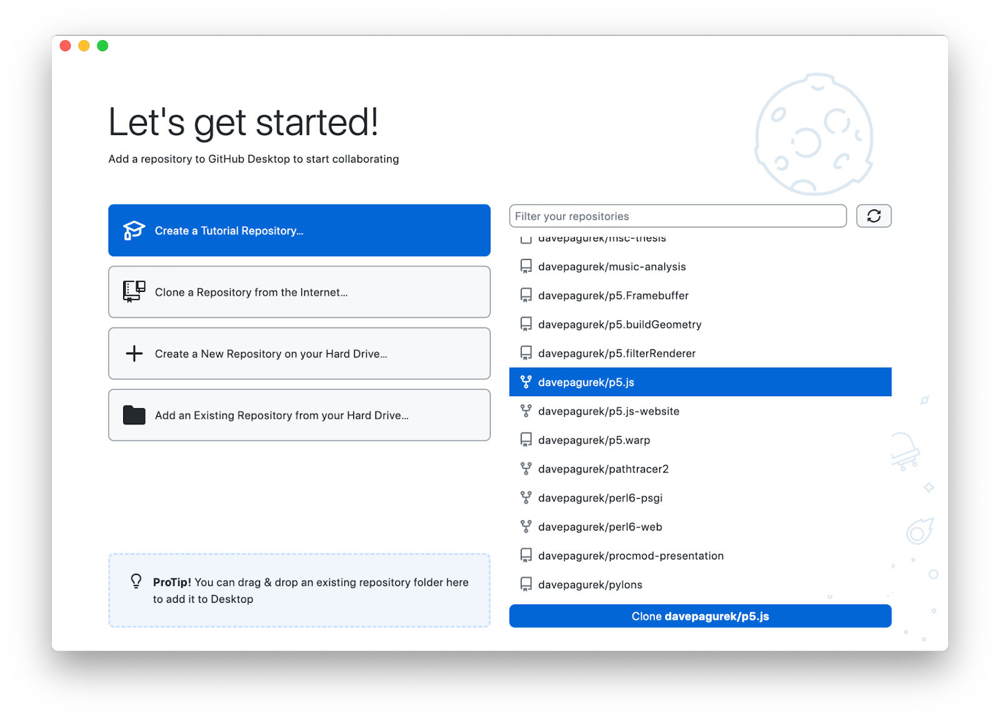

克隆成功后，你需要选择使用该 fork 的目的。请选择 “To contribute to the parent project”，然后点击 “Continue”。

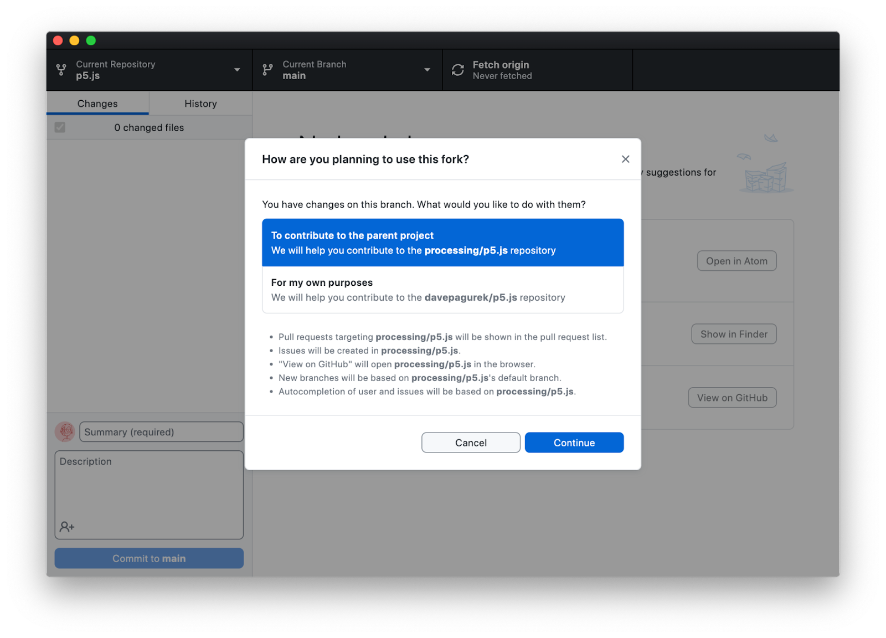

### 使用 git 命令行界面

创建好 fork 之后，去 fork 页面点击绿色 “Code” 按钮复制 git 链接。链接的格式是这样：`https://github.com/limzykenneth/p5.js.git`。

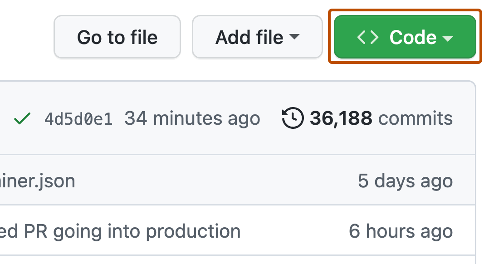

然后在本地环境中打开命令行，并克隆这个仓库。简单地说，"克隆" 就是将仓库副本下载到本地计算机上。在你想要存储 p5.js 源代码文件夹的文件夹中运行以下命令：

```
git clone [git_url]
```

将 `[git_url]` 替换为你在上一步复制的 git 链接。这可能需要等几分钟，具体多久取决于你的网速，你可以去泡杯咖啡。克隆完成后，用你喜欢的文本编辑器打开名为 `p5.js` 的文件夹，就可以开始查看了。

## 代码库拆解

在 p5.js 文件夹中，你将会遇到一些关键的文件和文件夹，具体如下：

- `src` - 最终生成 `p5.js` 和 `p5.min.js` 文件的所有代码都存放于此。
- [`test`](../unit_testing.md) - 存放单元测试代码和测试所有文档示例代码的位置。
- `tasks` - 存放详细的自定义构建代码的位置。
- `Gruntfile.js` - 主要的构建配置文件。
- `contributor_docs` - 存放文档和其他贡献者文档的位置。

其他文件和文件夹要么是配置文件，要么是其他类型的支持文件，大多数情况下，你不需要对它们做任何修改。

## 构建设置

为了构建和测试运行 p5.js，你需要先创建本地项目文件夹。假设你已经安装了 `Node.js`，请运行如下代码：

```
npm ci
```

这可能需要一些时间，因为 npm 会下载所有需要的依赖项。但是，一旦下载完成，就全部设置好了。非常简单，对吧？

## Git 工作流程

现在，你可以根据自己的需要做更改了。关于仓库其他部分的详情，以及如何做相应修改，请参考接下来的子章节。若要开始，请运行：

```
npm test
```

从头开始构建 p5.js 并运行所有单元测试，这整个过程应该是不会报错的。如果你只是想构建仓库而不运行测试，可以运行：

```
npm run build
```

以上任何一个命令都会在 `lib/` 文件夹中创建 `p5.js` 和 `p5.min.js` 文件。如果需要，你可以用这些构建好的文件来做测试。

接下来，我们建议你开始工作之前在主分支 `main` 上创建一个分支。在 git 中，分支顾名思义就是存储库的一个分支版本，你可以在分支上添加提交而不会影响主分支或其他分支。在分支上，你可以同时处理多个功能（通过使用多个不同的分支），而不用担心搞砸之后会影响到主分支。

如果使用 GitHub 桌面版，可以点击窗口上方的 "Current Branch" 按钮来创建分支。你可以在这里切换分支，或输入分支名创建一个新分支。在这里，我们输入一个分支名描述一下即将做的更改，然后点击 "Create New Branch"。

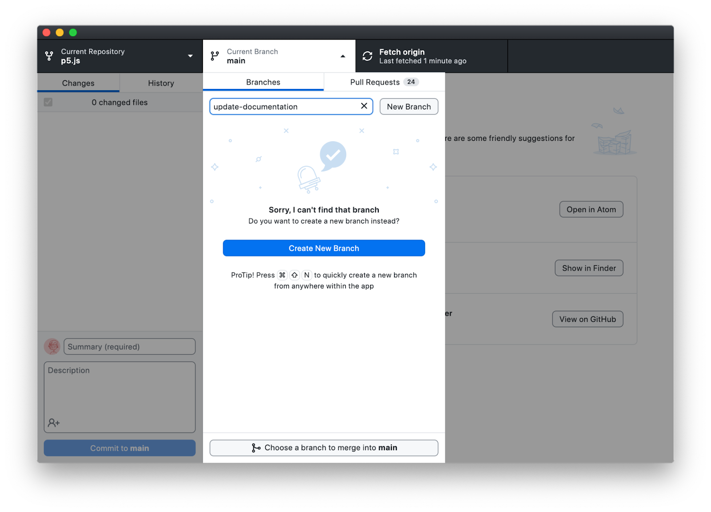

如果使用终端，在主分支上运行 `git checkout -b branch_name`，将 `branch_name` 替换为描述性的内容，然后你就在一个新的分支上了。

我们建议你在做更改时经常运行 `npm test`， 尤其是在修改源代码的时候。运行这个命令会花费一些时间，但它能确保你的修改不会破坏当前行为。在参照以下描述提交更改之前，你应该先运行 `npm test`。

一旦你对代码库做了更改，就需要将它提交到 git。一次提交是保存在 git 仓库中的一系列更改，它本质上记录了提交时仓库中文件的当前状态。

可能你会问你应该每隔多久向 git 做一次提交？通常情况下，我们建议你经常提交，而不是将多个更改合并为一次提交。好的做法是，每完成一个可以用一句话描述的子任务就做一次提交。

要从 GitHub 桌面版提交当前所有更改，请在更改完成后打开该应用程序。左侧边栏会显示你更改过的文件，右侧显示每个文件中的更改详情。在窗口左下角，用户图标旁边的区域中输入简要的描述，这就是本次提交的标题。你可以在下面的描述区域中做进一步阐述或留白，点击蓝色的 "Commit" 按钮以完成更改。

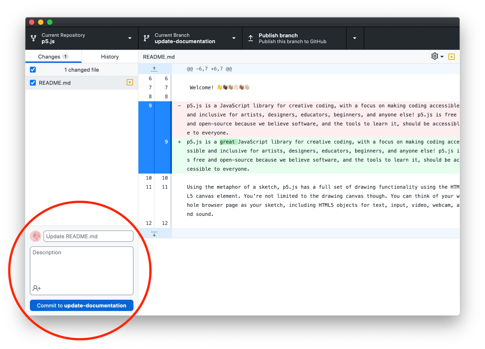

要从终端提交当前所有更改，请运行以下命令：

1. 运行以下命令，检查是否只列出了你更改过的文件。

```
git status
```

如果列出了你没有更改过的文件，你需要将它们 [恢复](https://git-scm.com/docs/git-restore) 到原始状态，或者确保这些更改是你想要的。如需查看每个文件的更改详情，请运行以下命令：

```
git diff
```

不想要的文件更改，不要提交到 PR 中。

2. 运行以下命令，将所有更改添加到 git 暂存区

```
git add .
```

3. 运行以下命令，将所有更改提交到 git

```
git commit -m "[your_commit_message]"
```

将 `[your_commit_message]` 替换为描述本次更改相关的信息，避免使用宽泛的陈述。例如：不用 “文档修复 1”，而用 “给 circle() 函数添加文档示例”

```
git commit -m "给 circle() 函数添加文档示例"
```

所有提交都重复以上步骤，同时定期运行 `npm test` 以确保一切正常运行。

### 源代码

如果你要处理源代码，并且也清楚你要处理 p5.js 的哪些功能，好的开始是去看文档。因为 p5.js 文档中，每个已记录功能的底部，都有其源代码的链接。

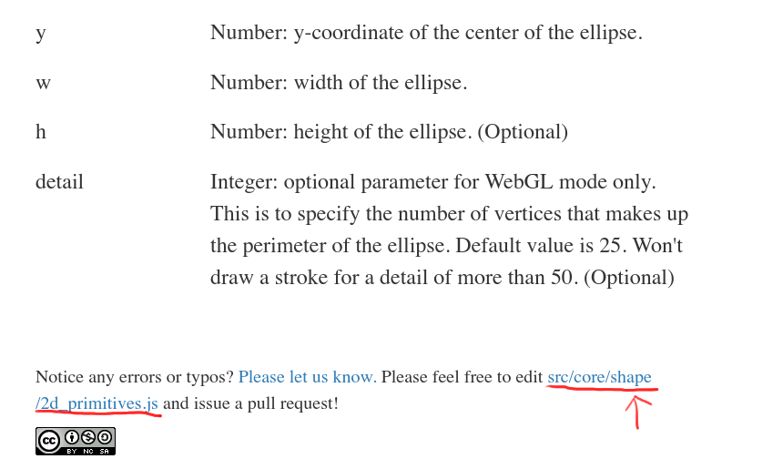

### 单元测试

如果你要进行单元测试，请参阅[这里](./unit_testing.md)。需要注意的是，对于任何功能强化、功能新增和错误修复，都应该在 PR 中添加相关的单元测试。

### 内联文档

如果你要处理内联文档，请参阅[这里](./inline_documentation.md)。

### 无障碍

如果你要处理无障碍功能，请参阅[这里](./web_accessibility.md)。关于友好的错误系统，请参阅[这里](./friendly_error_system.md)。

## 代码规范

p5.js 的代码规范或者代码风格由 ESLint 执行。任何 git 提交和拉取请求在被接受之前，都必须通过 ESLint 代码检查。要遵循正确的代码规范，最简单方法是在文本编辑器中使用可用的 ESLint 插件，它可以高亮显示 ESLint 检查到的错误（适用于大多数流行的文本编辑器）。

## 设计原则

开发 p5.js 的功能时，牢记 p5.js 的设计原则是很重要的。我们的优先级可能与其他项目的优先级不同，所以如果你来自其他项目，建议你先熟悉 p5.js 的设计原则。

- **可访问性**：我们将可访问性置于首位，在做决定时，必须考虑如何提升历史上被边缘化的群体的可访问性。在我们的访问声明中可以了解更多相关信息。

- **初学者友好**：p5.js API 旨在对初学者友好，它使用前沿的 HTML5/Canvas/DOM API ，为创建交互性视觉内容提供了低门槛。

- **教育性**：p5.js 专注于支持教育用途的 API 和课程，包括 API 的完整参考和支持示例，还有介绍核心创意编程原则的教程和示例课程，思路清晰，井然有序。

- **JavaScript 及其社区**：为了使初学者更容易接触到 Web 开发实践，p5.js 通过对合适的 JavaScript 设计模式和使用进行建模，并在必要时进行提取。作为一个开源库，p5.js 还将更广泛的 JavaScript 社区纳入其创作、文档和传播当中。

- **Processing 及其社区**：p5.js 受到 Processing 语言及其社区的启发，致力于将 Processing Java 到 JavaScript 的转换变得简单而清晰。

⬆ [back to top](#贡献者指南)

# 拉取请求

当你完成了包括单元测试在内的所有更改，运行过 `npm test` 没有报错，并且已经提交了更改，你就可以开始准备拉取请求，将你的新提交合并到 p5.js 官方仓库中。一个拉取请求，更正式地说，是对一个仓库（当前情况是指 p5.js 官方仓库）提出的请求，请求从另一个仓库（当前情况是指 fork 的 p5.js 仓库）拉取或合并更改到其提交历史中。

## 创建拉取请求

首先，将新的提交推送到你 fork 的 p5.js 中，你可以理解为将更改上传到你的 fork。

如果使用 GitHub 桌面版，在窗口顶部用于切换分支的按钮的右侧，有一个按钮可以将你的更改推送到 GitHub，点击这个按钮推送你的更改。

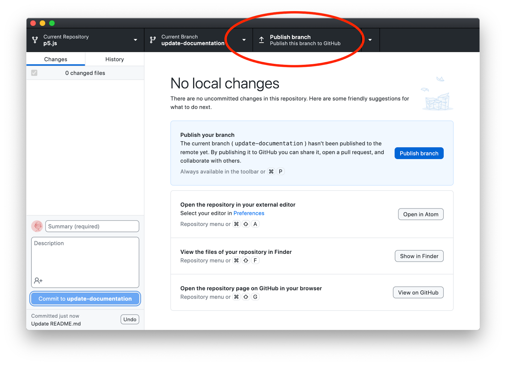

一旦代码上传完毕，你将会看到一个按钮提示你创建拉取请求。点击一下这个按钮会显示预览，预览中包含另一个按钮，这个按钮才可以真正地创建请求。点击 "Create Pull Request" 按钮创建拉取请求。

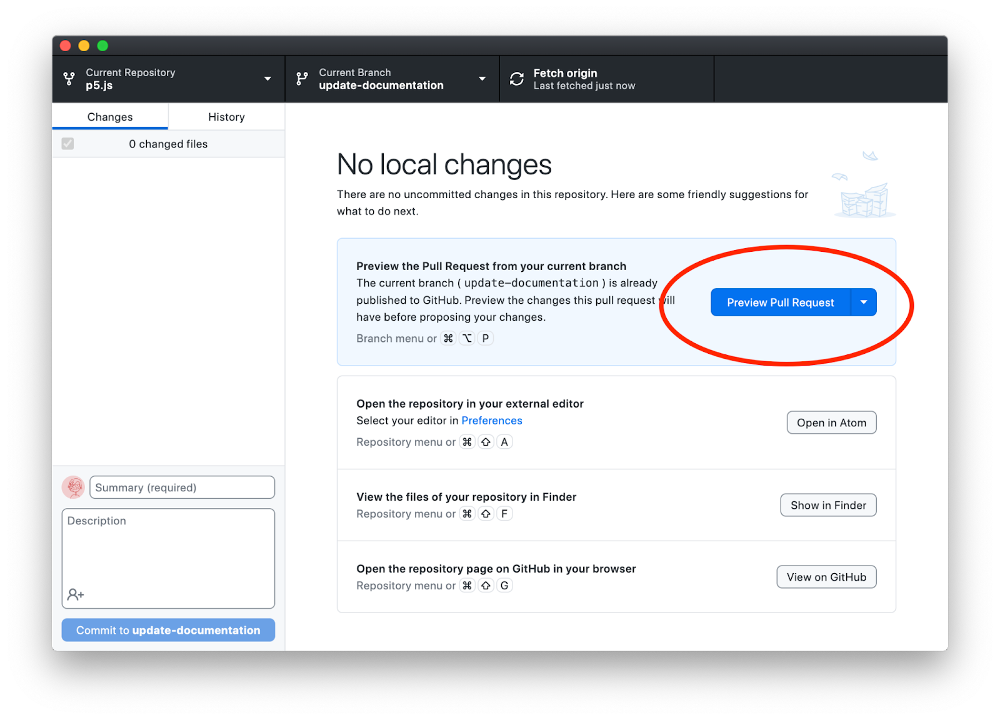

如果使用终端，请运行以下代码：

```
git push -u origin [分支名称]
```

推送完成后，你可能会在终端里看到一个链接，可以点击它创建拉取请求。如果没有，你可以在浏览器中导航到你的 fork，通过文件列表顶部的下拉按钮切换到你正在工作的分支，然后点击 “Contribute”，接着点击 "Open pull request"。


当你访问 p5.js 的 Github 仓库时，你可能也会看到一个创建拉取请求的按钮。点击它也可以创建一个新的拉取请求。

### 拉取请求信息

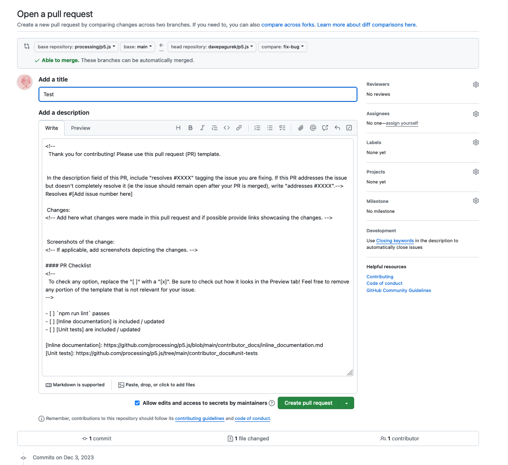

在提交拉取请求之前，你需要填写拉取请求模板。

### 标题

拉取请求的标题应简要描述更改的内容，再次提醒要避免宽泛的陈述。

### 解决

在模板中，有这样一行文字：`解决 #[在此添加问题编号]`，你需要将 `[在此添加问题编号]` 替换为你正在处理/修复的问题的问题编号 [看上面](#关于issue)（例如，`解决 #1234`）。这样可以确保 PR 合并后，该问题会自动关闭。如果你不希望 PR 合并后自动关闭该问题（可能因为有更多的更改将在其他 PR 中提交），请将 `解决` 改为 `处理`。

### 更改

清晰地描述你在 PR 中所做的更改，包括任何与审阅者相关的实现细节和决策。

### 更改的截图

是否需要上传截图，视情况而定。当更改涉及到 p5.js 在画布上呈现可视化内容时，就需要上传截图。请注意，不是文本编辑器的截图，而是做过更改后的页面预览截图。

### PR 检查列表

检查列表包含一些相关的选项，将 `[ ]` 替换为 `[x]` 来勾选与你的更改有关的选项。

勾选完成后，点击 “Create pull request”。

### 变基和解决冲突

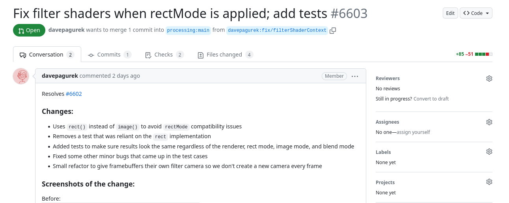

现在你应该检查已提交的拉取请求，并注意以下几点：

1. 提交的次数应该与你在这个 PR 上所做的提交次数相匹配，也就是说，如果你在这个 PR 上做了两次提交，"Commits" 选项卡中应该只显示两个提交记录。
2. "Files changed" 选项卡只展示你的更改与 p5.js 仓库之间的差异。
3. 靠近页面底部，应该可以看到 "This branch has no conflicts with the base branch"， 而不是 "This branch has conflicts that must be resolved"。

如果以上任何一项不正确（提交数量多于预期或存在冲突），你可能需要 [变基](https://git-scm.com/book/en/v2/Git-Branching-Rebasing) 或者帮忙解决冲突。这里的冲突是指：你所更改的文件，近期已经有过更新，git 不确定该保留或者忽略哪组修改。如果你不确定如何解决这些问题，请联系我们，我们将指导你完成。基本操作步骤如下：

有时，GitHub 会显示 "Resolve Conflicts" 按钮，允许你直接在浏览器中解决冲突。

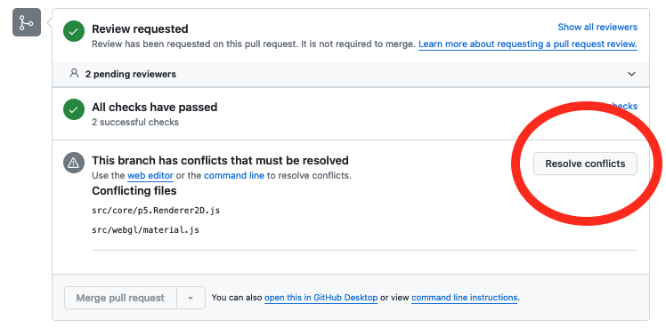

冲突展示在 `<<<<<<<` 和 `>>>>>>>` 之间， 被 `=======` 隔开。前半部分是你自己写的代码，后半部分是主分支中已经变更过的代码。

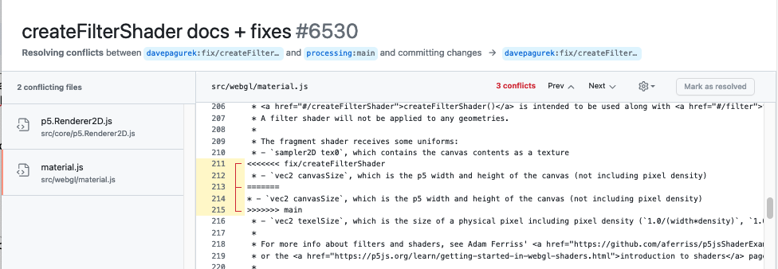

删除冲突标记，在 PR 中保留最终需要保留的代码。所有冲突都解决好之后，点击 "Mark as resolved"。

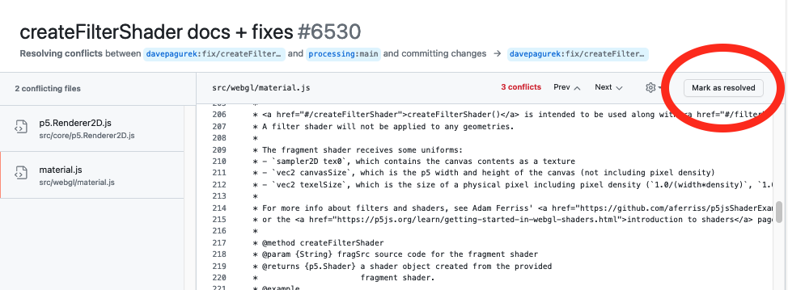

所有文件的冲突都解决好之后，就可以提交更改了。

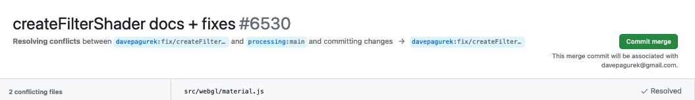

有时候，冲突对于 Github 来说在网页上展示起来太过复杂。在这种情况下，或者如果你更喜欢手动操作，你也可以在本地解决冲突：

1. 运行 `git remote add upstream https://github.com/processing/p5.js`
2. 运行 `git fetch upstream`
3. 运行 `git rebase upstream/main`
4. 可能会有冲突！如果只涉及到 `lib/p5.js` 和 `lib/p5.min.js`，就很容易解决，只需重新构建项目。如果其他文件存在冲突，并且你不确定如何解决，去寻求帮助吧！
```
npm test
git add -u
git rebase --continue
```

5. 运行 `git push`

上述步骤完成后，上面的检查列表可能会清空，如果没有清空，我们将指导你完成必要的修复。

## 讨论和修改

现在你已经提交了 PR，管理员或维护者将会进行审核。可能需要几天时间，管理员才能给你回复，请耐心等待。在此期间，你可以看看其他尚未解决的问题。

一旦管理员审核了你的 PR，可能会有两种结果：1. 你的 PR 被批准并合并，太棒了！2. 管理员可能会针对你的 PR 提出一些问题，或者要求你做一些修改。如果是后者，不要惊慌，这是完全正常的，并且管理员们总是愿意帮助你完成你的贡献！

如果你的 PR 需要进一步更改，并且你能够完成这些更改，请按照之前的 [相同流程](#git-工作流程) 进行操作。但务必在本地仓库副本的相关分支进行修改、提交， 并将提交推送到你 fork 的远程仓库。一旦提交成功，新的提交会自动显示在你的 PR 中。然后在 PR 中留言，让审阅者知道你已经按要求做了更改。如果不需要额外的更改，你的 PR 将被合并！

⬆ [back to top](#贡献者指南)
