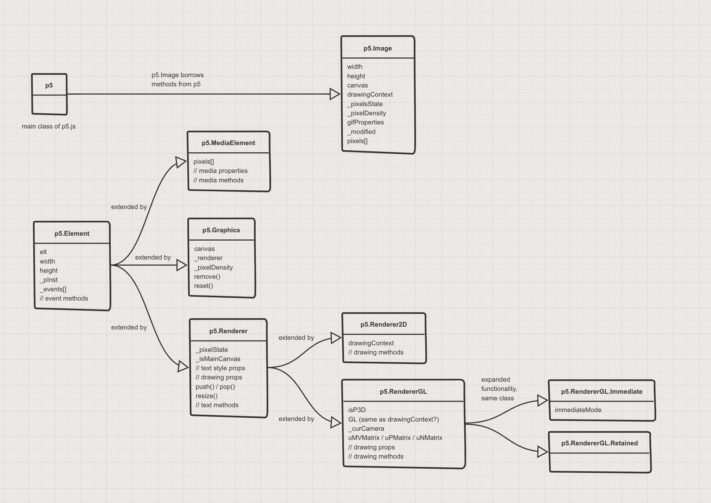

# p5.js Core

This folder contains the core functionality of p5.js, including the init and main files, environment, constants, the friendly error system, and the graphics pipeline (with the exception of 3D/WebGL). [Here is a diagram](
https://sketchboard.me/zBOkvPuQisyA#/) that outlines how the main graphics-related classes inherit from and extend one another. There is still more to be done to document this pipeline more clearly.

## [init.js](./init.js)

The `init.js` module initializes a new `p5` object in either global mode, instance mode, or unit testing mode. Broadly speaking, this module should only contain logic that needs to execute *before startup*, such as testing the environment in which the code is running in order to make decisions about how it should load.

## [main.js](./main.js)

The sole job of the `main.js` module is to create and then export the constructor function for creating a new `p5` object. This constructor function is also called `p5`, and doesn't use the typical JavaScript convention of capitalizing constructor functions. The constructor handles a number of mechanical startup concerns, including assigning functions and properties from elsewhere in the source code to the newly created `p5` object as either public or private methods and properties.

Aside from the exported constructor function, the most important thing in this module is the set of functions that define the loop used by nearly every p5.js project: `preload()`, `setup()`, `draw()`, `remove()`, and so on. These functions are both available on the `p5` object as methods, and also assigned to variables in the global space for syntactic simplicity, because calling a function named `draw()` is more creatively expressive than namespacing the same functionality with an object as with `mySketch.draw()` or similar. The `friendlyBindGlobal()` function standardizes the process by which the necessary global variables can be created, notably including logging [friendly error messages](https://github.com/processing/p5.js/blob/main/contributor_docs/friendly_error_system.md) when conflicts are detected, but it is not exported from the module's internal scope.

## [structure.js](./structure.js)

The `structure.js` module is best thought of as a collection of ways to make *modifications* to the typical *loop structure* exposed by the `draw()` function. The functions in this module allow you to add and extract individual renders from the loop, draw the loop one frame at a time, pause and resume the loop, and so on.

## [constants.js](./constants.js)

The `constants.js` module provides various default values mostly related to math and web standards using clear semantic names to increase syntax clarity when they are used in other algorithms. These values are attached to the `p5` object prototype as properties by the constructor function so they can be more easily accessed by other parts of the p5.js library or by user code.

## [friendly_errors/fes_core.js](./friendly_errors/fes_core.js)
This is the main file for the Friendly Error System (FES). The Friendly Error System (FES) is a system designed to help new programmers with common user errors as they get started learning. It catches common beginning errors and provides clear language and links to help a user resolve the error. FES is only applied to functions that are ones a user might encounter when they are just starting.  You can learn more about the FES in the comment section at the top of this file, or in the [contributors_docs/friendly_error_system.md](https://github.com/processing/p5.js/blob/main/contributor_docs/friendly_error_system.md) file.

## [legacy.js](./legacy.js)
These are functions that are part of the Processing API but are not part of the p5.js API. In some cases they have a new name, in others, they are removed completely. Not all unsupported Processing functions are listed here but we try to include ones that a user coming from Processing might likely call.

# Browser

*utilizing and abstracting web technologies*

## [environment.js](./environment.js)

The `environment.js` module detects and semantically reassigns various features of the code execution environment that are arguably beyond the control of the p5.js library, such as device properties, window dimensions, and the URL bar. In general, this module should only contain code that exposes mechanics of the web that usually would not be considered part of the p5.js "sketch." This module is conceptually similar to `init.js` in that it tests the environment in which the p5.js code is executing, but one major difference is that broadly speaking the code in `environment.js` does *not* need to run solely at initialization as with `init.js`, and can be invoked whenever necessary.

## [shim.js](./shim.js)

Sometimes p5.js needs to use new browser APIs or other features which haven't yet been completely standardized; for example, a feature that still uses [vendor prefixes](https://developer.mozilla.org/en-US/docs/Glossary/Vendor_Prefix). In any such cases where it is necessary to handle multiple versions of the same functionality, the `shim.js` module juggles the available variants and assigns the results of that evaluation to a standardized property on the `p5` object. The rest of the p5.js library can then use that functionality without needing to constantly reconsider the specific browser implementation details.

## [p5.Element.js](./p5.Element.js)

Although p5.js is a general toolkit for all sorts of interactive art projects, in practice many p5.js sketches focus on rendering two dimensional graphics into a `<canvas>` element. The `p5.Element.js` module is a wrapper around the browser's DOM API which is focused on the `<canvas>` element and also handles user input events like clicks and mouse movements. Conceptually, p5.js considers the sketch to be *the entire web page*. It's useful to separate `<canvas>` from the more general DOM because so many p5.js projects focus on `<canvas>` and this enables smaller [custom builds](https://github.com/processing/p5.js/blob/main/contributor_docs/custom_p5_build.md). 

# Rendering

*project output options*

## [rendering.js](./rendering.js)

The `rendering.js` module presents the user-facing API for p5's various graphical output options. In the overwhelming majority of cases, a p5.js sketch will be output to a `<canvas>` tag on the current web page, but it is also possible to do "headless" output using `nocanvas` mode or "render" to a graphics buffer that is computed but never actually appears on the screen.

## [p5.Renderer.js](./p5.Renderer.js)

The `p5.Renderer.js` module provides a common base definition for a p5 project output mode that can then be extended as with [p5.Renderer2D](./p5.Renderer2D.js). For three dimensional output, see the [webgl module](../webgl/). Each `p5` object instance typically has a `Renderer` attached as a property.

## [p5.Renderer2D.js](./p5.Renderer2D.js)

The `p5.Renderer2D.js` module extends the generic `p5.Renderer` definition and optimizes it for two dimensional images.

## [p5.Graphics.js](./p5.Graphics.js)

The `p5.Graphics` module is a lightweight wrapper around renderers which is used to create output graphics in memory without ever actually drawing them on the screen.

# Drawing

*lines, shapes, and visual styles*

## [transform.js](./transform.js)

The `transform.js` module implements logic for scaling, rotation, and matrix transformations.

## [shape/attributes.js](./shape/attributes.js)

Attributes are an important part of the general API for the web, but the `attributes.js` module defines and handles miscellaneous *graphical* attributes that can be consider a set of active parameters for the current drawing style. Think of this as a grab bag of all the remaining drawing parameters that were not moved out into separate dedicated modules as with [color](../color/) and [typography](../typography/).

## [shape/2d_primitives.js](./shape/2d_primitives.js)

The `2d_primitives.js` module provides helper functions for drawing common shapes. The resulting drawing commands are sent to the currently active [renderer](./rendering.js).

## [shape/vertex.js](./shape/vertex.js)

The `vertex.js` module handles points and coordinates for drawing curves and shapes.

## [shape/curves.js](./shape/curves.js)

The `curves.js` module draws curves based on a set of vertices.
