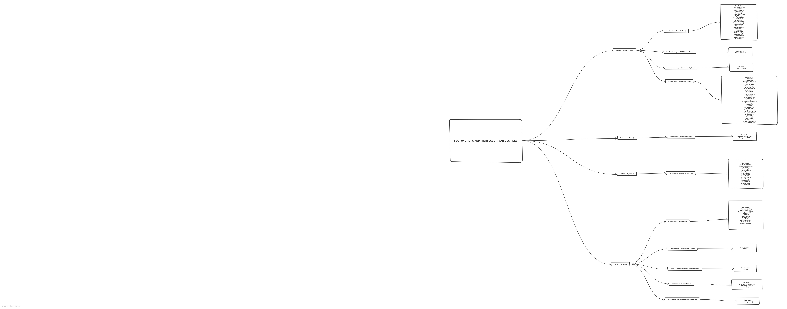

This folder contains the core functionality of Friendly Error Systems. [Here is a diagram](
https://sketchboard.me/NDYnl9RGJdU) that outlines how the FES Functions are being used in various files throughout p5.js repository and also specifies the files in which the code for these FES functions sits in.




# FES Reference and Notes from Developers
The following information contains reference and development notes for the p5.js Friendly Error System (FES). The FES houses several functions responsible for generating friendly error messages for different types of errors. These functions gather errors from various locations, including error events triggered by the browser, mistakes found while scanning the user code, parameter checking within the library, etc.

Main functions for generating the friendly error messages are:
* `_validateParameters()`
* `_friendlyFileLoadError()`
* `_friendlyError()`
* `helpForMisusedAtTopLevelCode()`
* `_fesErrorMonitor()`

These functions are located throughout this folder.
* `fes_core.js` contains the core as well as miscellaneous functionality of the FES.
* `_validateParameters()` is located in `validate_params.js` along with other code used for parameter validation.
* `_friendlyFileLoadError()` is located in `file_errors.js` along with other code used for dealing with file load errors.
* Apart from this, there's also a file `stacktrace.js`, which contains the code to parse the error stack, borrowed from: https://github.com/stacktracejs/stacktrace.js

The following section presents the full reference for the FES functions.

## FES Functions: Reference

### `_report()`
##### Description
`_report()` is the primary function that prints directly to the console with the output of the error helper message.
If `_fesLogger` is set ( i.e., we are running tests ), _report will call _fesLogger instead of console.log.
##### Syntax
````JavaScript
_report(message)
````
````JavaScript
_report(message, func)
````
````JavaScript
_report(message, func, color)
````
##### Parameters
```
@param  {String}        message   Message to be printed
@param  {String}        [func]    Name of function
@param  {Number|String} [color]   CSS color code
```
##### Location
core/friendly_errors/fes_core.js


### `_friendlyError()`
##### Description
`_friendlyError()` creates and prints a friendly error message. Any p5 function can call this function to offer a friendly error message.

Implemented to functions in:
* `core/friendly_errors/fes_core/fesErrorMonitor()`
* `core/friendly_errors/fes_core/checkForUserDefinedFunctions()`
* `core/friendly_errors/fes_core/handleMisspelling()`
* `core/friendly_errors/fes_core/processStack()`
* `core/friendly_errors/file_errors`
* `core/friendly_errors/sketch_reader`
* `core/friendly_errors/validate_params/_friendlyParamError()`
* `core/main/_createFriendlyGlobalFunctionBinder()`
* `core/shape/vertex`
* `math/p5.Vector`

The call sequence to `_friendlyError` looks something like this:
```
_friendlyError
  _report
```

##### Syntax
````JavaScript
_friendlyError(message)
````
````JavaScript
_friendlyError(message, func)
````
````JavaScript
_friendlyError(message, func, color)
````
##### Parameters
```
@param  {String}        message   Message to be printed
@param  {String}        [func]    Name of the function
@param  {Number|String} [color]   CSS color code
```
##### Location
core/friendly_errors/fes_core.js

### `_friendlyFileLoadError()`
##### Description
`_friendlyFileLoadError()` is called by the `loadX()` functions if there is an error during file loading.

Generates and prints a friendly error message using key: `fes.fileLoadError.*`.

This function generates and displays friendly error messages if a file fails to load correctly. It also checks and produces a warning if the size of a file is too large to load.

The current version contains templates for generating error messages for `image`, `XML`, `table`, `text`, `json` and `font` files.

Implemented to functions in:
* `image/loading_displaying/loadImage()`
* `io/files/loadFont()`
* `io/files/loadTable()`
* `io/files/loadJSON()`
* `io/files/loadStrings()`
* `io/files/loadXML()`
* `io/files/loadBytes()`.

The call sequence to `_friendlyFileLoadError` looks something like this:
```
_friendlyFileLoadError
  _report
```
##### Syntax
````JavaScript
_friendlyFileLoadError(errorType, filePath)
````
##### Parameters
```
@param  {Number}  errorType   Number of file load error type
@param  {String}  filePath    Path to file caused the error
```
##### Examples
<ins>File Loading Error Example</ins>
````JavaScript
/// missing font file
let myFont;
function preload() {
  myFont = loadFont('assets/OpenSans-Regular.ttf');
};
function setup() {
  fill('#ED225D');
  textFont(myFont);
  textSize(36);
  text('p5*js', 10, 50);
};
function draw() {};
````
FES will generate the following message in the console:
> 🌸 p5.js says: It looks like there was a problem loading your font. Try checking if the file path [assets/OpenSans-Regular.ttf] is correct, hosting the font online, or running a local server.[https://github.com/processing/p5.js/wiki/Local-server]


##### Location
/friendly_errors/file_errors.js

### `validateParameters()`
##### Description
`validateParameters()` runs parameter validation by matching the input parameters with information from `docs/reference/data.json`, which is created from the function's inline documentation. It checks that a function call contains the correct number and the correct types of parameters.

Generates and prints a friendly error message using key: `fes.friendlyParamError.*`.

This function can be called through: `p5._validateParameters(FUNCT_NAME, ARGUMENTS)` or, `p5.prototype._validateParameters(FUNCT_NAME, ARGUMENTS)` inside the function that requires parameter validation. It is recommended to use static version, `p5._validateParameters` for general purposes. `p5.prototype._validateParameters(FUNCT_NAME, ARGUMENTS)` mainly remained for debugging and unit testing purposes.

Implemented to functions in:
* `accessibility/outputs`
* `color/creating_reading`
* `color/setting`
* `core/environment`
* `core/rendering`
* `core/shape/2d_primitives`
* `core/shape/attributes`
* `core/shape/curves`
* `core/shape/vertex`
* `core/transform`
* `data/p5.TypedDict`
* `dom/dom`
* `events/acceleration`
* `events/keyboard`
* `image/image`
* `image/loading_displaying`
* `image/p5.Image`
* `image/pixel`
* `io/files`
* `math/calculation`
* `math/random`
* `typography/attributes`
* `typography/loading_displaying`
* `utilities/string_functions`
* `webgl/3d_primitives`
* `webgl/interaction`
* `webgl/light`
* `webgl/loading`
* `webgl/material`
* `webgl/p5.Camera`

The call sequence from _validateParameters looks something like this:
```
validateParameters
   buildArgTypeCache
      addType
    lookupParamDoc
    scoreOverload
      testParamTypes
      testParamType
    getOverloadErrors
    _friendlyParamError
      ValidationError
      report
        friendlyWelcome
```
##### Syntax
````JavaScript
_validateParameters(func, args)
````
##### Parameters
```
@param  {String}  func    Name of the function
@param  {Array}   args    User input arguments
```
##### Examples
<ins>Example of a Missing Parameter</ins>
````JavaScript
arc(1, 1, 10.5, 10);
````
FES will generate the following message in the console:
> 🌸 p5.js says: It looks like arc() received an empty variable in spot #4 (zero-based index). If not intentional, this is often a problem with scope: [https://p5js.org/examples/data-variable-scope.html]. [http://p5js.org/reference/#p5/arc]

> 🌸 p5.js says: It looks like arc() received an empty variable in spot #5 (zero-based index). If not intentional, this is often a problem with scope: [https://p5js.org/examples/data-variable-scope.html]. [http://p5js.org/reference/#p5/arc]

<ins>Example of a Type Mismatch</ins>
````JavaScript
arc('1', 1, 10.5, 10, 0, Math.PI, 'pie');
````
FES will generate the following message in the console:
> 🌸 p5.js says: arc() was expecting Number for parameter #0 (zero-based index), received string instead. [http://p5js.org/reference/#p5/arc]
##### Location
core/friendly_errors/validate_params.js

### `fesErrorMonitor()`
##### Description
`fesErrorMonitor()` handles various errors that the browser shows. The function generates global error messages.

Generates and prints...
* ... a friendly error message using key: `fes.globalErrors.syntax.*`, `fes.globalErrors.reference.*`, `fes.globalErrors.type.*`.
* ... an "internal library" error message via `processStack()` using key: `fes.wrongPreload`, `fes.libraryError`.
* ... a stacktrace message via `printFriendlyStack()` using key: `fes.globalErrors.stackTop`,`fes.globalErrors.stackSubseq`.
* ... a spell-check message (from a reference error) via `handleMisspelling()` using key: `fes.misspelling`.

`_fesErrorMonitor()` can be called either by an error event, an unhandled rejection event, or it can be manually called in a catch block as follows:
```
try { someCode(); } catch(err) { p5._fesErrorMonitor(err); }
```

The function currently works with some kinds of ReferenceError, SyntaxError, and TypeError. You can find the complete list of supported errors in `browser_errors.js`.

The call sequence for `_fesErrorMonitor` roughly looks something like this:
```
 _fesErrorMonitor
     processStack
       printFriendlyError
     (if type of error is ReferenceError)
       _handleMisspelling
         computeEditDistance
         _report
       _report
       printFriendlyStack
     (if type of error is SyntaxError, TypeError, etc)
       _report
       printFriendlyStack
```
##### Syntax
````JavaScript
fesErrorMonitor(event)
````
##### Parameters
```
@param {*}  e     Error event
```
##### Examples
<ins>Internal Error Example 1</ins>
````JavaScript
function preload() {
  // error in background() due to it being called in
  // preload
  background(200);
}
````
FES will generate the following message in the console:
> 🌸 p5.js says: An error with message "Cannot read property 'background' of undefined" occurred inside the p5js library when "background" was called (on line 4 in sketch.js [http://localhost:8000/lib/empty-example/sketch.js:4:3]).
//If not stated otherwise, it might be due to "background" being called from preload. Nothing besides load calls (loadImage, loadJSON, loadFont, loadStrings, etc.) should be inside the preload function. (http://p5js.org/reference/#/p5/preload)

<ins>Internal Error Example 2</ins>
````JavaScript
function setup() {
  cnv = createCanvas(200, 200);
  cnv.mouseClicked();
}
````
FES will generate the following message in the console:
> 🌸 p5.js says: An error with message "Cannot read property 'bind' of undefined" occurred inside the p5js library when mouseClicked was called (on line 3 in sketch.js [http://localhost:8000/lib/empty-example/sketch.js:3:7]) If not stated otherwise, it might be an issue with the arguments passed to mouseClicked. (http://p5js.org/reference/#/p5/mouseClicked)

<ins>Example of an Error in User's Sketch (Scope)</ins>
````JavaScript
function setup() {
  let b = 1;
}
function draw() {
  b += 1;
}
````
FES will generate the following message in the console:
> 🌸 p5.js says: There's an error due to "b" not being defined in the current scope (on line 5 in sketch.js [http://localhost:8000/lib/empty-example/sketch.js:5:3]). If you have defined it in your code, you should check its scope, spelling, and letter-casing (JavaScript is case-sensitive). For more: https://p5js.org/examples/data-variable-scope.html https://developer.mozilla.org/docs/Web/JavaScript/Reference/Errors/Not_Defined#What_went_wrong

<ins>Example of an Error in User's Sketch Example (Spelling)</ins>
````JavaScript
function setup() {
  colour(1, 2, 3);
}
````
FES will generate the following message in the console:
> 🌸 p5.js says: It seems that you may have accidentally written "colour" instead of "color" (on line 2 in sketch.js [http://localhost:8000/lib/empty-example/sketch.js:2:3]). Please correct it to color if you wish to use the function from p5.js (http://p5js.org/reference/#/p5/color)
##### Location
core/friendly_errors/fes_core.js

### `fesCodeReader()`
##### Description
`fesCodeReader()` checks (1) if any p5.js constant or function is used outside of the `setup()` and/or `draw()` function and (2) if any p5.js reserved constant or function is redeclared.

Generates and print a friendly error message with type: `fes.sketchReaderErrors.reservedConst`, `fes.sketchReaderErrors.reservedFunc`.

In `setup()` and `draw()` functions it performs:
 * Extraction of the code written by the user
 * Conversion of the code to an array of lines of code
 * Catching variable and function declaration
 * Checking if the declared function/variable is a reserved p5.js constant or function and report it.

This function is executed whenever the `load` event is triggered.

##### Examples
<ins>Example of Redefining p5.js Reserved Constant</ins>
````JavaScript
function setup() {
  //PI is a p5.js reserved constant
  let PI = 100;
}
````
FES will generate the following message in the console:
> 🌸 p5.js says: you have used a p5.js reserved variable "PI" make sure you change the variable name to something else. (https://p5js.org/reference/#/p5/PI)

<ins>Example of Redefining p5.js Reserved Function</ins>
````JavaScript
function setup() {
  //text is a p5.js reserved function
  let text = 100;
}
````
FES will generate the following message in the console:
> 🌸 p5.js says: you have used a p5.js reserved function "text" make sure you change the function name to something else.


##### Location
/friendly_errors/sketch_reader.js

### `checkForUserDefinedFunctions()`
##### Description
Checks if any user defined function (`setup()`, `draw()`, `mouseMoved()`, etc.) has been used with a capitalization mistake.

Generates and prints a friendly error message using key: `fes.checkUserDefinedFns`.
##### Syntax
````JavaScript
checkForUserDefinedFunctions(context)
````
##### Parameters
```
@param {*} context  Current default context.
                    Set to window in "global mode" and
                    to a p5 instance in "instance mode"
```
##### Examples
````JavaScript
function preLoad() {
  loadImage('myimage.png');
}
````
FES will generate the following message in the console:
> 🌸 p5.js says: It seems that you may have accidentally written preLoad instead of preload. Please correct it if it's not intentional. (http://p5js.org/reference/#/p5/preload)

##### Location
/friendly_errors/fes_core.js

### `_friendlyAutoplayError()`
##### Description
`_friendlyAutoplayError()` is called internally if there is an error linked to playing a media (for example, a video), most likely due to the browser's autoplay policy.

Generates and prints a friendly error message using key: `fes.autoplay`.
##### Location
core/friendly_errors/fes_core.js


### `helpForMisusedAtTopLevelCode()`
##### Description
`helpForMisusedAtTopLevelCode()` is called by `fes_core.js` on window load to check for use of p5.js functions outside of `setup()` or `draw()`.

Generates and prints a friendly error message using key: `fes.misusedTopLevel`.
##### Parameters
```
@param {*}        err    Error event
@param {Boolean}  log    false
```
##### Location
/friendly_errors/fes_core.js

## Development Notes: Notes from Developers
#### Misc. FES Functions that Generates Friendly Errors
* `friendlyWelcome()` prints to console directly. (Hidden by default.)

* `stacktrace.js` contains the code to parse the error stack, borrowed from https://github.com/stacktracejs/stacktrace.js. This is called by `fesErrorMonitor()` and `handleMisspelling()`

#### Preparing p5.js Objects for Parameter Validation
* Any p5.js objects that will be used for parameter validation will need to assign a value for `name` parameter (name of the object) within the class declaration. e.g.:
```javascript
p5.newObject = function(parameter) {
   this.parameter = 'some parameter';
   this.name = 'p5.newObject';
};
````
* Inline documentation: allowed parameter types are `Boolean`, `Number`, `String`, and name of the object (see the above bullet point). Use `Array` for any types of array parameters. If needed, explain what specific types of array parameters are allowed (e.g. `Number[]`, `String[]`) in the description section.
* Currently supported class types (have their `name` parameter): `p5.Color`, `p5.Element`, `p5.Graphics`, `p5.Renderer`, `p5.Renderer2D`, `p5.Image`, `p5.Table`, `p5.TableRow`, `p5.XML`, `p5.Vector`, `p5.Font`, `p5.Geometry`, `p5.Matrix`, `p5.RendererGL`.

#### Performance Issue with the FES

By default, FES is enabled for p5.js, and disabled in `p5.min.js` to prevent FES functions slowing down the process. The error checking system can significantly slow down your code (up to ~10x in some cases). See the [friendly error performance test](https://github.com/processing/p5.js-website/tree/main/src/assets/learn/performance/code/friendly-error-system/).

You can disable this with one line of code at the top of your sketch:

```JavaScript
p5.disableFriendlyErrors = true; // disables FES

function setup() {
  // Do setup stuff
}

function draw() {
  // Do drawing stuff
}
```

Note that this will disable the parts of the FES that cause performance slowdown (like argument checking). Friendly errors that have no performance cost (like giving an descriptive error if a file load fails, or warning you if you try to override p5.js functions in the global space), will remain in place.


## Known Limitations

* FES may still result in false negative cases. These are usually caused by the mismatch between designs of the  functions (e.g. drawing functions those are originally designed to be used interchangeably in both 2D and 3D settings) with actual usage cases. For example, drawing a 3D line with
```JavaScript
const x3; // undefined
line(0, 0, 100, 100, x3, Math.PI);
```
will escape FES, because there is an acceptable parameter pattern (`Number`, `Number`, `Number`, `Number`) in `line()`'s inline documentation for drawing in 2D setting. This also means the current version of FES doesn't check for the environmental variables such as `_renderer.isP3D`.

* FES is only able to detect global variables that have been overwritten if they were declared using `const` or `var`. If `let` is used for variable declaration, they go undetected. This is not currently solvable due to the way `let` instantiates variables.

* The functionality described under **`fesErrorMonitor()`** currently only works on the web editor or if running on a local server. For more details see pull request [#4730](https://github.com/processing/p5.js/pull/4730).

* `sketch_reader()` may miss some cases (e.g. when all the code is written in a single line) while it extracts variable/function names from the user code.

## Thoughts for Future Work
* Re-introduce color coding for the Web Editor.

* Add more unit tests for comprehensive test coverage.

* More intuitive and narrowed down output messages.

* All the colors being used should be color blind friendly.

* Identify more common error types and generalize with FES (e.g. `bezierVertex()`, `quadraticVertex()` - required object not initiated; checking Number parameters positive for `nf()` `nfc()` `nfp()` `nfs()`)

* Extend Global Error catching. This means catching errors that the browser is throwing to the console and matching them with friendly messages. `fesErrorMonitor()` does this for a select few kinds of errors but help in supporting more is welcome :)

* Improve `sketch_reader.js`'s code reading and variable/function name extracting functionality (which extracts names of the function and variables declared by the user in their code). For example,`sketch_reader.js` cannot extract variable/function names properly if all the code is written in a single line. We welcome future proposals to identify all these "escape" cases and add unit tests to catch them.

* `sketch_reader.js` can be extended and new features (for example: Alerting the user when they have declared a variable in the `draw()` function) can be added to it to better aid the user.
```JavaScript
// this snippet wraps window.console methods with a new function to modify their functionality
// it is not currently implemented, but could be to give nicer formatted error messages
const original = window.console;
const original_functions  = {
    log: original.log,
    warn:  original.warn,
    error: original.error
}
["log", "warn", "error"].forEach(function(func){
    window.console[func] = function(msg) {
      //do something with the msg caught by the wrapper function, then call the original function
      original_functions[func].apply(original, arguments)
    };
});
```
* Generate the FES reference from the inline doc. This generated reference can be a separate system from our main [p5.js reference], to keep functions for sketch and console separate to reduce possible confusion.

[p5.js reference]: https://p5js.org/reference/